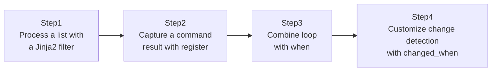

## Introduction

- **What You'll Learn From This Article**: Take the Jinja2 templating covered in [The Top 1% Hands-On for Experiencing Production-Grade Configuration Management With Ansible Roles, Handlers, and Templates](/en/articles/ansible-roles-handson-guide) one level deeper: data processing with filters, combining `loop` with `when`, and the actual structure inside a `register`ed variable.
- **Intended Audience**: Readers who've used simple variable expansion like `{{ variable }}`, but have never actually put filters or a `register` variable's structured data to use.
- **Estimated Reading Time**: About 20 minutes (about 35 minutes if you build along with the hands-on)

This article is part of the [Top 1% Series Complete Article Guide](/en/sitemap), the 8th article in the [Ansible Series](/en/sitemap#series-list).

## The Big Picture

This hands-on consists of four steps.



## Hands-On Steps

### Step 1: Process a list with a Jinja2 filter

Process a list of package names using filters.

```yaml
- name: Show a filtered and sorted package list
  debug:
    msg: "{{ packages | select('match', '^nginx') | list | sort }}"
  vars:
    packages: ["nginx", "mysql-server", "nginx-extras", "redis"]
```

**This writes a three-stage pipeline in a single line: extracting matching elements with the `select` filter, explicitly turning them into a list with `list`, and sorting with `sort`.** Jinja2 filters chain together with `|`, and you can apply several in sequence.

### Step 2: Capture a command result with register

Capture a command's execution result into a variable with `register`, and inspect its content.

```yaml
- name: Check running processes
  command: systemctl is-active nginx
  register: nginx_status
  ignore_errors: true

- name: Show the full register content
  debug:
    var: nginx_status
```

**A `register`ed variable's content isn't a simple string — it's a structured dictionary with keys like `stdout`, `stderr`, `rc` (exit code), and `changed`.** Pulling out only the key you need, like `nginx_status.stdout`, is the standard real-world practice.

### Step 3: Combine loop with when

For multiple services, combine `loop` with `when` to restart only the ones that are currently active.

```yaml
- name: Check each service status
  command: "systemctl is-active {{ item }}"
  register: service_status
  loop: ["nginx", "redis", "mysql"]
  ignore_errors: true

- name: Restart only the services that are currently active
  service:
    name: "{{ item.item }}"
    state: restarted
  loop: "{{ service_status.results }}"
  when: item.stdout == "active"
```

**The easily-overlooked spec here is that `when` is evaluated individually, per `loop` item.** `service_status.results` stores each iteration's result as an array, and it's a common real-world misconception that meeting the condition for just one of them triggers execution for the whole thing — in reality, each element's condition is judged independently.

### Step 4: Customize change detection with changed_when

The `command` module is always treated as `changed` by default, so customize actual change detection with `changed_when`.

```yaml
- name: Check nginx config syntax
  command: nginx -t
  register: nginx_check
  changed_when: false
  failed_when: nginx_check.rc != 0
```

**Specifying `changed_when: false` accurately tells Ansible "this task is only checking state — it hasn't changed anything."** Without it, every task using the `command` module gets treated as "changed," which can cause a Handler to fire unnecessarily.

## What a Pro Sees Here (Top 1% Understanding)

### Idempotency and the changed judgment are different concepts

"Idempotency" (running the same Playbook any number of times produces the same result), covered in [Understanding What Ansible Is the Top 1% Way](/en/articles/ansible-guide), and the "changed judgment" (reporting whether this task actually changed anything) look similar but are different concepts. The `command` and `shell` modules always report `changed: true` by default, because Ansible has no way to judge whether that particular command itself is idempotent. **Without understanding that accurately reporting the execution result requires explicitly writing a condition with `changed_when`**, you end up with the bug of a Handler firing unintentionally every single time.

### Why the seemingly redundant `item.item` is necessary

Step 3 uses the seemingly redundant expression `item.item`. That's because the `item` being iterated by `loop: "{{ service_status.results }}"` is actually "the entire result of the previous task" (a dictionary containing `stdout`, `rc`, and more), and inside it, the `item` key holds **the original value used by the loop before that one** (such as `"nginx"`). Without understanding this pattern — passing a `register`ed result straight into the next `loop`, which comes up constantly in real-world work — you can't make sense of what `item.item` even means, and the code becomes unreadable.

## Common Misconceptions and Pitfalls

- **Misconception 1: "when is evaluated just once for the whole loop."**
  `when` is evaluated individually for each `loop` item. One element meeting the condition has no effect on whether any other element runs.
- **Misconception 2: "Using the command module means Ansible automatically judges idempotency for you."**
  The `command` and `shell` modules can't have their contents interpreted by Ansible, so idempotency can't be judged. They always default to `changed: true`.
- **Misconception 3: "A registered variable is always a simple string."**
  A registered variable is a structured dictionary with keys like `stdout`, `rc`, and `changed`.

## Troubleshooting Perspective

1. **You get an error around an expression like `item.item`**: Check whether you're feeding a `register`ed result into `loop`, versus feeding the original list directly into `loop`, and confirm `item`'s actual structure with the `debug` module.
2. **A Handler fires unintentionally every time**: Check whether `changed_when` is set on tasks using the `command`/`shell` module.
3. **The `select` filter's result comes back empty**: Check whether the regex pattern is correct, and whether you should be using `match` (prefix match) or `search` (substring match).

## Summary

- Jinja2 filters chain with `|`, letting you write a pipeline combining `select`, `list`, `sort`, and more.
- A `register`ed variable is a structured dictionary with keys like `stdout`, `rc`, and `changed`.
- `when` is evaluated individually per `loop` item — that's the spec.
- The `command`/`shell` modules always default to `changed: true`, so you need to explicitly control it with `changed_when`.

**Takeaways to Apply Today**
1. Whenever you use the `command`/`shell` module, always consider `changed_when`.
2. If you lose track of what's inside a registered variable, first check its structure with `debug: var=variable_name`.

## References

- [Jinja2 filters | Ansible Documentation](https://docs.ansible.com/ansible/latest/playbook_guide/playbooks_filters.html)
- [Conditionals | Ansible Documentation](https://docs.ansible.com/ansible/latest/playbook_guide/playbooks_conditionals.html)
