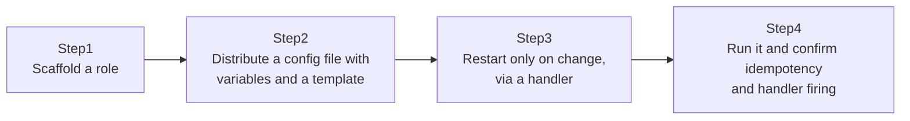

## Introduction

- **What You'll Learn From This Article**: You'll split the Playbook you built in [The Top 1% Hands-On for Automating Config Deployment to Multiple Servers With Ansible](/en/articles/ansible-handson-guide) — everything crammed into one YAML file — into a **role**, distribute a per-environment config file with a **Jinja2 template**, and use a **handler** so a service only restarts "when the config file actually changed." These three mechanisms show up in almost every piece of real-world Ansible code, and you'll build all three hands-on here.
- **Intended Audience**: Readers who finished the [previous hands-on](/en/articles/ansible-handson-guide) and can automate something small with a single Playbook, but don't yet understand why real-world Ansible code is organized around the role unit.
- **Estimated Reading Time**: About 30 minutes (about an hour if you build along with the hands-on)

This article is part of the [Top 1% Series' full article guide](/en/sitemap). It reuses the `control`/`node1` environment from the [previous hands-on](/en/articles/ansible-handson-guide) as-is.

## Prerequisites

- [The Top 1% Hands-On for Automating Config Deployment to Multiple Servers With Ansible](/en/articles/ansible-handson-guide): This article assumes you're already familiar with Inventory, Playbooks, and idempotency.

## The Big Picture

This hands-on consists of four steps.



## Hands-On Steps

### Step 1: Scaffold a role

In the `~/ansible-lab` directory from before, use the `ansible-galaxy` command to auto-generate the standard directory structure for a role.

```bash
cd ~/ansible-lab
mkdir roles
ansible-galaxy init roles/webserver
```

Check the generated directory structure.

```
roles/webserver/
├── tasks/main.yml       # The Tasks this role actually runs
├── handlers/main.yml    # Handlers (run only when something changed)
├── templates/           # Jinja2 templates (empty for now)
├── vars/main.yml        # Variables specific to this role
├── defaults/main.yml    # Default values for variables (lower priority than vars)
└── (other directories, unused today)
```

**Notice how "tasks," "handlers," "templates," and "variables" each get their own dedicated directory and file.** In the previous hands-on, all of this was crammed into a single file, `site.yml`. A role is a mechanism for organizing that mess, so that **"building a webserver" becomes a self-contained unit you can copy straight into another project and reuse.**

### Step 2: Distributing a config file with variables and a template

First, pull out the values you'll want to change per environment as variables. Edit `roles/webserver/vars/main.yml`.

```yaml
server_name: lab.example.com
welcome_message: "Hello from Ansible Roles!"
```

Next, create an Nginx test page with these variables embedded, as a Jinja2 template at `roles/webserver/templates/index.html.j2`.

```html
<h1>{{ welcome_message }}</h1>
<p>server_name: {{ server_name }}</p>
```

**The parts wrapped in `{{ }}` are Jinja2's variable-expansion syntax — they get replaced with the values from `vars/main.yml` at runtime.** This lets one single template file produce a different config file per environment, just by changing the values in `vars/main.yml`.

Next, edit `roles/webserver/tasks/main.yml` to describe installing Nginx and deploying this template.

```yaml
---
- name: Install Nginx
  ansible.builtin.apt:
    name: nginx
    state: present
    update_cache: true

- name: Deploy the test page from the template
  ansible.builtin.template:
    src: index.html.j2
    dest: /var/www/html/index.html
  notify: Restart Nginx
```

**Notice we're using the `ansible.builtin.template` module here, in place of the `ansible.builtin.copy` module from the previous hands-on.** `copy` transfers a static file as-is, while `template` expands the Jinja2 `{{ }}` syntax inside the file at runtime, before distributing it.

### Step 3: Restart a service "only when something changed," with a handler

The `notify: Restart Nginx` at the end of that Task is what triggers a handler. Edit `roles/webserver/handlers/main.yml` to define the corresponding handler.

```yaml
---
- name: Restart Nginx
  ansible.builtin.service:
    name: nginx
    state: restarted
```

**This combination of `notify` and `handlers` plays an extremely important role in real-world Ansible code.** A Task using the `template` module only returns a `changed` result — and only in that case does it call the handler named in `notify` — when the destination file's contents actually change. **If the contents didn't change (on a second or later run, for example), the handler is never called, and Nginx isn't restarted.** This prevents the wasteful, real-world-undesirable behavior of unconditionally restarting a service every single time a config file is distributed.

### Step 4: Run the role from site.yml

Rewrite `~/ansible-lab/site.yml` to a simple form that just calls the role.

```yaml
---
- name: Build the web server (role version)
  hosts: webservers
  become: true
  roles:
    - webserver
```

Run it.

```bash
ansible-playbook -i inventory.ini site.yml
```

On the first run, installing Nginx and deploying the template (and the resulting Nginx restart triggered by the handler) should both be reported as `changed`. **Run the same Playbook again.** This time, since the template's content hasn't changed, the `template` Task is reported as `ok`, and **the handler named in `notify` is never called — Nginx isn't restarted.**

Next, change the value of `welcome_message` in `vars/main.yml`, and run it once more. This time the `template` Task is reported as `changed`, and you can confirm from the `PLAY RECAP` output that **the handler is actually called, and Nginx is restarted.**

## What a Pro Sees Here (Top 1% Understanding)

### Why real-world Ansible code is organized around roles, not a single Playbook

Writing everything into one `site.yml`, as in the previous hands-on, is no problem for a small automation targeting only Nginx. But in practice, it's normal to manage multiple different server roles simultaneously — web servers, database servers, load balancers, and more. **Splitting things into role units makes it possible to manage and reuse each role independently — copying just the webserver role into a separate project, or handing off just the dbserver role to a different team member.** On top of that, Ansible Galaxy hosts a huge library of ready-made roles published by engineers worldwide, so you often don't have to reinvent the wheel at all.

### How a handler runs "just once, gathered at the end"

A handler has one more important property. **Even if multiple Tasks in the same Play `notify` the same handler, that handler still runs just once, gathered at the end of the Play.** For example, if three separate Tasks distributing three different Nginx config files all specify the same `notify: Restart Nginx`, Nginx is only restarted once at the end of the Play (as long as at least one of them changed) — not three separate times. This is a genuinely sensible design in practice: batch up multiple config changes, then restart the service safely, exactly once.

## Common Misconceptions and Pitfalls

- **Misconception 1: "The `copy` and `template` modules do the same thing."**
  `copy` transfers a static file as-is, while `template` expands Jinja2's `{{ }}` syntax at runtime before distributing it. Use `template` whenever you need to embed variables.
- **Misconception 2: "A handler always runs whenever a Task specifying `notify` runs."**
  A handler only runs when that Task actually reports `changed`.
- **Misconception 3: "If multiple Tasks notify the same handler, that handler runs once per notify."**
  Within the same Play, a handler runs just once at the end of the Play (as long as it was notified at least once).

## Troubleshooting Perspective

1. **You changed the config file and re-ran it, but the service didn't restart**: Check whether `notify` is correctly specified on the Task, and whether the string given to `notify` exactly matches the `name` in `handlers/main.yml` (even a one-character mismatch is silently treated as a different, nonexistent handler).
2. **A `template`-module Task outputs the literal `{{ }}` instead of expanding the variable**: Check for a typo in the variable name, or whether you're referencing a variable that isn't defined in `vars/main.yml`.
3. **An error says the role can't be found**: Check that the directory you're running `site.yml` from is positioned correctly relative to the `roles` directory (Ansible looks for `roles/` relative to `ansible.cfg`'s location or the current working directory at runtime).

## Summary

- `ansible-galaxy init` auto-generates the standard directory structure for a role (tasks, handlers, templates, vars).
- The `template` module expands Jinja2's `{{ }}` syntax at runtime before distributing a config file. Understand how that differs from `copy`.
- Combining `notify` and `handlers` lets you implement the safe pattern of restarting a service only when something actually changed.
- Even if multiple Tasks in the same Play notify the same handler, it still only runs once, gathered at the end of the Play.
- Splitting things into role units makes independent management and reuse possible, per role.

**Takeaways to Apply Today**
1. When writing a Task that requires restarting a service, make it a habit to reach for the `notify`-plus-handler combination instead of restarting unconditionally.
2. If you get the chance to write a Playbook for a second web server use case, try copying and reusing the webserver role you just built as-is.

## References

- [Ansible: Roles](https://docs.ansible.com/ansible/latest/playbook_guide/playbooks_reuse_roles.html)
- [Ansible: Handlers and notify](https://docs.ansible.com/ansible/latest/playbook_guide/playbooks_handlers.html)
- [Ansible: ansible.builtin.template module](https://docs.ansible.com/ansible/latest/collections/ansible/builtin/template_module.html)
