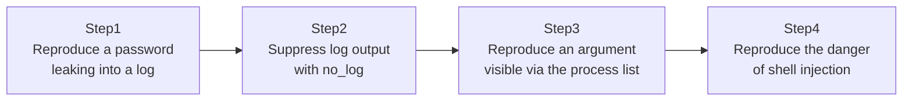

## Introduction

- **What You'll Learn From This Article**: [The Top 1% Hands-On for Never Leaving a Password in Plaintext in Git With Ansible Vault](/en/articles/ansible-vault-handson-guide) covered at-rest encryption with Vault, but a separate set of paths exists where secrets can leak at runtime. This article reproduces three runtime leak paths — **plaintext output into logs**, **visibility via the process list**, and **shell injection** — inside a test environment you manage yourself, and walks through closing off each one. **This hands-on is for educational and defensive purposes, to strengthen the defenses of a test environment you manage yourself. Do not run this procedure against someone else's live environment without authorization.**
- **Intended Audience**: Readers who encrypt at rest with Ansible Vault, but have never been conscious of the risk of secrets ending up in runtime logs or the process list.
- **Estimated Reading Time**: About 20 minutes (about 35 minutes if you build along with the hands-on)

This article is part of the [Top 1% Series Complete Article Guide](/en/sitemap), the 11th article in the [Ansible Series](/en/sitemap#series-list).

## The Big Picture

This hands-on consists of four steps.



## Hands-On Steps

### Step 1: Reproduce a password leaking into a log

Run a command that includes a password as an argument, without `no_log`.

```yaml
- name: Create a database user (leaks the password into the log)
  command: "mysql -u root -p{{ db_root_password }} -e \"CREATE USER 'app'@'%' IDENTIFIED BY 'AppP@ss123!';\""
```

Run this Playbook with `-v` (verbose mode).

```bash
ansible-playbook -i inventory.ini site.yml -v
```

**The execution output shows `db_root_password`'s actual value, as the full command line, exactly as-is.** If your operation saves and shares this Playbook's execution result as a CI/CD job log, the root password is now leaked to everyone who can view that log.

### Step 2: Suppress log output with no_log

Add `no_log: true` to the same task.

```yaml
- name: Create a database user (log output suppressed)
  command: "mysql -u root -p{{ db_root_password }} -e \"CREATE USER 'app'@'%' IDENTIFIED BY 'AppP@ss123!';\""
  no_log: true
```

**Re-run the same command with `-v`, and the output is replaced with the string `censored`, with the actual value never displayed at all.** Adding `no_log: true` to any task handling a secret is nearly mandatory practice in real-world work.

### Step 3: Reproduce an argument visible via the process list

Even with `no_log` set, a separate path can leak the secret for that brief instant it's running.

```yaml
- name: Long-running command that embeds a secret as an argument
  shell: "sleep 5 && echo done"
  args:
    warn: false
  environment:
    DB_PASSWORD: "{{ db_root_password }}"
```

While this task is running, check the same host from a separate terminal.

```bash
ps aux | grep mysql
```

**`no_log` only suppresses Ansible's own log output — it doesn't prevent the path where, while a command is actually running on the target host, its command-line arguments are visible in the OS's process list.** Passing a password via an environment variable or a temporarily placed password file, instead of as an argument, is the countermeasure for this path.

### Step 4: Reproduce the danger of shell injection

Reproduce the danger of embedding an externally supplied value directly into the `shell` module.

```yaml
- name: Vulnerable to shell injection if user_supplied_value is untrusted
  shell: "echo {{ user_supplied_value }}"
  vars:
    user_supplied_value: "hello; rm -rf /tmp/testdir"
```

**Pass an untrusted external input — like an API response or a user-submitted form value — into the `shell` module like `user_supplied_value` here, and everything after the `;` gets executed as a separate command.** This test environment keeps it to the harmless example `rm -rf /tmp/testdir`, but a real attack could use this path to run an arbitrary command.

## What a Pro Sees Here (Top 1% Understanding)

### At-rest encryption and runtime leak paths need separate countermeasures

Vault, covered in [The Top 1% Hands-On for Never Leaving a Password in Plaintext in Git With Ansible Vault](/en/articles/ansible-vault-handson-guide), protects secrets **at rest** (while sitting in a Git repository). The `no_log`, process list, and shell injection risks covered in this hands-on, on the other hand, are all an entirely different category of risk, occurring **at runtime**. Believing "we're safe because it's encrypted with Vault" is an incomplete understanding, in the sense that it doesn't protect the runtime path at all. In real-world work, you need to close off both categories of risk, separately.

### The real essence of shell injection countermeasures is not using shell at all

Rather than embedding a parameter directly into the `shell` module, in most cases you can avoid this class of risk at the root by not using the `shell` module at all, and using a dedicated module instead (`user`, `mysql_user`, `copy`, and more). Dedicated modules are designed to internally handle parameters safely. **The judgment "if a dedicated module exists, consider it first" — rather than "the shell module is convenient because it can do anything" — is the first thing a top-1% engineer checks in an Ansible code review.** If you genuinely have no choice but to use `shell`, escape the value with the `quote` filter, or consider an execution method that bypasses shell interpretation entirely, such as `args: {executable: ...}`.

## Common Misconceptions and Pitfalls

- **Misconception 1: "Setting no_log closes off every secret leak path."**
  no_log only suppresses Ansible's own log output. It doesn't prevent other paths, like appearing in the process list on the target host.
- **Misconception 2: "Encrypting with Ansible Vault means runtime leak countermeasures aren't needed."**
  Vault is an at-rest countermeasure — runtime leaks (logs, the process list, shell injection) need separate countermeasures.
- **Misconception 3: "Even if you embed a variable in the shell module, Ansible automatically escapes it for you."**
  Ansible doesn't perform automatic escaping. When embedding an untrusted value, you need to explicitly escape it, such as with the `quote` filter.

## Troubleshooting Perspective

1. **Set no_log, but some information still shows up in the log**: `no_log` is a per-task setting. Check whether a different task before or after it (like `debug`) is outputting the same variable from somewhere else.
2. **Replacing with a dedicated module is difficult**: For an operation with no dedicated module, first consider whether the `command` module (which bypasses shell interpretation) can replace `shell`.
3. **Past secrets still linger in CI/CD logs**: Adding `no_log` only applies to runs from that point forward. Past CI/CD log output itself needs a separate action to delete or de-publish it.

## Summary

- Add `no_log: true` to any task handling a secret, to suppress Ansible's log output.
- `no_log` doesn't prevent a separate leak path: visibility on the target host's process list.
- Embedding an untrusted, externally supplied value directly into the `shell` module creates a shell injection risk.
- At-rest encryption (Vault) and runtime leak countermeasures are two different categories of countermeasure that need to be addressed separately.

**Takeaways to Apply Today**
1. Make adding `no_log: true` standard practice for every task handling a password or private key.
2. Build the habit of first considering whether a dedicated module can replace `shell`, before reaching for it.

## References

- [Protecting sensitive data with no_log | Ansible Documentation](https://docs.ansible.com/ansible/latest/playbook_guide/playbooks_variables.html#hiding-output-with-no-log)
- [Command Injection | OWASP](https://owasp.org/www-community/attacks/Command_Injection)
