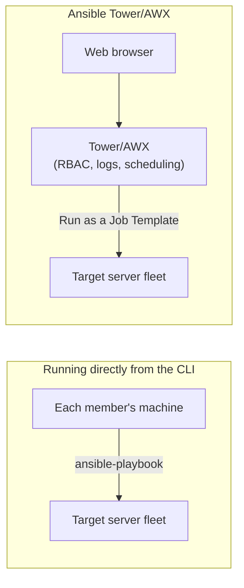

## Introduction

- **What You'll Learn From This Article**: This series, starting from [Understanding What Ansible Is From a "Top 1%" Perspective](/en/articles/ansible-guide), has consistently run `ansible-playbook` directly from an individual's machine or a CI/CD pipeline. This article gives you a systematic understanding of exactly **how that setup breaks down as an organization grows**, and how Ansible Tower (and its open-source counterpart, AWX) solves that problem.
- **Intended Audience**: Readers comfortable with the `ansible-playbook` command, who've heard the terms "Ansible Tower" and "AWX" but can't explain what's different about them compared to running from the CLI.
- **Estimated Reading Time**: About 13 minutes

This article is part of the [Top 1% Series Complete Article Guide](/en/sitemap), the 18th article in the [Ansible Series](/en/sitemap#series-list).

## The Big Picture

## A Thorough, Grounds-Up Explanation

### How Ansible Tower and AWX Relate

**Ansible Tower** is Red Hat's commercial web application for centrally managing Ansible execution. **AWX** is the open-source project Tower is built on. The naming of specific features differs slightly, but the core concept — centrally managing Playbook execution through a web UI — is shared by both.

### The Organizational-Scale Problems With Running Directly From the CLI

Having each team member run `ansible-playbook` directly from their own machine or a CI/CD pipeline works fine for an individual or a small team. But as an organization's headcount grows, problems like these surface:

- **Hard to track who ran what, and when**: There's no centralized way to trace execution history, short of individually checking each member's shell history or logs.
- **No fine-grained control over who can run against production**: SSH keys and cloud credentials have to be distributed to every member who runs anything, making it hard to enforce something like "this Playbook is fine to run, but that one isn't."
- **Scheduled runs end up dependent on whoever's individual cron**: It becomes tribal knowledge which machine's `crontab` has which job registered.

## What a Pro Sees Here (Top 1% Understanding)

### The Four Concrete Problems Tower/AWX Solves

**Ansible Tower (AWX) solves each of the problems above with a specific, concrete feature.**

- **RBAC (role-based access control)**: Lets you configure fine-grained execution permissions per Playbook and per environment — for example, "this user group can only run this production-targeted Job Template." SSH keys and cloud credentials themselves are managed centrally inside Tower/AWX, eliminating the need to distribute them to the machines of everyone who runs anything.
- **Centralized execution logging**: Records who ran which Playbook, when, and with what result, entirely as searchable, auditable history in the web UI.
- **Scheduled execution**: Instead of depending on any individual machine's cron, Tower/AWX itself centrally manages the schedule for recurring runs.
- **Job Templates**: Lets you pre-define the combination of "which Playbook, against which inventory, using which credential" — and anyone with execution permission just picks that template and runs it. **The biggest practical win here is that the person running it never has to directly handle an SSH key or a detailed `ansible-playbook` command-line option themselves.**

**The design principle of "never let credentials touch an individual's machine" is a natural extension of the secrets-management approach covered in [The Top 1% Hands-On for Never Leaving a Password in Plaintext in git With Ansible Vault](/en/articles/ansible-vault-handson-guide).** Where Vault's job is encrypting secrets inside a file, Tower/AWX solves the problem one layer up — by never handing the credential itself to the person running the job in the first place.

## Common Misconceptions and Pitfalls

- **Misconception 1: "Ansible Tower and AWX are completely separate pieces of software."**
  AWX is the open-source project Tower is built on, sharing the same core concept and most of the same functionality.
- **Misconception 2: "Adopting Tower/AWX changes how you write a Playbook."**
  Tower/AWX operates at the layer of how an existing Playbook gets run and managed — it has no effect on how you write the Playbook itself (YAML, Tasks, Roles, and so on).
- **Misconception 3: "Adopting Tower/AWX is always better, even for a small team."**
  Features like RBAC and scheduling only pay off once an organization's headcount, or its need to segment execution permissions, actually grows — for an individual or small team, running directly from the CLI is often perfectly sufficient.

## Troubleshooting Perspective

This article covers Tower/AWX at an overview level, so it doesn't go into specific installation steps or Job Template configuration. When considering adopting Tower/AWX, the first practical step is organizing a permission matrix: who is allowed to run which Playbook against which environment.

## Summary

- Ansible Tower is a commercial web application; AWX is the open-source project it's built on.
- Running directly from the CLI runs into three problems as an organization grows: tracking execution history, segmenting permissions, and managing schedules.
- Tower/AWX solves these with four features: RBAC, centralized execution logging, scheduled execution, and Job Templates.

**Takeaways to Apply Today**
1. Once your team's headcount grows and managing "who's allowed to run what" gets unwieldy, treat that as a signal to evaluate Tower/AWX.
2. The Job Template idea — pre-defining a combination and letting the runner just pick it — is a useful principle for organizing Playbooks even without adopting Tower/AWX.

## References

- [Red Hat Ansible Automation Platform](https://www.redhat.com/en/technologies/management/ansible)
- [AWX Project (GitHub)](https://github.com/ansible/awx)
