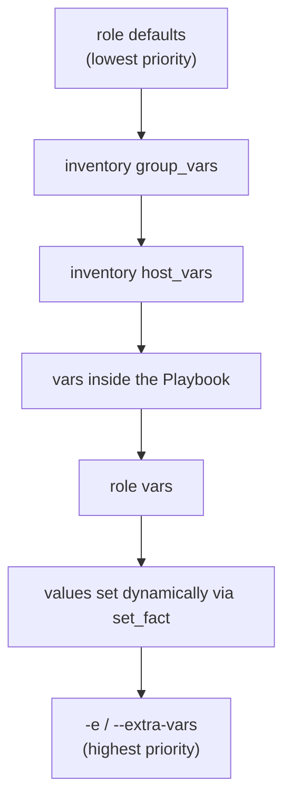

## Introduction

- **What You'll Learn From This Article**: Beyond the `group_vars` covered in [The Top 1% Hands-On for Safely Handling dev/staging/prod With a Single Playbook](/en/articles/ansible-environments-handson-guide), Ansible offers many places to define a variable. This article gives you a systematic understanding of **which value actually wins** when they collide.
- **Intended Audience**: Readers who've used `group_vars`, `host_vars`, or `-e` (extra-vars) individually, but can't explain what happens when several of them define the same variable name at once.
- **Estimated Reading Time**: About 13 minutes

This article is part of the [Top 1% Series Complete Article Guide](/en/sitemap), the 14th article in the [Ansible Series](/en/sitemap#series-list).

## The Big Picture

## A Thorough, Grounds-Up Explanation

### Six Common Places to Define a Variable

- **role defaults (`roles/*/defaults/main.yml`)**: The "initial value" for that role — the lowest-priority variable, meant to be overridden by whoever uses the role.
- **group_vars (`group_vars/<group name>.yml`)**: Applied in bulk to every host belonging to a specific inventory group.
- **host_vars (`host_vars/<host name>.yml`)**: Applied only to a single, specific host.
- **`vars` inside the Playbook**: Written directly into the Playbook file.
- **role `vars` (`roles/*/vars/main.yml`)**: A role's "generally not meant to be overridden" setting.
- **`-e`/`--extra-vars`**: Passed directly on the command line at `ansible-playbook` runtime.

### The Core Precedence Principle: "More Specific and More Recent" Wins

Ansible's official documentation lists a detailed 21-tier variable precedence order, but what matters first in practice is one core principle: **whatever applies to a narrower scope, or loads later, wins over whatever applies more broadly, or loads earlier.** As the diagram shows, a "broad, early" variable like role defaults gets overridden easily, while `-e`, specified directly at every single run, overrides everything else.

## What a Pro Sees Here (Top 1% Understanding)

### "I Passed -e and It Didn't Take Effect" Almost Never Happens — Which Is What Makes It Dangerous

**`-e` (extra-vars) effectively holds the strongest power in Ansible's entire variable-precedence order.** Flip that around, and it means: **pass even one wrong value via `-e` at Playbook runtime, and it overrides everything else without exception, no matter how carefully you've configured role defaults or group_vars.** In a setup where a CI/CD pipeline invokes Ansible, a classic incident shape is a pipeline misconfiguration that passes an unintended `-e`, applying a staging value to the production environment.

**Precisely because of that strength, the standard practice in real-world operations is to keep `-e` limited to narrow uses — a one-off override, or an explicit injection from CI/CD — and manage persistent configuration values through `group_vars` or `host_vars` instead.** Conversely, since role defaults is the place meant for "an initial value the user is free to override," a value the role genuinely needs to stay fixed belongs in `vars` (not `defaults`), which avoids it getting overridden from something like group_vars.

## Common Misconceptions and Pitfalls

- **Misconception 1: "Between group_vars and host_vars, whichever loads later wins."**
  It's not about load order — it's about scope. host_vars applies to only one specific host, so it wins over group_vars.
- **Misconception 2: "A value written in role defaults never changes within that role."**
  role defaults is the lowest-priority variable, and gets easily overridden by nearly everything else — group_vars, host_vars, extra-vars, and more.
- **Misconception 3: "A variable passed via -e only applies to part of that Playbook run."**
  `-e` applies across the entire command line — every single Task in that Playbook run — taking priority over every other source.

## Troubleshooting Perspective

1. **An unexpected variable value is being used**: Run `ansible-playbook` with `-v` (verbose output), or use `ansible-inventory --host <hostname>` to check the final value that ends up applied to that host.
2. **Only runs via a CI/CD pipeline apply an unintended setting**: Check whether the pipeline's run command embeds an unintended `-e` argument.
3. **Reusing a role doesn't pick up the expected defaults value**: Check whether the caller (a Playbook or group_vars) defines a variable with the same name.

## Summary

- Ansible variables can be defined in many places: role defaults, group_vars, host_vars, vars inside a Playbook, role vars, and extra-vars, among others.
- The core precedence principle is that a narrower scope wins over a broader one, and a later-loaded value wins over an earlier one.
- `-e` (extra-vars) is the strongest override mechanism, taking priority over nearly every other source.

**Takeaways to Apply Today**
1. Manage persistent configuration values through group_vars/host_vars, and keep `-e` limited to one-off overrides or CI/CD injection.
2. When you hit an unexpected variable value, build the habit of checking `ansible-inventory --host <hostname>` to see which value actually won.

## References

- [Using Variables | Ansible Documentation](https://docs.ansible.com/ansible/latest/playbook_guide/playbooks_variables.html)
- [Ansible Variable Precedence | Ansible Documentation](https://docs.ansible.com/ansible/latest/playbook_guide/playbooks_variables.html#variable-precedence-where-should-i-put-a-variable)
