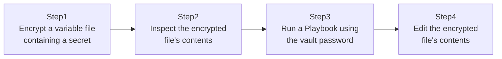

## Introduction

- **What You'll Learn From This Article**: You'll solve an extremely common real-world antipattern — writing a secret like a database password or an API key directly into a Playbook or variable file in plaintext, then committing it as-is to a Git repository — using **Ansible Vault.** You'll experience the safe pattern of version-controlling a file containing secrets in encrypted form, and decrypting it only at execution time.
- **Intended Audience**: Readers who've heard the name Ansible Vault but have never actually used it, and have wondered how they're supposed to handle secrets.
- **Estimated Reading Time**: About 20 minutes (about 40 minutes if you build along with the hands-on)

This article is part of the [Top 1% Series Complete Article Guide](/en/sitemap), the 4th article in the [Ansible Series](/en/sitemap#series-list).

## Prerequisites

- [The Top 1% Hands-On for Real-World Config Management With Ansible Roles, Handlers, and Templates](/en/articles/ansible-roles-handson-guide): This article assumes you already know the structure of a role and what `group_vars` is.

## Why This Problem Happens in the First Place

Ansible's variable files (`group_vars` and `host_vars`) are usually version-controlled in the same Git repository as the rest of the Playbook's code. **Write a secret like a database connection password into one of these in plaintext, and anyone with read access to that Git repository can read that secret.** What makes this even trickier: once it's committed to Git's history, deleting the offending line later doesn't help — anyone can still dig through the commit history and read that secret.

## The Big Picture

This hands-on consists of four steps.



## Hands-On Steps

### Step 1: Encrypt a variable file containing a secret

Create a variable file containing a database password.

```bash
cat > db_secrets.yml << 'EOF'
db_password: "SuperSecretP@ssw0rd"
EOF
```

Encrypt this file with Ansible Vault.

```bash
ansible-vault encrypt db_secrets.yml
```

**Running this prompts you for a password to use for encryption.** Remember this password — you'll need it every time you decrypt or edit this file going forward.

### Step 2: Inspect the encrypted file's contents

Run `cat db_secrets.yml` and check the file's contents. **You'll find they're now unreadable ciphertext starting with `$ANSIBLE_VAULT`.** In this state, you can safely commit this file to a Git repository as-is, without leaking the secret.

### Step 3: Run a Playbook using the vault password

To run a Playbook that reads this encrypted variable file, you need to additionally specify the vault password.

```bash
ansible-playbook -i inventory.ini site.yml --ask-vault-pass
```

**Specifying `--ask-vault-pass` prompts you for the vault password at runtime, temporarily decrypts the content with it, and runs the Playbook.** The decrypted content is never left on disk in plaintext. If typing this in manually every time is too tedious, you can instead save the vault password to a file and specify it with the `--vault-password-file` option (just don't forget to add that file itself to `.gitignore`, so it never ends up in the Git repository).

### Step 4: Edit the encrypted file's contents

If you want to change the encrypted file's contents later, you don't need the tedious process of manually decrypting it and re-encrypting it afterward.

```bash
ansible-vault edit db_secrets.yml
```

**This command bundles the entire flow — prompting for the vault password, opening the temporarily decrypted content in an editor, and automatically re-encrypting it once you save — into a single command.**

## What a Pro Sees Here (Top 1% Understanding)

### A design that lets "encrypted" and "unencrypted" files safely coexist in a Git repository

In practice, rather than encrypting an entire Playbook, the common design is to **carve out just the variables containing secrets into a dedicated encrypted file (often named something like `vault.yml`), while everything else — the regular Playbooks and task definitions — stays version-controlled unencrypted, as-is.** This keeps the vast majority of the code able to go through normal Git diff review, while safely protecting only the secrets. A common convention is pairing `group_vars/all/vault.yml` with an ordinary `group_vars/all/vars.yml`, where the latter references variables from the former.

### Using vault-id to manage multiple encryption passwords

As a more advanced technique, `ansible-vault` has a mechanism called **vault-id.** This lets you, for example, manage a "development environment encryption password" and a "production environment encryption password" separately, using files encrypted with different passwords side by side within the same repository.

```bash
ansible-vault encrypt --vault-id prod@prompt prod_secrets.yml
ansible-playbook site.yml --vault-id prod@prompt
```

**This mechanism prevents the accident of someone who knows the development environment's vault password accidentally being able to decrypt production secrets too.** As a team grows and you want to restrict who can access which environment, this `vault-id`-based separation becomes practically important.

## Common Misconceptions and Pitfalls

- **Misconception 1: "To edit a file encrypted with Ansible Vault, you have to manually decrypt it and then re-encrypt it."**
  The `ansible-vault edit` command bundles decrypt, edit, and re-encrypt into a single command.
- **Misconception 2: "As long as you know the vault password, you can decrypt any encrypted file."**
  If multiple passwords are being managed with `vault-id`, you can't decrypt a file without the specific password that corresponds to it.
- **Misconception 3: "Once a file is encrypted, it can no longer go through Git diff review at all."**
  While the encrypted file itself can't go through diff review, the vast majority of the Playbook's code that doesn't contain secrets can still go through normal diff review.

## Troubleshooting Perspective

1. **`ansible-playbook` doesn't prompt for the vault password at all**: Check whether that file is actually encrypted, by confirming with `cat` that it starts with `$ANSIBLE_VAULT`.
2. **You entered the vault password, but decryption fails**: If you're managing multiple passwords with `vault-id`, check whether the vault-id you specified matches the password that file was actually encrypted with.
3. **The file specified with `--vault-password-file` accidentally got committed to Git**: Immediately change that file's contents (rotate the vault password itself), and consider also removing it from Git's history.

## Summary

- Ansible Vault lets you version-control a variable file containing secrets in encrypted form.
- The `ansible-vault edit` command handles decrypt, edit, and re-encrypt in a single step.
- In practice, it's common to carve secrets out into a dedicated encrypted file while leaving the rest of the code unencrypted.
- `vault-id` lets you manage a different encryption password per environment.

**Takeaways to Apply Today**
1. Whenever you need to put a secret into a Playbook, consider encrypting it with Ansible Vault before ever writing it in plaintext.
2. If you use `--vault-password-file`, don't forget to add that file itself to `.gitignore`.

## References

- [Ansible: Encrypting content with Vault](https://docs.ansible.com/ansible/latest/vault_guide/vault_encrypting_content.html)
- [Ansible: Managing multiple vault passwords with vault-id](https://docs.ansible.com/ansible/latest/vault_guide/vault_managing_passwords.html)
