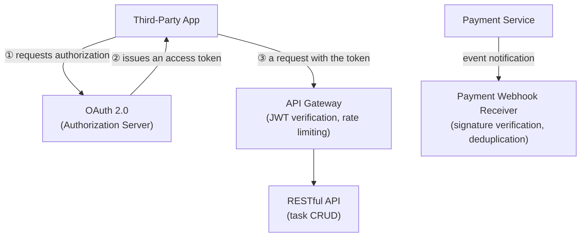

## Introduction

- **What You'll Learn From This Article**: This is the Web/API Department's capstone project, where you'll **integrate, on your own, the techniques you've learned one at a time in earlier hands-on labs** (RESTful API design for idempotency and pagination, authorization via OAuth 2.0, webhook signature verification and deduplication, rate-limiting algorithms, a structurally safe JWT verification implementation) **into a single fictional SaaS startup's public API platform.** Where earlier articles aimed at "following steps to reliably master one technique," this article takes a format much closer to real-world work: **presenting only requirements, and leaving you to design which techniques to combine, and how.**
- **Intended Audience**: Readers who've worked through the Web/API Department's Junior, Senior, and Graduate School content and can execute each individual hands-on lab, but have never designed a single API platform combining them.
- **Estimated Reading Time**: Expect several days to about a week, including design, building, and documentation (the heaviest single hands-on in this series).

This article is part of the [Top 1% Series Complete Article Guide](/en/sitemap). It's positioned as the capstone project within the [Web/API Department's full curriculum](/en/university#web-api-department).

## Prerequisite Knowledge

This hands-on doesn't teach any new technique. **You'll combine and use the techniques you've already mastered in the following completed hands-on labs.**

- [Understanding RESTful APIs — From HTTP/JSON Fundamentals to Real-World Design — From a Top 1% Perspective](/en/articles/restful-api-guide)
- [A Top 1% Hands-On for Building a Simple RESTful API Yourself and Verifying Idempotency and Pagination With curl](/en/articles/restful-api-handson-guide)
- [Understanding What's Actually Happening Behind a Payment API From a Top 1% Perspective](/en/articles/payment-api-guide)
- [Understanding How OAuth 2.0 Works From a Top 1% Perspective](/en/articles/oauth2-guide)
- [Understanding the Difference Between GraphQL and RESTful APIs From a Top 1% Perspective](/en/articles/graphql-vs-rest-guide)
- [A Top 1% Hands-On for Building a Webhook Receiver Yourself and Experiencing Signature Verification and Handling a Retried Delivery](/en/articles/webhook-signature-handson-guide)
- [A Top 1% Hands-On for Implementing Rate Limiting Yourself With a Token Bucket, and Reproducing the Fixed Window's Boundary Burst](/en/articles/rate-limiting-handson-guide)
- [A Top 1% Hands-On for Reproducing JWT's 'alg: none' Vulnerability Yourself and Confirming Defense via an Explicit Allowed-Algorithm List](/en/articles/jwt-alg-none-handson-guide)

## The Assignment: a Fictional SaaS Startup's Public API Platform

**You're an infrastructure engineer at a fictional SaaS startup, "KoiKoi Tasks." The company runs a task-management service, and is launching a public API platform letting third-party developers operate a user's tasks from their own apps. Your assignment is to build, on your own, an API platform that satisfies all of the following requirements.**

### Requirement 1: Prevent a Third-Party Developer From Accessing Data Without the User's Permission

**Build a mechanism that obtains the user's own explicit permission before a third-party app can operate the user's tasks on their behalf.** The premise is that a password is never handed to the third-party app at all.

### Requirement 2: Design Task CRUD Operations as a RESTful API That Correctly Preserves Idempotency

**Build an API for creating, retrieving, updating, and deleting tasks.** In particular, design the update operation so it's safe to send the same request multiple times.

### Requirement 3: Guarantee That Verifying an Issued Token Is Structurally Safe

**When the API gateway verifies an incoming token, eliminate the design flaw of unconditionally trusting information carried inside the token itself.**

### Requirement 4: Protect the Whole Service From Excessive Requests by a Specific Client

**Make sure one client sending a flood of requests in a short time never consumes the entire service's processing capacity.** Also watch out for the unintended loophole a naive implementation can carry.

### Requirement 5: Safely Receive Notifications From the Payment Service

**When a user subscribes to the premium plan, receive the notification sent by the payment service, and verify it genuinely came from the legitimate payment service.** Make sure the premium plan never gets activated twice if the same notification arrives more than once.

### Requirement 6: Consider Whether You Can Flexibly Handle Multiple Different Clients' Requirements

**A web app and a mobile app, two different clients, may each need a differently shaped set of data.** Consider what design options would exist if this requirement ever needs addressing in the future.

## Deliverable Requirements: Assemble It as a Portfolio

**This hands-on's final deliverable isn't just a confirmation that the configuration worked.** Put together a repository, on GitHub or similar, containing:

- **README.md**: An overview of this scenario, and the full picture of the API platform you adopted (including diagrams, such as Mermaid).
- **A record of your design decisions**: Why you chose that specific technology or configuration — especially anywhere a security-versus-developer-usability trade-off came up.
- **The steps you actually took**: A record of the configuration and the commands you used to verify it.
- **A retrospective**: What challenges you discovered while doing this, and what you'd additionally consider in genuine real-world work (monitoring API usage, auto-generating API documentation, and similar).

**This deliverable itself is a concrete accomplishment you can present in a job search or as a portfolio piece.** Being able to show "I designed a solution combining multiple techniques under the realistic constraints of third-party integration, and can articulate the security-versus-usability trade-offs" is far more persuasive than simply saying "I did the OAuth 2.0 hands-on."

## What a Pro Sees Here (Top 1% Understanding)

### "Following Steps" and "Designing From Requirements" Are Entirely Different Skills

Every earlier hands-on in this series took the form of "Step 1, Step 2, ..." — following a fixed, predetermined sequence. **But what actually gets valued in real-world work isn't the ability to execute a procedure exactly as written — it's the ability to look at given requirements (Requirements 1 through 6 in this article) and design, yourself, which techniques to combine, and how.** These are similar-looking but entirely different skills. Completing every individual hands-on doesn't make you immediately effective in real work if you've never designed one coherent API platform combining them. This capstone project is deliberately designed to bridge exactly that gap.

### Why a "Third-Party Plus Payment Integration" Setting?

There's a reason this hands-on deliberately models a realistic project — integrating with both external developers and an external payment service — instead of a single-shot technical demo. **Most real-world API platform builds never wrap up with a single purpose — they need to simultaneously satisfy multiple axes: authorization, authentication safety, resilience against excessive use, and safe integration with external services.** Knowing the basics of RESTful API design alone doesn't help in a real project if you can't also see ahead to OAuth 2.0, safe JWT verification, rate limiting, and safely receiving a webhook. The ultimate goal of this capstone is elevating your knowledge of individual techniques into **the design ability to see every external connection point at once.**

## Common Misconceptions and Pitfalls

- **Misconception 1: "This hands-on has one fixed, correct configuration."**
  There's no single correct answer here. Multiple valid approaches exist as long as they satisfy the requirements. Recording the design you chose, and why, in README.md is what matters.
- **Misconception 2: "A confirmation that the configuration worked is sufficient as a deliverable."**
  Confirming it works matters, but it's not enough on its own. Being able to articulate the reasoning behind your design decisions is this hands-on's real value.
- **Misconception 3: "Having completed every individual hands-on means this one will go quickly too."**
  There's a real gap between knowing individual techniques and integrating them into one coherent design. Expect this to take considerable time.

## Troubleshooting Perspective

This hands-on's main challenge isn't individual technical troubleshooting — it's **design rework.**

1. **You thought you satisfied the requirements, but notice a contradiction later**: Before starting implementation, write out only the design section of README.md first, and confirm on paper that all six requirements are genuinely satisfied.
2. **You've forgotten the steps for an individual hands-on**: Don't hesitate to go back and re-read the prerequisite article for that requirement. This capstone tests design ability, not memorization.
3. **You're not sure how thorough to make this**: Use "could I show this README.md to an interviewer I've never met and explain my design decisions" as your bar for completeness.

## Summary

- This capstone project is an integrative exercise combining the techniques you've learned individually in the Web/API Department, into a single fictional SaaS startup's public API platform.
- What's being tested is the ability to design from requirements yourself, not the ability to follow a procedure.
- Assemble your deliverable as a portfolio piece — a document articulating the reasoning behind your design decisions, not just confirmation it worked.

**Takeaways to Apply Today**
1. Even while learning individual hands-on labs, build the habit of asking "under what future requirements would I actually use this?"
2. Beyond the technical deliverable itself, build the habit of articulating security-versus-usability trade-offs in your day-to-day work too.

## References

- [The Web/API Department's Full Curriculum](/en/university#web-api-department)
