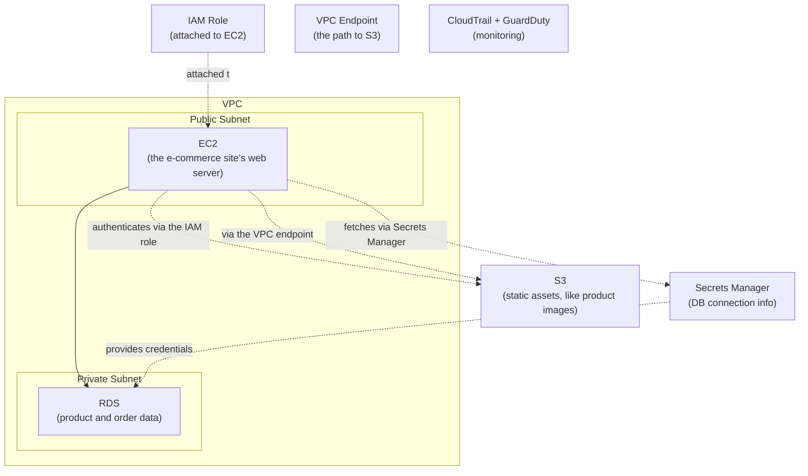

## Introduction

- **What You'll Learn From This Article**: This is the AWS Department's capstone project, where you'll **integrate, on your own, the techniques you've learned one at a time in earlier hands-on labs** (VPC design, EC2, RDS/Secrets Manager, S3, IAM roles, VPC endpoints, EBS backups, least-privilege policies, CloudTrail/GuardDuty, and more) **into a single fictional e-commerce site's infrastructure.** Where earlier articles aimed at "following steps to reliably master one technique," this article takes a format much closer to real-world work: **presenting only requirements, and leaving you to design which techniques to combine, and how.**
- **Intended Audience**: Readers who've worked through the AWS Department's Junior, Senior, and Graduate School content and can execute each individual hands-on lab, but have never designed a single environment combining them.
- **Estimated Reading Time**: Expect several days to about a week, including design, building, and documentation (the heaviest single hands-on in this series).

This article is part of the [Top 1% Series Complete Article Guide](/en/sitemap). It's positioned as the capstone project within the [AWS Department's full curriculum](/en/university#aws-department).

## Prerequisite Knowledge

This hands-on doesn't teach any new technique. **You'll combine and use the techniques you've already mastered in the following completed hands-on labs.**

- [The Top 1% Hands-On for Building a VPC With Public/Private Subnets Yourself](/en/articles/aws-vpc-handson-guide)
- [The Top 1% Hands-On for Launching an EC2 Instance and Publishing a Web Server](/en/articles/aws-ec2-webserver-handson-guide)
- [The Top 1% Hands-On for Never Letting an App Write a Password With RDS and Secrets Manager](/en/articles/aws-rds-secrets-handson-guide)
- [The Top 1% Hands-On for Publishing a Static Website From an S3 Bucket](/en/articles/aws-s3-static-website-handson-guide)
- [The Top 1% Hands-On for Never Giving EC2 an Access Key: Escaping Hardcoded Credentials With an IAM Role](/en/articles/aws-iam-role-handson-guide)
- [The Top 1% Hands-On for Reaching S3 Without a NAT Gateway Using a VPC Endpoint](/en/articles/aws-vpc-endpoint-handson-guide)
- [The Top 1% Hands-On for Building a Backup/Restore Strategy With EBS Snapshots and AMIs](/en/articles/aws-ebs-snapshot-handson-guide)
- [The Top 1% Hands-On for Reproducing the Danger of an Overly Broad IAM Policy and Scoping It to Least Privilege](/en/articles/aws-least-privilege-policy-handson-guide)
- [The Top 1% Hands-On for Detecting a Leaked Access Key's Misuse With CloudTrail and GuardDuty](/en/articles/aws-cloudtrail-guardduty-handson-guide)

## The Assignment: Building a Fictional E-Commerce Company's Infrastructure

**You're an infrastructure engineer at a fictional e-commerce company, "KoiKoi Shop." The company is migrating its on-premises e-commerce site fully onto AWS. Your assignment is to build, on your own, an integrated AWS environment that satisfies all of the following requirements.**

### Requirement 1: Design a VPC With Public and Private Subnets

The e-commerce site's web server needs to be reachable from outside, but **place the database in a private subnet that can never be reached directly from the internet.**

### Requirement 2: Build the Web Server on EC2, With No Credentials Hardcoded Anywhere

The e-commerce application's code must **never hardcode an access key or password anywhere, for connecting to the database or accessing S3.**

### Requirement 3: Put the Product Database on RDS, Product Images on S3

**Put order and product data on RDS, and static assets like product images on S3**, each placed appropriately.

### Requirement 4: Optimize NAT Gateway Traffic Cost

Heavy traffic from EC2 to S3 is expected. **Consider and implement a setup that avoids being billed for data volume passing through a NAT gateway.**

### Requirement 5: Establish a Backup Regimen

**Establish a regular backup mechanism for the EC2 instance, and verify you can actually restore from it.**

### Requirement 6: Perform a Least-Privilege Security Review

The rushed migration may have left **IAM policies with more permissions than actually needed. Audit the actual permissions in use and scope the policies down to the minimum necessary.**

### Requirement 7: Establish Monitoring and Detection

**In case credentials ever leak, build a monitoring setup capable of detecting suspicious API calls.**

## Deliverable Requirements: Assemble It as a Portfolio

**This hands-on's final deliverable isn't just screenshots of things working, or the AWS Management Console's configuration results.** Put together a repository, on GitHub or similar, containing:

- **README.md**: An overview of this scenario, and the full picture of the architecture you adopted (including diagrams, such as Mermaid).
- **A record of your design decisions**: Why you chose that specific instance type, storage class, or policy scope — especially anywhere a cost-versus-security trade-off came up.
- **The steps you actually took**: A record of the AWS CLI commands or console configuration changes you actually made (be sure to remove any sensitive information, such as access keys).
- **A retrospective**: What challenges you discovered while doing this, and what you'd additionally consider in genuine real-world work (auto scaling, a multi-AZ setup, and similar).

**This deliverable itself is a concrete accomplishment you can present in a job search or as a portfolio piece.** Being able to show "I designed a solution combining multiple techniques under the realistic constraints of an e-commerce migration to AWS, and can articulate the cost-versus-security trade-offs" is far more persuasive than simply saying "I did the RDS and Secrets Manager hands-on."

## What a Pro Sees Here (Top 1% Understanding)

### "Following Steps" and "Designing From Requirements" Are Entirely Different Skills

Every earlier hands-on in this series took the form of "Step 1, Step 2, ..." — following a fixed, predetermined sequence. **But what actually gets valued in real-world work isn't the ability to execute a procedure exactly as written — it's the ability to look at given requirements (Requirements 1 through 7 in this article) and design, yourself, which AWS services to use, in what configuration, and how to combine them.** These are similar-looking but entirely different skills. Completing every individual hands-on doesn't make you immediately effective in real work if you've never designed one coherent architecture combining them. This capstone project is deliberately designed to bridge exactly that gap.

### Why a "Fictional E-Commerce Migration" Setting?

There's a reason this hands-on deliberately models a realistic project with multiple tangled concerns — a full on-premises migration — instead of a single-shot technical demo. **Most real-world AWS projects never wrap up with a single service rollout — they need to simultaneously satisfy multiple axes at once: availability, cost, and security.** Knowing VPC design alone doesn't help in a real project if you can't also see ahead to cost optimization, least privilege, and a monitoring setup. The ultimate goal of this capstone is elevating your knowledge of individual services into **the design ability to see an entire project.**

## Common Misconceptions and Pitfalls

- **Misconception 1: "This hands-on has one fixed, correct configuration."**
  There's no single correct answer here. Multiple valid approaches exist as long as they satisfy the requirements. Recording the design you chose, and why, in README.md is what matters.
- **Misconception 2: "Screenshots proving it worked are sufficient as a deliverable."**
  Screenshots matter, but they're not enough on their own. Being able to articulate the reasoning behind your design decisions is this hands-on's real value.
- **Misconception 3: "Having completed every individual hands-on means this one will go quickly too."**
  There's a real gap between knowing individual techniques and integrating them into one coherent design. Expect this to take considerable time.

## Troubleshooting Perspective

This hands-on's main challenge isn't individual technical troubleshooting — it's **design rework.**

1. **You thought you satisfied the requirements, but notice a contradiction later**: Before starting implementation, write out only the design section of README.md first, and confirm on paper that all seven requirements are genuinely satisfied.
2. **You've forgotten the steps for an individual hands-on**: Don't hesitate to go back and re-read the prerequisite article for that requirement. This capstone tests design ability, not memorization.
3. **You're not sure how thorough to make this**: Use "could I show this README.md to an interviewer I've never met and explain my design decisions" as your bar for completeness.

## Summary

- This capstone project is an integrative exercise combining the techniques you've learned individually in the AWS Department, into a single fictional e-commerce migration scenario.
- What's being tested is the ability to design from requirements yourself, not the ability to follow a procedure.
- Assemble your deliverable as a portfolio piece — a document articulating the reasoning behind your design decisions, not just proof it worked.

**Takeaways to Apply Today**
1. Even while learning individual hands-on labs, build the habit of asking "under what future requirements would I actually use this?"
2. Beyond the technical deliverable itself, build the habit of articulating cost-versus-security trade-offs in your day-to-day work too.

## References

- [The AWS Department's Full Curriculum](/en/university#aws-department)
