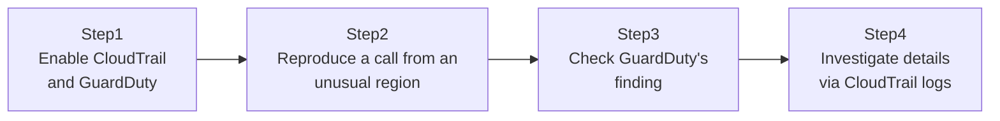

## Introduction

- **What You'll Learn From This Article**: Building on the risk covered in [The Top 1% Hands-On for Reproducing the Danger of an Overly Broad IAM Policy and Scoping It to Least Privilege](/en/articles/aws-least-privilege-policy-handson-guide) — "what happens if credentials leak" — experience the detection side of that story. You'll understand the division of labor between **CloudTrail**, which records every API operation's trail, and **GuardDuty**, which detects anomalies, and reproduce and detect a leaked access key being misused, inside your own test environment. **This hands-on is for educational and defensive purposes, to strengthen the defenses of a test environment you manage yourself. Do not run this procedure against someone else's live environment without authorization.**
- **Intended Audience**: Readers who've heard the names CloudTrail and GuardDuty, but have been satisfied just enabling them, without ever experiencing what they actually detect.
- **Estimated Reading Time**: About 25 minutes (about 40 minutes if you build along with the hands-on)

This article is part of the [Top 1% Series Complete Article Guide](/en/sitemap), the 10th article in the [AWS Fundamentals Series](/en/sitemap#series-list).

## The Big Picture

This hands-on consists of four steps.



## Hands-On Steps

### Step 1: Enable CloudTrail and GuardDuty

Enable both, if you haven't already.

```bash
aws cloudtrail create-trail --name my-trail --s3-bucket-name my-cloudtrail-logs-bucket
aws cloudtrail start-logging --name my-trail

aws guardduty create-detector --enable
```

**The moment CloudTrail is enabled, it starts recording nearly every API call across the account.** GuardDuty is enabled to analyze this CloudTrail log, along with VPC Flow Logs, DNS logs, and other data sources.

### Step 2: Reproduce a call from an unusual region

Using a test access key, call an API from a region that user has never used before (simulating one of GuardDuty's detection targets: an unusual usage pattern).

```bash
AWS_ACCESS_KEY_ID=<test key> AWS_SECRET_ACCESS_KEY=<test secret> \
  aws ec2 describe-instances --region ap-southeast-2
```

**This command itself succeeds normally, but the fact that it's an operation from a region that user has never accessed before is exactly the kind of behavior GuardDuty's anomaly-detection algorithm pays attention to.**

### Step 3: Check GuardDuty's finding

After waiting a while, check GuardDuty's findings.

```bash
aws guardduty list-findings --detector-id <detector-id>
aws guardduty get-findings --detector-id <detector-id> --finding-ids <finding-id>
```

**The finding includes a severity-tagged alert of a type like `UnauthorizedAccess:IAMUser/InstanceCredentialExfiltration`, or one indicating an API call from an unusual location.** Information on "what," "when," and "by which IAM entity" is bundled together, readable at a glance.

### Step 4: Investigate details via CloudTrail logs

Using the event ID included in GuardDuty's finding, check that API call's details in CloudTrail's log.

```bash
aws cloudtrail lookup-events --lookup-attributes AttributeKey=EventName,AttributeValue=DescribeInstances --max-results 5
```

**Where GuardDuty tells you "something's wrong," CloudTrail's log provides the raw evidence needed for after-the-fact investigation — down to that API call's source IP address, User-Agent, and request parameters.** Only combining the two makes both "detecting what happened" and "investigating why and how it happened" possible.

## What a Pro Sees Here (Top 1% Understanding)

### CloudTrail "records" while GuardDuty "analyzes and alerts" — a clear division of labor

It's not uncommon for practitioners to conflate CloudTrail and GuardDuty, but their roles are entirely different. **CloudTrail is purely a logging service, endlessly recording every API call without applying any judgment.** **GuardDuty, on the other hand, is a service that cross-references that log (and other data sources) against machine learning and known threat intelligence, judges "this is anomalous," and then alerts you.** With CloudTrail enabled alone, nobody can read that log every day and spot anomalies by hand. Only once the "analyze and alert" layer of GuardDuty is combined does it become a detection mechanism that actually works in real-world operations.

### What CloudTrail log retention period means for incident response

By the time GuardDuty detects something, it's not unusual for hours or even days to have already passed since the incident actually occurred. If the CloudTrail logs needed for investigation have already been deleted or overwritten by then, an after-the-fact investigation becomes impossible. **Retaining CloudTrail logs long-term in an S3 bucket, and protecting that bucket itself with MFA delete and versioning, is the real-world prerequisite for preventing the situation of "we detected it, but there's no evidence left to investigate."**

## Common Misconceptions and Pitfalls

- **Misconception 1: "Enabling CloudTrail automatically detects unauthorized access."**
  CloudTrail is purely a recording service. Detecting anomalies requires a separate analysis service like GuardDuty.
- **Misconception 2: "Once GuardDuty is enabled, CloudTrail becomes unnecessary."**
  Much of GuardDuty's detection analyzes CloudTrail's log as input — disable CloudTrail, and GuardDuty's detection capability degrades too.
- **Misconception 3: "GuardDuty's finding alone is enough — a detailed investigation isn't needed."**
  GuardDuty tells you "something's wrong," but a detailed investigation — the source IP address, request parameters — requires referencing CloudTrail logs.

## Troubleshooting Perspective

1. **GuardDuty is enabled but the expected finding doesn't appear**: GuardDuty's learning period (learning a baseline of normal usage patterns) takes some time. Detection accuracy can be low right after enabling it.
2. **Can't find the CloudTrail log**: `lookup-events` only covers the last 90 days of event history by default. For anything older, you need to reference the files saved in the S3 bucket directly.
3. **Can't map a GuardDuty finding to a CloudTrail log**: Use the access key ID, IAM entity name, and timestamp included in the finding as filter conditions for `lookup-events`.

## Summary

- CloudTrail is a logging service that records every API operation without judgment; GuardDuty analyzes that log to alert on anomalies.
- Detection (GuardDuty) and after-the-fact investigation (CloudTrail) only together make a real-world-functional incident response mechanism.
- Long-term retention and protection of CloudTrail logs is a prerequisite for making post-detection investigation possible.
- GuardDuty needs a certain learning period, and detection accuracy can be low right after enabling it.

**Takeaways to Apply Today**
1. Always set versioning and access restrictions on the S3 bucket storing CloudTrail logs.
2. Share an investigation procedure using CloudTrail logs with your team ahead of time, in preparation for when a GuardDuty finding appears.

## References

- [Amazon GuardDuty | AWS Documentation](https://docs.aws.amazon.com/guardduty/latest/ug/what-is-guardduty.html)
- [AWS CloudTrail | AWS Documentation](https://docs.aws.amazon.com/awscloudtrail/latest/userguide/cloudtrail-user-guide.html)
