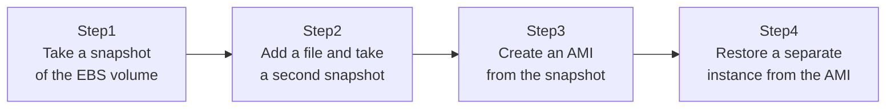

## Introduction

- **What You'll Learn From This Article**: Experience the full flow of taking a snapshot of an EBS volume from a running EC2 instance, creating an AMI (Amazon Machine Image) from that snapshot, and restoring it as a separate instance. You'll also understand the underlying mechanism that a snapshot is actually an "incremental backup," and how to choose between EBS volume types (gp3/io2).
- **Intended Audience**: Readers who've manually backed up an EC2 instance from the console before, but have never thought about a snapshot's internal mechanism or what to watch for when deleting one.
- **Estimated Reading Time**: About 20 minutes (about 35 minutes if you build along with the hands-on)

This article is part of the [Top 1% Series Complete Article Guide](/en/sitemap), the 8th article in the [AWS Fundamentals Series](/en/sitemap#series-list).

## The Big Picture

This hands-on consists of four steps.



## Hands-On Steps

### Step 1: Take a snapshot of the EBS volume

Take the first snapshot of the EBS volume attached to a running EC2 instance.

```bash
aws ec2 create-snapshot --volume-id vol-xxxx --description "Snapshot 1: initial state"
```

**This first snapshot contains the entire volume's data at that point in time.** On the surface it looks like a "full backup," but the next step reveals that's not actually what's happening underneath.

### Step 2: Add a file and take a second snapshot

Create a new file inside the instance, then take a second snapshot.

```bash
echo "new data" > /home/ec2-user/new-file.txt

aws ec2 create-snapshot --volume-id vol-xxxx --description "Snapshot 2: after adding a file"
```

**The time and cost of creating the second snapshot are dramatically smaller than the first.** That's because AWS only stores the "difference" from the first snapshot as this second one.

### Step 3: Create an AMI from the snapshot

Register the state at the second snapshot as an AMI.

```bash
aws ec2 create-image --instance-id i-xxxx --name "my-app-backup-$(date +%Y%m%d)" --no-reboot
```

**An AMI bundles the snapshot together with metadata like the OS, instance type, and boot configuration.** With just this AMI, you can launch a brand-new EC2 instance in exactly the same state at any time.

### Step 4: Restore a separate instance from the AMI

Launch a new EC2 instance from the AMI you created.

```bash
aws ec2 run-instances --image-id ami-xxxx --instance-type t3.micro --key-name my-key

ssh ec2-user@<new instance's IP>
cat /home/ec2-user/new-file.txt
```

**Success looks like `new-file.txt`'s content coming back correctly.** You've confirmed that a brand-new instance, entirely independent of the original, has reproduced exactly the same state.

## What a Pro Sees Here (Top 1% Understanding)

### A snapshot is an incremental backup — deleting the first one doesn't break later ones

The single most important mechanism of an EBS snapshot is that **every snapshot after the first only stores the "difference" from the immediately preceding snapshot — it's an incremental backup.** A common real-world misconception here is worrying that "deleting the first snapshot would break every later snapshot too." In reality, AWS internally manages block-level reference relationships, and **deleting the first snapshot still leaves the second snapshot independently, correctly restorable** (data from blocks that only existed in the first snapshot gets carried forward and retained within the second). Without understanding this mechanism, it's easy to fall into the mistaken operational habit of "old snapshots are wasted capacity, so just delete the oldest ones indiscriminately" — but planned deletion following a lifecycle policy is actually fine.

### Choosing between gp3 and io2 volume types

EBS's general-purpose **gp3** volume lets you independently specify storage capacity, IOPS (I/O operations per second), and throughput, giving it excellent cost-performance for most workloads. **io2**, on the other hand, is a provisioned-IOPS volume aimed at workloads — like a database — that demand extremely high IOPS and durability. Rather than "deciding the volume type based only vaguely on capacity," judging whether gp3 is sufficient or io2 is genuinely needed, based on the actual IOPS, throughput, and durability level the workload requires, is what achieves both cost optimization and performance in real-world work.

## Common Misconceptions and Pitfalls

- **Misconception 1: "Deleting the first snapshot also breaks every subsequent snapshot."**
  AWS internally manages block-level reference relationships, so subsequent snapshots remain independently, correctly restorable even after the first is deleted.
- **Misconception 2: "Every snapshot after the first costs just as much time and money as the first."**
  Since snapshots after the first only store the difference — an incremental backup — both time and cost drop dramatically.
- **Misconception 3: "Once you create an AMI, the original EBS snapshot is no longer needed."**
  An AMI internally references a snapshot. Deregistering an AMI doesn't automatically delete its associated snapshot.

## Troubleshooting Perspective

1. **After restoring from a snapshot, some files look outdated**: If you ran `create-image` without `--no-reboot`, write buffer contents might not have been flushed correctly. Consider a reboot-based capture if you prioritize consistency.
2. **Storage charges continue even after deregistering an AMI**: This is because its associated snapshot wasn't automatically deleted. You need to delete unneeded snapshots individually.
3. **io2 volume costs are higher than expected**: Provisioned IOPS bills based on the configured IOPS value regardless of actual usage. Check whether you've provisioned excessive IOPS.

## Summary

- Every EBS snapshot after the first is an incremental backup, storing only the difference from the immediately preceding one.
- Even after deleting the first snapshot, AWS's internal reference management keeps subsequent snapshots independently restorable.
- An AMI bundles a snapshot together with metadata like the OS and instance type.
- gp3 has good cost-performance for most workloads; io2 suits cases needing extremely high IOPS and durability.

**Takeaways to Apply Today**
1. Set up a snapshot lifecycle policy to automate deleting old snapshots.
2. When choosing an EBS volume type, check the required IOPS and throughput level, not just capacity.

## References

- [Amazon EBS snapshots | AWS Documentation](https://docs.aws.amazon.com/AWSEC2/latest/UserGuide/EBSSnapshots.html)
- [Amazon EBS volume types | AWS Documentation](https://docs.aws.amazon.com/AWSEC2/latest/UserGuide/ebs-volume-types.html)
