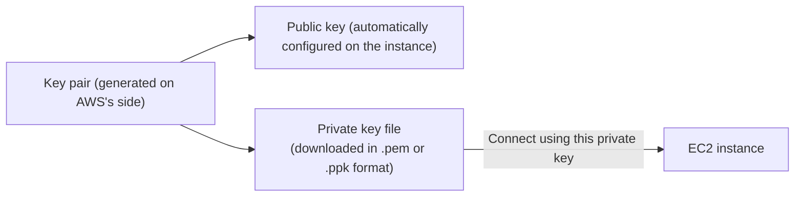
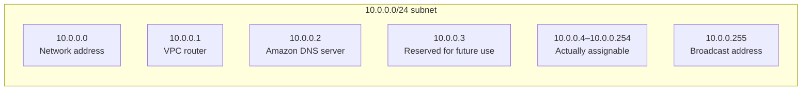

## Introduction

- **What You'll Learn From This Article**: This article explains the **key pair** you always create and specify when launching an EC2 instance — **what's different between the .pem and .ppk formats, and which you should choose.** It also systematically organizes why creating a subnet within a VPC on AWS makes **the first four and last one IP addresses within the available range unusable, reserved**, and what each one is used for.
- **Intended Audience**: This article is aimed at engineers who've worked with building EC2 instances or designing VPC subnets, but who can't explain the difference in key pair formats, or the concrete purpose of the reserved IPs.
- **Estimated Reading Time**: About 16 minutes

This article is part of the [Top 1% Series' full article guide](/en/sitemap), and the first article in a new series on AWS fundamentals.

## Prerequisites

- **Public-key cryptography**: An encryption technology using a pair of keys (a public key and a private key), leveraging the property that data encrypted with the public key can only be decrypted with the corresponding private key. See [Understanding PKI and Digital Certificates from a "Top 1%" Perspective](/en/articles/pki-guide) for details.

## Getting the Big Picture

### The Role of an EC2 Key Pair

The **key pair** you specify when launching an EC2 instance is **authentication credential, based on public-key cryptography, for logging into that instance securely without a password.** AWS configures the public key on the instance, and you connect using the corresponding private key file. **The difference between the .pem and .ppk extensions is a difference in the "format" of this private key file.**

## Fundamentals, Explained Thoroughly

### The Difference Between .pem and .ppk: A Format Difference, Not a Cryptographic One

**.pem and .ppk represent the same private key information, just in different file formats.**

| Format | Main software using it | Characteristics |
|---|---|---|
| **.pem** | OpenSSH (standard on Linux/macOS, and the OpenSSH client built into Windows 10 and later) | A Base64-encoded text format. The standard format for many SSH clients. |
| **.ppk** | PuTTY (a traditionally popular SSH/Telnet client on Windows) | PuTTY's own proprietary binary format. |

**The format AWS lets you download when creating an EC2 key pair is .pem by default.** A tool like PuTTY can't directly read any format other than its own proprietary one (.ppk), so if you want to connect using PuTTY, you need to **convert the .pem file downloaded from AWS to .ppk format using PuTTY's bundled conversion tool, PuTTYgen.**

**Which to choose is, in practice, decided simply by "which SSH client software you're using."** Current Windows 10/11 comes with an OpenSSH client built in by default, letting you connect via SSH directly with the .pem-format file from Command Prompt or PowerShell. If you're used to PuTTY, or your existing operations continue to use PuTTY, you'll need to convert to .ppk.

No difference in cryptographic strength or security

.pem and .ppk are simply a difference in the **file format (container)** storing the same private key information — there's no difference in the encryption algorithm the key itself uses (RSA, Ed25519, and so on), or in the key's security itself. Converting with PuTTYgen is simply re-encoding the same key information into a different format.

### AWS Subnet Reserved IP Addresses

When you create a subnet within a VPC, AWS **reserves a total of five IP addresses out of that subnet's CIDR range — the first four and the last one — making them unavailable for assignment to EC2 instances or anything else.**

For example, if you create a subnet with `10.0.0.0/24`, these are reserved as follows:

| IP address | Purpose |
|---|---|
| `10.0.0.0` | The network address (conventionally reserved as representing the subnet itself) |
| `10.0.0.1` | Reserved for the VPC router |
| `10.0.0.2` | Reserved for Amazon's DNS server (used for name resolution within the VPC) |
| `10.0.0.3` | Reserved by AWS for future use |
| `10.0.0.255` (last) | The network broadcast address (AWS doesn't support broadcast, but it's conventionally reserved anyway) |

**The first three (router, DNS, future reservation) are addresses the VPC service itself needs internally to manage and provide its functionality.** In particular, `10.0.0.2` functions as the address of the Amazon-provided DNS server (Route 53 Resolver) that instances within the VPC query for name resolution. **The first address, `10.0.0.0`, and the last, `10.0.0.255`, serve no actual function on AWS, but are still treated as reserved IPs, in line with traditional IP networking convention (a network address and broadcast address).**

**Because of these five reserved IP addresses, when designing a subnet's CIDR, you need to think in terms of the actual assignable count — subtracting these five — rather than simply mapping the CIDR range's host count to your expected instance count.** For example, a `/28` subnet (16 IP addresses) actually only has `16 - 5 = 11` addresses assignable to instances.

## The View From the Top 1% Perspective

### A Practical Caveat in Subnet Size Design

A design creating many overly small subnets (such as `/28`) sees the impact of these five reserved IP addresses become proportionally larger, potentially leading to running out of IP addresses sooner than expected. It's practically important to design subnet sizes with room to spare, factoring in future scaling, from the design stage onward.

## Common Misconceptions and Pitfalls

- **Misconception 1: ".pem and .ppk are different types of keys with different cryptographic strength"**
  The two are just a difference in the file format storing the same private key information — there's no difference in the key's own encryption algorithm or security.
- **Misconception 2: "The five reserved IP addresses on an AWS subnet are just a pointless restriction"**
  The first three are addresses AWS needs internally to provide the VPC's own functionality — the router, DNS server, and future expansion.
- **Misconception 3: "A subnet's CIDR range's host count is exactly how many instances you can assign"**
  The actual number of assignable IP addresses is the CIDR range's host count minus the five reserved addresses.

## The Troubleshooting Perspective

For EC2/VPC networking issues, the basic approach is to **isolate whether the problem is with the key pair format, or with subnet design/reserved IPs.**

1. **PuTTY won't recognize the key file when trying to connect**: This is likely because the .pem file downloaded from AWS hasn't been converted to .ppk format with PuTTYgen.
2. **An instance in a subnet can't be assigned the expected IP address**: Check whether that IP address falls within the reserved first-four or last-one addresses.
3. **A small subnet ran out of IP addresses sooner than expected**: Recalculate the actual assignable count, factoring in the impact of the five reserved IP addresses, and consider revisiting the subnet size.

### Preventive Measures and Permanent Fixes

- If you plan to use PuTTY as your SSH client, convert the key pair to .ppk format with PuTTYgen right after creating it.
- When designing a subnet's CIDR, secure enough room for the number of instances you need, based on the actual assignable count after subtracting the five reserved IP addresses.

## Summary

- .pem and .ppk are different file formats storing the same private key information, with no difference in cryptographic strength or security. The choice depends on the SSH client software in use.
- On an AWS subnet, a total of five IP addresses are reserved and unavailable for assignment: the first four (network address, router, DNS server, future reservation) and the last one (broadcast address).
- When designing a subnet size, you need to think in terms of the actual assignable count — the CIDR range's host count minus these five.

**What to Keep in Mind From Today**
1. When deciding on a key pair format, judge based on compatibility with the SSH client software you're using, not a difference in cryptographic strength.
2. When designing a subnet's size, always calculate using the actual assignable count after subtracting the five reserved IP addresses.

## References

- [Amazon EC2 key pairs and Amazon EC2 instances | AWS Documentation](https://docs.aws.amazon.com/AWSEC2/latest/UserGuide/ec2-key-pairs.html)
- [VPCs and subnets | AWS Documentation](https://docs.aws.amazon.com/vpc/latest/userguide/configure-subnets.html)
- [Amazon DNS server | AWS Documentation](https://docs.aws.amazon.com/vpc/latest/userguide/vpc-dns.html)
