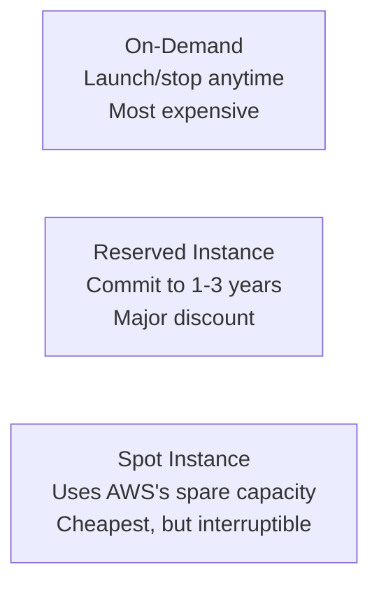

## Introduction

- **What You'll Learn From This Article**: [The Top 1% Hands-On for Launching an EC2 Instance and Publishing a Web Server](/en/articles/aws-ec2-webserver-handson-guide) just used `t2.micro`, covered by the free tier, as-is. In real-world work, though, you need to choose between multiple **pricing models** to optimize cost. This article gives you a systematic understanding of the three pricing models — **On-Demand, Reserved Instances, and Spot Instances** — the mechanism each is built on, and how to choose between them.
- **Intended Audience**: Readers who've launched an EC2 instance On-Demand before, but can't explain the mechanism behind why a Reserved Instance or a Spot Instance ends up cheaper.
- **Estimated Reading Time**: About 15 minutes

This article is part of the [Top 1% Series Complete Article Guide](/en/sitemap), the 12th article in the [AWS Fundamentals Series](/en/sitemap#series-list).

## The Big Picture

## A Thorough, Grounds-Up Explanation

### On-Demand Instances: The Most Basic, Pay-As-You-Go Model

An **On-Demand Instance** is the most basic pricing model, billed by the second for exactly what you use. No long-term commitment is needed at all, and you can launch or stop it any time. **In exchange, it carries the highest per-unit price among the three models.** It suits handling a sudden traffic spike, or launching a new service whose usage pattern isn't predictable yet.

### Reserved Instances: A Major Discount in Exchange for a Usage Commitment

A **Reserved Instance** commits in advance to using a specific instance type in a specific region for a 1-year or 3-year term, in exchange for a major discount (up to roughly 70%) compared to On-Demand. **Why does this discount exist at all? From AWS's side, being able to reliably count on long-term demand for that resource makes it rational to lower the price in exchange for securing that commitment.** **It suits a workload with a stable, predictable usage pattern — a production database server you know will run constantly, for example.**

### Spot Instances: Renting AWS's Spare Capacity at a Steep Discount

A **Spot Instance** rents spare compute capacity, currently unused in an AWS data center, at a price that fluctuates with supply and demand. **It can end up as much as roughly 90% cheaper than On-Demand, but in exchange, if AWS needs to reclaim that capacity for other demand (an On-Demand or Reserved customer), your instance gets forcibly interrupted after a brief notice period (2 minutes, by default).**

Why can a Spot Instance be this cheap?

An AWS data center always has some amount of unused capacity sitting around, essentially reserve capacity kept in preparation for fluctuating On-Demand/Reserved demand. **Rather than treating this reserve capacity as a resource that goes completely to waste if left alone, renting it out cheaply with the constraint "it can be reclaimed at any time" creates a revenue opportunity for AWS and a major cost saving for the renter — a mutually beneficial economic mechanism that's the real essence of a Spot Instance.**

## What a Pro Sees Here (Top 1% Understanding)

### A Spot Instance's Fundamental Design Assumption: "It's Fine to Be Interrupted at Any Time"

The single most important mindset when using a Spot Instance in real-world work is **always asking, at the design stage, "would this workload be fine even if it were interrupted without warning (there's a brief grace period in practice, but still)?"** A workload like batch processing, data analysis, or a CI/CD build job — **the kind where re-running it later is perfectly fine if it gets interrupted partway through** — pairs extremely well with a Spot Instance, and the real-world cost savings can be substantial. Conversely, casually using a Spot Instance for a workload that needs to hold state continuously, like a database server, is a design to avoid in practice.

### Combining Pricing Models Within a Single System Is the Basic Approach

In real-world work, it's common to combine multiple pricing models within a single system. For example: **securing the minimum baseline count that always runs with Reserved Instances, temporarily adding capacity during traffic spikes with On-Demand, and handling interruption-tolerant workloads like batch processing with Spot Instances.** Rather than "standardizing on just one model," choosing a pricing model per workload's nature is the basic real-world approach to cost optimization.

## Common Misconceptions and Pitfalls

- **Misconception 1: "A Reserved Instance means you have to actually keep that instance running continuously."**
  A Reserved Instance is purely a pricing discount contract — the contract itself continues even during time it isn't actually running (and you're billed regardless, whether it's running or not).
- **Misconception 2: "You can perfectly predict exactly when a Spot Instance will be interrupted."**
  The timing of an interruption depends on AWS-side demand and can't be precisely predicted — you only get a roughly 2-minute notice by default.
- **Misconception 3: "A system should standardize on a single pricing model throughout."**
  In real-world work, combining multiple pricing models per workload's nature is the basic approach.

## Troubleshooting Perspective

1. **A Spot Instance suddenly stopped**: This is an expected interruption. Check whether a mechanism exists to detect the interruption notice (2 minutes ahead) and safely wind down processing.
2. **You contracted a Reserved Instance, but the bill is higher than expected**: Check whether the instance type, region, and OS you contracted actually match the instance you're running. The discount doesn't apply if they don't match.
3. **You want to optimize cost but aren't sure which pricing model fits which workload**: First use "is it fine to re-run this later if it gets interrupted?" as your judgment criterion.

## Summary

- On-Demand is the most flexible but most expensive; Reserved offers a major discount in exchange for a usage commitment; Spot is the cheapest but carries interruption risk — three pricing models.
- A Spot Instance rents AWS's spare capacity, and being forcibly interrupted by fluctuating demand is a built-in assumption.
- A Spot Instance pairs well with a workload that's fine being re-run later after an interruption.
- In real-world work, combining multiple pricing models within a single system is the basic approach.

**Takeaways to Apply Today**
1. When designing a new workload, consider the right pricing model based on "is it okay to be interrupted?"
2. For a resource you know will run continuously, consider a Reserved Instance for cost savings.

## References

- [Amazon EC2 Pricing | AWS](https://aws.amazon.com/ec2/pricing/)
- [Amazon EC2 Spot Instances | AWS Documentation](https://docs.aws.amazon.com/AWSEC2/latest/UserGuide/using-spot-instances.html)
