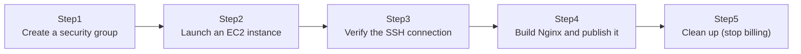

## Introduction

- **What You'll Learn From This Article**: Using the knowledge from [Understanding EC2 Key Pairs (.pem/.ppk) and Reserved Subnet IPs from a "Top 1%" Perspective](/en/articles/aws-ec2-networking-basics-guide), you'll actually launch an EC2 instance on AWS's free tier, open only the minimum necessary holes with a security group, SSH in, build a web server (Nginx), and confirm it's actually reachable over the internet. We'll also cover the cleanup step that trips people up first on AWS: how to actually stop being billed once you're done.
- **Intended Audience**: Readers who've created an AWS account but never actually launched an EC2 instance and published a web server from it.
- **Estimated Reading Time**: About 25 minutes (about an hour if you build along with the hands-on)

This article is part of the [Top 1% Series' full article guide](/en/sitemap).

## Prerequisites

- [Understanding EC2 Key Pairs (.pem/.ppk) and Reserved Subnet IPs from a "Top 1%" Perspective](/en/articles/aws-ec2-networking-basics-guide): This article assumes you already know how key pairs work.
- **An AWS account**: Set one up in advance with access to the free tier (12 months, a certain amount of `t2.micro` instance time free, and so on).

## The Big Picture

This hands-on consists of five steps.



## Hands-On Steps

### Step 1: Create a security group

From the AWS Management Console, go to EC2 → Security Groups → "Create security group," and add only these two inbound rules.

| Type | Port | Source |
|---|---|---|
| SSH | 22 | My IP (only your own global IP) |
| HTTP | 80 | Anywhere (0.0.0.0/0) |

**Notice that we're restricting SSH's source to "My IP" rather than "Anywhere" here.** This is the principle covered in [Understanding Practical Server Security Measures from a "Top 1%" Perspective](/en/articles/practical-server-security-measures-guide) — never allow traffic you don't need — put into practice in a cloud environment via a security group. Leaving SSH (port 22) open to the entire internet is a configuration you should avoid in practice.

### Step 2: Launch an EC2 instance

From EC2 → "Launch instance," launch with the following settings.

- **AMI**: Ubuntu Server (one covered by the free tier)
- **Instance type**: `t2.micro` (covered by the free tier)
- **Key pair**: Create a new one and download it in `.pem` format (or select an existing one if you already have it)
- **Security group**: Select the one you created in Step 1

Once launched, confirm the instance's state becomes "running" and that it's been assigned a **public IPv4 address.**

### Step 3: Verify the SSH connection

Before connecting over SSH, always lock down the permissions on the downloaded `.pem` file.

```bash
chmod 400 my-key.pem
ssh -i my-key.pem ubuntu@<public IPv4 address>
```

**Try to connect without running `chmod 400` first, and the connection is refused with a warning: `Permissions 0644 for 'my-key.pem' are too open`.** This is the SSH client itself confirming that the private key file can't be read by anyone but you.

### Step 4: Build Nginx and confirm external access

Once connected via SSH, install and start Nginx.

```bash
sudo apt update
sudo apt install -y nginx
```

`sudo apt install` alone completes both installing Nginx and configuring it to start automatically (the package bundles its own systemd unit file). Just to be sure, check its status.

```bash
sudo systemctl status nginx
```

Confirm connectivity locally, from the instance itself.

```bash
curl http://localhost/
```

Success looks like Nginx's default landing page HTML coming back. Next, confirm access **from your own local PC**, over the internet.

```bash
curl http://<public IPv4 address>/
```

Visiting the same address in a browser should also show Nginx's default landing page. **At this point, you've actually published, with your own hands, a web server that anyone on the internet can reach.**

### Step 5: Cleaning up (stop the billing)

Once you're done verifying, terminate the instance. In the EC2 console, select the instance, then "Instance state" → "Terminate instance."

<details>
<summary>Important: the difference between "stop" and "terminate," and the invisible billing trap</summary>

AWS gives you two ways to stop an instance.

- **Stop**: Stops the instance from running, but **the attached EBS volume (disk) sticks around, and its storage charges keep accruing.** You can also restart it later with the same configuration intact.
- **Terminate**: Completely deletes the instance itself. By default, the root EBS volume is deleted at the same time, and no further charges accrue (though if the EBS volume's "delete on termination" setting is off, the EBS volume alone can be left behind — watch out for that).

**For an instance like this hands-on, built purely for testing with no future use planned, we recommend fully terminating it rather than just stopping it.** Also watch out if you ever reserved an **Elastic IP** (a static public IP) during this process: **an Elastic IP is free while it's attached to a running instance, but once you terminate the instance and it loses its attachment (or if it was never attached at all), billing kicks in.** The assumption "I'm not using it, so it must not be costing anything" is one of the most costly misconceptions in AWS. After terminating an instance, always double-check whether any Elastic IP you reserved is still sitting around unattached.

</details>

## What a Pro Sees Here (Top 1% Understanding)

### Why we used the default VPC as-is this time

This hands-on deliberately didn't create a new VPC — it used the **default VPC** that AWS automatically sets up when you create an account. The default VPC has every subnet already connected to an internet gateway, with public IPs auto-assigned, making it ideal for today's goal of "get something on the internet as fast as possible." In practice, though, the norm is **to design a dedicated VPC and subnets per use case, cleanly separating public and private subnets.** Continuing to use the default VPC in a production environment is, in practical terms, close to abandoning security design altogether.

### A security group is "stateful"

We allowed SSH (port 22) with an inbound rule, but configured nothing at all for outbound (sending response packets back). SSH still works fine anyway, because a security group is **stateful** — allow traffic in one direction, and the corresponding return traffic is automatically allowed. If you're used to stateless on-premises firewalls, you might expect to need a separate rule for the return traffic too, but with AWS security groups, that concern doesn't apply.

## Common Misconceptions and Pitfalls

- **Misconception 1: "Stopping an instance brings billing down to exactly zero."**
  Storage (EBS) attached to a stopped instance keeps accruing charges. To stop billing completely, you need to terminate it.
- **Misconception 2: "An Elastic IP is free as long as you're just holding onto it."**
  An Elastic IP not attached to a running instance accrues charges.
- **Misconception 3: "A security group requires you to separately allow outbound traffic too, or the connection won't work."**
  A security group is stateful, so return traffic for anything allowed inbound is automatically permitted.

## Troubleshooting Perspective

1. **The SSH connection times out**: Check whether the security group's inbound rule allows port 22, and whether the source matches your current global IP (a home global IP can change over time).
2. **`curl` can't reach it from outside**: Check whether the security group allows port 80, and whether Nginx is actually running with `sudo systemctl status nginx`.
3. **You got charged more than expected**: Check the "Billing and Cost Management" dashboard for resources like EBS volumes or an Elastic IP that keep accruing charges even with no instance running.

## Summary

- With a security group, the norm is to open only the minimum necessary holes, such as restricting SSH's source to "My IP."
- Always lock down the `.pem` file's permissions with `chmod 400` before connecting over SSH.
- `sudo apt install nginx` alone completes both the install and the automatic-startup configuration.
- Fully stopping billing on an instance requires terminating it, not just stopping it — and watch out, an unattached Elastic IP keeps accruing charges.
- A security group is stateful, so there's no need to separately allow outbound traffic.

**Takeaways to Apply Today**
1. Once you're done with an AWS resource you created for testing, always terminate it fully, and double-check nothing like an Elastic IP is left lingering.
2. Make it a habit to restrict a security group's SSH rule to "My IP," never "Anywhere."

## References

- [Amazon EC2 Instance Lifecycle | AWS Documentation](https://docs.aws.amazon.com/AWSEC2/latest/UserGuide/ec2-instance-lifecycle.html)
- [Amazon EC2 Security Groups | AWS Documentation](https://docs.aws.amazon.com/AWSEC2/latest/UserGuide/ec2-security-groups.html)
- [Elastic IP Addresses | AWS Documentation](https://docs.aws.amazon.com/AWSEC2/latest/UserGuide/elastic-ip-addresses-eip.html)
