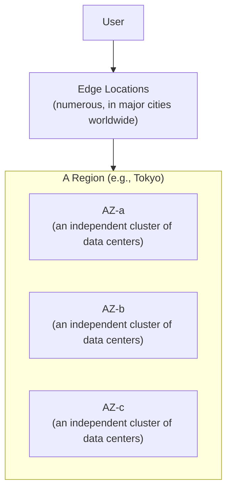

## Introduction

- **What You'll Learn From This Article**: Articles like [The Top 1% Hands-On for Building a VPC With Public/Private Subnets Yourself](/en/articles/aws-vpc-handson-guide) have used the terms "region" and "Availability Zone" as a given. This article gives you a systematic understanding of how AWS's global infrastructure is organized across three layers: **regions, Availability Zones (AZs), and edge locations.**
- **Intended Audience**: Readers who've selected a region in the management console before, but can't explain what an AZ is for, or why designing across multiple AZs is recommended.
- **Estimated Reading Time**: About 15 minutes

This article is part of the [Top 1% Series Complete Article Guide](/en/sitemap), the 11th article in the [AWS Fundamentals Series](/en/sitemap#series-list).

## The Big Picture

## A Thorough, Grounds-Up Explanation

### A Region: The Top-Level, Geographically Independent Unit

A **region** is a geographically independent area where AWS provides its services — Tokyo, Osaka, N. Virginia, Singapore, and many more exist worldwide. **Most AWS resources exist only within the region you've selected.** Create an EC2 instance in one region, and it won't show up on a different region's console screen. This exists to satisfy regulatory requirements (data sometimes can't leave a specific country or region) and to reduce latency by placing resources geographically close to users.

### Availability Zones (AZs): Independent Failure Units Within a Region

Internally, a single region is made up of multiple **Availability Zones (AZs).** **Each AZ is a cluster of one or more physically separate data centers, each with its own independent power, cooling, and network connections.** AZs are connected to each other by low-latency dedicated links, but the design assumes that a power outage or natural disaster affecting one AZ never directly affects another.

**The subnet covered in [The Top 1% Hands-On for Building a VPC With Public/Private Subnets Yourself](/en/articles/aws-vpc-handson-guide) always belongs to exactly one AZ.** In real-world work, the basic availability design is deliberately spreading resources with the same role (a web server, say) across multiple AZs, so that losing one entire AZ never takes down the whole service.

### Edge Locations: The Points Closest to Users

**Edge locations** are deployed in far greater numbers than regions, across major cities worldwide. A service like CloudFront (a CDN) places cached content at the edge location closest to a user, delivering it with much lower latency than querying all the way back to a region. **Keep in mind the difference: an edge location isn't a place you can launch an EC2 instance, the way you can in a region — it's purely a point for caching and some lightweight processing (like Lambda@Edge).**

## What a Pro Sees Here (Top 1% Understanding)

### The Assumption That Data Isn't Automatically Synchronized Between Regions

Most AWS services don't replicate data across regions by default. **Data stored in an S3 bucket in one region is never automatically copied to a different region.** This isn't a limitation so much as a deliberate design choice — cross-region replication carries communication cost and complexity, so AWS's basic philosophy is explicitly enabling a feature like cross-region replication only when genuinely needed (disaster recovery, or a regulatory requirement to store data in multiple regions). The assumption "splitting across regions automatically gives you a backup" is a common real-world misconception.

### Multi-AZ Design and Multi-Region Design Are Entirely Different in Both Purpose and Difficulty

Designing across multiple AZs (multi-AZ) is relatively easy to achieve using an AWS-managed service (RDS's Multi-AZ deployment, for example). Designing across multiple regions (multi-region), on the other hand, requires a far harder design decision, in terms of data consistency, latency, and cost. **Given a request to "increase availability," the first real-world design step is judging whether multi-AZ is genuinely sufficient, before ever concluding multi-region is truly necessary.**

## Common Misconceptions and Pitfalls

- **Misconception 1: "Switching to a different region shows resources created in another region too."**
  Most AWS resources are independent per region. If something's missing, check the region selection first.
- **Misconception 2: "Placing data in multiple regions alone automatically gives you a backup."**
  Cross-region replication doesn't happen by default — it needs to be explicitly enabled when needed.
- **Misconception 3: "You can launch an EC2 instance at an edge location too."**
  An edge location is a point for things like CDN caching — it's not a place where you can launch an EC2 instance.

## Troubleshooting Perspective

1. **A resource you created is nowhere to be found**: Check whether the selected region differs between when you created it and when you're looking for it.
2. **Despite a multi-AZ setup, one AZ's outage took down the whole thing**: Check whether resources are actually distributed across multiple AZs, and whether something like a load balancer is correctly targeting multiple AZs.
3. **CDN-delivered content is slow**: Check the user's geographic location and which edge location is actually serving cache hits, via CloudFront's logs.

## Summary

- A region is the top-level, geographically independent unit, and most AWS resources are independent per region.
- An AZ is an independent failure unit within a region, and spreading resources across multiple AZs is the basic availability design.
- An edge location is the point closest to users, used for things like CDN caching.
- Data replication between regions doesn't happen by default, so backup strategy needs to be designed around that assumption.

**Takeaways to Apply Today**
1. Given a request to increase availability, first judge whether multi-AZ is sufficient, then determine whether multi-region is genuinely necessary.
2. For important data, design your backup strategy on the assumption that cross-region replication isn't happening by default.

## References

- [AWS Global Infrastructure](https://aws.amazon.com/about-aws/global-infrastructure/)
- [Regions and Zones | AWS Documentation](https://docs.aws.amazon.com/AWSEC2/latest/UserGuide/using-regions-availability-zones.html)
