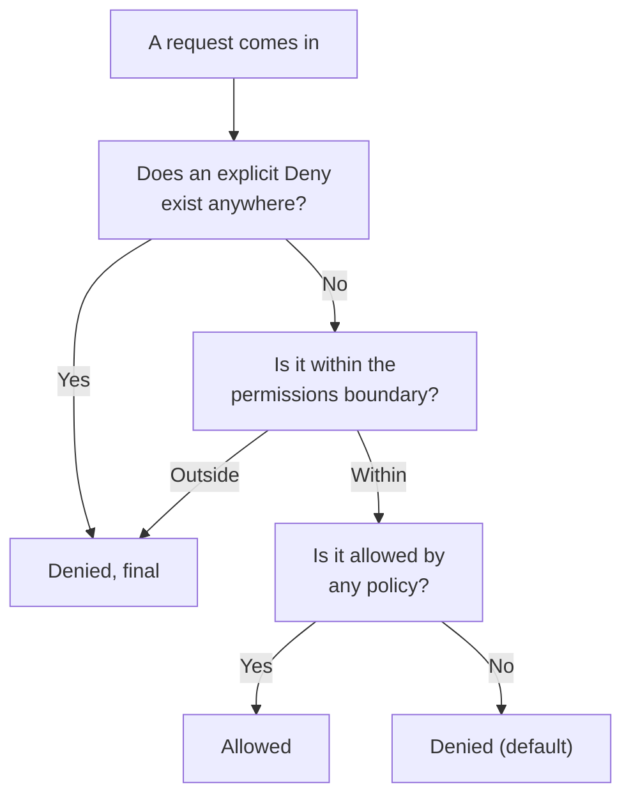

## Introduction

- **What You'll Learn From This Article**: [The Top 1% Hands-On for Reproducing the Danger of an Overly Broad IAM Policy and Scoping It to Least Privilege](/en/articles/aws-least-privilege-policy-handson-guide) touched on the evaluation order rule "an explicit Deny always wins over an Allow." This article gives you a systematic understanding of that evaluation logic, extended to the more realistic case of **multiple different types of policy existing at once.**
- **Intended Audience**: Readers who've judged allow/deny by looking at a single IAM policy before, but can't explain how the final result gets decided once multiple policies overlap.
- **Estimated Reading Time**: About 15 minutes

This article is part of the [Top 1% Series Complete Article Guide](/en/sitemap), the 14th article in the [AWS Fundamentals Series](/en/sitemap#series-list).

## The Big Picture

## A Thorough, Grounds-Up Explanation

### The Core Principle: Deny by Default, Explicit Allow Required

The single most basic assumption in IAM's evaluation logic is **implicit deny**: "any operation not explicitly allowed is denied." A user with no IAM policy configured can do nothing at all. Only once you add a policy explicitly stating `Allow` can that specific operation actually happen.

### Policy Types: Identity-Based and Resource-Based

IAM policies broadly split into two types.

- **Identity-based policies**: Attached directly to an IAM user, group, or role, defining "what this entity can do." The policy covered in [The Top 1% Hands-On for Never Giving EC2 an Access Key With an IAM Role](/en/articles/aws-iam-role-handson-guide) is this type.
- **Resource-based policies**: Attached directly to a resource, like an S3 bucket policy, defining "who can access this resource."

**The important point is that these two types don't operate independently of each other — both get evaluated at the same time.** When an IAM user tries to access an S3 bucket, both that user's identity-based policy and the bucket's resource-based policy are checked.

### The Permissions Boundary: A Mechanism for Setting a "Ceiling"

A **permissions boundary** is a special mechanism defining the **ceiling** on the permissions an IAM user or role can hold. Even if an ordinary identity-based policy grants `Allow`, the operation is ultimately denied if the permissions boundary doesn't permit it. **The key understanding is that the permissions an entity actually holds are always the intersection of "the scope allowed by identity-based policies" and "the scope allowed by the permissions boundary."**

## What a Pro Sees Here (Top 1% Understanding)

### An Explicit Deny Always Wins Over Everything

As covered in [The Top 1% Hands-On for Reproducing the Danger of an Overly Broad IAM Policy and Scoping It to Least Privilege](/en/articles/aws-least-privilege-policy-handson-guide), **if even a single explicit `Deny` exists anywhere — an identity-based policy, a resource-based policy, a permissions boundary, or an SCP (Service Control Policy) — that operation is denied, regardless of any other `Allow`.** This "absolute priority of an explicit Deny" is the one and only rule in IAM's evaluation logic that holds without exception. In real-world troubleshooting, when you run into "I added an Allow, but access still doesn't work," the standard investigation order is suspecting the source of a Deny (including SCPs and permissions boundaries) first.

### An SCP (Service Control Policy): An Organization-Wide Ceiling

When managing multiple AWS accounts together under AWS Organizations, an **SCP** mechanism exists, setting a ceiling on the entire account. It's easiest to understand an SCP as the permissions-boundary idea applied not to an individual IAM entity, but to **an entire account.** No matter how permissive the IAM policies inside an account are, if the organizational unit that account belongs to has a restriction via SCP, that restriction wins.

## Common Misconceptions and Pitfalls

- **Misconception 1: "If a single policy grants Allow, that operation can always be executed."**
  If a Deny exists anywhere in another policy (a permissions boundary, an SCP, a resource-based policy, and more), that one wins.
- **Misconception 2: "Only one of identity-based or resource-based policies gets evaluated."**
  Both get evaluated simultaneously — if either one doesn't permit it, access fails (barring an explicit Deny somewhere).
- **Misconception 3: "A permissions boundary adds permissions, the same way an ordinary policy does."**
  A permissions boundary defines a ceiling on permissions — it never grants permission on its own.

## Troubleshooting Perspective

1. **You added an Allow policy, but access still doesn't work**: Check whether an explicit Deny exists in a permissions boundary, an SCP, or a resource-based policy.
2. **S3 bucket access is denied even though the IAM side looks correct**: Check whether the bucket policy (a resource-based policy) has an unintended restriction.
3. **Only a specific account within an organization can't use an expected permission**: Check whether an SCP restriction applies to the organizational unit that account belongs to.

## Summary

- IAM evaluation is built on the core principle "deny by default, explicit allow required."
- Identity-based and resource-based policies are both evaluated at the same time.
- A permissions boundary defines a ceiling on permissions, and actual permissions always fall within that ceiling.
- An explicit Deny always wins over every Allow, regardless of which policy type it came from.

**Takeaways to Apply Today**
1. When you hit "I allowed it, but access still fails," first suspect the source of an explicit Deny.
2. If your organization manages multiple AWS accounts, include organization-wide SCP restrictions in your investigation too.

## References

- [Policy evaluation logic | AWS Documentation](https://docs.aws.amazon.com/IAM/latest/UserGuide/reference_policies_evaluation-logic.html)
- [Permissions boundaries for IAM entities | AWS Documentation](https://docs.aws.amazon.com/IAM/latest/UserGuide/access_policies_boundaries.html)
