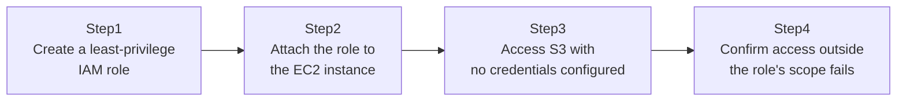

## Introduction

- **What You'll Learn From This Article**: As a follow-on to [The Top 1% Hands-On for Launching an EC2 Instance and Publishing a Web Server](/en/articles/aws-ec2-webserver-handson-guide), you'll experience how an application running on EC2 can safely access an AWS service like S3, using an **IAM role**, without ever hardcoding an access key or secret key. This is the single most fundamental — and most commonly overlooked — security practice in AWS.
- **Intended Audience**: Readers who don't know any way to authenticate other than running `aws configure` with an access key, or writing an access key directly into code.
- **Estimated Reading Time**: About 20 minutes (about 40 minutes if you build along with the hands-on)

This article is part of the [Top 1% Series Complete Article Guide](/en/sitemap), the 3rd article in the [AWS Fundamentals Series](/en/sitemap#series-list).

## Prerequisites

- [The Top 1% Hands-On for Launching an EC2 Instance and Publishing a Web Server](/en/articles/aws-ec2-webserver-handson-guide): This article assumes you already know how to launch an EC2 instance.

## Why Hardcoding an Access Key Is a Problem in the First Place

Say an application running on EC2 needs to read a file from an S3 bucket. The easiest approach is to create an IAM user, issue its access key and secret key, and write them directly into the application's config file or code. **But this approach has a serious problem.** If that EC2 instance is ever compromised in any way, an attacker can simply steal this static access key as-is. **This access key has no expiration — unless an administrator deliberately rotates (updates or revokes) it, it stays valid indefinitely, even after being stolen.** On top of that, copying the same credentials around to multiple servers makes it a headache to track which server is even using which credential.

## The Big Picture

This hands-on consists of four steps.



## Hands-On Steps

### Step 1: Create a least-privilege IAM role

Create an IAM policy and role that only permits read-only access to one specific S3 bucket.

```bash
aws iam create-role --role-name EC2-S3-ReadOnly-Role --assume-role-policy-document '{
  "Version": "2012-10-17",
  "Statement": [{"Effect": "Allow", "Principal": {"Service": "ec2.amazonaws.com"}, "Action": "sts:AssumeRole"}]
}'
```

**This `AssumeRolePolicyDocument` (the trust policy) specifies that "only the EC2 service is permitted to assume this role."** Separately from this, attach a permissions policy that actually grants read access to S3, scoped to exactly one specific bucket.

### Step 2: Attach the role to the EC2 instance

Attach the role you created to your target EC2 instance.

```bash
aws ec2 associate-iam-instance-profile --instance-id i-xxxxxxxx --iam-instance-profile Name=EC2-S3-ReadOnly-Role
```

**This can be done against a running instance, with no restart required.**

### Step 3: Access S3 with no credentials configured

SSH into that EC2 instance, and without ever running `aws configure`, run the following.

```bash
aws s3 ls s3://my-allowed-bucket/
```

**Confirm this command succeeds, even though you never configured an access key or secret key at all.** The AWS CLI automatically queries the instance metadata service and retrieves temporary credentials for the role attached to that instance, on its own.

### Step 4: Confirm access outside the role's scope fails

Now try accessing a different S3 bucket, one the role's policy doesn't permit.

```bash
aws s3 ls s3://some-other-bucket/
```

**Confirm you get an `Access Denied` error.** This shows that the permission granted to the role is exactly as scoped as intended — to one specific bucket only.

## What a Pro Sees Here (Top 1% Understanding)

### An IAM role's credentials are temporary, issued by STS

The credentials an instance with an IAM role attached actually uses aren't a static access key at all. **A mechanism called STS (Security Token Service) automatically issues temporary, time-limited credentials.** These temporary credentials automatically refresh every few hours by default. In other words, even if these temporary credentials were ever leaked, they'd simply expire and become invalid on their own. Compared to a static access key that requires a human to deliberately rotate it, this property — automatically becoming invalid even if left alone — is exactly why an IAM role is considered fundamentally safer.

### The instance metadata service, and why IMDSv2 became mandatory

Behind the scenes of the AWS CLI automatically retrieving credentials in Step 3 is a mechanism called the **instance metadata service**, which the EC2 instance itself queries at the special address `169.254.169.254`. This mechanism has an older version (IMDSv1) and a newer one (IMDSv2). **IMDSv1 lets credentials be retrieved with nothing more than a simple HTTP GET request, which means that if the application itself has a vulnerability called SSRF (Server-Side Request Forgery), an external attacker can use that application as a stepping stone to indirectly steal the instance's credentials** — this has actually been exploited in the real world. IMDSv2 prevents this class of attack by requiring an additional step: fetching a token first. Always enable the setting that requires IMDSv2 on any newly launched instance.

## Common Misconceptions and Pitfalls

- **Misconception 1: "You still need to run `aws configure` on the application side, even with an IAM role attached."**
  With an IAM role attached, the AWS CLI and SDKs automatically retrieve credentials — running `aws configure` is unnecessary.
- **Misconception 2: "An IAM role and an IAM user are fundamentally the same thing."**
  An IAM user is a persistent identity with long-term credentials. An IAM role is something you "assume" on demand each time, and doesn't hold static credentials of its own.
- **Misconception 3: "Once retrieved, an IAM role's credentials remain valid forever."**
  An IAM role's credentials are temporary, issued by STS, and need automatic refresh every few hours by default.

## Troubleshooting Perspective

1. **You attached the role, but still get `Access Denied`**: Check both the trust policy (who can assume this role) and the permissions policy (what this role can actually do). Even if the former allows the EC2 service, it fails if the latter doesn't grant access to the target bucket.
2. **The `aws s3 ls` command itself errors with credentials not found**: Check whether the role is actually correctly attached to the instance, with `aws ec2 describe-iam-instance-profile-associations`.
3. **Queries to the instance metadata service time out**: If IMDSv2 is set to required, an older version of the AWS CLI or SDK may fail to correctly fetch the token. Update it.

## Summary

- An application on EC2 accessing an AWS service should use an IAM role, not a hardcoded access key.
- An IAM role's credentials are temporary, automatically issued and refreshed by STS, making them fundamentally safer than a static access key.
- Requiring IMDSv2 prevents credential theft via SSRF.
- Permissions granted to an IAM role should be scoped to only the minimum necessary resources and actions.

**Takeaways to Apply Today**
1. When launching a new EC2 instance, first consider whether an IAM role can achieve what you need, and avoid hardcoding an access key.
2. Always enable the setting requiring IMDSv2 on new instances.

## References

- [IAM Roles for Amazon EC2 | AWS Documentation](https://docs.aws.amazon.com/AWSEC2/latest/UserGuide/iam-roles-for-amazon-ec2.html)
- [Use IMDSv2 | AWS Documentation](https://docs.aws.amazon.com/AWSEC2/latest/UserGuide/configuring-instance-metadata-service.html)
