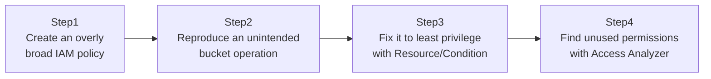

## Introduction

- **What You'll Learn From This Article**: Reproduce, inside a test environment you manage yourself, the real risk created by an excessively broad IAM policy — the kind that tends to get granted "just to get things working." You'll then experience the process of fixing it into a least-privilege policy scoped down with `Resource` and `Condition`, and using **IAM Access Analyzer** to find permissions that have already been granted but are never actually used. **This hands-on is for educational and defensive purposes, to strengthen the defenses of a test environment you manage yourself. Do not run this procedure against someone else's live environment without authorization.**
- **Intended Audience**: Readers who've been running an IAM policy with `"Resource": "*"` left as-is, or who can't yet concretely picture the danger of doing so.
- **Estimated Reading Time**: About 25 minutes (about 45 minutes if you build along with the hands-on)

This article is part of the [Top 1% Series Complete Article Guide](/en/sitemap), the 9th article in the [AWS Fundamentals Series](/en/sitemap#series-list).

## The Big Picture

This hands-on consists of four steps.



## Hands-On Steps

### Step 1: Create an overly broad IAM policy

Attach a common shape of overly broad policy — the kind meant "for an app that uses S3" — to a test IAM user.

```json
{
  "Version": "2012-10-17",
  "Statement": [{
    "Effect": "Allow",
    "Action": "s3:*",
    "Resource": "*"
  }]
}
```

**Contrary to the intent of only wanting to let this app operate on one specific bucket, this policy permits every operation — including read, write, and delete — on every S3 bucket in the entire account.**

### Step 2: Reproduce an unintended bucket operation

Using this IAM user's credentials, try operating on a separate, important bucket that was never intended to be accessible.

```bash
aws s3 ls s3://another-important-bucket-in-same-account/
aws s3 rm s3://another-important-bucket-in-same-account/critical-file.txt
```

**This command succeeds unintentionally.** You've reproduced the fact that if credentials issued for an app leak, an attacker could read from or delete from every other bucket in the account, entirely unrelated to that app.

### Step 3: Fix it to least privilege with Resource/Condition

Scope the policy down to just specific operations on a specific bucket.

```json
{
  "Version": "2012-10-17",
  "Statement": [{
    "Effect": "Allow",
    "Action": ["s3:GetObject", "s3:PutObject"],
    "Resource": "arn:aws:s3:::my-app-specific-bucket/*",
    "Condition": {
      "StringEquals": { "aws:RequestedRegion": "ap-northeast-1" }
    }
  }]
}
```

**`Resource` is scoped down to just one specific bucket's ARN, `Action` is limited to only the genuinely needed `GetObject`/`PutObject`, and `Condition` further constrains it by region.** Re-run the same command from Step 2 against this policy, and confirm it now results in `AccessDenied`.

### Step 4: Find unused permissions with Access Analyzer

Use IAM Access Analyzer to check the gap between the permissions actually used and the permissions in the policy.

```bash
aws accessanalyzer list-findings --analyzer-arn <analyzer-arn>
aws accessanalyzer generate-policy --policy-generation-details '{"principalArn": "<test IAM user's ARN>"}'
```

**`generate-policy` analyzes CloudTrail's actual usage history, and automatically generates a draft least-privilege policy based purely on the operations that IAM user actually used.** The important point is that "what permissions does this user genuinely need" is derived from actual usage records, not guesswork.

## What a Pro Sees Here (Top 1% Understanding)

### The structural reason "just get it working" policies get mass-produced in real-world work

An overly broad policy like `"Resource": "*"` most often arises not from malice, but from an accumulation of decisions prioritizing development speed — "I don't want to get stuck on an access-denied error while developing." **The fundamental difficulty here is an asymmetry: the damage from an overly broad permission stays invisible until an actual incident occurs, while a bug from an overly narrow permission gets noticed immediately during development.** Understanding this asymmetry, the practical real-world solution is making it a team standard process to develop with a broader policy, but always narrow it to least privilege using a mechanism like Access Analyzer's `generate-policy` before shipping to production.

### The easily-misunderstood spec of IAM policy evaluation order

When both `Allow` and `Deny` exist for an IAM policy, **an explicit `Deny` always takes priority over an `Allow`.** This is exactly the same idea as the AD ACL evaluation order (explicit deny wins) covered in [The Top 1% Hands-On for Delegating OU Control: Giving the Help Desk Password-Reset Rights Only](/en/articles/ad-delegation-handson-guide). Without understanding this evaluation order, investigating "I added an Allow policy, but access still doesn't work for some reason" can waste time overlooking a `Deny` hiding in an SCP (Service Control Policy) or a permissions boundary.

## Common Misconceptions and Pitfalls

- **Misconception 1: "Using a broad policy during development is fine as long as it's narrowed before production."**
  In theory, yes — but in real-world work, the psychology of "I don't want to touch what's already working" repeatedly pushes off that pre-production narrowing. A process that enforces it is needed.
- **Misconception 2: "IAM Access Analyzer automatically fixes security problems for you."**
  Access Analyzer only goes as far as finding the problem and proposing an improvement — actually fixing and applying the policy is a human judgment call.
- **Misconception 3: "Scoping Resource down to an ARN means Condition isn't needed."**
  Resource and Condition complement each other. Constraints that Resource alone can't express — a specific time window, an IP address range, requiring MFA — get added via Condition.

## Troubleshooting Perspective

1. **After scoping to least privilege, even legitimate processing gets denied**: Check CloudTrail's event history for the actual denied `Action`, and check whether any needed operation is missing from the policy.
2. **`generate-policy`'s result comes back empty**: Check whether a sufficient period of usage history has accumulated in CloudTrail for the target IAM user/role.
3. **Can't find the source of an explicit Deny**: Check for a Deny not just in the IAM user's own policy, but also in an SCP or a permissions boundary.

## Summary

- An overly broad policy like `"Resource": "*"` unintentionally widens the blast radius if credentials leak.
- Combining `Resource` and `Condition` achieves a precisely scoped least-privilege policy.
- IAM Access Analyzer's `generate-policy` automatically generates a draft least-privilege policy based on actual usage records.
- An IAM policy has an evaluation order where an explicit Deny always takes priority over an Allow.

**Takeaways to Apply Today**
1. Even when using a broad policy during development, always build in a step to narrow it with Access Analyzer before shipping to production.
2. When investigating "access is denied for some reason," check SCPs and permissions boundaries too, not just the target policy.

## References

- [IAM Access Analyzer | AWS Documentation](https://docs.aws.amazon.com/IAM/latest/UserGuide/what-is-access-analyzer.html)
- [Policy evaluation logic | AWS Documentation](https://docs.aws.amazon.com/IAM/latest/UserGuide/reference_policies_evaluation-logic.html)
