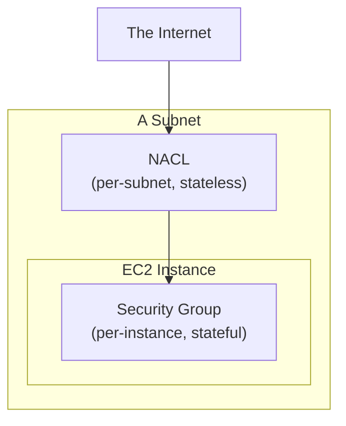

## Introduction

- **What You'll Learn From This Article**: The **security group** covered in [The Top 1% Hands-On for Launching an EC2 Instance and Publishing a Web Server](/en/articles/aws-ec2-webserver-handson-guide) is just one of the traffic-control mechanisms within a VPC. This article gives you a systematic understanding of the difference from the other one, the **Network ACL (NACL)**, along two axes: **scope of application** and **stateful vs. stateless.**
- **Intended Audience**: Readers who've configured a security group before, but don't know a separate mechanism called a NACL exists, or can't explain the difference between the two.
- **Estimated Reading Time**: About 15 minutes

This article is part of the [Top 1% Series Complete Article Guide](/en/sitemap), the 16th article in the [AWS Fundamentals Series](/en/sitemap#series-list).

## The Big Picture

## A Thorough, Grounds-Up Explanation

### Difference in Scope: Per-Instance or Per-Subnet

- A **security group** applies **per EC2 instance** (more precisely, per network interface). Even instances within the same subnet can each have different controls, by attaching different security groups.
- A **NACL** applies **per subnet.** Associate a NACL with a subnet, and the same rules apply uniformly to every instance within that subnet.

**This difference creates a natural division of labor: a NACL as "a broad seawall for the whole subnet," and a security group as "fine-grained control per instance."**

### Design-Philosophy Difference: Stateful or Stateless

This is the single biggest difference between the two.

- **A security group (stateful)**: As covered in [The Top 1% Hands-On for Launching an EC2 Instance and Publishing a Web Server](/en/articles/aws-ec2-webserver-handson-guide), the outbound traffic that's the "return" for traffic permitted inbound is automatically allowed. You never need to write a separate outbound rule.
- **A NACL (stateless)**: **Inbound and outbound must be configured as completely independent, separate rules.** Permit inbound traffic to port 80, and unless you separately write an outbound rule permitting the response (the return traffic), the connection never works.

## What a Pro Sees Here (Top 1% Understanding)

### Forget an Outbound NACL Rule, and a Connection Breaks for a "Mysterious" Reason

For someone unfamiliar with a stateless, on-premises firewall, the most common gotcha the first time they configure a NACL is **assuming "permitting inbound alone should be enough to make the connection work."** Get used to a security group's stateful behavior, and it's easy to assume a NACL behaves the same way — but **a NACL treats a response packet as its own independent piece of traffic, so unless you explicitly permit outbound traffic to the return port range (ephemeral ports, generally 1024-65535), the very traffic you thought you'd permitted fails because it can never receive a response.** When troubleshooting connectivity issues, always keep the possibility "the security group let it through, but the NACL is blocking it" on the table.

### Rule Evaluation Order: The Lowest-Numbered Rule Wins

Each NACL rule carries a number (a rule number). **A NACL evaluates rules in ascending numeric order, and the first matching rule is the one applied.** This is a fundamentally different mechanism from the "an explicit Deny always wins" evaluation logic of IAM policies, covered in [The Top 1% Hands-On for Reproducing the Danger of an Overly Broad IAM Policy and Scoping It to Least Privilege](/en/articles/aws-least-privilege-policy-handson-guide). In a NACL, even a Deny rule gets overridden if a lower-numbered Allow rule matches first. **Designing rule numbers with deliberate spacing, anticipating future rule additions, is a genuinely important real-world consideration in NACL operations.**

## Common Misconceptions and Pitfalls

- **Misconception 1: "A NACL behaves statefully too, just like a security group."**
  A NACL is stateless — inbound and outbound each need to be permitted independently.
- **Misconception 2: "You only need to configure either a security group or a NACL, not both."**
  Both get evaluated at the same time. Get blocked by either one, and the connection never works.
- **Misconception 3: "In a NACL, a Deny rule always wins over an Allow rule."**
  A NACL evaluates rules in ascending numeric order, and the first matching rule applies — a different mechanism from IAM policy evaluation logic.

## Troubleshooting Perspective

1. **The security group should permit it, but traffic still doesn't arrive**: Check whether the NACL associated with the subnet correctly permits both inbound and outbound. In particular, check for a missing outbound permission for the ephemeral port range used for responses.
2. **You added a NACL rule, but it's not behaving as intended**: Check the rule numbers, and whether an unintended, lower-numbered rule is matching first.
3. **Only some instances can't communicate**: Check whether the security group attached to that instance differs from the others (a NACL should be common across the whole subnet).

## Summary

- A security group applies per instance; a NACL applies per subnet.
- A security group is stateful, automatically permitting return traffic; a NACL is stateless, requiring inbound and outbound to be permitted separately.
- A NACL evaluates rules in ascending numeric order, and the first matching rule applies.
- Security groups and NACLs are both evaluated at the same time — getting blocked by either one breaks the connection.

**Takeaways to Apply Today**
1. When configuring a NACL, always permit outbound for the return traffic (the ephemeral port range) as well, not just inbound.
2. When troubleshooting connectivity, build the habit of checking both the security group and the NACL, independently.

## References

- [Network ACLs | AWS Documentation](https://docs.aws.amazon.com/vpc/latest/userguide/vpc-network-acls.html)
- [Security groups for your VPC | AWS Documentation](https://docs.aws.amazon.com/vpc/latest/userguide/VPC_SecurityGroups.html)
