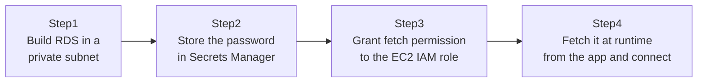

## Introduction

- **What You'll Learn From This Article**: Extending the IAM role thinking from [The Top 1% Hands-On for Never Giving EC2 an Access Key With an IAM Role](/en/articles/aws-iam-role-handson-guide) to database credentials as well. You'll build an RDS instance in a private subnet, and experience fetching its DB connection password from **Secrets Manager** at runtime, without ever writing it into application code or config files.
- **Intended Audience**: Readers who've hardcoded a password into an environment variable or config file when connecting to RDS before.
- **Estimated Reading Time**: About 25 minutes (about 50 minutes if you build along with the hands-on)

This article is part of the [Top 1% Series Complete Article Guide](/en/sitemap), the 6th article in the [AWS Fundamentals Series](/en/sitemap#series-list).

## Prerequisite Knowledge

- [The Top 1% Hands-On for Building a VPC With Public/Private Subnets Yourself](/en/articles/aws-vpc-handson-guide): this hands-on places RDS into the private subnet built there.

## The Big Picture

This hands-on consists of four steps.



## Hands-On Steps

### Step 1: Build RDS in a private subnet

Create a MySQL-compatible RDS instance in the private subnet built previously.

```bash
aws rds create-db-instance \
  --db-instance-identifier my-app-db \
  --db-instance-class db.t3.micro \
  --engine mysql \
  --master-username admin \
  --master-user-password "TemporaryP@ss123!" \
  --allocated-storage 20 \
  --db-subnet-group-name my-private-subnet-group \
  --no-publicly-accessible
```

**Notice the explicit `--no-publicly-accessible` flag.** Never giving RDS a public IP, so it's only reachable from within the private subnet, is a baseline assumption for production operation. The `master-user-password` specified here is just the initial value at creation time — you'll switch to Secrets Manager-based operation right after this.

### Step 2: Store the password in Secrets Manager

Store the full set of information needed for the DB connection as a Secrets Manager secret.

```bash
aws secretsmanager create-secret \
  --name my-app-db-credentials \
  --secret-string '{"username":"admin","password":"TemporaryP@ss123!","host":"my-app-db.xxxx.ap-northeast-1.rds.amazonaws.com","port":3306}'
```

**At this point, the password never appears in the application's code or config files at all.** All the app needs is "permission to fetch information from this secret name" — not the password value itself.

### Step 3: Grant fetch permission to the EC2 IAM role

Grant the IAM role attached to the app's EC2 instance permission to read only this one secret.

```json
{
  "Version": "2012-10-17",
  "Statement": [{
    "Effect": "Allow",
    "Action": "secretsmanager:GetSecretValue",
    "Resource": "arn:aws:secretsmanager:ap-northeast-1:123456789012:secret:my-app-db-credentials-*"
  }]
}
```

**Scoping `Resource` down to just this one secret's ARN is the important part.** Use a wildcard covering every secret instead, and if this EC2 instance is ever compromised, another app's DB password would be readable too.

### Step 4: Fetch it at runtime from the app and connect

At app startup, fetch this secret from Secrets Manager via the SDK and use it for the DB connection.

```python
import boto3
import json
import pymysql

client = boto3.client("secretsmanager", region_name="ap-northeast-1")
secret = json.loads(client.get_secret_value(SecretId="my-app-db-credentials")["SecretString"])

conn = pymysql.connect(
    host=secret["host"], user=secret["username"],
    password=secret["password"], port=secret["port"]
)
```

**This code contains neither an access key nor a DB password.** `boto3.client` automatically uses the temporary credentials from the IAM role attached to the EC2 instance, and only through those credentials does it fetch the DB password from Secrets Manager for the first time.

## What a Pro Sees Here (Top 1% Understanding)

### Password rotation becomes possible with zero code changes

Secrets Manager can periodically and automatically rotate (swap in a new value for) a stored secret. Combined with RDS, a Lambda function automatically keeps the password change on the RDS side and the secret update on the Secrets Manager side in sync. **The app's code stays exactly as-is — "fetch from Secrets Manager at runtime" — with zero changes needed**, and the app doesn't even need to notice the password quietly rotating underneath it. This shows that the same design philosophy behind rotating access keys periodically — shortening a credential's lifetime to narrow its exposure window — applies just as well to an entirely different kind of credential: a password.

### Why RDS belongs in a private subnet

As covered in [The Top 1% Hands-On for Building a VPC With Public/Private Subnets Yourself](/en/articles/aws-vpc-handson-guide), a private subnet is one that "can't have a connection initiated into it from outside." A database like RDS has no legitimate reason to accept connections from anything other than its proper application server, so placing it in a private subnet with public access fully disabled is the standard real-world design. **Leaving RDS publicly accessible "because it's easier during development" and carrying that straight into production** is a serious, recurring design mistake in real-world work.

## Common Misconceptions and Pitfalls

- **Misconception 1: "Once you store it in Secrets Manager, the app side doesn't need to do anything at all."**
  The app side still needs both code that fetches the secret from Secrets Manager at runtime, and the IAM permission that allows that fetch.
- **Misconception 2: "Granting the IAM role broad permission like SecretsManagerFullAccess is fine as long as it's safe."**
  You should grant a least-privilege policy scoped to just that one secret's ARN.
- **Misconception 3: "The master-user-password set at RDS creation time becomes the password used in production operation."**
  The creation-time password is just an initial value — once you switch to Secrets Manager-based operation, it should change periodically via automatic rotation.

## Troubleshooting Perspective

1. **The app's access to Secrets Manager gets `AccessDenied`**: Check whether the IAM role attached to the EC2 instance has `secretsmanager:GetSecretValue` permission for that secret's ARN.
2. **The app's connection to RDS times out**: Check whether RDS and EC2 are in the same VPC, and whether RDS's security group permits the connecting IP or security group from EC2.
3. **After password rotation, the app fails to connect with an old password**: Check whether the app is caching the secret instead of re-fetching it, and whether it's designed to re-fetch on every rotation.

## Summary

- Secrets Manager lets you avoid writing a DB password into an app's code or config files at all.
- Scope the Secrets Manager permission granted to an IAM role down to just one specific secret's ARN.
- Secrets Manager's automatic rotation feature lets a password rotate periodically with zero app code changes.
- Placing RDS in a private subnet with public access fully disabled is the standard design.

**Takeaways to Apply Today**
1. If an existing app writes a DB password into an environment variable or config file, consider migrating it to fetch from Secrets Manager instead.
2. When granting permissions to an IAM role, always scope it down to just the minimum resources that role genuinely needs.

## References

- [Rotate secrets | AWS Documentation](https://docs.aws.amazon.com/secretsmanager/latest/userguide/rotating-secrets.html)
- [Amazon RDS | AWS Documentation](https://docs.aws.amazon.com/AmazonRDS/latest/UserGuide/Welcome.html)
