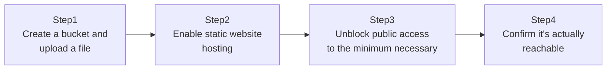

## Introduction

- **What You'll Learn From This Article**: With **S3 (Simple Storage Service)**, one of AWS's most fundamental services, you'll actually create a bucket, enable static website hosting, and get it genuinely reachable from the internet. After understanding S3's safe-by-default design — **blocking all public access by default** — you'll experience correctly unblocking it "per bucket" and "only for the operation genuinely needed."
- **Intended Audience**: Readers who've uploaded files to S3 before, but have hit friction with how public access works, or with public-access configuration in general.
- **Estimated Reading Time**: About 20 minutes (about 40 minutes if you build along with the hands-on)

This article is part of the [Top 1% Series Complete Article Guide](/en/sitemap), the 4th article in the [AWS Fundamentals Series](/en/sitemap#series-list).

## The Big Picture

This hands-on consists of four steps.



## Hands-On Steps

### Step 1: Create a bucket and upload a file

Create an S3 bucket and upload a simple HTML file.

```bash
aws s3 mb s3://my-unique-bucket-name-12345
echo '<h1>Hello from S3!</h1>' > index.html
aws s3 cp index.html s3://my-unique-bucket-name-12345/
```

**A bucket name must be unique not just within your own AWS account, but across every AWS user in the world.** At this point, trying to access the uploaded file from a browser with the default settings still in place gets you an `AccessDenied` error.

### Step 2: Enable static website hosting

From the bucket's properties, enable static website hosting.

```bash
aws s3 website s3://my-unique-bucket-name-12345/ --index-document index.html
```

**This setting alone doesn't publish the site yet.** Enabling static website hosting and actually granting permission to read the file from outside are two separate things.

### Step 3: Unblock public access to the minimum necessary

First, disable this bucket's "Block all public access" setting.

```bash
aws s3api put-public-access-block --bucket my-unique-bucket-name-12345 --public-access-block-configuration "BlockPublicAcls=false,IgnorePublicAcls=false,BlockPublicPolicy=false,RestrictPublicBuckets=false"
```

**This setting only stops AWS from blocking a bucket policy's public-access configuration in the first place.** Next, explicitly specify exactly what to permit with a bucket policy.

```bash
cat > policy.json << 'EOF'
{
  "Version": "2012-10-17",
  "Statement": [{
    "Sid": "PublicReadGetObject",
    "Effect": "Allow",
    "Principal": "*",
    "Action": "s3:GetObject",
    "Resource": "arn:aws:s3:::my-unique-bucket-name-12345/*"
  }]
}
EOF
aws s3api put-bucket-policy --bucket my-unique-bucket-name-12345 --policy file://policy.json
```

**This policy only permits `s3:GetObject` (reading an object).** Anyone can now read files, but this policy alone doesn't permit uploading, deleting, or overwriting anything at all.

### Step 4: Confirm it's actually reachable

Access the static website hosting endpoint from a browser or with `curl`.

```bash
curl http://my-unique-bucket-name-12345.s3-website-<region>.amazonaws.com/
```

Success looks like `<h1>Hello from S3!</h1>` coming back. Looking back over this whole process, notice it took two separate stages: "unblocking public access" and "the bucket policy specifying what's actually permitted."

## What a Pro Sees Here (Top 1% Understanding)

### Why "blocking public access" exists separately from bucket policies

S3 has a safety mechanism, at both the account level and the bucket level, called **the public access block** — separate from bucket policies or ACLs. **This design exists because an unintentionally public S3 bucket has historically been one of the single most common causes of data breaches across the entire cloud industry.** Even if someone accidentally sets a bucket policy or ACL that effectively means "publish to the entire world," as long as this public access block is enabled, it doesn't actually get published. **This feature is AWS's concrete implementation of defense in depth: "even if a careless mistake happens, one last line of defense still blocks it."** The correct real-world usage, as in this hands-on, is deliberately disabling that block only for the specific bucket you genuinely intend to publish.

### Versioning: S3's own built-in "undo" feature

S3 has a feature conceptually similar to the AD Recycle Bin covered in [A Hands-On Lab: Restoring an Accidentally Deleted User or OU With the AD Recycle Bin](/en/articles/ad-recycle-bin-handson-guide). Enable **versioning**, and overwriting or deleting a file at the same key (file path) automatically retains its past versions, letting you restore them later.

```bash
aws s3api put-bucket-versioning --bucket my-unique-bucket-name-12345 --versioning-configuration Status=Enabled
```

**With versioning enabled, a delete operation doesn't actually erase the file at all — it just adds a special version called a "delete marker."** Remove that delete marker, and the original file comes back. As a safeguard against the common real-world accident of overwriting or deleting a file by mistake, enabling this is recommended for any bucket holding important data.

## Common Misconceptions and Pitfalls

- **Misconception 1: "An S3 bucket is public by default."**
  A current S3 bucket blocks all public access by default. There was a period in the past when the default was different, but safety-first is the current default.
- **Misconception 2: "Disabling the public access block alone makes files public."**
  Disabling the public access block only "permits" a public-access configuration set via a bucket policy or ACL — actually publishing anything still requires separately granting explicit permission, such as via a bucket policy.
- **Misconception 3: "Enabling versioning makes storage usage grow without bound."**
  Combining it with a lifecycle policy lets you automatically delete old versions past a certain age, keeping costs under control.

## Troubleshooting Perspective

1. **You enabled static website hosting, but still get `AccessDenied`**: Check whether both the public access block is disabled and the bucket policy grants `s3:GetObject`.
2. **The `PutBucketPolicy` command itself fails**: Check whether that bucket's public access block setting (particularly `BlockPublicPolicy`) is still enabled.
3. **You want to restore a file you accidentally overwrote or deleted**: Check whether versioning was enabled beforehand, and look at past versions with `aws s3api list-object-versions`.

## Summary

- An S3 bucket blocks all public access by default — publishing it requires explicitly unblocking that.
- Unblocking the public access block and granting permission via a bucket policy are two separate stages.
- The public access block is a defense-in-depth safety mechanism against unintentional public exposure.
- With versioning enabled, deletion actually just adds a delete marker, and the file can be restored later.

**Takeaways to Apply Today**
1. When publishing an S3 bucket, write a policy scoped to only the objects and operations actually needed, rather than the entire bucket.
2. Make enabling versioning standard practice for any bucket holding important data.

## References

- [Blocking public access to your Amazon S3 storage | AWS Documentation](https://docs.aws.amazon.com/AmazonS3/latest/userguide/access-control-block-public-access.html)
- [Hosting a static website using Amazon S3 | AWS Documentation](https://docs.aws.amazon.com/AmazonS3/latest/userguide/WebsiteHosting.html)
