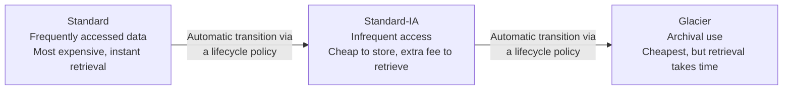

## Introduction

- **What You'll Learn From This Article**: [The Top 1% Hands-On for Publishing a Static Website From an S3 Bucket](/en/articles/aws-s3-static-website-handson-guide) just used S3's default storage class (Standard) as-is. This article gives you a systematic understanding of **why S3 offers multiple "storage classes"** at all, what access frequency each one is designed around, and how a **lifecycle policy** automates moving data between them.
- **Intended Audience**: Readers who've stored a file in S3 before, but have never deliberately chosen a storage class other than Standard.
- **Estimated Reading Time**: About 15 minutes

This article is part of the [Top 1% Series Complete Article Guide](/en/sitemap), the 15th article in the [AWS Fundamentals Series](/en/sitemap#series-list).

## The Big Picture

## A Thorough, Grounds-Up Explanation

### Why Do Multiple Storage Classes Exist at All?

S3's pricing is built from two components: **the per-unit cost of storage capacity itself**, and **an extra fee for retrieving data.** **A storage class is really about shifting the balance between these two components, based on how often the data actually gets accessed.**

- **S3 Standard**: The default class, assuming frequent access. Its storage capacity unit cost is the highest, but no extra fee applies for retrieval.
- **S3 Standard-IA (Infrequent Access)**: For data accessed infrequently — roughly once a month, say. Its storage unit cost is cheaper than Standard, but an extra fee applies every time you retrieve data.
- **S3 Glacier**: For archival use cases barely ever accessed at all, like logs kept for a legally mandated retention period. Its storage unit cost is extremely cheap, but retrieval takes anywhere from minutes to hours.

**The tradeoff structure of "cheap to store, expensive to retrieve" is common across every infrequent-access-oriented class.** Misjudge access frequency and place data you actually access frequently into Glacier, and accumulated retrieval fees can end up costing more than you saved.

### Lifecycle Policies: Automatic Transitions Over Time

Set up a **lifecycle policy**, and you can automate storage class transitions like "move to Standard-IA after 30 days, then to Glacier after 90 days" — based on the assumption **that data's access frequency drops over time.** This is especially effective for data with the classic access pattern of **log files or backup data: heavily referenced right after creation, but barely referenced as time passes.**

## What a Pro Sees Here (Top 1% Understanding)

### The Danger of Choosing Glacier Purely Because "It's Cheap"

Since Glacier has the cheapest storage unit cost, it's easy to reach for it purely from a cost-cutting perspective, but **what actually matters in real-world work is the time constraint and extra cost you'll face when you genuinely need to retrieve that data.** If you urgently need to check a past log during an incident investigation, and that log sits in Glacier, retrieval taking hours delays the investigation itself. **Choosing a storage class should be judged not just by "how much can I cut storage cost," but also by "how quickly do I genuinely need to retrieve this if it's ever needed" — a business-continuity perspective.**

### Combining Versioning With a Lifecycle Policy

Enable **versioning**, covered in [The Top 1% Hands-On for Publishing a Static Website From an S3 Bucket](/en/articles/aws-s3-static-website-handson-guide), and every overwrite or delete accumulates a past version. **A lifecycle policy can also target these "past versions" — deleting them after a certain period, or moving them to a cheaper storage class.** Enable versioning and forget to also set up a lifecycle policy, and old versions accumulate indefinitely, quietly ballooning storage cost — a common real-world pitfall.

## Common Misconceptions and Pitfalls

- **Misconception 1: "Since Glacier's storage cost is cheap, you should always choose Glacier."**
  Choose Glacier without accounting for retrieval time and extra cost, and it can delay an emergency response, or actually cost more overall.
- **Misconception 2: "A lifecycle policy is a feature that only automates deletion."**
  Automatically transitioning to a cheaper storage class, not just deletion, is also an important lifecycle-policy feature.
- **Misconception 3: "Enabling versioning always makes storage cost balloon indefinitely."**
  Set up a lifecycle policy for automatic deletion or transition of old versions, and cost stays under control.

## Troubleshooting Perspective

1. **S3 costs are higher than expected**: Check whether frequently accessed data was accidentally placed in Standard-IA or Glacier, and whether retrieval fees from that access are accruing.
2. **You need to retrieve data stored in Glacier right away**: Glacier offers multiple retrieval options (Standard, Expedited, Bulk) — the Expedited option can retrieve in minutes, but at an extra cost.
3. **A bucket's storage usage keeps growing more than expected**: Check whether versioning is enabled without a lifecycle policy configured alongside it.

## Summary

- An S3 storage class shifts the balance between storage unit cost and retrieval fees, based on access frequency.
- Standard-IA and Glacier are cheap to store but carry extra fees or time cost to retrieve.
- A lifecycle policy automates storage-class transitions or deletion based on elapsed time.
- Choosing a storage class should account for the time constraint of actually retrieving it when needed, not just cost.

**Takeaways to Apply Today**
1. When storing data, estimate its access frequency first, then choose the appropriate storage class.
2. Always pair versioning with a lifecycle policy on any bucket where you enable it.

## References

- [Amazon S3 Storage Classes | AWS Documentation](https://docs.aws.amazon.com/AmazonS3/latest/userguide/storage-class-intro.html)
- [Managing your storage lifecycle | AWS Documentation](https://docs.aws.amazon.com/AmazonS3/latest/userguide/object-lifecycle-mgmt.html)
