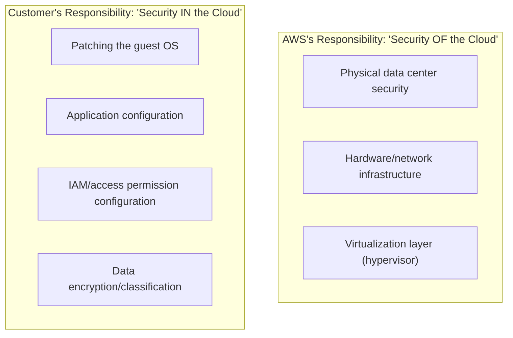

## Introduction

- **What You'll Learn From This Article**: Articles like [The Top 1% Hands-On for Reproducing the Danger of an Overly Broad IAM Policy and Scoping It to Least Privilege](/en/articles/aws-least-privilege-policy-handson-guide) have implicitly relied on the assumption of "this part is AWS's job to protect" vs. "this part is ours to protect." This article gives you a systematic understanding of the **Shared Responsibility Model** underlying that assumption.
- **Intended Audience**: Readers who use AWS but vaguely assume "security is AWS's problem, so we're fine" — or, on the flip side, can't explain exactly where their own responsibility begins.
- **Estimated Reading Time**: About 15 minutes

This article is part of the [Top 1% Series Complete Article Guide](/en/sitemap), the 13th article in the [AWS Fundamentals Series](/en/sitemap#series-list).

## The Big Picture

## A Thorough, Grounds-Up Explanation

### "Security OF the Cloud" vs. "Security IN the Cloud"

AWS's Shared Responsibility Model draws a clear line between responsibilities, using these two phrases:

- **"Security OF the cloud"**: AWS's own responsibility. This covers physical data center security, hardware, network infrastructure, and the safety of the virtualization layer (the hypervisor) itself.
- **"Security IN the cloud"**: The customer's (your own) responsibility. This covers patching the guest OS, application configuration, managing access permissions via IAM, and data encryption/classification.

**The fact that these two phrases are distinguished by nothing more than a single preposition (of/in) captures the essence of this model concisely.** AWS protects "the building that is the cloud itself," while the customer protects "the belongings you placed inside that building" — that's the division of labor.

### The Responsibility Boundary Shifts Depending on the Service You Use

**The responsibility boundary doesn't sit in the same place for every service.** For an **infrastructure-type service (IaaS)** like the EC2 covered in [The Top 1% Hands-On for Launching an EC2 Instance and Publishing a Web Server](/en/articles/aws-ec2-webserver-handson-guide), everything above the OS layer — patching the OS, configuring middleware, application code — is entirely the customer's responsibility. For a **managed service** like RDS, on the other hand, patching the OS and the database engine itself falls within AWS's scope. **The key understanding is that the scope you need to protect yourself genuinely changes depending on the type of service you use.**

## What a Pro Sees Here (Top 1% Understanding)

### The Real Security Incidents Born From the Assumption "We're Safe Because We Use AWS"

Most cloud-related security incidents aren't caused by AWS's own infrastructure being breached — **they're caused by a misconfiguration on the customer's side, within "security IN the cloud."** The unintentionally public S3 bucket configuration covered in [The Top 1% Hands-On for Publishing a Static Website From an S3 Bucket](/en/articles/aws-s3-static-website-handson-guide) is a textbook example. **No matter how robustly AWS protects "security OF the cloud," if the customer misconfigures "security IN the cloud," data can leak from exactly that gap, without limit.** The idea "using the cloud alone improves your security" is dangerous — the correct understanding is that "the cloud provides strong security only for the scope the customer has configured correctly."

### Choosing a Managed Service Is a Deliberate Choice to Shrink Your Own Responsibility

Choosing RDS over EC2, or ELB over a homegrown load balancer, isn't just a comparison of features and cost — **it's also a security design decision: deliberately shifting the scope of responsibility your own organization carries, toward AWS.** If you don't have the organizational capacity to keep managing OS patching yourself, or you'd rather spend that effort elsewhere, actively choosing a managed service is a rational choice grounded in the shared responsibility model.

## Common Misconceptions and Pitfalls

- **Misconception 1: "Using AWS means security measures are basically unnecessary."**
  AWS only covers "security OF the cloud" — "security IN the cloud" is the customer's own responsibility.
- **Misconception 2: "The responsibility boundary sits in the same place no matter which AWS service you use."**
  The scope the customer is responsible for differs between an IaaS-type service like EC2 and a managed service like RDS.
- **Misconception 3: "Cloud-related security incidents are mainly caused by a fault on AWS's side."**
  In reality, most are caused by a misconfiguration on the customer's side ("security IN the cloud").

## Troubleshooting Perspective

1. **You need to determine whose responsibility a security incident falls under**: Check AWS's published, per-service Shared Responsibility Model documentation, to see exactly where AWS's scope ends for that specific service.
2. **An audit asks you to explain "AWS's security measures"**: First take inventory of the "security IN the cloud" items your own organization is responsible for (IAM configuration, encryption, patch status, and more).
3. **You're considering migrating to a managed service**: Sort out, based on the shared responsibility model, how much of your current responsibility scope could shift to AWS's side.

## Summary

- AWS's Shared Responsibility Model draws a clear line between "security OF the cloud" (AWS's responsibility) and "security IN the cloud" (the customer's responsibility).
- The responsibility boundary shifts depending on whether it's an IaaS-type service like EC2 or a managed service like RDS.
- Most cloud-related security incidents are caused by a customer-side misconfiguration within "security IN the cloud."
- Choosing a managed service is also a security design decision, deliberately shifting responsibility scope toward AWS.

**Takeaways to Apply Today**
1. Whenever you start using a new AWS service, first check exactly where the responsibility boundary sits for that service.
2. Drop the assumption "we're safe because we use AWS," and periodically take inventory of the "security IN the cloud" items your organization owns.

## References

- [Shared Responsibility Model | AWS](https://aws.amazon.com/compliance/shared-responsibility-model/)
