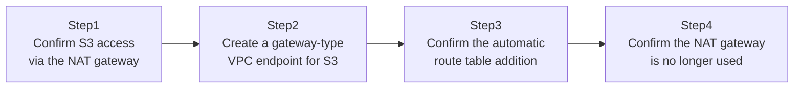

## Introduction

- **What You'll Learn From This Article**: Experience a concrete, real-world solution to the problem covered in [The Top 1% Hands-On for Building a VPC With Public/Private Subnets Yourself](/en/articles/aws-vpc-handson-guide) — "a NAT gateway bills you for data volume passing through it." You'll build a setup that reaches S3 directly from a private subnet through a **VPC endpoint**, instead of routing through a NAT gateway.
- **Intended Audience**: Readers who've looked at a NAT gateway's billing breakdown and been surprised that "traffic to S3 alone costs this much" — or are about to be.
- **Estimated Reading Time**: About 20 minutes (about 35 minutes if you build along with the hands-on)

This article is part of the [Top 1% Series Complete Article Guide](/en/sitemap), the 7th article in the [AWS Fundamentals Series](/en/sitemap#series-list).

## The Big Picture

This hands-on consists of four steps.



## Hands-On Steps

### Step 1: Confirm S3 access via the NAT gateway

First, access S3 from the private-subnet EC2 instance built in [The Top 1% Hands-On for Building a VPC With Public/Private Subnets Yourself](/en/articles/aws-vpc-handson-guide).

```bash
aws s3 ls s3://my-unique-bucket-name-12345/
```

**At this point, per the private subnet's route table, this traffic reaches S3 by routing through the NAT gateway.** This is a path that incurs NAT gateway data-processing charges based on data volume.

### Step 2: Create a gateway-type VPC endpoint for S3

Create a gateway-type VPC endpoint for S3.

```bash
aws ec2 create-vpc-endpoint \
  --vpc-id vpc-xxxx \
  --service-name com.amazonaws.ap-northeast-1.s3 \
  --route-table-ids rtb-private \
  --vpc-endpoint-type Gateway
```

**Notice the `--vpc-endpoint-type Gateway` (gateway type) specified here.** Only two services — S3 and DynamoDB — support this gateway-type VPC endpoint, and it's free of charge.

### Step 3: Confirm the automatic route table addition

Check the content of the specified route table.

```bash
aws ec2 describe-route-tables --route-table-ids rtb-private
```

**Creating a gateway-type VPC endpoint automatically adds a route to the specified route table, targeting S3's IP address range (a prefix list) as the destination.** You don't need to manually add the route yourself.

### Step 4: Confirm the NAT gateway is no longer used

Access S3 again, and confirm the traffic path has changed by looking at the NAT gateway's data-processing volume metric.

```bash
aws s3 ls s3://my-unique-bucket-name-12345/

aws cloudwatch get-metric-statistics \
  --namespace AWS/NATGateway \
  --metric-name BytesOutToDestination \
  --dimensions Name=NatGatewayId,Value=nat-xxxx \
  --start-time 2026-09-26T00:00:00Z --end-time 2026-09-26T23:59:59Z \
  --period 3600 --statistics Sum
```

**Traffic through the VPC endpoint doesn't pass through the NAT gateway at all anymore, since the route table's route to S3 has switched to going through the VPC endpoint instead.** You can also confirm in CloudWatch's metrics that this S3-access data volume is no longer being counted.

## What a Pro Sees Here (Top 1% Understanding)

### Gateway type and interface type are fundamentally different mechanisms

VPC endpoints come in two distinct mechanisms: the **gateway type**, exclusively for S3 and DynamoDB, and the **interface type**, for most other AWS services (the EC2 API, Secrets Manager, SSM, and more). The gateway type is implemented as a route added to a route table, and it's free. The interface type, on the other hand, works by creating an ENI (Elastic Network Interface — a virtual NIC with a private IP) inside the subnet and forwarding traffic through that ENI, which incurs both time-based and data-processing charges. **The assumption that "using a VPC endpoint is always free" is wrong — the billing model differs entirely depending on the target service**, and you need to understand this.

### Priority order in real-world cost optimization

Access to Secrets Manager, used in [The Top 1% Hands-On for Never Letting an App Write a Password With RDS and Secrets Manager](/en/articles/aws-rds-secrets-handson-guide), can also be routed through an interface-type VPC endpoint. But since the interface type is paid, you need to compare "NAT gateway charges vs. interface-type VPC endpoint charges" before deciding to adopt it. On the other hand, if your design involves heavy traffic to S3 or DynamoDB, there's almost no reason not to adopt the free gateway-type VPC endpoint. Cost optimization isn't "turn everything into an endpoint no matter what" — it's the job of looking at traffic volume and service type and judging the cost-benefit tradeoff.

## Common Misconceptions and Pitfalls

- **Misconception 1: "Using a VPC endpoint makes access to every AWS service free."**
  Only the gateway type, for S3 and DynamoDB, is free. The interface type, for other services, is paid.
- **Misconception 2: "After creating a gateway-type VPC endpoint, you need to manually add a route to the route table."**
  The gateway type automatically adds a route to the specified route table. No manual addition is needed.
- **Misconception 3: "Creating a VPC endpoint makes the NAT gateway itself unnecessary."**
  Internet-bound traffic other than to S3/DynamoDB (such as access to an external API) still needs the NAT gateway.

## Troubleshooting Perspective

1. **You created a VPC endpoint, but traffic still seems to route through the NAT gateway**: Check whether the target route table ID actually matches the route table associated with the private subnet.
2. **Can't access via the interface-type VPC endpoint**: Check whether the security group attached to that ENI permits traffic from the connecting source.
3. **The cost savings are smaller than expected**: Before adopting this, check via CloudWatch metrics what proportion of NAT gateway data volume was actually traffic to S3/DynamoDB.

## Summary

- A gateway-type VPC endpoint is exclusively for S3/DynamoDB, and it's free.
- An interface-type VPC endpoint is for most other AWS services, works via an ENI, and incurs charges.
- The gateway type automatically adds a route to the specified route table.
- Cost optimization is the job of judging cost-benefit by traffic volume and service type — not "turn everything into an endpoint no matter what."

**Takeaways to Apply Today**
1. Check via CloudWatch what proportion of your NAT gateway's data volume is traffic to S3/DynamoDB.
2. When adopting a VPC endpoint, always check whether the target service is gateway type or interface type.

## References

- [VPC endpoints | AWS Documentation](https://docs.aws.amazon.com/vpc/latest/privatelink/vpc-endpoints.html)
- [Gateway endpoints for Amazon S3 | AWS Documentation](https://docs.aws.amazon.com/vpc/latest/privatelink/vpc-endpoints-s3.html)
