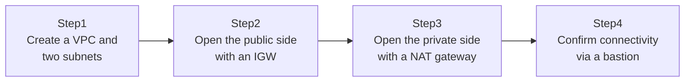

## Introduction

- **What You'll Learn From This Article**: Building on the default-VPC discussion in [Understanding an EC2 Key Pair and a Subnet's Reserved IPs the Top 1% Way](/en/articles/aws-ec2-networking-basics-guide), you'll build a production-grade VPC with public and private subnets, entirely by yourself. You'll actually run each piece — the internet gateway (IGW), the NAT gateway, and the route table — and understand what each one does and why all three are necessary.
- **Intended Audience**: Readers who've launched an EC2 instance inside the default VPC, but have never designed and built a VPC from scratch themselves.
- **Estimated Reading Time**: About 25 minutes (about 50 minutes if you build along with the hands-on)

This article is part of the [Top 1% Series Complete Article Guide](/en/sitemap), the 5th article in the [AWS Fundamentals Series](/en/sitemap#series-list).

## The Big Picture

This hands-on consists of four steps.



## Hands-On Steps

### Step 1: Create a VPC and two subnets

Inside a `10.0.0.0/16` VPC, create two subnets: one for public use, one for private use.

```bash
aws ec2 create-vpc --cidr-block 10.0.0.0/16
# Use the VpcId from the output in the commands below

aws ec2 create-subnet --vpc-id vpc-xxxx --cidr-block 10.0.1.0/24 --availability-zone ap-northeast-1a
aws ec2 create-subnet --vpc-id vpc-xxxx --cidr-block 10.0.2.0/24 --availability-zone ap-northeast-1a
```

**At this point, there's no substantive difference between the two subnets at all.** "Public" and "private" aren't a tag or attribute AWS assigns to a subnet — they're purely an operational distinction that emerges from the route table content you're about to configure.

### Step 2: Open the public side with an IGW

Create an internet gateway (IGW), attach it to the VPC, and add an internet-bound route to the route table used by the public subnet.

```bash
aws ec2 create-internet-gateway
aws ec2 attach-internet-gateway --vpc-id vpc-xxxx --internet-gateway-id igw-xxxx

aws ec2 create-route-table --vpc-id vpc-xxxx
aws ec2 create-route --route-table-id rtb-public --destination-cidr-block 0.0.0.0/0 --gateway-id igw-xxxx
aws ec2 associate-route-table --subnet-id subnet-public --route-table-id rtb-public
```

**Attaching an IGW to the VPC alone doesn't let any subnet communicate with the internet yet.** Only once you explicitly add a route pointing `0.0.0.0/0` (every destination) to the IGW, on the route table associated with that specific subnet, does that subnet become something you can genuinely call a "public subnet."

### Step 3: Open the private side with a NAT gateway

For the private subnet, instead of pointing a route directly at the IGW, route it through a NAT gateway created inside the public subnet.

```bash
aws ec2 allocate-address --domain vpc
aws ec2 create-nat-gateway --subnet-id subnet-public --allocation-id eipalloc-xxxx

aws ec2 create-route-table --vpc-id vpc-xxxx
aws ec2 create-route --route-table-id rtb-private --destination-cidr-block 0.0.0.0/0 --nat-gateway-id nat-xxxx
aws ec2 associate-route-table --subnet-id subnet-private --route-table-id rtb-private
```

**A NAT gateway is not a substitute for an IGW.** Where an IGW enables two-way communication with the internet, a NAT gateway only enables one-way communication: the private subnet side initiating an outbound connection. The internet side can never initiate a connection into an instance in the private subnet through a NAT gateway.

### Step 4: Confirm connectivity via a bastion

Launch a bastion EC2 instance in the public subnet, and a production-representative EC2 instance in the private subnet.

```bash
# SSH into the private-subnet instance via the bastion
ssh -J ec2-user@<bastion's public IP> ec2-user@10.0.2.xxx

# From inside the private-subnet instance, confirm outbound connectivity
sudo yum update -y
```

**If `yum update` succeeds, that confirms outbound communication through the NAT gateway is working.** Meanwhile, trying to SSH directly into this instance from the internet won't even reach it, since it doesn't have a public IP at all.

## What a Pro Sees Here (Top 1% Understanding)

### "Public/private" isn't an attribute — it's a result the route table produces

The single most important fact this hands-on demonstrates is that **a subnet's "public" or "private" label isn't an attribute like a checkbox in the AWS console — it's purely a result determined by the content of the route table associated with that subnet.** Change (or remove) where that route table's `0.0.0.0/0` points — from an IGW to a NAT gateway, say — on the very same subnet, and its nature changes the instant you do. Assuming "this subnet is public, so it's safe" is dangerous: you genuinely don't know a subnet's real nature until you check what's actually inside its route table.

### A NAT gateway costs money — a real-world design constraint

A NAT gateway bills you both for the time it's running and for the volume of data passing through it. Design a system that sends large volumes of data from a private subnet to S3 or DynamoDB, and the NAT gateway's data-processing charges can balloon unexpectedly. A practical solution to this problem — reaching AWS services directly without routing through a NAT gateway, using a VPC endpoint — is covered in a separate niche-spec-tier article.

## Common Misconceptions and Pitfalls

- **Misconception 1: "Attaching an IGW to a VPC lets every subnet in that VPC reach the internet."**
  Attaching an IGW is a VPC-wide operation, but whether communication actually works depends on each subnet's own route table configuration.
- **Misconception 2: "A NAT gateway lets the internet side connect into the private subnet."**
  What a NAT gateway enables is only outbound communication initiated from the private subnet side. It can never let something external initiate the connection.
- **Misconception 3: "A private subnet doesn't need security group configuration."**
  Reachability via the route table and permission via security groups are separate layers. Both need to be configured correctly.

## Troubleshooting Perspective

1. **`yum update` fails on the private-subnet instance**: Check whether that subnet's route table correctly has a `0.0.0.0/0` route pointing to the NAT gateway.
2. **Creating the NAT gateway itself fails**: A NAT gateway requires an allocated Elastic IP address. Check whether you ran `allocate-address` beforehand.
3. **Can't SSH into the private-subnet instance via the bastion**: Check whether SSH (port 22) is permitted on both the bastion's and the private instance's security groups.

## Summary

- "Public/private subnet" isn't an attribute — it's a distinction determined by route table configuration.
- An IGW enables two-way communication; a NAT gateway only enables one-way communication initiated from the private side.
- A NAT gateway incurs both time-based and data-processing charges.
- Reachability via route tables and permission via security groups both need to be configured correctly, separately.

**Takeaways to Apply Today**
1. When judging whether a subnet is genuinely public or private, always check the actual content of its route table.
2. When designing something that routes through a NAT gateway, estimate the data-processing cost at design time too.

## References

- [NAT gateways | AWS Documentation](https://docs.aws.amazon.com/vpc/latest/userguide/vpc-nat-gateway.html)
- [Route tables | AWS Documentation](https://docs.aws.amazon.com/vpc/latest/userguide/VPC_Route_Tables.html)
