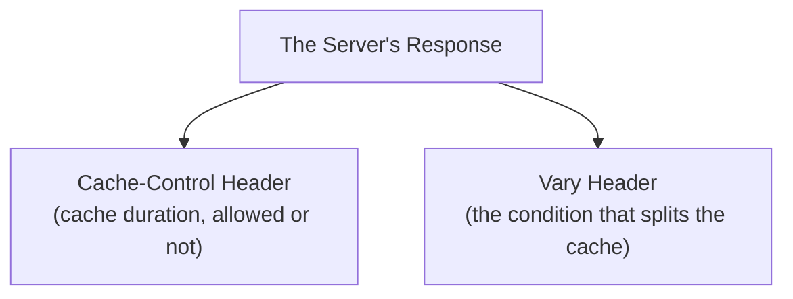

## Introduction

- **What You'll Learn From This Article**: Building on the browser-cache and CDN fundamentals covered in [The Rise of HTTPS and the End of Proxy Caching](/en/articles/http-caching-cdn-guide), a systematic understanding of **exactly what each Cache-Control directive actually controls**, and **how the Vary header makes the same URL use multiple separate caches.**
- **Intended Audience**: Readers who've seen strings like `Cache-Control: no-cache` or `max-age`, but can't explain exactly what each one instructs, or what the Vary header even exists for.
- **Estimated Reading Time**: About 18 minutes

This article is part of the [Top 1% Series Complete Article Guide](/en/sitemap), and the sixth article in the [Web Proxy/Caching Fundamentals Series](/en/sitemap#series-list).

## Prerequisite Knowledge

- **Browser Cache and CDN Fundamentals**: The fundamentals covered in [The Rise of HTTPS and the End of Proxy Caching](/en/articles/http-caching-cdn-guide) — where caching now happens (browser/CDN). This article covers how the server side controls that caching behavior.

## Getting the Big Picture

The mechanism controlling caching splits broadly into two roles: **Cache-Control**, instructing "how long is this response allowed to be cached," and **Vary**, instructing "under which differing conditions should this same URL be treated as separate caches."



## Deep Dive Into the Fundamentals

### Cache-Control: the Main Directives in Common Use

| Directive | Meaning |
|---|---|
| `max-age=<seconds>` | How long, in seconds, the response is considered "fresh." |
| `no-cache` | **Permits storing it in the cache, but forces re-validation (confirming it's still valid) with the server before it's ever used.** |
| `no-store` | Entirely forbids storing it in a cache at all. |
| `private` | Permits storage only in a personal cache, like a browser's; forbids storage in a shared cache, like a CDN's. |
| `public` | Explicitly permits storage in a shared cache too. |

<details>
<summary>If It's Called "no-cache," Why Does It Still Get Stored in a Cache?</summary>

**`no-cache` is the most commonly misunderstood directive in real-world practice.** The name suggests "never cache this," but it actually instructs **"store this in the cache, but always confirm with the server before ever using it."** A response marked `no-cache` genuinely does get stored in a cache, but the next time the same request arrives, the server always gets asked "is this cache still valid?" (re-validation, typically via an ETag) before the stored content is ever returned as-is. **If what you actually intend is "never store this in a cache at all," you need `no-store` instead.** Mixing up these two directives leads to real-world confusion like "I never meant to cache this, but old content briefly flashed on screen."

</details>

### Age: a Header Communicating "How Old" a Response Actually Is

When a caching server (a CDN, say) returns a response it holds in its own cache, **it communicates, via the `Age` header, exactly how many seconds have elapsed since that response was originally fetched from the origin server.** The client can compare this `Age` value against `max-age` to judge "is this response still within its valid period?"

### Vary: Managing the Same URL as Multiple Separate Cache Entities

The directives covered so far control "whether to cache, and for how long." **What the Vary header addresses is an entirely different axis.** Even for the same URL (say, `/products`), **the content that should be returned can differ based on a request header's content.**

```
Vary: Accept-Language, User-Agent
```

When a caching server stores a response carrying this Vary header, **it uses, as the key distinguishing a cache entity, not just "the URL," but "the URL plus the combination of values from the specified request headers."** This lets the same `/products` URL correctly use and distinguish separate caches — serving the Japanese-language response for a request carrying `Accept-Language: ja`, and the English-language response for one carrying `Accept-Language: en`.

<details>
<summary>What Happens If You Forget to Specify Vary?</summary>

If the server's implementation returns a different response per language, but **you forget to specify `Accept-Language` in the Vary header, the caching server mistakenly concludes "the URL is the same, so the same response is fine."** The result is a very common real-world failure: **the response matching whichever user happened to access it first, based on their language setting, gets stored in the cache, and then gets incorrectly served to every subsequent user, even ones with an entirely different language setting.** [The Difference Between GraphQL and RESTful APIs](/en/articles/graphql-vs-rest-guide) covered how a GraphQL response doesn't lend itself to simple URL-based caching — the exact scenario where Vary becomes necessary shares the same underlying structure: a single axis, the URL, alone can't correctly distinguish a response's real identity.

</details>

## What a Pro Sees Here (Top 1% Understanding)

### A Caching Bug Is Always One of Two Things: "Stored Too Long" or "Not Distinguished Enough"

A real-world caching incident almost always falls into one of two categories: **"it's being cached unintentionally too long" (a Cache-Control misconfiguration)**, or **"responses that should genuinely be separate are being treated as the same cache" (insufficient Vary configuration).** Being able to isolate these as two separate axes is the single most important lens for troubleshooting a caching problem. When you get a report of "the cache is stale," deciding which of these two it actually is immediately narrows down where to investigate.

## Common Misconceptions and Pitfalls

- **Misconception 1: "Specifying no-cache means it never gets stored in a cache at all."**
  no-cache instructs "store it, but re-validate before using it." If you truly mean "never store this at all," you need no-store instead.
- **Misconception 2: "The Vary header specifies how long something gets cached."**
  The Vary header doesn't specify a duration — it instructs "under which differing conditions should this be treated as a separate cache."
- **Misconception 3: "The Age header is something the client side sets."**
  The Age header is something the caching server attaches to the response, to communicate the freshness of its own cached copy.

## Troubleshooting Perspective

1. **Content you updated keeps showing its old version**: Check whether `max-age` is set too long, or whether `no-cache` is being used in a situation that actually calls for `no-store`.
2. **A user with a different language setting sees the page in the wrong language**: Check whether the implementation varies its response based on `Accept-Language`, but forgot to specify `Vary: Accept-Language`.
3. **A mobile user ends up seeing the PC-version response via the cache**: For an implementation that varies its response by device, check the `Vary: User-Agent` (or equivalent header) setting.

## Summary

- `max-age` sets the cache's valid duration, `no-cache` means "store it, but re-validate," and `no-store` means "never store it at all" — three distinct instructions.
- The `Age` header lets a caching server communicate to the client exactly how old the response it holds actually is.
- The `Vary` header makes requests to the same URL get managed as separate caches, whenever the value of a specified request header differs.
- Forgetting to specify `Vary` is a common real-world cause of the wrong language- or device-specific cache getting served to a different user.

**Takeaways to Apply Today**
1. When you run into a caching bug, first isolate whether it's "a duration problem" or "a distinction problem."
2. When implementing a response that varies based on a request header, never forget to specify the `Vary` header.

## References

- [RFC 7234 - HTTP/1.1 Caching](https://datatracker.ietf.org/doc/html/rfc7234)
- [HTTP Caching | MDN Web Docs](https://developer.mozilla.org/en-US/docs/Web/HTTP/Caching)
