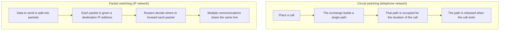
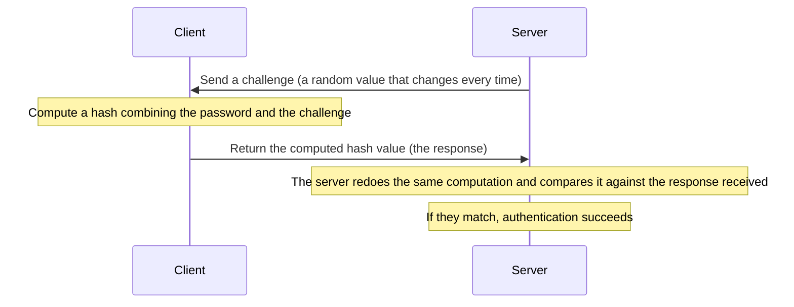
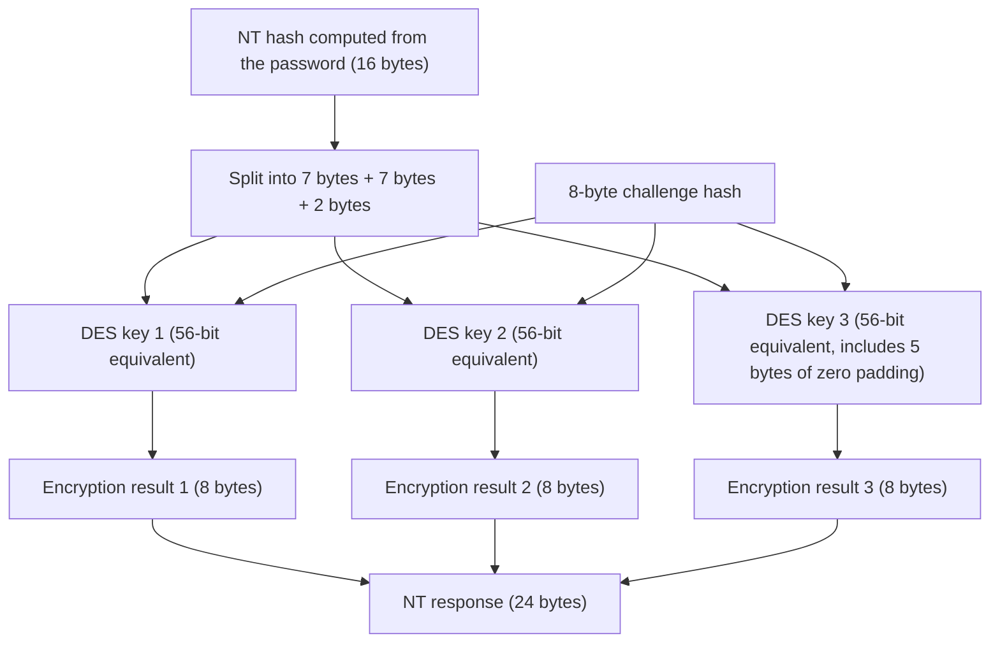

## Introduction

- **What You'll Learn From This Article**: This article gives you a systematic understanding of what "telephone lines" and "IP networks" actually refer to and how they differ — the mechanics of circuit switching and packet switching, the two communication methods, and the historical background behind why that difference emerged; why PPP, a protocol born in the dial-up era, kept being reused in new forms such as PPPoE and VPNs long after; and what the still-widely-used MS-CHAPv2 authentication is actually computing internally.
- **Intended Audience**: This article is written for infrastructure engineers who know terms like "telephone line," "modem," and "dial-up" but cannot explain how they differ from today's IP networks, or why related technologies (such as PPP) still remain embedded in today's network equipment and VPNs.
- **Estimated Reading Time**: About 20 minutes

This article is part of the [Top 1% Series' full article guide](/en/sitemap).

## Prerequisites

- **Circuit/line**: A term referring to the physical or logical "path" through which data travels between a source and a destination. What it refers to concretely varies with context, but the common thread is "the path data travels through."
- **Switch/exchange**: A device that connects and reconnects between multiple circuits as needed. In a telephone network, the exchange (or switch) is responsible for building a single transmission path between the caller and the callee.
- **Packet**: A unit of data exchanged over a network. It consists of control information (a header) — such as source and destination — and the data itself (the payload).
- **IP address**: Information that functions as an address uniquely identifying a device on an IP network.

## Getting the Big Picture

### In a Nutshell

**A telephone network is a circuit-switched system: for every call, a dedicated one-to-one circuit is built and then occupied continuously until the call ends. An IP network is a packet-switched system: a single line is shared by many communications at once, with data split into packets and routed to its destination piece by piece.** PPP is a protocol that was born to "connect two points directly" within this circuit-switched world (telephone lines), and it has been used to build the "entry point" into the packet-switched world of IP networks.

This difference between the two approaches isn't simply a matter of technical superiority — it helps to keep in mind that **it stems from the fact that the telephone network and computer networks were, from the start, trying to solve different problems: the telephone network needed to carry real-time voice without interruption, while computer networks wanted to efficiently multiplex bursty data traffic that can be sent all at once whenever convenient, and that can tolerate some delay.**

## Fundamentals, Thoroughly Explained

### How Circuit Switching Works: The Telephone Network

"Placing a call" on a telephone network is the act of requesting the exchange to "build a transmission path dedicated to this call between the caller and the callee." In early telephone networks, human operators built this path by manually plugging and unplugging phone lines, but after the invention of the automatic exchange (the Strowger switch) in the late 19th century, exchanges themselves began automatically building the path according to the dialed number.

In modern digitized telephone networks, this "building of the path" is achieved through a technology called **TDM (Time Division Multiplexing)**. A single transmission line is divided into time slots at fixed intervals, and every exchange along the way is instructed that "this time slot may be used" for a particular call. This assignment remains unchanged for the duration of the call, and as a result, a single logical path — fixed from caller to callee for the entire call — is established.

**What matters here isn't the number of exchanges traversed, but the property that "the path stays fixed for the whole call and is never taken over by other traffic."** In an actual telephone network, it's normal to pass through multiple exchanges between the nearest local exchange and the exchange serving the other party, but none of those exchanges change the path (the time-slot assignment) once established, until the call ends. It is precisely this property — "the path stays fixed for the duration of the call (the 'call')" — that means that once the destination is determined at the moment a number is dialed, **there is no longer any need to include destination information in the subsequent exchange at all.** This turns out to be a decisive premise for the design of PPP, discussed below.

How Does an Exchange Decide Which Exchange to Connect to Next?

It isn't a fixed port mapping where, say, "numbers starting with 080 always go out port 3, and 9277 always goes out port 4." A telephone number has a hierarchical structure — country code, area code (or a mobile carrier's number block), and subscriber number — standardized internationally by a numbering plan called E.164, and each exchange holds a **routing table** that maps the ranges of numbers it's responsible for to which next exchange (trunk) a given number should be forwarded to. Finding the matching range from the front of the dialed number and deciding the next hop is, at heart, the same idea as route selection in an IP network's routing table — but because the telephone network's number hierarchy (country → region → carrier → subscriber) is fixed in advance, the route lookup is simpler.

Just as important is that this route lookup happens first, over a **dedicated control channel separate from the actual circuit (time slot) that will carry the voice** (modern telephone networks use a common-channel signaling system called SS7 for this). When a caller dials, a request to "please prepare a path to this number" is relayed one exchange at a time over this control channel; only once it reaches the receiving exchange (or the callee) and confirms the call can be delivered does the actual reservation happen in the reverse direction, with each exchange along the path claiming one time slot for the call. In other words, "finding the route (signaling)" and "reserving the actual bandwidth to carry data over that route" are two separate stages, and it's only once the latter is reserved that the path (each segment's time slot) becomes unavailable to other calls. The internals of SS7 are covered in detail in [Understanding VoIP and SS7 — and the Real Path Your Traffic Takes — from a "Top 1%" Perspective](/en/articles/voip-ss7-guide).

### How Packet Switching Works: IP Networks

An IP network, by contrast, has a single physical line or a relaying router shared simultaneously by countless communications. Because of this, unless the destination of the data being sent is explicitly stated as an IP address on every single packet, intermediate routers have no way of knowing where to forward it. Furthermore, because each router independently decides the next hop every time it receives a packet, multiple packets sent to the same destination are not guaranteed to travel the same path, and delay, reordering, and loss can all occur depending on congestion along the way.

This design has been a deliberate choice ever since ARPANET began operating in 1969. A scheme like the telephone network's, where a dedicated path is reserved for each communication, guarantees that bandwidth is used without waste while it's reserved — but it also keeps that path occupied even when no communication is happening, which is inefficient for the intermittent, bursty data traffic between computers. Packet switching is designed to eliminate this inefficiency by not reserving a path and instead having many communications share a single line through statistical multiplexing.

### Comparing the Two Approaches

| Aspect | Circuit switching (telephone network) | Packet switching (IP network) |
|---|---|---|
| Path | One path is built per communication and occupied/fixed for its duration | A shared path is chosen packet by packet |
| Destination information | Determined once at call setup (dialing); unnecessary afterward | A destination IP address is required on every packet |
| Order | Preserved in principle, since the path is fixed | Can be reordered, since the path may change packet by packet |
| Bandwidth efficiency | Tends to be inefficient, since a reserved path is unavailable to other traffic | Efficient thanks to statistical multiplexing, though delay/loss can occur under congestion |
| Best suited for | Real-time voice, which cannot tolerate delay or reordering | Communication in general involving many devices exchanging data intermittently |

### Why Was PPP Created?

If circuit switching and packet switching rest on such different design philosophies, why did anyone try to connect to an IP network over a telephone line in the first place? The answer isn't a good technical fit — it's that, **as of the 1980s–90s, the telephone line was the only kind of communications wiring that reliably reached almost every household.** Laying new cabling dedicated to data communication to every home would have required enormous capital investment, including work on utility poles and underground conduits, but the telephone network had already, over decades, reached inside the walls of nearly every home. Within this constraint of "reuse the wiring that's already there," modems and PPP became necessary as a way to somehow carry digital data over a telephone line's analog voice band. **This wasn't a passive choice made because telephone lines happened to be sitting idle — it was an active necessity: among the options actually available at the time, it was the only realistic way to connect homes to a network.** Keeping this in mind makes the design story that follows easier to connect together.

**PPP (Point-to-Point Protocol, RFC 1661)** is a protocol designed to connect two points directly for dial-up connections over this circuit-switched telephone line. It defines a sequence of steps: "establish the link (LCP)," "authenticate with a username and password (the authentication phase)," and "assign an IP address (IPCP)."

PPP Was Not Invented "to Make Phone Calls"

PPP itself was not a standard "invented to make phone calls." PPP is designed as a **general-purpose protocol for establishing a link, authenticating, and configuring an IP address over serial links that connect two points directly in general** — not limited to dial-up over telephone lines, but including other point-to-point circuits such as leased lines. The telephone line was simply one of the readily and cheaply available means of realizing a "point-to-point serial link" at the time. In other words, PPP is in no way required for the act of "making a phone call" itself; the accurate understanding is that PPP is only needed **when you want to use that point-to-point link for data communication (connecting to an IP network)**.

The fact that this design of PPP rests on the premise of "circuit switching" is the crux of this article. On a circuit-switched telephone line, a single physical circuit remains occupied between the two parties for the duration of the call, with no other party's traffic ever interrupting it — so there is never any need to explicitly state, on every exchange, "who is the other party on this circuit right now," because the circuit itself already uniquely determines who that is. And because data simply flows along a single physical path, it can also be taken for granted (barring physical-layer errors) that it arrives in the order it was sent. **The reason PPP can get away with a simple design — carrying no destination address and simply processing incoming frames in order — is that it rests on this premise of "a circuit occupied one-to-one, with order preserved."**

### The Actual Steps of Modem and Dial-Up Connections

Let's walk through, chronologically, how PPP actually worked over a telephone line. A **modem (modulator-demodulator)** is a device that converts between the digital signals computers work with and the analog voice signals that flow over telephone lines, translating in one direction at the sending side and back again at the receiving modem — making data communication possible over telephone lines that were never designed for digital communication in the first place.

Laying out, in order, what happens from pressing the call button to being able to communicate over IP, we get the following.

1. **Dialing through circuit connection**: When you dial a phone number, the telephone exchange network temporarily reserves a transmission path dedicated to that call. This is, in OSI terms, an **L1 (physical layer)** event, and data-link framing hasn't even begun yet. It's the stage where the "pipe" has just been connected, with nothing yet determined about what protocol will run over it.
2. **Modem handshake**: Both modems perform a handshake (colloquially rendered as "screeching noise") to establish a serial link capable of exchanging digital data as analog voice signals. Neither PPP nor IP has appeared yet at this point.
3. **PPP's LCP**: PPP's LCP begins running over this serial link, agreeing on link parameters (such as MRU) and the authentication method to be used. This is the first point at which the L2-level concept of a "frame" comes into existence.
4. **PPP authentication phase**: Following the agreed method (PAP/CHAP, etc.), the username and password are exchanged **automatically, as digital signals between the modems**. Because the call is treated as a data call, there's no scene in which a human operator answers and verbally asks for an ID and password. Once the modem handshake in step 2 has already switched the circuit over from voice use to data use, the PPP control data — LCP → authentication → IPCP — simply happens to be the first thing flowing within the continuous digital data the modem is modulating; if a human listened to the line during this time, it would sound like nothing more than continuous modem-specific noise, not intelligible speech.
5. **IPCP (IP Control Protocol, RFC 1332)**: Only once authentication succeeds does the connecting party (the ISP, discussed below) assign the client a single IP address. **Up until this exact moment, the client side has no IP address whatsoever.**

Note that dialing a phone number is an L1-level reservation of a circuit — it is not performing L2 framing (the L2-equivalent framing is handled afterward by PPP's LCP). Because a single modem circuit can only handle one call at a time, no one else can get through to the same number while it's busy — but the party being called typically has a **modem pool**, a bank of many modems behind a single published number, and incoming calls are automatically routed to whichever modem is free. So it's not the case that "while one person is connected, nobody else can connect there" — rather, as many simultaneous connections as there are free lines in the modem pool were possible.

What Is an ISP (Internet Service Provider)?

An ISP is the operator that serves as the "boundary" connecting a user's line — a telephone line in the dial-up era, or xDSL, fiber, or a mobile line today — to the internet, the worldwide network. In the dial-up era, the ISP's modem pool, on the receiving end of the number a user dialed, would accept the PPP connection, perform authentication, assign the user an IP address, and then relay their packets on into the vast internet backbone beyond.

### Inside the Authentication Phase: CHAP/MS-CHAPv2 Challenge-Response

Step 4 of the previous section stated that "the username and password are exchanged," but what actually flows over the wire differs greatly depending on the authentication method. Here we'll dig into the internal workings of **MS-CHAPv2 (RFC 2759)**, the PPP authentication method still most widely used today.

As a premise, PPP's authentication methods have broadly evolved through three stages.

| Method | How the password is handled | Direction of authentication |
|---|---|---|
| PAP (RFC 1334) | Sends the username and password **as plaintext** | Client→server only, one direction |
| CHAP (RFC 1994) | Never sends the password itself; exchanges only hash values via a **challenge-response scheme** | Client→server only, one direction |
| MS-CHAPv2 (RFC 2759) | Same challenge-response scheme as CHAP, but extended by Microsoft to support **mutual, bidirectional authentication** | Both client→server and server→client |

The decisive difference is that **PAP sends the password in plaintext**, whereas **CHAP and later never send the password itself over the network even once**. The basic form of this "challenge-response" idea is as follows.

Because the server can verify the response simply by redoing the same computation using the password information it already knows (has stored) plus the challenge, **the password itself never needs to travel over the wire at all.** Even if this exchange were eavesdropped, all an eavesdropper could obtain is "a challenge that changes every time" and "a one-time hash value corresponding to that challenge" — neither of which reveals the original password directly.

#### What MS-CHAPv2 Actually Computes

MS-CHAPv2 makes this challenge-response mechanism more concrete, performing authentication through the following steps.

1. **The server sends a 16-byte challenge value** to the client.
2. **The client also generates its own 16-byte random value (the Peer Challenge)**, and computes a hash (SHA-1) combining the server's challenge, the Peer Challenge, and the username, producing an 8-byte "challenge hash." By mixing in randomness from the client's side at this stage, the response computed later no longer depends solely on the server's challenge — so even if the server tried to reuse the same challenge for a replay attack, the client's random value changes every time, preventing the same response from being produced.
3. **The client has already computed, from its own password, an NT hash (a 16-byte MD4-based hash value)** in advance (this NT hash is itself the exact internal form in which Windows stores passwords).
4. This 16-byte NT hash is **split into three pieces of 7, 7, and 2 bytes**, each processed so it can be used as a 56-bit DES encryption key (the last fragment, only 2 bytes, is padded with 5 bytes of zeros to reach the equivalent of 7 bytes).
5. **Each of these three DES keys is used to encrypt the 8-byte challenge hash from step 2**, and the three results are concatenated into a 24-byte value sent to the server as the "NT response."
6. The server, using its own copy of the same NT hash, independently performs the exact same computation (steps 2 through 5) that the client did, and **verifies whether it matches the NT response received**.
7. Once authentication succeeds, the server **computes an "Authenticator Response" in the reverse direction using the same idea, and returns it to the client**, which the client also verifies. This establishes bidirectional mutual authentication, confirming even "whether the client is connected to the genuine server."

**Why does the known weakness mentioned earlier in this article — that MS-CHAPv2's "analysis cost can be reduced to that of a single DES key (2^56 possibilities)" — actually hold?** This becomes clear once you follow the steps above. The 24-byte NT response is nothing more than **the same single 8-byte challenge hash, encrypted separately with three independent DES keys and simply concatenated**. There's no need to brute-force all three keys together as a combination — **each DES key can be brute-forced independently, on its own.** In particular, the third key effectively carries only 2 bytes (16 bits) of information and can be identified instantly, while the remaining two 56-bit keys can each be broken with the brute-force cost of a single standalone DES key. Although the scheme was meant to protect the entire 16-byte (128-bit) NT hash, **the very structure of "splitting it into three and encrypting each piece independently" is what collapses the effective decryption cost down to that of brute-forcing a single 56-bit DES key** — that is the essence of this weakness.

### The Role IPCP Plays: Promoting a Circuit into Part of the IP Network

The IP address assigned in step 5 is used from then on as the source address for every IP packet flowing over that PPP link. Worth noting here is that the understanding "the moment you connect to the ISP through the modem, you're already on an IP network" actually has the causality backward. The physical pipe that is the telephone line is not, itself, an IP network — **it is only from the moment PPP (via its IPCP) assigns an IP address that the link begins functioning as part of an IP network.** IPCP is not "a procedure for connecting to an IP network that already exists" — it is, in itself, **the procedure that promotes that one-to-one link into part of the IP network**.

Also note that everything covered so far applies specifically to the case where you want to use a telephone line for data communication (an internet connection). For a plain voice call (an ordinary phone call), none of this — the modem handshake, or PPP's LCP, authentication, and IPCP — happens at all; once the circuit is connected, the analog voice signal picked up by the handset is simply carried straight through to the other party.

## The View from the Top 1% (What Experts See)

### Why Did PPP Survive After Dial-Up Faded Away?

As ADSL and fiber became widespread, dial-up connections over telephone lines themselves largely disappeared, but the PPP protocol itself did not vanish (the technical mechanics of ADSL and fiber themselves, as access-line technologies, are covered in [Understanding the Evolution of Access-Line Technology — ADSL, Fiber, and More — from a "Top 1%" Perspective](/en/articles/access-network-guide)). The reason is that the feature set PPP provides — **"authenticate per user and dynamically assign an IP address, over a one-to-one link" — turned out to have demand that extended well beyond telephone lines.**

- **PPPoE (PPP over Ethernet, RFC 2516)**: In the era of ADSL and fiber, subscribers began connecting to their ISP over Ethernet (within a LAN), but the commercial and billing model inherited from the telephone-line era — "authenticate who's using each line, and dynamically assign an IP address" — carried straight over. PPPoE is a standard that, by encapsulating PPP frames inside Ethernet frames, reproduces the same "one-to-one link" that original PPP assumed, logically, on top of a physically shared Ethernet medium.
- **L2TP (Layer 2 Tunneling Protocol, RFC 2661)**: In the world of remote-access VPNs, the exact same experience as a telephone-line dial-up connection was needed for each client connecting to the corporate network — "authenticate with a username and password, and assign an internal virtual IP address." L2TP virtually reproduces the "one-to-one link" that PPP assumes, over an IP network that has no physical circuit, by encapsulating PPP frames inside a virtual tunnel on that IP network. The internal workings of a VPN combining L2TP with IPsec (L2TP/IPsec) are covered in detail in [Understanding How L2TP/IPsec Works from a "Top 1%" Perspective — Why Combine Two Protocols?](/en/articles/l2tp-ipsec-guide).

In other words, whether the medium is Ethernet or an IP network, both PPPoE and L2TP reuse PPP based on the same idea: **taking a single frame that PPP sends out, wrapping it unchanged as the payload of a different protocol, and delivering it to one fixed peer.** It's easiest to grasp the overall picture by seeing it this way: even after physical telephone lines disappeared, the "software contract" that is PPP alone survived, and kept getting ported onto one medium after another.

### Modern Telephone Networks Are Increasingly Packetized Internally

As a somewhat more advanced aside: in modern telephone networks, the "access line" from a subscriber's home to the local exchange does retain traditionally circuit-switched characteristics, but the core network connecting exchanges to one another has, in most cases, become built on top of packet-switching technology internally, as VoIP technology and the IP-ization of SS7 (Signaling System No. 7, the suite of call-control protocols) have progressed (the internals of VoIP and SS7, along with a concrete example of how data actually flows over an IP network, are covered in [Understanding VoIP and SS7 — and the Real Path Your Traffic Takes — from a "Top 1%" Perspective](/en/articles/voip-ss7-guide)). That said, **from the user's point of view, the experience — dial and a single path is established, which is then maintained for the duration of the call — remains unchanged.** This is a good example of how the underlying implementation technology can migrate from circuit switching to packet switching while the service-level property visible from above (behaving as though a dedicated path is reserved for each call) remains a separate matter entirely.

## Common Misconceptions and Pitfalls

- **Misconception 1: "The moment you connect to the ISP through the modem, you're already on an IP network."**
  The physical pipe that is the telephone line is not itself an IP network. It's only from the moment PPP's IPCP assigns an IP address that the link first begins functioning as part of an IP network.
- **Misconception 2: "The 'screeching' sound a modem makes is machines talking to each other in place of humans."**
  That sound isn't a signal meant to be understood by human ears — it's a mechanical handshake sound through which the modems agree on parameters like communication speed and modulation scheme. As for the PPP authentication data (username, password, and so on) exchanged after that agreement is reached, it sounds like nothing more than continuous noise.
- **Misconception 3: "PPP is a standard exclusively for telephone lines."**
  PPP is a general-purpose protocol for point-to-point serial links in general, and the telephone line was just one means of realizing that. It was precisely this generality that allowed PPP to be reused, years later, over completely different media in PPPoE and L2TP.
- **Misconception 4: "A telephone line only counts as a dedicated line if it passes through just one exchange from source to destination."**
  In practice it's normal to pass through multiple exchanges. The reason it can be called a "dedicated line" has nothing to do with the number of exchanges traversed — it's because **the path (the time-slot assignment) stays fixed for the entire call and is never taken over by other traffic.**

## Troubleshooting Perspective

PPP may look like an old technology, but it still shows up in practice today — in PPPoE (authentication for consumer broadband lines), WAN leased lines, and L2TP VPNs. The basic approach to isolating the problem is the same as it was in the telephone-line era: **"which stage — LCP → authentication → IPCP — is it stuck at?"**

1. **LCP doesn't establish**: Typical causes are a mismatch in link parameters (such as MRU) with the peer device, or the link simply not being up at the physical or data-link layer in the first place. For PPPoE, the ATM/Ethernet-segment session is established first through the PADI/PADO/PADR/PADS discovery phase (RFC 2516), and LCP starts on top of that.
2. **Authentication fails**: Causes include an incorrect username/password, or no mutually agreeable authentication method (PAP/CHAP, etc.) between client and server. Check which authentication methods are supported in the settings on both the ISP and VPN server side.
3. **It stalls at IPCP (authentication succeeds but no IP address is assigned)**: Typical causes include a mismatch between subscriber information and the account, or exhaustion of the assignable IP address pool.

### Prevention and Long-Term Countermeasures

- When isolating faults in PPPoE or WAN leased-line connections, first confirm the link is up at the physical and data-link layers, then trace the logs at each of the LCP → authentication → IPCP stages.
- Where possible, use CHAP or a later challenge-response method for authentication, rather than PAP, which sends the password in plaintext.

## Summary

- The telephone network is a circuit-switched system that "builds a dedicated path per call and keeps it occupied for the call's duration," while an IP network is a packet-switched system in which "many communications share a single line, routed to their destinations packet by packet" — a difference rooted in the fact that real-time voice and bursty data communication are fundamentally different problems to solve.
- PPP is a protocol designed on the premise of the "occupied one-to-one, order-preserving" properties of a circuit-switched telephone line, and its simple structure — carrying no destination address — rests on that premise.
- IPCP is not "a procedure for connecting to an IP network that already exists" — it is, in itself, "the procedure that promotes a one-to-one link into part of the IP network."
- PPP is not a standard exclusive to telephone lines but a general-purpose protocol for point-to-point serial links in general, and it is precisely this generality that has kept it in use, in altered forms, in PPPoE (broadband lines) and L2TP (remote-access VPNs), long after physical telephone lines disappeared.

**Starting Today**
1. When you encounter the word "PPP" in a VPN or broadband line configuration, remember that it's an extension of the telephone-line era's idea of "authentication plus IP address assignment over a one-to-one link."
2. When you run into a PPP-family connection failure, first narrow down which stage — LCP → authentication → IPCP — it's stuck at.

## References

- [The Point-to-Point Protocol (PPP) | RFC 1661](https://datatracker.ietf.org/doc/html/rfc1661)
- [The PPP Internet Protocol Control Protocol (IPCP) | RFC 1332](https://datatracker.ietf.org/doc/html/rfc1332)
- [PPP Password Authentication Protocol (PAP) | RFC 1334](https://datatracker.ietf.org/doc/html/rfc1334)
- [PPP Challenge Handshake Authentication Protocol (CHAP) | RFC 1994](https://datatracker.ietf.org/doc/html/rfc1994)
- [Microsoft PPP CHAP Extensions, Version 2 | RFC 2759](https://datatracker.ietf.org/doc/html/rfc2759)
- [A Method for Transmitting PPP Over Ethernet (PPPoE) | RFC 2516](https://datatracker.ietf.org/doc/html/rfc2516)
- [Layer Two Tunneling Protocol "L2TP" | RFC 2661](https://datatracker.ietf.org/doc/html/rfc2661)
