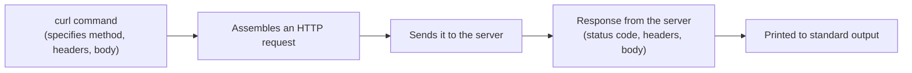

## Introduction

- **What You'll Learn From This Article**: You'll systematically understand what HTTP request the **curl** command — used casually everywhere as `curl http://example.com/` — actually assembles and sends under the hood, and how it interprets the response. We'll map the main options `-X`, `-H`, `-d`, and `-i` onto the exact part of an HTTP request each one corresponds to, cross-checking against your browser's developer tools along the way.
- **Intended Audience**: Readers who've copy-pasted `curl` commands before, but couldn't explain what each option means, or what `curl` is actually doing, to someone else.
- **Estimated Reading Time**: About 15 minutes

This article is part of the [Top 1% Series' full article guide](/en/sitemap). It covers the common foundation behind the `curl` command that shows up as a matter of course across many articles on this blog, including [The Top 1% Hands-On for Automating Config Deployment to Multiple Servers With Ansible](/en/articles/ansible-handson-guide) and [Understanding RESTful APIs from a "Top 1%" Perspective](/en/articles/restful-api-guide).

## The Big Picture

### In a Nutshell

`curl` is **a tool for assembling and sending an HTTP (or various other protocol) request from the command line, and receiving the response.** It helps to picture it as taking everything a browser does behind the scenes when you "type a URL and press Enter," and letting you specify each piece explicitly, as an individual command-line option.



## The Full Breakdown

### The Simplest Example: a GET Request

```bash
curl http://example.com/
```

Run `curl` with no options at all, and by default it sends **an HTTP request using the GET method.** This is nearly identical to the request your browser sends when you visit that URL. Only the returned HTML body is printed directly to standard output.

### Seeing the Status Code and Headers: the `-i` Option

Plain `curl` only shows the response body, so you can't tell whether the request actually succeeded, or was redirected.

```bash
curl -i http://example.com/
```

Add the `-i` (`--include`) option, and the HTTP status code (like `HTTP/1.1 200 OK`) and the full set of response headers are printed before the body. The first step in diagnosing "it's not connecting properly" is always to check exactly what status code is actually coming back, with `-i`.

### Specifying the Method: the `-X` Option

```bash
curl -X POST http://example.com/api/users
```

The `-X` (`--request`) option lets you explicitly specify an HTTP method other than GET (POST, PUT, DELETE, and so on). **However, if you send data with the `-d` option covered next, POST is automatically selected even if you omit `-X POST`.** Use `-X` when you need to state the method explicitly — for a DELETE request with no body, for instance.

### Adding Request Headers: the `-H` Option

```bash
curl -H "Authorization: Bearer <token>" -H "Content-Type: application/json" http://example.com/api/users
```

The `-H` (`--header`) option lets you add any HTTP request header you like. Credentials like `Authorization: Bearer <token>`, covered in [Understanding RESTful APIs from a "Top 1%" Perspective](/en/articles/restful-api-guide), are typically sent this same way, via `-H`. Specify `-H` multiple times to attach several headers at once.

### Sending a Request Body: the `-d` Option

```bash
curl -X POST -H "Content-Type: application/json" -d '{"name": "taro"}' http://example.com/api/users
```

The `-d` (`--data`) option specifies the request body — the actual data sent with a POST/PUT/PATCH. **As noted above, specifying `-d` automatically selects POST even if you omit `-X POST`.** When sending to a JSON API, it's standard practice to explicitly attach a `Content-Type: application/json` header with `-H` (forget it, and the server may fail to interpret the body as JSON at all).

<details>
<summary>Note: your browser's "Copy as cURL" feature</summary>

In the Network tab of a browser's Developer Tools (F12) — Chrome, Edge, and others — right-click any request and choose "Copy as cURL" to copy a `curl` command that reproduces that exact request, headers, cookies, body and all, to your clipboard. It's an extremely handy way to reproduce and inspect, locally, a request that's already succeeding in your browser.

</details>

## What a Pro Sees Here (Top 1% Understanding)

### curl isn't standalone — it's a wrapper around a library called libcurl

The `curl` command is actually just a thin wrapper (a user-facing front end) for calling **libcurl**, a C library that implements HTTP and various other communication protocols, from the command line. libcurl itself is called directly from an enormous number of programming languages and tools — PHP, Python (sometimes internally, via the `requests` library), Node.js, and many more. **In other words, a request you've verified locally with the `curl` command is effectively a dry run for the same request your application code will later make through libcurl.** This is one concrete, everyday example of the pattern covered in [What Is a Library? Understanding Static and Dynamic Linking from a "Top 1%" Perspective](/en/articles/software-library-guide) — many different programs sharing and calling the same library.

### Why curl isn't "just an HTTP client"

The name `curl` comes from "Client for URLs," and it actually handles URLs for far more than just HTTP/HTTPS — FTP, SMTP, LDAP, Telnet, and many other protocols. In the context of this blog, usage is almost entirely HTTP/HTTPS, but "curl is an HTTP-only tool" isn't accurate — the precise understanding is that it inspects the URL scheme (`http://`, `ftp://`, and so on) and internally selects the appropriate protocol implementation to communicate with.

## Common Misconceptions and Pitfalls

- **Misconception 1: "When sending data with `-d`, you always have to explicitly specify `-X POST`."**
  Specifying `-d` automatically selects POST even if you omit the method. `-X POST` gives you the identical result whether you include it or not.
- **Misconception 2: "If you don't specify anything, `curl` won't tell you whether the request succeeded."**
  By default only the response body is shown, but adding the `-i` option also shows you the status code and headers.
- **Misconception 3: "`curl` is an HTTP-only command."**
  `curl` is a general-purpose tool supporting many protocols, HTTP/HTTPS included.

## Troubleshooting Perspective

1. **`curl` seems to hang, with no response coming back**: Name resolution or the TCP connection itself may be taking a long time. Add the `-v` (`--verbose`) option to see detailed progress through each stage — DNS resolution, TCP connection, the TLS handshake — and pinpoint exactly where it's stuck.
2. **You sent data to a JSON API with `-d`, but the server isn't interpreting it correctly**: Check whether you forgot to explicitly attach a `Content-Type: application/json` header with `-H`.
3. **An error like `curl: (60) SSL certificate problem` appears**: Server certificate verification has failed. There's a `-k` (`--insecure`) option as an emergency workaround limited to test environments using a self-signed certificate, but you shouldn't use it against anything resembling production, since it disables certificate verification entirely.

## Summary

- `curl` is a tool for assembling and sending an HTTP request from the command line, and receiving the response.
- `-i` shows the status code and headers, `-X` specifies the method, `-H` adds a header, and `-d` sends a body.
- Specifying `-d` automatically selects the POST method, even if you omit `-X POST`.
- The `curl` command is a thin wrapper around a library called libcurl, which many programming languages use directly to make the same kind of request.

**Takeaways to Apply Today**
1. When a request isn't behaving, make it a habit to check the status code first, with `-i`.
2. Make use of your browser's "Copy as cURL" feature to reproduce a request that's already succeeding in your browser, locally.

## References

- [curl Official Documentation](https://curl.se/docs/manpage.html)
- [everything curl (the official in-depth guide)](https://everything.curl.dev/)
