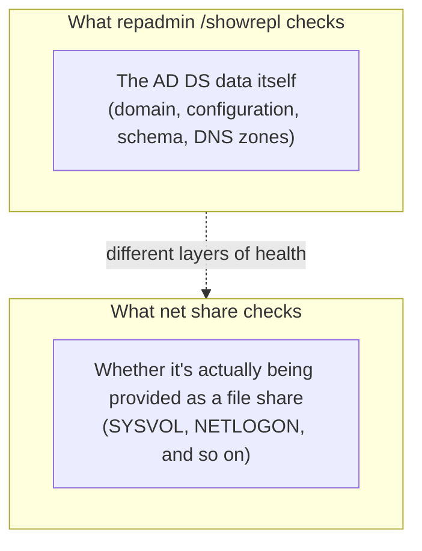

## Introduction

- **What You'll Learn From This Article**: This article systematically explains what the output of two commands that appear in nearly every AD migration or DC build procedure — `repadmin /showrepl` and `net share` — concretely represents, and the criteria for judging it "healthy." It covers the true identity of the five partitions visible in `repadmin /showrepl`, the meaning of the `C$`, `IPC$`, `ADMIN$`, `NETLOGON`, and `SYSVOL` shares shown by `net share`, and what the `SysvolReady` registry value indicates.
- **Intended Audience**: This article is aimed at engineers who've run `repadmin /showrepl` or `net share` while following an AD migration or DC build procedure, but who've stopped at the surface-level judgment of "no errors showed up, so it must be fine" without understanding what the output actually means.
- **Estimated Reading Time**: About 19 minutes

This article is part of the [Top 1% Series' full article guide](/en/sitemap), and the seventh article in the [Active Directory series](/en/sitemap#series-list). It assumes you understand partition types from [Understanding the Difference Between AD and DC, and Domains vs. Forests, from a "Top 1%" Perspective](/en/articles/ad-dc-fundamentals-guide), and `_msdcs`/`ForestDnsZones` from [Reading DNS Zones and Records from a "Top 1%" Perspective](/en/articles/dns-zones-records-guide).

## Prerequisites

- **Replication**: The mechanism by which AD DS changes are replicated between DCs. See [Understanding the Difference Between AD and DC, and Domains vs. Forests, from a "Top 1%" Perspective](/en/articles/ad-dc-fundamentals-guide) for details.
- **SYSVOL**: A shared folder, replicated between DCs, that holds the actual files for Group Policy Objects (GPOs), logon scripts, and so on.

## Getting the Big Picture

### In a Nutshell

**`repadmin /showrepl` is a command that checks whether the AD DS data itself is being correctly replicated between DCs; `net share` is a command that checks whether that DC is actually able to correctly provide what it's supposed to provide as file shares.** These two check entirely different layers, and confirming DC health requires looking at both together.



## Fundamentals, Explained Thoroughly

### The Five Partitions Shown by `repadmin /showrepl`

Running `repadmin /showrepl` shows, for each of the several partitions (naming contexts) a DC holds, the latest sync status with each of its replication partners. In a typical single-domain forest, you'll see these five partitions:

| Partition | Contents | Replication scope |
|---|---|---|
| Domain partition (e.g. `DC=corp,DC=example,DC=com`) | Objects such as users, computers, and groups | All DCs within the domain |
| Configuration partition (`CN=Configuration,...`) | Forest-wide configuration information such as site topology and replication topology | All DCs in the forest |
| Schema partition (`CN=Schema,CN=Configuration,...`) | Object type definitions | All DCs in the forest |
| DomainDnsZones partition | AD-integrated DNS zone data shared at the domain level | All DCs in the domain (that hold the DNS server role) |
| ForestDnsZones partition | DNS zone data that needs to be shared forest-wide, such as `_msdcs` | All DCs in the forest (that hold the DNS server role) |

These five categories correspond exactly to the three basic partitions (domain, configuration, schema) explained in [Understanding the Difference Between AD and DC, and Domains vs. Forests, from a "Top 1%" Perspective](/en/articles/ad-dc-fundamentals-guide), plus the two DNS-specific partitions (DomainDnsZones and ForestDnsZones) explained in [Reading DNS Zones and Records from a "Top 1%" Perspective](/en/articles/dns-zones-records-guide). **Since each partition has a different replication scope, when isolating a replication inconsistency, it's important to always check which partition the problem is occurring in.**

### What "Success" Actually Means

In the output of `repadmin /showrepl`, information like the following is shown for inbound replication from each partner:

```
DC1\CORP.EXAMPLE.COM
DC Options: IS_GC
Site Options: (none)
DSA object GUID: xxxxxxxx-xxxx-xxxx-xxxx-xxxxxxxxxxxx
DSA invocationID: xxxxxxxx-xxxx-xxxx-xxxx-xxxxxxxxxxxx

==== INBOUND NEIGHBORS ======================================

DC=corp,DC=example,DC=com
    CN=Configuration,DC=corp,DC=example,DC=com
        DC2\CORP.EXAMPLE.COM via RPC
            DSA object GUID: yyyyyyyy-yyyy-yyyy-yyyy-yyyyyyyyyyyy
            Last attempt @ <timestamp> was successful.
```

The single most important thing to get right when reading this output is **not mixing up who is "receiving from" whom.** The example above was run on `DC1`, and as the `INBOUND NEIGHBORS` heading indicates, this is the state of replication in the direction of "**DC1 pulling in changes from DC2**." `repadmin /showrepl` always shows the state **with the DC you ran the command on as the subject (the receiver) — only the side of what that DC is receiving from other DCs.** If you want to check the picture from DC2's side — "is what DC2 sent actually arriving correctly at DC1?" — you need to run the same command on DC2 itself, or check across multiple DCs at once with `repadmin /replsummary`, covered below. A mismatch like "`showrepl` on DC1 showed success, but DC2 showed a different error" is a classic pitfall that's easy to miss if you don't understand this inbound-only nature of the command.

With that established, the most important thing to check here is **whether the most recently attempted replication with each partner reads `was successful`, and whether that timestamp falls within a reasonable window relative to the current time (typically, within the last few hours).** **"Successful" only means that the most recent replication attempt with that partner completed correctly — it doesn't rule out the possibility that replication had been stalled for a long time before that.** Rather than being reassured by looking at just the most recent attempt, you also need to check whether the consecutive failure count is 0, and whether the last-success timestamp isn't abnormally old.

<details>
<summary>What a failure looks like</summary>

When replication is failing, instead of `was successful`, you'll see an error code and its meaning, such as:

```
Last attempt @ <timestamp> failed, result 1722 (0x6ba):
    The RPC server is unavailable.
    <failure count> consecutive failure(s).
Last success @ <timestamp>.
```

**If `<failure count> consecutive failure(s)` is greater than 0, that definitively indicates some kind of problem.** The error code (1722, in this example) indicates that RPC — the communication mechanism between these DCs — is itself unreachable, which is a clue to check for issues with network connectivity, firewalls, or DNS name resolution.

</details>

### The Default Shares Shown by `net share`: C$, IPC$, ADMIN$, NETLOGON, SYSVOL

Running the `net share` command on a DC (or on Windows Server in general) shows, alongside any explicitly created shared folders, the **administrative shares that are automatically set up by default.**

| Share name | What it points to | Purpose |
|---|---|---|
| `C$` | The entire `C:\` drive | An administrative share letting a user with administrator privileges access that entire drive remotely (a similar `D$` and so on is automatically created per drive letter) |
| `ADMIN$` | `%SYSTEMROOT%` (typically `C:\Windows`) | An administrative share used for remote administrative operations (such as installing a service) — many remote management tools rely on it internally |
| `IPC$` | Not a folder with actual content — a named pipe for inter-process communication | A special share used not for file sharing but for carrying inter-process communication such as remote procedure calls (RPC) over SMB. Unlike the other shares, it has no actual file content |
| `NETLOGON` | The `scripts` folder under SYSVOL | A share for distributing logon scripts and the like |
| `SYSVOL`| The entire SYSVOL folder | A share for distributing the actual files of Group Policy Objects (GPOs) |

**Of these, C$, IPC$, and ADMIN$ aren't specific to AD DS or DCs at all — they're administrative shares always created by default on any ordinary Windows (Server) machine.** **NETLOGON and SYSVOL, on the other hand, are proof that the server is functioning correctly as a DC**, and hold particular significance for DC health checks.

<details>
<summary>Do C$, ADMIN$, and IPC$ exist for RDP connections?</summary>

A common misconception in practice: **these three administrative shares have nothing to do with RDP (Remote Desktop) connections themselves.** An RDP connection is an entirely separate mechanism that streams that server's desktop screen to you remotely (the RDP protocol, default TCP port 3389) — the reason you can see the C drive or the desktop once you've logged in via RDP is **simply that you're operating the OS in exactly the same state as if you were sitting directly at that server; it has nothing to do with going through the C$ share.**

The real purpose of these administrative shares is to **directly access the file system or services over the network, without opening a full desktop session like RDP.**

- **C$**: Accessing it directly as a UNC path in the form `\\server-name\C$` lets a remote administrator browse and operate on that server's C drive contents directly from Explorer or the command line — without logging in via RDP every time. Backup software and operational scripts that push files out to many servers at once routinely rely on this path.
- **ADMIN$**: This maps to `C:\Windows` (`%SYSTEMROOT%`), and many remote management tools (remote service installation, remote execution tools like `PsExec`, and so on) use it internally to transfer an executable temporarily or register it as a service. It isn't "a special share only usable when you've RDP'd in as an administrator" — it's **a share dedicated to the Windows folder, directly accessible remotely by any account with administrator privileges, without going through RDP at all.**
- **IPC$**: Rather than a file share with actual content, this is **a communication-only channel for carrying remote procedure calls (RPC) or named-pipe communication over SMB.** Many remote-management API calls — editing the remote registry, listing/starting/stopping services, enumerating shared folders — go over this IPC$ channel. It isn't for placing or retrieving files; it's more accurate to picture it as **"the pipe you send administrative commands and queries to this server through."**

In short, C$, ADMIN$, and IPC$ are all **"paths for directly operating files or services remotely without logging in via RDP,"** and RDP is a completely separate, independent mechanism from these.

One more nuance worth flagging: the idea that "accessing `\\server-name\C$` in Explorer as an administrator also unlocks ADMIN$" is half right and half imprecise. **C$ and ADMIN$ are separate, independent shares — accessing one doesn't "grant" permission on the other.** However, since an SMB connection establishes an authenticated session per server, once you've authenticated as an administrator, **that same authenticated session can access whichever of C$ or ADMIN$ your admin privileges allow, without re-authenticating.** It's not that "C$ unlocks ADMIN$" — it's that "the same admin session happens to work for both C$ and ADMIN$."

</details>

### NETLOGON and SYSVOL, and Why You Need Both

Before going further, it's worth separating two different things the name "NETLOGON" can refer to. Everything covered so far was the `NETLOGON` **share** (exposing the `scripts` folder under SYSVOL) — but there's also a separate Windows service called the **Netlogon service**. **The Netlogon service is responsible for three things: establishing and maintaining the secure channel via the DC's own computer account, processing client authentication requests, and dynamically registering the DNS SRV records clients use to locate their DC.** The `NETLOGON` share's name traces back to this service's historical involvement in distributing logon scripts, but **the share itself is just part of SYSVOL — the Netlogon service doesn't hold the share's content.** The secure channel mechanism itself is covered in depth in [Understanding the Netlogon Service and the Secure Channel](/en/articles/ad-netlogon-guide).

As the table above shows, the `NETLOGON` share's actual target is the `scripts` subfolder inside the `SYSVOL` folder. In other words, **the NETLOGON share is simply re-exposing, under a different name, part of the same tree that the SYSVOL share already exposes** — it isn't separate, independent data. Both trace back to the same SYSVOL folder on the DC, and **both are accessed by clients and DCs alike** (it isn't a split of "SYSVOL is DC-to-DC only, NETLOGON is client-only").

It's a fair question to ask, "if the entire SYSVOL folder is already shared, why is a separate NETLOGON share needed at all?" — and the reason it still exists as an independent share today is **historical compatibility**. Before AD DS and SYSVOL were introduced in Windows 2000, domains running Windows NT 4.0 and earlier had a convention of placing logon scripts at a fixed path, `\\server-name\netlogon\script-name`, and many logon scripts and tools simply assumed that path outright. Even after SYSVOL was introduced, `NETLOGON` was kept around as an alias-like share pointing at the `scripts` subfolder, so that this familiar, short path — `\\domain-name\netlogon\...` — could keep working. In practice, it's worth understanding the division of labor this way: the traditional short `NETLOGON` path is used to reference logon scripts, while the broader `SYSVOL` path is used to access the GPO configuration files themselves (under the `Policies` folder). How a GPO's actual content is managed on SYSVOL and replicated via DFSR is covered in more depth in [Understanding SYSVOL, DFSR, and Group Policy](/en/articles/ad-sysvol-dfsr-gpo-guide).

### Why the Presence of NETLOGON and SYSVOL Shares Constitutes a DC Health Check

The NETLOGON and SYSVOL shares are only automatically created once replication of the SYSVOL folder (via DFSR, or the legacy FRS) has completed successfully, and the Netlogon service has judged its content ready to distribute. **Right after promoting a DC, or when there's a problem with SYSVOL replication, these two shares may not exist (or may temporarily disappear).** If running `net share` doesn't show these two shares, that DC likely can't apply Group Policy or distribute logon scripts, and in practice, should be judged as not fully functioning as a DC.

<details>
<summary>With multiple DCs, which DC's SYSVOL does a client actually consult?</summary>

Because the actual GPO and logon-script files are replicated **to every DC** via DFSR (or the legacy FRS), a client can in principle reach the same content by consulting any DC's SYSVOL. So which DC does a client actually pick? It's **the same DC that client itself uses for Kerberos authentication at logon time.** At startup and logon, a client uses DNS SRV records to look up **the closest DC in its own site (location)**, and from then on, generally directs its authentication, GPO retrieval, and logon-script retrieval at that same DC. Unless you've explicitly configured a DC to be used, this isn't something an administrator manually assigns per client. The detailed mechanics of this DC selection (the DC locator) are covered, using the DNS SRV records involved, in [Understanding DNS Zones and Records from a "Top 1%" Perspective](/en/articles/dns-zones-records-guide), and in [Understanding AD "Sites" and Replication Topology from a "Top 1%" Perspective](/en/articles/ad-sites-guide).

It's worth remembering that, because of this mechanism, **at a moment when replication of a change hasn't yet completed across all DCs, a mix of "already applied" and "not yet applied" GPO states can temporarily coexist, depending on which DC a given client happens to consult.** A GPO change doesn't take effect on every client the instant you make it — it depends on both the propagation of replication and the timing of each client's own GPO re-application cycle (by default, every 90 minutes plus a random offset for clients; every 5 minutes for DCs).

</details>

A command that makes this judgment more reliable is checking a registry value with `reg query`:

```powershell
reg query "HKLM\SYSTEM\CurrentControlSet\Services\Netlogon\Parameters" /v SysvolReady
```

This registry value, `SysvolReady`, **is set to `1` by the Netlogon service once it judges that SYSVOL replication has completed and it's safe to start sharing.** Beyond eyeballing the output of `net share`, confirming this value is `1` lets you more reliably distinguish "the share is just temporarily not showing" from "replication genuinely hasn't finished yet."

## The View From the Top 1% Perspective

### Confirming No Trace of a Demoted DC Remains

In real AD migration work, after formally demoting and removing a DC, you need to confirm **that no trace of that DC remains anywhere in AD DS.** From `repadmin`'s perspective, this is confirmed with commands like:

```powershell
repadmin /replsummary
repadmin /showrepl *
```

If the output of these commands **still lists the name of an old DC that should already have been removed, as a replication partner, that means the demotion process wasn't complete, and stale references (metadata) still remain in AD DS.** This is a clear sign of impaired health, and along with confirming that any leftover SRV and GUID records in the `_msdcs` zone (covered in [Reading DNS Zones and Records from a "Top 1%" Perspective](/en/articles/dns-zones-records-guide)) have been cleaned up, it should be treated as a criterion for judging whether an AD migration is truly complete. Confirming the actual object-level removal in AD DS (cleanup via `dsa.msc`, `adsiedit.msc`, and so on) will be covered in a later article.

### Thoroughly Checking Across Multiple DCs and Partners

`repadmin /showrepl` shows the state of inbound replication with the running DC itself as the receiver. **In an environment with multiple DCs, it's important not to stop at checking just one — run this command on each DC and confirm that replication is functioning correctly across every combination of DCs.** `repadmin /replsummary` lets you get a consolidated overview of failing replication across every DC in the forest in one view, which helps make health checks efficient in large-scale environments.

Beyond `/showrepl`, `repadmin` has a handful of other subcommands you'll actually reach for in DC build and migration work. Some representative ones:

| Subcommand | Purpose |
|---|---|
| `repadmin /replsummary` | Get a one-view overview of replication failures across every DC in the forest (covered above) |
| `repadmin /showrepl * /csv` | Bulk-export the `/showrepl` results for every DC in CSV format, easy to work with in Excel — handy for periodic audits of environments with many DCs |
| `repadmin /syncall <DC name> /AdeP` | Starting from the given DC, force synchronization with every partner **right now**, without waiting for the replication schedule. Used right after building a DC, or when verifying a migration where you want a change propagated to every DC immediately (`/A` = all partitions, `/d` = display servers by distinguished name (DN) rather than GUID for readability, `/e` = extend to every site in the forest, `/P` = push changes out from this DC to the others) |
| `repadmin /kcc <DC name>` | Have that DC's KCC (Knowledge Consistency Checker, the mechanism that automatically calculates replication topology) immediately recalculate the topology. Used right after changing site configuration, for example |
| `repadmin /queue <DC name>` | Check the queue of outbound replication requests still waiting to be sent. Used to check whether replication has backed up right after a large volume of changes |

These aren't something you check every time the way you do with `/showrepl` — think of them as tools for **immediate propagation right after a build, or targeted investigation when a change is in doubt.** For day-to-day health checks, `/showrepl` and `/replsummary` are enough on their own.

## Common Misconceptions and Pitfalls

- **Misconception 1: "If repadmin /showrepl shows no errors, AD DS is fully healthy"**
  `repadmin /showrepl` only checks the replication status of AD DS's data. SYSVOL's share status (what `net share` confirms) is a different layer of health entirely — both need to be checked together.
- **Misconception 2: "Once the NETLOGON and SYSVOL shares have shown up once, there's no need to check again"**
  If a problem develops in SYSVOL replication later on, the share itself may still remain even while replication of its content (such as GPO files) has stalled. Beyond the mere existence of the shares, the actual health of the replicated content needs to be checked continuously.
- **Misconception 3: "C$ and ADMIN$ are dangerous shares specific to AD environments, and should be disabled on DCs"**
  C$, IPC$, and ADMIN$ aren't specific to AD DS at all — they're administrative shares created by default across all of Windows Server. Disabling them breaks many remote management tools, so the standard practice is to protect them through access control (who holds administrator privileges) rather than disabling them.

## The Troubleshooting Perspective

The basic approach to DC health checks is to **check both layers together: "replication of AD DS data" (repadmin) and "SYSVOL's sharing and replication" (net share/SysvolReady).**

1. **Replication is failing between specific DCs**: Check the error code in `repadmin /showrepl` to isolate whether the problem is RPC reachability, DNS name resolution, or a firewall.
2. **Group Policy isn't being applied on a specific DC**: Run `net share` on that DC to check whether the NETLOGON and SYSVOL shares exist. If they don't, check the `SysvolReady` registry value and the state of the SYSVOL replication (DFSR) service.
3. **After an AD migration, information about an old DC that should have been removed still remains**: Use `repadmin /replsummary` or `repadmin /showrepl *` to check whether the old DC's name still shows up as a replication partner.

### Preventive Measures and Permanent Fixes

- In environments with multiple DCs, periodically run `repadmin /replsummary` to monitor replication status across the whole forest at a glance.
- Right after building and promoting a new DC, confirm SYSVOL sharing has started using both `net share` and `SysvolReady` before putting it into production use (adding it as a reference target for clients).
- When demoting and removing a DC, treat confirming that the old DC's name has completely disappeared from `repadmin`'s output as the criterion for considering the work complete.

## Summary

- `repadmin /showrepl` checks the replication status of the AD DS data itself, while `net share` checks whether things like SYSVOL are actually being provided as file shares — the two check different layers of health.
- The five partitions visible in `repadmin /showrepl` are the three basic partitions (domain, configuration, schema) plus the two DNS-specific ones (DomainDnsZones and ForestDnsZones).
- A "successful" indicator only means the most recent attempt succeeded — you also need to check the failure count and the last-success timestamp.
- The NETLOGON and SYSVOL shares are proof that SYSVOL replication has completed, and checking them together with the `SysvolReady` registry value lets you judge DC health more reliably.

**What to Keep in Mind From Today**
1. When looking at `repadmin /showrepl`'s output, check the failure count and the last-success timestamp, not just the "successful" indicator.
2. After demoting and removing a DC during an AD migration, confirm its name has completely disappeared from `repadmin /replsummary` before considering the work complete.

## References

- [Repadmin overview | Microsoft Learn](https://learn.microsoft.com/en-us/troubleshoot/windows-server/identity/repadmin-overview)
- [Monitoring and Troubleshooting Active Directory Replication Using Repadmin | Microsoft Learn](https://learn.microsoft.com/en-us/troubleshoot/windows-server/identity/useful-repadmin-commands)
- [Understanding SYSVOL Replication | Microsoft Learn](https://learn.microsoft.com/en-us/windows-server/storage/dfs-replication/migrate-sysvol-to-dfsr)
- [Overview of problems that are caused by disabling NTLM or administrative shares | Microsoft Learn](https://learn.microsoft.com/en-us/troubleshoot/windows-server/networking/disable-administrative-shares)
