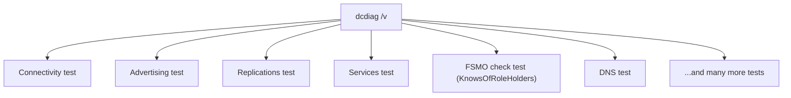

## Introduction

- **What You'll Learn From This Article**: `dcdiag /v` shows up in nearly every AD migration or DC build procedure. This article systematically explains what this tool actually verifies in the first place, what each of its major test items concretely checks, and how to look at the warnings and errors it produces and **distinguish "grounds for proceeding with the AD migration work" from "grounds for stopping and addressing the issue."**
- **Intended Audience**: This article is aimed at engineers who've run `dcdiag /v` but felt overwhelmed by the sheer number of test items and the length of the output — either brushing off warnings as "that's normal" or, conversely, panicking over every single warning.
- **Estimated Reading Time**: About 20 minutes

This article is part of the [Top 1% Series' full article guide](/en/sitemap), and the ninth article in the [Active Directory series](/en/sitemap#series-list). Together with `repadmin` and `net share`, covered in [Understanding DC Health Checks from a "Top 1%" Perspective](/en/articles/dc-health-check-guide), this is one of the primary tools for confirming DC health.

## Prerequisites

- **Event log**: The operational log recorded by various Windows services and applications. Some of `dcdiag`'s tests inspect the contents of this event log.
- **Services**: Background processes such as Netlogon and the KDC (Kerberos Key Distribution Center), needed for a machine to function as a DC.

## Getting the Big Picture

### What Does `dcdiag` Actually Test?

**`dcdiag` (Domain Controller Diagnostics) is a tool that runs, in one pass, a large number of independent tests required for a DC to function correctly, and reports each as PASS, FAIL, or a warning.** With the `/v` (verbose) option, it also outputs more detailed information about what grounds each test used to reach a PASS/FAIL judgment.

**The key point is that each of dcdiag's tests checks a separate, independent aspect.** A single test failing doesn't necessarily mean "the entire DC is completely down," and conversely, even if everything passes, other kinds of problems that `dcdiag` simply doesn't check for (such as the detailed replication failure counts confirmed by `repadmin`, mentioned earlier) may still exist. `dcdiag` isn't an all-powerful, single command — it's better positioned as **an efficient entry point for checking a large number of aspects at once.**

## Fundamentals, Explained Thoroughly

### Major Test Items and What They Mean

`dcdiag /v` runs dozens of different tests, but here's a breakdown of the items most frequently referenced in real-world AD migration and troubleshooting work.

| Test name | What it verifies | What a FAIL could indicate |
|---|---|---|
| **Connectivity** | DNS name resolution and network reachability to the target DC | The DC can't be reached at all, or there's an error in its DNS registration |
| **Advertising** | Whether that DC is correctly advertised as an "available DC" via DC locator functionality (the SRV records covered in [Reading DNS Zones and Records from a "Top 1%" Perspective](/en/articles/dns-zones-records-guide)) | Clients can't discover that DC |
| **NetLogons** | Whether the shares the Netlogon service needs (NETLOGON, SYSVOL) are accessible | A problem with SYSVOL replication, or an abnormality in the Netlogon service itself |
| **Replications** | Whether that DC's most recent replications have any failures | A summarized version of what `repadmin` checks — use `repadmin` for detailed isolation |
| **Services** | Whether required services for functioning as a DC — Netlogon, KDC, DNS, and so on — are started correctly | A specific service has stopped or terminated abnormally |
| **KnowsOfRoleHolders** | Whether that DC correctly recognizes the current holder of each of the five FSMO roles | Inconsistency in [FSMO](/en/articles/fsmo-guide) holder information |
| **MachineAccount** | Whether that DC's own computer account settings (such as its SPNs) are correct | A possible lingering inconsistency related to [a computer name change](/en/articles/ad-computername-netdom-guide) |
| **FrsEvent/DFSREvent** | Whether errors have been logged in the event log related to SYSVOL replication (legacy FRS or DFSR) | SYSVOL replication may be functioning now, but a record of a past error still remains |
| **DNS** | Whether the DNS records a DC needs (the SRV record set mentioned above, and so on) are correctly registered | A DNS registration gap, or a zone misconfiguration |

How exactly does the Connectivity test confirm "reachability"?

The `Connectivity` test isn't a single simple check — it runs four checks in sequence:

1. **DNS name resolution**: Can the target DC's hostname be correctly resolved via DNS?
2. **ICMP ping response**: Does a ping actually get through to the resolved IP address?
3. **LDAP bind**: Can you actually connect to (bind to) the target DC's AD DS over the LDAP protocol?
4. **RPC bind**: Can you connect to the AD DS RPC interface using the `DsBindWithCred` API?

Only once all four succeed does the `Connectivity` test pass. Regardless of whether the command prompt running `dcdiag /v` is on the target DC itself or a different machine, what's common across the board is that it's verifying **whether this entire chain of reachability — DNS resolution → ping → LDAP → RPC — holds, as seen from the machine running the command.** Note also that the `Connectivity` test is a prerequisite for every other test: for any target DC where it fails, none of the subsequent tests are run (running them wouldn't produce a meaningful result anyway).

### What the Extra Information Added by the `/v` Option Means

Running `dcdiag` without `/v` shows only a one-line PASS/FAIL for each test, like `passed test Connectivity`. With `/v`, **even for tests that passed, it outputs the detailed information underlying that judgment** (the content of records checked, response times, internal verification steps, and so on). This lets you confirm not just that a test "passed," but **what grounds it used to reach that PASS**, making it much harder to overlook a borderline state (barely passing, with no margin).

## The View From the Top 1% Perspective

### Grounds for Ignoring an Error or Warning, and Grounds for Not

Because `dcdiag /v` has so many items, in a real AD environment, **it's actually rarer for zero warnings to show up at all.** What matters here is taking the stance of **individually judging "grounds for ignoring" versus "grounds for not ignoring" from the following angles.**

- **Cases where ignoring is relatively likely to be safe**:
  - **Warnings tied to a transient or past event**: for example, an event log entry about a transient service delay during the boot sequence, caused by a recent reboot of that DC. **Always confirm when the event occurred and whether things have since returned to normal** — if it's a one-off event that has already resolved, the practical risk can be judged as low.
  - **Warnings caused by an intentional design choice**: for example, a warning on some reachability check caused by a firewall deliberately restricting specific traffic by design. If **you've confirmed the restriction is intentional and hasn't caused any actual operational impact**, it can be treated as an expected, environment-specific result.
- **Cases you should never ignore**:
  - **A FAIL on Replications, NetLogons, Services, or KnowsOfRoleHolders**: These tests concern a DC's core functionality itself — replication, authentication, and awareness of FSMO information. If any of these FAIL, **you shouldn't proceed with AD migration work (especially FSMO transfer or demoting a DC) until you've identified and resolved the cause.**
  - **A warning with an unidentified or unexplainable cause**: Don't dismiss it with "that's just normal" — it's important to **investigate until you can actually explain why that warning is occurring.** Proceeding to the next stage of work (FSMO transfer, demoting an old DC, and so on) while an unexplained warning lingers makes isolating the cause dramatically harder later on.

**The basic principle for judgment is to center it on whether that warning or error concerns a kind of test that directly affects the work you're about to perform (FSMO transfer, demoting a DC, and so on).** Being decisive here matters in practice — don't spend too much time on unrelated, minor warnings, but never defer a FAIL on a core test.

### When to Run `dcdiag`

In real AD migration work, it's recommended to run `dcdiag /v` at **at least several distinct points** and compare how the state changes.

1. **Before starting the migration work**: Establishes a baseline confirming the existing environment is healthy in the first place
2. **Right after adding a new DC**: Confirms there's no issue with the new DC itself, or with how existing DCs see it
3. **Right after an FSMO transfer**: Confirms that things like `KnowsOfRoleHolders` correctly recognize the new holder
4. **Right after demoting and removing the old DC**: Confirms no trace of the old DC remains, and that the remaining DCs stay in a healthy state

Saving the results at each stage, so you can **distinguish "warnings that existed before the migration" from "warnings newly caused by the migration work,"** makes a huge difference in how efficiently you can isolate causes. If you want to actually experience these four stages hands-on, see [Hands-On: Migrating From an Old DC to a New One](/en/articles/ad-migration-handson-guide), which also includes an exercise in deliberately triggering and reading a dcdiag warning.

## Common Misconceptions and Pitfalls

- **Misconception 1: "If even one warning or error shows up in dcdiag /v, there's a serious problem across the entire AD environment"**
  In a real AD environment, minor warnings are far from rare. Rather than just checking whether any warnings exist, you need to individually judge which test item each warning belongs to and what it means.
  

  
The risk of the shortsighted judgment "many warnings = unhealthy"

  Focusing solely on the number of warnings risks a genuinely serious FAIL (such as NetLogons or Replications) getting buried and overlooked amid a pile of minor warnings. What matters is individually evaluating the type of test each warning or FAIL belongs to and what it means, not the count.
  

- **Misconception 2: "If dcdiag passes everything, there's absolutely no problem in the AD environment"**
  `dcdiag` is ultimately a collection of representative tests, and there are aspects it doesn't fully cover on its own — such as the detailed replication failure counts that `repadmin` checks.
- **Misconception 3: "Running dcdiag once is enough — there's no need to repeat it before and after the work"**
  Only by comparing results at each stage of the migration can you isolate "a problem that already existed" from "a problem newly caused by the work." A single run doesn't allow for this comparison.

## The Troubleshooting Perspective

Troubleshooting with `dcdiag /v`'s results is best approached by **prioritizing based on whether a test concerns core functionality or something peripheral.**

1. **A FAIL on any of Replications, NetLogons, or Services**: Identify the cause as the top priority. Combine this with `repadmin` and `net share`, covered in [Understanding DC Health Checks from a "Top 1%" Perspective](/en/articles/dc-health-check-guide), to get a more detailed picture.
2. **A FAIL on KnowsOfRoleHolders**: This likely indicates an inconsistency in [FSMO](/en/articles/fsmo-guide) holder information — confirm the actual holder with `netdom query fsmo` as well.
3. **A warning on the DNS test**: Check whether the SRV records under `_msdcs`, covered in [Reading DNS Zones and Records from a "Top 1%" Perspective](/en/articles/dns-zones-records-guide), are correctly registered.
4. **An unexplained warning shows up consistently across multiple DCs**: Suspect a factor common to the entire environment — network configuration or DNS settings — rather than a problem specific to any individual DC.

### Preventive Measures and Permanent Fixes

- Always save the results of `dcdiag /v` at each stage of an AD migration (before migration, after adding a new DC, after FSMO transfer, after removing the old DC) so they can be compared.
- When a warning appears, always record when it started, whether it's reproducible, and whether it's caused by an intentional configuration — don't leave it unexplained.
- Share a review workflow within the team that prioritizes core tests (Replications, NetLogons, Services, KnowsOfRoleHolders) higher than other warnings.

## Summary

- `dcdiag` is a tool that runs, in one pass, a large number of independent tests required for a DC to function correctly, reporting PASS/FAIL — adding `/v` also shows the grounds behind each test's judgment.
- Tests like Connectivity, Advertising, NetLogons, Replications, Services, KnowsOfRoleHolders, and DNS each verify a different aspect, so when a FAIL appears, always check which test it belongs to.
- Whether a warning or error is safe to ignore hinges on whether it's caused by a transient or expected event, and whether it belongs to a core test (Replications, NetLogons, Services, KnowsOfRoleHolders).
- Running `dcdiag /v` repeatedly at multiple stages of an AD migration and comparing the results lets you isolate pre-existing problems from ones newly caused by the work.

**What to Keep in Mind From Today**
1. When looking at `dcdiag /v`'s results, first check which test item a warning belongs to, rather than counting how many warnings there are.
2. Build the habit of saving `dcdiag /v`'s results at each stage of an AD migration and comparing before and after.

## References

- [Dcdiag | Microsoft Learn](https://learn.microsoft.com/en-us/windows-server/administration/windows-commands/dcdiag)
- [Diagnosing Active Directory replication problems with dcdiag | Microsoft Learn](https://learn.microsoft.com/en-us/troubleshoot/windows-server/identity/useful-repadmin-commands)
- [Active Directory Replication Concepts | Microsoft Learn](https://learn.microsoft.com/en-us/windows-server/identity/ad-ds/get-started/replication/active-directory-replication-concepts)
