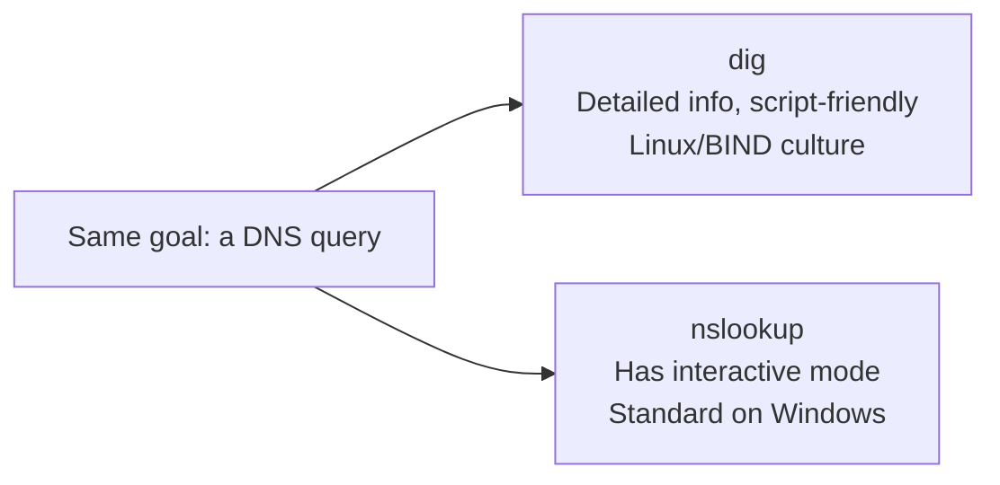

## Introduction

- **What You'll Learn From This Article**: You've used `dig` following the steps in articles like [A "Top 1%" Hands-On Lab: Building a DNS Server With BIND and Experiencing a Zone Transfer](/en/articles/dns-server-handson-guide) — this article gives you a systematic understanding of its basic usage and how to read its output. It also covers `nslookup`, the other representative DNS query command, and when to reach for which in real-world work.
- **Intended Audience**: Readers who've run `dig` or `nslookup` by following a hands-on article's steps, but can't explain what each item in the output means, or what the difference between the two commands actually is.
- **Estimated Reading Time**: About 15 minutes

This article is part of the [Top 1% Series Complete Article Guide](/en/sitemap), the 3rd article in the [DNS Fundamentals Series](/en/sitemap#series-list).

## The Big Picture

`dig` and `nslookup` are both commands with the same goal: querying the DNS record corresponding to a domain name. But they come from different backgrounds and excel at different things.



## A Thorough, Grounds-Up Explanation

### dig's Basic Usage and How to Read Its Output

The most basic way to use `dig` follows this format.

```bash
dig <the domain name to query> <record type>
```

```bash
dig example.com A
```

Run it for real, and the output splits into several sections like these:

- **HEADER**: A summary of whether the query succeeded (`status: NOERROR`) and how many answers came back (`ANSWER: 1`).
- **QUESTION SECTION**: Exactly what was queried, as-is.
- **ANSWER SECTION**: The actual record content returned. This lists the TTL, class (`IN`), record type, and value.
- **Query time / SERVER / WHEN**: How long the query took, which DNS server it was sent to, and when it ran.

Use `@` to explicitly specify which DNS server to query.

```bash
dig @8.8.8.8 example.com A
```

Omit `@`, and it queries whatever DNS server is configured as the machine's OS default (like `/etc/resolv.conf`). **When you want to verify whether a specific DNS server is functioning correctly, explicitly specifying it with `@` matters.** Forget to specify it, and you might unintentionally end up looking at the result from a different DNS server (the default resolver, say), mistaking what you're actually validating.

<details>
<summary>Using +short to make output more concise</summary>

`dig`'s output carries a lot of information, which gets verbose when a script just wants to pull out the result. Add the `+short` option, and it displays only the record's value, concisely.

```bash
dig example.com A +short
```

This comes in handy when an automation script just wants to capture an IP address value into a variable.

</details>

### nslookup's Basic Usage

`nslookup` similarly lets you query just by specifying a domain name.

```bash
nslookup example.com
```

`nslookup` has an interactive mode: run the command alone with no arguments, and a prompt appears, letting you run multiple queries in a row.

```bash
nslookup
> set type=MX
> example.com
> exit
```

`set type=<record type>` lets you specify which record type subsequent queries fetch.

### Choosing Between dig and nslookup in Real-World Work

**`nslookup`'s biggest strength is that it comes standard on Windows.** Even if you administer Linux servers, when you want to verify DNS behavior directly from a Windows PC on the client side, `nslookup` — usable with no extra installation — comes in handy. `dig`, on the other hand, **can display detailed information down to TTLs and various flags, and has a rich set of output-control options like `+short`**, so in Linux/BIND culture, `dig` tends to be preferred for deeper investigation and scripting. In real-world work, a common division is "a quick check from a Windows client uses `nslookup`; detailed investigation or scripting on a Linux server uses `dig`."

## What a Pro Sees Here (Top 1% Understanding)

### Why nslookup Is Often Mistakenly Thought of as "Deprecated"

You'll sometimes see wording along the lines of "using nslookup is not recommended" in `dig`'s man page and similar places. This traces back to a historical detail: `nslookup` internally used a query path of its own, different from the OS's standard name-resolution library (the resolver library). **Because of this difference, in very rare cases, `nslookup`'s result can diverge from the result an actual application's name resolution would produce** — that's the technical reason it's sometimes called not recommended. That said, for simple DNS record checks, this difference is almost never a real-world problem, and it remains widely used as a quick check command on Windows. The reality is closer to "dig is more accurate for certain purposes" than "don't ever use it because it's deprecated."

## Common Misconceptions and Pitfalls

- **Misconception 1: "dig and nslookup are functionally identical commands."**
  They share the same goal, but differ in output detail, supported options, and internal query path.
- **Misconception 2: "Running dig with just a domain name always queries the DNS server the machine is actually using."**
  Without explicitly specifying it with `@`, it refers to the OS's default configuration — for verification purposes, you should explicitly specify the target with `@`.
- **Misconception 3: "nslookup is an old, deprecated command that shouldn't be used anymore."**
  It's sometimes called not recommended because of its different internal query path, but for quick checks it's almost never a real-world problem, and it remains widely used thanks to being standard on Windows.

## Troubleshooting Perspective

1. **`dig`'s result differs from what you expected**: Check which DNS server you're querying via `@`, whether you might be looking at stale cached information, and check the TTL in the `ANSWER SECTION` too by dropping `+short`.
2. **Only queries to the internal DNS server fail**: Check whether a firewall is blocking UDP/TCP port 53, and isolate the issue by explicitly querying `@<internal DNS server's IP>`.
3. **`nslookup` and `dig` give different results**: First check whether both are actually querying the same DNS server (`nslookup` can also explicitly specify a server).

## Summary

- `dig` can display detailed information and supports script-friendly output via options like `+short`, making it the preferred command in Linux/BIND culture.
- `nslookup` has an interactive mode and comes standard on Windows, making it widely used for quick checks.
- Explicitly specifying the target DNS server with `@` matters for verification purposes.
- `nslookup`'s "not recommended" label comes from its different internal query path, and is almost never a real-world problem for quick-check purposes.

**Takeaways to Apply Today**
1. When you want to verify a specific DNS server's behavior, build the habit of explicitly specifying the target with `@`.
2. Choose based on the situation: `dig +short` for scripting, `nslookup` for a quick check on Windows.

## References

- [dig(1) - Linux manual page](https://linux.die.net/man/1/dig)
- [nslookup | Microsoft Learn](https://learn.microsoft.com/en-us/windows-server/administration/windows-commands/nslookup)
