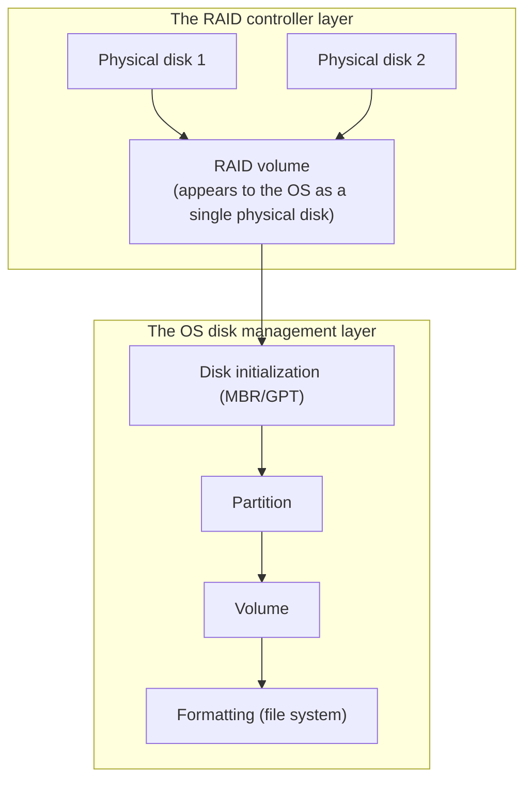

## Introduction

- **What You'll Learn From This Article**: Starting from a common practical question — "I built a RAID array before installing the OS, so why does the C drive work right away while the D drive needs a disk initialization step before I can use it?" — this article systematically organizes **what the RAID layer and the OS disk management layer each are responsible for.** It also dives into what terms that always come up in Disk Management — **disk initialization, MBR/GPT, volumes, and formatting** — concretely do.
- **Intended Audience**: This article is aimed at engineers who've worked with server disk management or RAID setup but who can't concretely explain the relationship between RAID and OS disk management, or what initialization and formatting actually do.
- **Estimated Reading Time**: About 19 minutes

This article is part of the [Top 1% Series' full article guide](/en/sitemap), and the first article in a new series on storage fundamentals.

## Prerequisites

- **Physical disk**: The actual storage device itself — a hard disk drive, an SSD, and so on.

## Getting the Big Picture

### RAID and OS Disk Management Are Completely Different Layers

**RAID (the controller) is an abstraction layer that bundles multiple physical disks together and makes them appear to the OS as "a single physical disk" (or fewer disks than the original count). OS disk management is a separate layer that manages the content of this "disk that appears as one" through yet another hierarchy: partitions, volumes, and file systems.** These are two completely independent layers — building a RAID array doesn't substitute for or eliminate the disk management work the OS still needs to do.

## Fundamentals, Explained Thoroughly

### Why the C Drive Works Right Away While the D Drive Needs Initialization

This happens because **the OS installer itself automatically completes partition creation, initialization, and formatting, as part of the install process, only for the disk you selected as the installation target** (usually the first disk, which becomes the C drive). **An additional RAID volume you didn't select as the installation target (such as a separately configured RAID array intended for the D drive), on the other hand, is never touched by the OS installer.** So by the time the OS install completes, the RAID volume meant to become the D drive is still in a **"raw state, physically recognized by the OS but with no partition information written at all."** Opening Disk Management (`diskmgmt.msc`) shows this uninitialized disk with an "Uninitialized" status, requiring a manual initialization step.

### What Disk Initialization Concretely Does

**Disk initialization is the operation of newly writing a partition table (MBR or GPT) to the beginning of that disk.** A partition table is, in effect, **the disk's table of contents (management information)**, recording "which range of this disk is used as which partition." A disk before initialization has no such table of contents at all, so while the OS can recognize that the disk exists, it can't determine "where and how to lay out data," and **the disk simply can't be used as-is.**

### The Difference Between MBR (Master Boot Record) and GPT (GUID Partition Table)

During initialization, you choose one of two partition table formats: **MBR** or **GPT.**

| | MBR (Master Boot Record) | GPT (GUID Partition Table) |
|---|---|---|
| When it appeared | The older scheme | A newer scheme premised on a UEFI environment |
| Where the partition table is stored | Only the disk's first 512 bytes (a single point of failure) | Multiple copies held in several locations (with a CRC32 checksum for redundancy and corruption detection) |
| Maximum partition count | Up to 4 primary partitions (effectively worked around with an extended partition) | Up to 128 |
| Maximum supported disk capacity | Up to 2TB | Effectively enormous (a theoretical limit in the billions of TB) |

**The reason MBR has a 2TB capacity ceiling is that it manages a partition's starting position and size using a 32-bit sector number.** For a typical disk with 512-byte sectors, `2^32 × 512 bytes = 2TB` is the maximum expressible with this 32-bit addressing. GPT, unconstrained by this limit, is today's standard choice for large-capacity disks.

Why MBR's partition table becomes a single point of failure

In MBR format, the partition table's information exists only in a single 512-byte location at the start of the disk. If this area is damaged by a physical bad sector or some write error, there's **a risk of losing all of that disk's partition information at once.** GPT is designed to address this risk by keeping copies of the partition table in multiple locations on the disk (such as at the beginning and the end).

### What Is a Volume? The Difference From a Partition

A **partition** refers to a physically demarcated region on the disk itself. A **volume** is **a logical unit the OS assigns a drive letter to and makes accessible via a file system**, on top of that partition (or, on a dynamic disk, on top of multiple partitions or multiple physical disks bundled together).

In many common configurations (basic disks), **a single partition is treated as a single volume as-is**, so there's rarely a chance to notice the distinction between the two. But with a **dynamic disk**, you can flexibly bundle multiple partitions (or multiple physical disks) into a single, large volume — in which case "partition" and "volume" don't map one-to-one, becoming clearly distinct concepts.

### What Formatting Concretely Does

**Formatting is the operation of newly writing the management data structures a file system (NTFS, ReFS, and so on) needs to manage data, onto a volume.** For NTFS, for example, this stage is where things like the **MFT (Master File Table — the central management data recording information about every file and folder on that volume)** get created. Only once these management data structures are in place does it become possible to store and manage data in units of "files" and "folders."

| Format type | Behavior |
|---|---|
| **Quick format** | Newly writes only the file system's management data structures, without scanning the existing data area itself (a bad-sector check). Completes quickly. |
| **Full (regular) format** | In addition to creating the management data structures, scans the entire disk to check for physical bad sectors. Takes a long time, proportional to disk capacity. |

## The View From the Top 1% Perspective

### Choosing Between Hardware RAID and the OS's Software RAID Functionality

Windows Server itself also offers **OS-level mirroring (equivalent to software RAID) via dynamic disk functionality**, but in practice, using a dedicated RAID controller (hardware RAID) is the common configuration. **Hardware RAID has the advantage that redundancy is already active from a stage before the OS even boots, and RAID-related computation (such as parity calculation) is offloaded to a dedicated processor, so it doesn't strain the OS/CPU side.** Software RAID, on the other hand, can be advantageous cost-wise, since it doesn't require additional dedicated hardware. Which layer to implement redundancy at is chosen based on requirements.

## Common Misconceptions and Pitfalls

- **Misconception 1: "Building a RAID array eliminates the need for OS-side disk management (initialization, formatting, and so on)"**
  RAID is purely an abstraction layer that makes multiple physical disks appear as one — the partition, volume, and file system management the OS performs on top of it is still needed, independent of whether RAID is used.
- **Misconception 2: "Partition and volume are just two names for the same thing"**
  In a basic disk configuration, they map one-to-one, so there's rarely a chance to distinguish them — but a partition is a physical region, and a volume is a logical unit the OS makes accessible — clearly distinct concepts.
- **Misconception 3: "Formatting is simply an operation that erases the disk's content"**
  Formatting is the operation of newly constructing the management data structures a file system needs to function. Erasing content is merely one byproduct of that process.

## The Troubleshooting Perspective

For disk-related issues, the basic approach is to **isolate whether the problem is at the RAID layer, or the OS disk management layer.**

1. **A newly added disk shows as "Uninitialized" and can't be used**: This isn't an abnormality — it's the normal state before initialization. Initialize it (choosing MBR/GPT) from Disk Management.
2. **A disk larger than 2TB was initialized, but only part of its capacity is usable**: You may have chosen the MBR format. You'll need to re-initialize it in GPT format (a backup beforehand is essential if data already exists).
3. **A RAID volume itself isn't recognized by the OS at all**: Check the RAID controller's own configuration and status. This is a problem occurring before the OS disk management layer even comes into play.

### Preventive Measures and Permanent Fixes

- Always choose GPT format at initialization time for any disk expected to exceed 2TB.
- When using hardware RAID, recognize that OS disk management is strictly an operation against the RAID volume as "a single disk" — keep checking the RAID controller's own settings/status distinctly separate from checking the OS-side disk management.

## Summary

- RAID is an abstraction layer making multiple physical disks appear as one; OS disk management is a separate layer managing partitions, volumes, and file systems on top of it — the two are completely independent.
- The OS installer only automatically completes partition creation and formatting for the installation target disk, so an additional RAID volume is left uninitialized, requiring manual initialization.
- Disk initialization is the operation of newly writing a partition table (MBR or GPT), and MBR has a 2TB capacity ceiling due to its 32-bit sector addressing.
- A partition is a physical region, and a volume is a logical unit the OS makes accessible; formatting is the operation of newly constructing a file system's management data structures.

**What to Keep in Mind From Today**
1. When a newly added disk shows as "Uninitialized," remember that this isn't an abnormality — it's the normal state before initialization.
2. Always choose GPT format when initializing a disk larger than 2TB.

## References

- [Windows and GPT FAQ | Microsoft Learn](https://learn.microsoft.com/en-us/windows-hardware/manufacture/desktop/windows-and-gpt-faq)
- [Basic and Dynamic Disks | Microsoft Learn](https://learn.microsoft.com/en-us/windows-server/storage/disk-management/basic-and-dynamic-disks)
- [NTFS Overview | Microsoft Learn](https://learn.microsoft.com/en-us/windows-server/storage/file-server/ntfs-overview)
