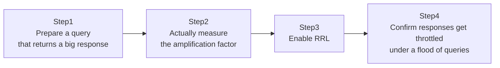

## Introduction

- **What You'll Learn From This Article**: Building on **DNS Amplification Attacks**, touched on in [Understanding DNS Server Fundamentals](/en/articles/dns-server-fundamentals-guide), you'll actually measure with `dig` just how much larger a response a small query can pull out. Then you'll enable BIND's **Response Rate Limiting** (RRL) defense feature, and watch it automatically throttle responses once a flood of queries arrives from the same source.
- **Intended Audience**: Readers who know the term "DNS amplification attack" but have never confirmed firsthand just how much amplification actually occurs, or how to defend against it. **This hands-on is for educational, defensive purposes — to strengthen the defenses of a test environment you manage yourself. Do not run these steps against someone else's production environment without authorization. Spoofing a source IP address is never covered in this hands-on.**
- **Estimated Reading Time**: About 30 minutes

This article is part of the [Top 1% Series Complete Article Guide](/en/sitemap).

## Prerequisite Knowledge

- **Authoritative Servers and Open Resolvers**: This assumes the risk of exposing recursion unprotected, covered in [Understanding DNS Server Fundamentals](/en/articles/dns-server-fundamentals-guide).

## The Big Picture



**This hands-on never covers the actual attack technique of spoofing a source IP address. You'll safely experience only the raw scale of DNS amplification itself, and the effect of the defense against it (RRL).**

## Hands-On Steps

### Step 1: Prepare a Query That Returns a Large Response

On the `lab.example.test` zone from [The Top 1% Hands-On Lab for Building a DNS Server With BIND](/en/articles/dns-server-handson-guide), deliberately add a large-sized TXT record.

```
big  IN  TXT  "AAAAAAAAAAAAAAAAAAAAAAAAAAAAAAAAAAAAAAAAAAAAAAAAAAAAAAAAAAAAAAAAAAAAAAAAAAAAAAAAAAAAAAAAAAAAAAAA...(repeat to around 400 characters)"
```

```bash
sudo named-checkzone lab.example.test /etc/bind/db.lab.example.test
sudo systemctl restart bind9
```

### Step 2: Compare the Query and Response Sizes and Measure the Amplification Factor

Run `dig` with `+stats` and compare the size of the query you actually sent against the response you received.

```bash
dig @<server's IP> big.lab.example.test TXT +stats
```

Compare the `MSG SIZE  rcvd` at the end of the output against the query's rough size (a few dozen bytes or so). **The query itself is a small UDP packet, a few dozen bytes, yet the response should reach several hundred bytes.** That's the **amplification factor** — only a few times in this example, but a real-world attack, abusing a record type with an even larger response (a DNSKEY record carrying a DNSSEC signature, say), can reach an amplification factor of dozens of times.

**Send this small query in bulk, with the source IP address spoofed to the target's IP address, and you can direct traffic many times the size of what you sent at the target — that's the real substance of a DNS amplification attack.** This hands-on never performs that spoofing itself.

### Step 3: Enable Response Rate Limiting (RRL)

Add the RRL configuration to `named.conf.options`.

```
options {
    rate-limit {
        responses-per-second 5;
        window 5;
    };
};
```

**`responses-per-second 5` means responding to the same source, for the same query pattern, no more than 5 times per second.** Anything beyond that gets deliberately throttled.

```bash
sudo named-checkconf
sudo systemctl restart bind9
```

### Step 4: Send a Flood of Queries and Confirm Responses Get Throttled

From your own machine (with no source spoofing), send the same query repeatedly in quick succession.

```bash
for i in $(seq 1 20); do dig @<server's IP> big.lab.example.test TXT +noall +stats; done
```

Check RRL's behavior in the logs, via `journalctl` or `rndc stats`.

```bash
sudo rndc stats
sudo tail -n 20 /var/cache/bind/named.stats
```

**You'll see a record of responses being processed as `Dropped` (discarded) or `Slipped` (a partially truncated response) once queries exceed the configured threshold (5 per second).** Even querying yourself, RRL mechanically throttles the rate purely by looking at the combination of source address and query content.

## What a Pro Sees Here (Top 1% Understanding)

### RRL Suppresses Harm by Reducing "Responses to the Attacker"

RRL's fundamental goal isn't **reducing the load on your own DNS server — it's reducing the actual volume of traffic your server ends up sending toward a third party (the spoofed target), as a launchpad for a DNS amplification attack.** Rather than blocking the attacker's queries outright, **capping the response frequency for the same query pattern to a fixed threshold** significantly suppresses the total amplified traffic volume the target receives, even if your server does end up abused as a launchpad.

### "Slip," a Mechanism Minimizing Impact on Legitimate Users

RRL offers a setting to fully `Drop` (discard) a response, and a setting to return only a partial response as a `Slip` (a truncated response nudging toward TCP). **If a legitimate user happens to send queries at a rate exceeding the threshold, fully discarding the response would break legitimate name resolution too.** `Slip` deliberately corrupts the UDP response, nudging the client toward "the UDP response wasn't valid, so retry over the more reliable TCP." **Since retrying over TCP (which requires a three-way handshake) is effectively impossible for an attacker spoofing their source, this design effectively suppresses attack traffic alone while minimizing the impact on legitimate users.**

## Common Misconceptions and Pitfalls

- **Misconception 1: "Enabling RRL completely prevents DNS amplification attacks."**
  RRL suppresses the harm your server causes if it gets abused as a launchpad — it doesn't eradicate the amplification technique itself.
- **Misconception 2: "RRL blocks queries entirely."**
  RRL never refuses to accept a query — it only limits the frequency of responses.
- **Misconception 3: "The amplification factor is the same for every record type."**
  A record type prone to a large response — a TXT record or a DNSKEY record, say — carries a higher amplification factor.

## Troubleshooting Perspective

1. **A legitimate user reports unstable name resolution**: Check whether RRL's threshold (`responses-per-second`) is too strict for legitimate usage patterns.
2. **RRL is enabled, but nothing shows up in the logs**: Check whether the `rate-limit` block in `named.conf.options` is loaded correctly, and check for syntax errors with `named-checkconf`.
3. **Wanting to investigate whether your own server has been abused as an amplification launchpad**: Check whether recursion or a record with a large response is unnecessarily exposed while reachable from outside.

## Summary

- DNS structurally has an amplification property — pulling a larger response out of a smaller query.
- A DNS amplification attack combines this property with spoofing the source IP address, directing amplified traffic at a target.
- Response Rate Limiting (RRL) suppresses the harm your server causes if abused as a launchpad, by capping how often it responds to the same query pattern.
- The partial-response-corruption mechanism, Slip, effectively suppresses attack traffic while minimizing impact on legitimate users.

**Takeaways to Apply Today**
1. For any DNS server exposed externally, consider enabling RRL.
2. Periodically check whether you're unnecessarily exposing recursion or large-response records externally.

## References

- [DNS Response Rate Limiting (DNS RRL) | ISC](https://kb.isc.org/docs/aa-00994)
- [Understanding DNS Amplification Attacks | CISA](https://www.cisa.gov/news-events/alerts/2013/03/29/dns-amplification-attacks)
