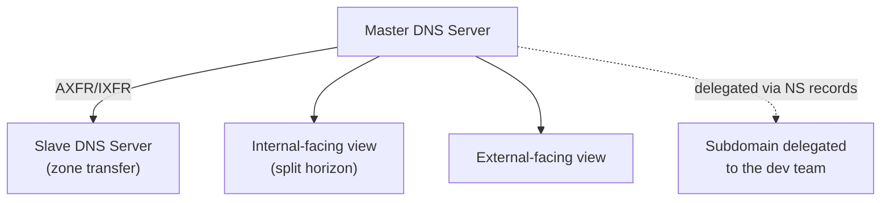

## Introduction

- **What You'll Learn From This Article**: This is the DNS Infrastructure Department's capstone project, where you'll **integrate, on your own, the techniques you've learned one at a time in earlier hands-on labs** (master/slave setups with zone transfers, split-horizon DNS, subdomain delegation, DNSSEC signing, response rate limiting against DNS amplification attacks) **into a single fictional company's DNS infrastructure.** Where earlier articles aimed at "following steps to reliably master one technique," this article takes a format much closer to real-world work: **presenting only requirements, and leaving you to design which techniques to combine, and how.**
- **Intended Audience**: Readers who've worked through the DNS Infrastructure Department's Junior, Senior, and Graduate School content and can execute each individual hands-on lab, but have never designed a single DNS infrastructure combining them.
- **Estimated Reading Time**: Expect several days to about a week, including design, building, and documentation (the heaviest single hands-on in this series).

This article is part of the [Top 1% Series Complete Article Guide](/en/sitemap). It's positioned as the capstone project within the [DNS Infrastructure Department's full curriculum](/en/university#dns-infrastructure-department).

## Prerequisite Knowledge

This hands-on doesn't teach any new technique. **You'll combine and use the techniques you've already mastered in the following completed hands-on labs.**

- [The Top 1% Hands-On for Building a DNS Server With BIND and Experiencing a Zone Transfer](/en/articles/dns-server-handson-guide)
- [Understanding How to Use dig and nslookup, and When to Use Which, From a Top 1% Perspective](/en/articles/dig-nslookup-guide)
- [Understanding How Split-Horizon DNS (BIND's Views) Works From a Top 1% Perspective](/en/articles/dns-split-horizon-guide)
- [The Top 1% Hands-On for Signing a Zone With DNSSEC in BIND and Reproducing a Validation Failure (SERVFAIL) Yourself](/en/articles/dns-dnssec-handson-guide)
- [The Top 1% Hands-On for Building Subdomain Delegation Yourself and Reproducing a Lame Delegation](/en/articles/dns-delegation-handson-guide)
- [The Top 1% Hands-On for Observing How a DNS Amplification Attack Works and Defending With Response Rate Limiting (RRL)](/en/articles/dns-amplification-rrl-handson-guide)

## The Assignment: a Fictional Company's DNS Infrastructure

**You're an infrastructure engineer at a fictional company, "KoiKoi Corp." The company is migrating its DNS infrastructure away from relying entirely on an external registrar, to an authoritative DNS server it manages itself. Your assignment is to build, on your own, a DNS infrastructure that satisfies all of the following requirements.**

### Requirement 1: Build an Authoritative DNS Setup With No Single Point of Failure

**A single master server is a single point of failure. Use a zone transfer to build at least one slave server.**

### Requirement 2: Return Different Answers for Internal and External Queries

**An internal application server needs to be reachable only from the internal network, via a private IP, while external users need to be directed to a different, public-facing IP. Build a mechanism that returns a different answer for the same domain name depending on where the query comes from.**

### Requirement 3: Delegate a Subdomain's Management to the Dev Team

**The dev team wants to be able to add and change records under a new subdomain independently. Also establish a procedure for verifying the delegation's configuration, so a delegation misconfiguration never produces a "Lame Delegation" state where queries fail to arrive.**

### Requirement 4: Cryptographically Guarantee the Legitimacy of DNS Answers

**In case of risks like cache poisoning producing a forged DNS answer, introduce a mechanism that lets a zone's answers be cryptographically verified as legitimate.** Also document an operational procedure that prevents a forgotten signature renewal from causing a validation failure (SERVFAIL).

### Requirement 5: Prevent Your Own DNS Server From Being Abused as an Attack Amplifier

**In case your authoritative DNS server is abused as a launchpad for a DNS amplification attack, introduce a mechanism that limits excessive responses.**

### Requirement 6: Leave a Reproducible Record of How You Verified Everything

**For every setting above, document the concrete steps you used to verify behavior, with tools like dig, in a form that anyone running it would reproduce the same result.**

## Deliverable Requirements: Assemble It as a Portfolio

**This hands-on's final deliverable isn't just a record of the answers you observed working.** Put together a repository, on GitHub or similar, containing:

- **README.md**: An overview of this scenario, and the full picture of the DNS infrastructure you adopted (including diagrams, such as Mermaid).
- **A record of your design decisions**: Why you chose that specific zone structure or view design — especially anywhere a delegation-versus-security trade-off came up.
- **The steps you actually took**: A record of the config file entries you used and the dig/nslookup commands you used to verify them.
- **A retrospective**: What challenges you discovered while doing this, and what you'd additionally consider in genuine real-world work (migrating to a managed DNS service, building a monitoring setup, and similar).

**This deliverable itself is a concrete accomplishment you can present in a job search or as a portfolio piece.** Being able to show "I designed a solution combining multiple techniques under the realistic constraints of mixed internal and external requirements, and can articulate the delegation-versus-security trade-offs" is far more persuasive than simply saying "I did the DNSSEC hands-on."

## What a Pro Sees Here (Top 1% Understanding)

### "Following Steps" and "Designing From Requirements" Are Entirely Different Skills

Every earlier hands-on in this series took the form of "Step 1, Step 2, ..." — following a fixed, predetermined sequence. **But what actually gets valued in real-world work isn't the ability to execute a procedure exactly as written — it's the ability to look at given requirements (Requirements 1 through 6 in this article) and design, yourself, which techniques to combine, and how.** These are similar-looking but entirely different skills. Completing every individual hands-on doesn't make you immediately effective in real work if you've never designed one coherent DNS infrastructure combining them. This capstone project is deliberately designed to bridge exactly that gap.

### Why a "Mixed Internal/External Plus Delegation" Setting?

There's a reason this hands-on deliberately models a realistic project involving multiple stakeholders — different answers for internal and external queries, delegation to another team — instead of a single-shot technical demo. **Most real-world DNS infrastructure never wraps up with a single purpose — it needs to simultaneously satisfy multiple axes: availability, convenience, and security.** Knowing how to set up a zone transfer alone doesn't help in a real project if you can't also see ahead to split-horizon design, delegation management, and security hardening. The ultimate goal of this capstone is elevating your knowledge of individual techniques into **the design ability to see multiple stakeholders at once.**

## Common Misconceptions and Pitfalls

- **Misconception 1: "This hands-on has one fixed, correct zone structure."**
  There's no single correct answer here. Multiple valid approaches exist as long as they satisfy the requirements. Recording the design you chose, and why, in README.md is what matters.
- **Misconception 2: "The output of a dig command is sufficient as a deliverable."**
  Verification output matters, but it's not enough on its own. Being able to articulate the reasoning behind your design decisions is this hands-on's real value.
- **Misconception 3: "Having completed every individual hands-on means this one will go quickly too."**
  There's a real gap between knowing individual techniques and integrating them into one coherent design. Expect this to take considerable time.

## Troubleshooting Perspective

This hands-on's main challenge isn't individual technical troubleshooting — it's **design rework.**

1. **You thought you satisfied the requirements, but notice a contradiction later**: Before starting implementation, write out only the design section of README.md first, and confirm on paper that all six requirements are genuinely satisfied.
2. **You've forgotten the steps for an individual hands-on**: Don't hesitate to go back and re-read the prerequisite article for that requirement. This capstone tests design ability, not memorization.
3. **You're not sure how thorough to make this**: Use "could I show this README.md to an interviewer I've never met and explain my design decisions" as your bar for completeness.

## Summary

- This capstone project is an integrative exercise combining the techniques you've learned individually in the DNS Infrastructure Department, into a single fictional company's DNS infrastructure.
- What's being tested is the ability to design from requirements yourself, not the ability to follow a procedure.
- Assemble your deliverable as a portfolio piece — a document articulating the reasoning behind your design decisions, not just verification output.

**Takeaways to Apply Today**
1. Even while learning individual hands-on labs, build the habit of asking "under what future requirements would I actually use this?"
2. Beyond the technical deliverable itself, build the habit of articulating delegation-versus-security trade-offs in your day-to-day work too.

## References

- [The DNS Infrastructure Department's Full Curriculum](/en/university#dns-infrastructure-department)
