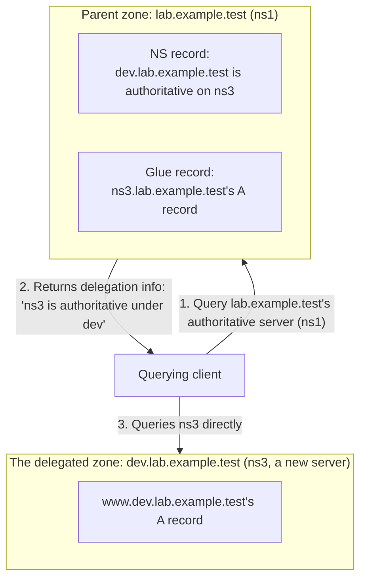

## Introduction

- **What You'll Learn From This Article**: Building on the FAQ note in [The Top 1% Hands-On Lab for Building a DNS Server With BIND](/en/articles/dns-server-handson-guide) — that a domain and a zone are different concepts, and part of one domain can be **delegated** to a different DNS server — you'll actually build this by adding a second authoritative server. You'll understand why the parent zone's NS record and a **glue record** are both needed, by reproducing a classic failure, **Lame Delegation**.
- **Intended Audience**: Readers who've already finished [The Top 1% Hands-On Lab for Building a DNS Server With BIND](/en/articles/dns-server-handson-guide) and are comfortable building and operating a single zone, but have never set up delegating a subdomain to a different server.
- **Estimated Reading Time**: About 40 minutes

This article is part of the [Top 1% Series Complete Article Guide](/en/sitemap).

## Prerequisite Knowledge

- **Zone Files and NS Records**: This assumes [Understanding DNS Server Fundamentals](/en/articles/dns-server-fundamentals-guide).
- **Building a Zone in BIND**: This assumes the `ns1` (master) environment with the `lab.example.test` zone built in [The Top 1% Hands-On Lab for Building a DNS Server With BIND](/en/articles/dns-server-handson-guide).

## The Big Picture



## Hands-On Steps

### Step 1: Build the Delegated Zone on a Third Server (ns3)

Install BIND on a third Ubuntu server, and create a new, independent zone, `dev.lab.example.test`.

```bash
sudo apt update && sudo apt install -y bind9 bind9utils dnsutils
```

```
# /etc/bind/named.conf.local (ns3)
zone "dev.lab.example.test" {
    type master;
    file "/etc/bind/db.dev.lab.example.test";
};
```

```
# /etc/bind/db.dev.lab.example.test (ns3)
$TTL 86400
@   IN  SOA   ns3.dev.lab.example.test. admin.dev.lab.example.test. (
                2026093001
                3600
                900
                604800
                86400 )
@       IN  NS      ns3.dev.lab.example.test.
ns3     IN  A       <ns3's own IP address>
www     IN  A       10.0.30.100
```

```bash
sudo named-checkzone dev.lab.example.test /etc/bind/db.dev.lab.example.test
sudo systemctl restart bind9
```

**At this point, `dev.lab.example.test` exists as a self-contained, independent zone inside ns3, but the parent, lab.example.test, doesn't reference it at all yet.**

### Step 2: Add Delegation Info (NS Record + Glue Record) to the Parent Zone (ns1)

On `ns1`'s `db.lab.example.test`, add the information delegating the subordinate zone `dev` to `ns3`.

```
# add to /etc/bind/db.lab.example.test (ns1)
dev     IN  NS      ns3.dev.lab.example.test.
ns3.dev IN  A       <ns3's own IP address>
```

**The first line's NS record is the delegation itself; the second line's A record for `ns3.dev` is what's called the `glue record`.** Bump the serial number and apply it.

```bash
sudo named-checkzone lab.example.test /etc/bind/db.lab.example.test
sudo systemctl restart bind9
```

Confirm the delegation is working correctly with `dig`.

```bash
dig @<ns1's IP> www.dev.lab.example.test A
```

If the `ANSWER SECTION` returns `10.0.30.100`, it worked. See exactly what's happening underneath with the `+trace` option.

```bash
dig +trace www.dev.lab.example.test A @<ns1's IP>
```

**The `AUTHORITY SECTION` shows `ns3.dev.lab.example.test` as the NS record for `dev.lab.example.test`, and you can see the query moving there.**

### Step 3: Deliberately Break the Glue Record and Reproduce Lame Delegation

This is the heart of this hands-on. On `ns1`, deliberately rewrite `ns3.dev`'s A record to a nonexistent IP address.

```
dev     IN  NS      ns3.dev.lab.example.test.
ns3.dev IN  A       192.0.2.99
```

```bash
sudo named-checkzone lab.example.test /etc/bind/db.lab.example.test
sudo systemctl restart bind9
```

Query `www.dev.lab.example.test` again.

```bash
dig www.dev.lab.example.test A
```

**The query actually gets sent to the nonexistent `192.0.2.99`, gets no response, and times out or returns SERVFAIL.** This state is called **Lame Delegation** — a broken delegation where the delegated server never actually responds. Confirm that restoring the glue record to the correct IP address makes it resolve normally again.

## What a Pro Sees Here (Top 1% Understanding)

### Why the "Dual Management" of a Glue Record Is Necessary

At first glance, since the NS record alone already tells you the delegated server's name, deliberately keeping its IP address in the parent zone too, as a glue record, looks like wasteful duplicate management. **But resolving the name `ns3.dev.lab.example.test` would ordinarily require querying the `dev.lab.example.test` zone itself — and that zone's own authoritative server is `ns3.dev.lab.example.test` itself, creating a circular dependency.** A glue record is a deliberate mechanism to break that cycle, by **letting the parent zone itself answer the delegated server's IP address directly, ahead of time.** When the delegated server's name is contained within the very zone being delegated (so-called "in-bailiwick delegation"), a glue record becomes structurally mandatory.

### Why Lame Delegation Is Genuinely Annoying in Practice

The Lame Delegation reproduced in Step 3 has a property that makes root-causing it hard: **it's caused by a misconfiguration on the parent zone's side, yet the symptom shows up as a name-resolution failure on the child zone's side.** No matter how carefully whoever manages the child zone reviews their own zone file, they'll never find the cause. **Suspecting this failure calls for asking the parent zone's administrator to check the NS record and glue record** — an investigative perspective that crosses organizational boundaries. Even on real internet domains, Lame Delegation from a stale name-server IP address registered at the registrar (equivalent to a glue record) is a frequent, genuine real-world headache.

## Common Misconceptions and Pitfalls

- **Misconception 1: "Delegation is complete just by adding one NS record."**
  When the delegated server's name is contained within the zone being delegated, a glue record (the delegated server's A record) is also needed on the parent zone's side, not just the NS record.
- **Misconception 2: "Lame Delegation is caused by a misconfiguration in the child zone."**
  Most Lame Delegation cases come from an error in the parent zone's NS record or glue record — the child zone's own configuration is usually correct.
- **Misconception 3: "A glue record is always needed for every delegation."**
  When the delegated server's name lies outside the zone being delegated (delegating to a DNS server managed by a different domain, say), no circular dependency exists, so a glue record isn't needed.

## Troubleshooting Perspective

1. **Only a subdomain's name resolution fails**: Check whether the parent zone's NS record and glue record match the delegated server's actual IP address.
2. **`dig +trace` stops partway through the delegation chain**: Check which layer is timing out, and ask that layer's administrator to check the delegation info.
3. **Changed the delegated zone, but it's not reflected**: The parent zone's glue record is independent of the delegated zone's own A record, so if the delegated server's IP address itself changes, don't forget to also update the parent zone's glue record.

## Summary

- Delegation is a mechanism for having a different authoritative server manage part of one zone, declared via an NS record.
- When the delegated server's name is contained within the zone being delegated, a glue record is needed on the parent zone's side, to break the circular dependency.
- A wrong glue record produces Lame Delegation, a failure where the delegated server never responds.
- Lame Delegation is usually caused by a misconfiguration on the parent zone's side, so reviewing the child zone's own configuration never reveals the cause.

**Takeaways to Apply Today**
1. In a setup where the delegated server's name is contained within the delegated zone, always double-check the glue record.
2. When only a subdomain's name resolution fails, suspect the parent zone's delegation info.

## References

- [BIND 9 Administrator Reference Manual: Zones](https://bind9.readthedocs.io/en/latest/chapter3.html)
- [RFC 1034: Domain Names - Concepts and Facilities](https://datatracker.ietf.org/doc/html/rfc1034)
