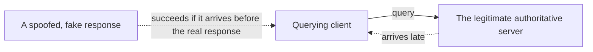

## Introduction

- **What You'll Learn From This Article**: Building on the zone files and record structure covered in [Understanding DNS Server Fundamentals From a "Top 1%" Perspective](/en/articles/dns-server-fundamentals-guide), this article gives you a systematic understanding of a structural weakness in the DNS response itself, and how **DNSSEC** (DNS Security Extensions) compensates for it using digital signatures.
- **Intended Audience**: Readers who understand how DNS name resolution works but have only heard the term "DNSSEC" in passing, without being able to explain specifically what it proves.
- **Estimated Reading Time**: About 16 minutes

This article is part of the [Top 1% Series Complete Article Guide](/en/sitemap), the 4th article in the [DNS Server Fundamentals Series](/en/sitemap#series-list).

## Prerequisite Knowledge

- **Authoritative Servers and Zone Files**: This assumes the zone file and resource record structure covered in [Understanding DNS Server Fundamentals](/en/articles/dns-server-fundamentals-guide).
- **Public-Key Cryptography (Digital Signatures)**: A signature created with a private key can be verified with the matching public key, proving the data was created by whoever holds that private key.

## The Big Picture

### DNS Was Never Given a Way to Prove Where a Response Came From

DNS is built on top of UDP, a connectionless protocol. **The DNS protocol itself has no way to tell whether a response arriving in answer to a client's query genuinely came from the legitimate authoritative server, or is a fake response injected by a third party impersonating that server.** An attack exploiting this weakness — delivering a fake response to the client before the real one arrives, getting the wrong (attacker-favorable) IP address cached — is DNS cache poisoning.

## A Thorough, Grounds-Up Explanation

### The Problem DNSSEC Solves: Proving "This Hasn't Been Tampered With"

**DNSSEC is a mechanism for attaching a digital signature to the DNS response itself.** An authoritative server creates a signature, in advance, using a private key, over the records in the zone it manages. A client receiving the response — or more precisely, the recursive resolver performing validation — verifies that signature using the matching public key. **A successful verification proves that record was issued by the legitimate authoritative server and hasn't been tampered with along the way.**

### The Three Main Record Types DNSSEC Is Built From

| Record | Role |
|---|---|
| **RRSIG** (Resource Record Signature) | The digital signature itself, over an individual resource record (an A record, an MX record, etc.). |
| **DNSKEY** | Holds the public key used to verify signatures for that zone. |
| **DS** (Delegation Signer) | Registered in the parent zone, this is a hash of the child zone's DNSKEY. It bridges trust from parent to child. |

### The Chain of Trust: Why It Has to Trace Back to the Root Zone

How do you prove the DNSKEY's public key itself is genuine? **DNSSEC solves this by having each parent zone vouch for its child zone's public key, following DNS's own hierarchy — root, then TLD, then domain.** Verifying that the DS record registered in the parent zone matches a hash of the child zone's DNSKEY confirms "this child zone's public key is vouched for by the parent zone." Repeat this check, tracing up one layer at a time, all the way to the **root zone** — the anchor of trust — and the final chain of trust is established.

## What a Pro Sees Here (Top 1% Understanding)

### DNSSEC Prevents "Tampering and Spoofing," Not "Eavesdropping"

The single most common misconception about DNSSEC is that "enabling DNSSEC encrypts DNS traffic." **What DNSSEC actually provides is integrity (proof of no tampering) and authenticity (proof of a legitimate origin) — not confidentiality (encryption).** If you want to encrypt the traffic itself, you need a separate mechanism, DNS over HTTPS (DoH) or DNS over TLS (DoT). It's important to understand that DNSSEC and encryption (DoH/DoT) are **independent mechanisms serving entirely different purposes.**

### A Single Break Anywhere in the Chain of Trust Fails the Entire Validation

The chain-of-trust design, flipped around, also means something fragile: **get the DS record registration wrong at even one parent zone along the way, and validation fails for every layer beneath it.** In practice, forgetting to update the DS record at the parent zone when rotating (periodically renewing) the keys for a DNSSEC-enabled domain leads to a serious outage where, from some point after the switch, the entire domain suddenly becomes unresolvable. In DNSSEC operations, the **timing of syncing with the parent zone** matters more than the key-rotation procedure itself.

## Common Misconceptions and Pitfalls

- **Misconception 1: "Enabling DNSSEC encrypts DNS traffic."**
  DNSSEC provides proof of integrity and authenticity; encryption (confidentiality) is handled by a separate mechanism (DoH/DoT).
- **Misconception 2: "DNSSEC works as soon as you sign the zone file."**
  Validation never succeeds unless the DS record is registered at the parent zone, connecting the chain of trust all the way to the root.
- **Misconception 3: "DNSSEC makes DNS cache poisoning completely impossible."**
  DNSSEC lets a fake response get rejected through validation — it doesn't physically prevent the attack itself. Going through a resolver that doesn't perform validation (isn't DNSSEC-aware) still leaves the risk in place.

## Troubleshooting Perspective

1. **A DNSSEC-enabled domain suddenly became unresolvable at some point**: Check whether the DS record registered at the parent zone matches the zone's current DNSKEY. A classic cause is forgetting to update the DS record after a key rotation.
2. **Checking a DNSSEC validation result**: Run `dig +dnssec <domain name>` and check whether the response has the `ad` (Authenticated Data) flag set.
3. **Name resolution fails only through some resolvers**: Check whether that resolver has DNSSEC validation enabled, and whether it can correctly trace the chain of trust from the root zone.

## Summary

- A DNS response was never given a way to prove where it came from, and that's exactly what makes DNS cache poisoning possible.
- DNSSEC proves a response's integrity and authenticity through three record types — RRSIG, DNSKEY, and DS — combined with digital signatures.
- The chain of trust establishes final trust by tracing back, one layer at a time, to the root zone.
- DNSSEC doesn't provide encryption (confidentiality) — it's an independent mechanism from DoH/DoT, serving a different purpose.

**Takeaways to Apply Today**
1. Treat DNSSEC and encryption (DoH/DoT) as independent mechanisms serving different purposes.
2. When rotating DNSSEC keys, don't forget to update the DS record at the parent zone.

## References

- [DNSSEC: DNS Security Extensions | ICANN](https://www.icann.org/resources/pages/dnssec-what-is-it-why-important-2019-03-05-en)
- [RFC 4033: DNS Security Introduction and Requirements](https://datatracker.ietf.org/doc/html/rfc4033)
