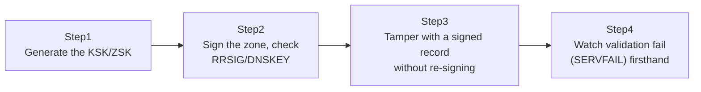

## Introduction

- **What You'll Learn From This Article**: This verifies the RRSIG, DNSKEY, and DS records, and the chain of trust, covered in [Understanding How DNSSEC Works](/en/articles/dns-dnssec-fundamentals-guide) by actually generating keys and signing the `lab.example.test` zone you built in [The Top 1% Hands-On Lab for Building a DNS Server With BIND](/en/articles/dns-server-handson-guide). You'll also deliberately edit a signed record without re-signing it, and watch firsthand as a resolver with validation enabled rejects the response (returns `SERVFAIL`).
- **Intended Audience**: Readers who've already finished [The Top 1% Hands-On Lab for Building a DNS Server With BIND](/en/articles/dns-server-handson-guide) and read [Understanding How DNSSEC Works](/en/articles/dns-dnssec-fundamentals-guide).
- **Estimated Reading Time**: About 50 minutes

This article is part of the [Top 1% Series Complete Article Guide](/en/sitemap).

## Prerequisite Knowledge

- **RRSIG, DNSKEY, DS, and the Chain of Trust**: This assumes [Understanding How DNSSEC Works](/en/articles/dns-dnssec-fundamentals-guide).
- **Building a Zone in BIND**: This assumes the master server environment with a `lab.example.test` zone built in [The Top 1% Hands-On Lab for Building a DNS Server With BIND](/en/articles/dns-server-handson-guide).

## The Big Picture



**For a real internet domain, you'd need to register a DS record with the parent zone (the registrar) to connect the chain of trust to the root. To keep this hands-on self-contained inside the test environment, you'll instead register the DNSKEY directly as a trusted anchor on the validating recursive resolver, using a setting called `trust-anchors`, in place of a DS record.**

## Hands-On Steps

### Step 1: Generate the Keys (KSK/ZSK)

On the master server, install the DNSSEC tooling and generate the keys.

```bash
sudo apt install -y bind9-dnsutils
cd /etc/bind
sudo dnssec-keygen -a ECDSAP256SHA256 -f KSK lab.example.test
sudo dnssec-keygen -a ECDSAP256SHA256 lab.example.test
```

**The first one, with `-f KSK`, is the Key Signing Key (KSK); the second, without it, is the Zone Signing Key (ZSK).** They have distinct roles: the KSK signs the DNSKEY record itself, while the ZSK signs individual resource records (A, MX, and so on). Each generates two files, `K lab.example.test.+013+xxxxx.key` and `.private`.

### Step 2: Sign the Zone and Check the RRSIG/DNSKEY Records

Load the generated keys into the zone file via INCLUDE.

```bash
sudo nano /etc/bind/db.lab.example.test
```

```
$INCLUDE /etc/bind/K lab.example.test.+013+xxxxx.key
$INCLUDE /etc/bind/K lab.example.test.+013+yyyyy.key
```

Bump the serial number, then actually sign it with `dnssec-signzone`.

```bash
sudo dnssec-signzone -A -3 $(head -c 16 /dev/urandom | xxd -p) -N INCREMENT -o lab.example.test -t db.lab.example.test
```

This command produces a new, signed zone file, `db.lab.example.test.signed`. Switch `named.conf.local`'s `file` to this signed file.

```
zone "lab.example.test" {
    type master;
    file "/etc/bind/db.lab.example.test.signed";
    allow-transfer { <slave server's IP address>; };
};
```

```bash
sudo systemctl restart bind9
```

Confirm with `dig` that the signature was actually applied.

```bash
dig @localhost www.lab.example.test A +dnssec
```

If the `ANSWER SECTION` shows a **RRSIG record** alongside the A record, the signing succeeded. You can check the DNSKEY record the same way.

```bash
dig @localhost lab.example.test DNSKEY +dnssec
```

### Step 3: Build a Validating Resolver and Configure trust-anchors

On another Ubuntu server, build BIND as a validating recursive resolver.

```bash
sudo apt install -y bind9
```

Register the ZSK's public key content, checked on the master, directly as a trusted anchor in the resolver's `named.conf.options`.

```
trust-anchors {
    lab.example.test initial-key 257 3 13 "<the DNSKEY record's public key string>";
};

options {
    recursion yes;
    dnssec-validation yes;
    forwarders { <the master server's IP address>; };
};
```

Restart, and query through this resolver.

```bash
sudo systemctl restart bind9
dig @localhost www.lab.example.test A +dnssec
```

If the response has the **`ad` (Authenticated Data) flag** set, the resolver succeeded at DNSSEC validation, confirming "this data is genuine."

### Step 4: Tamper With a Signed Record and Confirm Validation Failure (SERVFAIL)

This is the heart of this hands-on. On the master, **edit the signed zone file (the `.signed` file) directly, changing only the `www` IP address.** This is something you'd never do in normal operations, but you're doing it deliberately here to feel the effect of validation.

```bash
sudo nano /etc/bind/db.lab.example.test.signed
```

```
www     IN  A       10.0.20.250
```

Restart BIND without re-signing.

```bash
sudo systemctl restart bind9
```

A query directly to the master itself, which doesn't perform validation (isn't DNSSEC-aware), returns this tampered value as-is.

```bash
dig @<master's IP> www.lab.example.test A   # returns the tampered value as-is
```

**But send the same query to the validating resolver you built in Step 3, and the result is completely different.**

```bash
dig @<resolver's IP> www.lab.example.test A   # status: SERVFAIL
```

The `status` shows `SERVFAIL`, and **the tampered value never reaches the client at all.** The resolver detects that no correct RRSIG signature exists for the rewritten A record (it was never re-signed), judges "this data can't be trusted," and deliberately rejects the response.

## What a Pro Sees Here (Top 1% Understanding)

### The "Rejection" Itself Is DNSSEC Working Correctly

The `SERVFAIL` result seen in Step 4 **looks, at first glance, like a DNS server failure — but it's actually proof that DNSSEC is working exactly as designed.** The design philosophy on display here is that failing name resolution outright is still safer than delivering tampered data to the client. When troubleshooting a DNSSEC-enabled domain in real work, seeing a `SERVFAIL` result calls for first separating "is something genuinely broken" from "is this a deliberate rejection, correctly detecting some tampering or inconsistency."

### Why Separate the KSK and ZSK: Isolating Keys With Different Rotation Frequencies by Role

Here's the reason two distinct key types (KSK/ZSK) got generated back in Step 1. **The ZSK signs individual records, so it's expected to be rotated on a relatively short cycle, matched to how often the zone gets updated.** The KSK, on the other hand, **is tied to the more cumbersome work of registering a DS record with the parent zone, so it gets rotated far less often than the ZSK.** If only one type of key existed, every routine ZSK rotation would also require updating the parent zone's DS record every time, sending operational overhead through the roof. Splitting into two keys with distinct roles lets you **manage what changes frequently and what rarely changes independently.**

## Common Misconceptions and Pitfalls

- **Misconception 1: "Running dnssec-signzone once automatically keeps up with every future zone file change."**
  Every time you change the zone file's content, you need to run `dnssec-signzone` again to re-sign it.
- **Misconception 2: "SERVFAIL always means a DNS server failure or misconfiguration."**
  In a DNSSEC validation environment, it can be a deliberate rejection resulting from detected tampering or inconsistency.
- **Misconception 3: "The KSK and ZSK should both be rotated at the same frequency."**
  Standard practice is rotating the ZSK on a relatively short cycle and the KSK on a longer cycle, since it requires syncing with the parent zone.

## Troubleshooting Perspective

1. **SERVFAIL comes back after signing (even without any tampering)**: Check whether the signed zone file is current, and whether the serial number or the signature's validity period has expired. `dnssec-signzone` sets an expiration on signatures, so going too long without re-signing makes even genuine, untampered data fail validation.
2. **Validation doesn't activate even after configuring trust-anchors**: Check whether `dnssec-validation yes;` is set, and whether the registered public key string is accurate.
3. **A direct query to the master and a query through the resolver give different results**: This isn't a bug — it's correct behavior, since the master itself never performs validation, and only the resolver's side reflects the validation result.

## Summary

- `dnssec-keygen` generates the KSK/ZSK, and `dnssec-signzone` signs the zone, automatically adding RRSIG/DNSKEY records.
- A resolver with validation enabled shows successful validation by setting the `ad` flag on `dig`'s response.
- Tampering with a signed record without re-signing it makes a validating resolver return `SERVFAIL`, rejecting the response.
- The KSK and ZSK are deliberately provided as two separate keys, to isolate roles with different update frequencies.

**Takeaways to Apply Today**
1. Whenever you change a zone file, don't forget to re-sign it with `dnssec-signzone`.
2. When you hit `SERVFAIL` on a DNSSEC-enabled domain, first consider the possibility of a deliberate validation rejection rather than a failure.

## References

- [BIND 9 Administrator Reference Manual: DNSSEC](https://bind9.readthedocs.io/en/latest/chapter4.html)
- [dnssec-signzone(8) | BIND 9 Documentation](https://bind9.readthedocs.io/en/latest/manpages.html#dnssec-signzone-dnssec-sign-a-zone)
