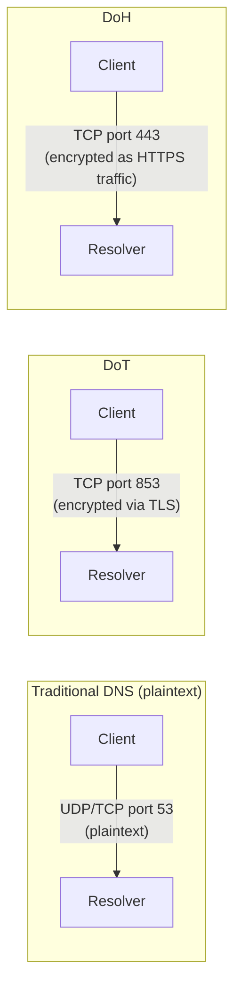

## Introduction

- **What You'll Learn From This Article**: Understand **DoH (DNS over HTTPS)** and **DoT (DNS over TLS)** — mechanisms that encrypt DNS communication itself, protecting **something entirely different** from what [DNSSEC Fundamentals](/en/articles/dns-dnssec-fundamentals-guide) covered, guaranteeing a DNS response hasn't been tampered with. Building on that, you'll learn the real-world problem where internal name resolution, built with [split-horizon DNS](/en/articles/dns-split-horizon-guide), ends up unintentionally bypassed by a browser's default DoH usage, and the fix via a **canary domain**.
- **Intended Audience**: Readers who understand DNSSEC, but assume "enabling DNSSEC also encrypts DNS communication's content," or readers who've heard the terms DoH and DoT, but can't explain exactly what problem they solve.
- **Estimated Reading Time**: About 18 minutes

This article is part of the [Top 1% Series Complete Article Guide](/en/sitemap), and article 6.1 in the [DNS Server Fundamentals Series](/en/sitemap#series-list).

## Prerequisite Knowledge

- [DNSSEC Fundamentals](/en/articles/dns-dnssec-fundamentals-guide): The mechanism of attaching a digital signature to a DNS response and verifying its authenticity is a prerequisite.
- [Split-Horizon DNS](/en/articles/dns-split-horizon-guide): The mechanism of returning a different response depending on who's asking, via BIND's views, is a prerequisite.

## Getting the Big Picture

An ordinary DNS query (over UDP/TCP port 53) travels across the network **as plaintext.** This means **anyone on the path (a public Wi-Fi operator, an ISP, or any other intermediary) can observe which domain names are being queried, or even rewrite the response itself.** DoH and DoT solve this problem by encrypting the communication path itself.



**DoT wraps the DNS protocol itself inside a TLS tunnel, over a dedicated port (853).** **DoH converts a DNS query into the form of an HTTPS request, sending it over the same port 443 as ordinary web traffic.**

## Deep Dive Into the Fundamentals

### DNSSEC and DoH/DoT Protect Entirely Different Things

**This is the single most misunderstood, decisive point.** DNSSEC, covered in [DNSSEC Fundamentals](/en/articles/dns-dnssec-fundamentals-guide), is a mechanism guaranteeing **the data's own authenticity** — "was this response genuinely issued by the legitimate authoritative DNS server, and was it never tampered with along the way." Even a DNSSEC-verified response still travels **over a plaintext communication path.** DoH and DoT, on the other hand, are mechanisms guaranteeing **the communication path's confidentiality** — "never let anyone along the way observe this communication's content."

| | DNSSEC | DoH / DoT |
|---|---|---|
| What it protects | The data's authenticity (detecting tampering/spoofing) | The communication path's confidentiality (preventing eavesdropping) |
| Does it encrypt? | No (a digital signature only) | Yes (encrypted via TLS/HTTPS) |
| Scope of the guarantee | End to end, from the authoritative DNS server to the verifier | Only between the client and the one resolver it's using |

**Concluding "DNS communication is safe because DNSSEC is enabled" isn't accurate.** DNSSEC can detect tampering and spoofing, but **it does nothing to prevent someone along the path from observing which domain name is being looked up by whom.** These two are independent mechanisms, and **only combining both achieves complete protection.**

<details>
<summary>Why DoH/DoT's Protection Scope Is "Only Between the Client and One Resolver"</summary>

**What DoH/DoT encrypts is only the first hop: the client sending a query to the resolver it's actually using (such as a public DNS service).** That resolver's own communication, forwarding the query on to an authoritative DNS server, generally still happens in plaintext, as before. In other words, **"the range protected from eavesdropping" and "the range protected from tampering" belong to entirely different layers, between DoH/DoT and DNSSEC.**

</details>

### A Browser's Default DoH Usage Silently Bypasses Enterprise DNS Design

As DoH has spread, major browsers like Firefox and Chrome have started **sending queries directly to a fixed, browser-trusted DoH-capable resolver, regardless of the DNS server configured at the OS level.** **This can silently bypass the very internal name-resolution mechanism built with [split-horizon DNS](/en/articles/dns-split-horizon-guide).** If a browser on an internal machine sends its query directly to an external DoH resolver the browser itself chose, rather than the internal DNS server, **internal-only domain names can stop resolving correctly, or the intended split-horizon behavior can simply stop working.**

### The Real-World Fix via Firefox's "Canary Domain"

Firefox provides a mechanism called the **canary domain** to address this exact problem. On startup, Firefox queries a specific domain name, `use-application-dns.net`, and **decides whether to automatically disable its default DoH usage, based on the response to that query.**

```
; Add this to the internal DNS server's (BIND) zone configuration
zone "use-application-dns.net" {
    type master;
    file "/etc/bind/db.empty";
};
```

**Configuring the internal DNS server to deliberately respond "this doesn't exist" (NXDOMAIN) for the domain name `use-application-dns.net` makes Firefox detect this as a signal that "DNS is being managed by an enterprise in this environment," and automatically disables its default auto-enabled DoH.** This makes internal machines send their queries to the internal DNS server as intended, preserving split-horizon DNS's behavior.

<details>
<summary>Does This Fix Still Work if a User Explicitly Enables DoH Themselves?</summary>

**Disabling via the canary domain only targets the case where "DoH gets automatically enabled by default, with no explicit setting changed."** If a user explicitly enables DoH themselves, in the browser's own settings, that choice takes precedence over the canary domain's result. If an organization wants more reliable control over DoH usage, it needs to consider disabling DoH usage itself at the policy level, using Group Policy (for Firefox, Mozilla's own provided ADMX templates).

</details>

## What a Pro Sees Here (Top 1% Understanding)

### The Spread of Encryption Always Creates the Conflict of "Encryption for Whose Benefit"

DoH and DoT are technologies with a clearly correct purpose: protecting an individual user's communication from an eavesdropper along the path. **But for an enterprise network administrator, this shakes the very premise behind an existing security measure: "block access to a malicious domain by monitoring and controlling DNS query content."** This is the exact same structure as the trade-off covered in [the Rise of HTTPS and the End of Proxy Caching](/en/articles/http-caching-cdn-guide) — **"the wider the scope of communication protected by encryption, the more visibility is lost for whoever was legitimately monitoring and managing that content" — a trade-off that always accompanies the spread of encryption technology.** A top-1% engineer, whenever considering adopting a new encryption technology, always evaluates both "whose communication, and what, is this protecting" and "as a result, who loses visibility into what."

## Common Misconceptions and Pitfalls

- **Misconception 1: "Enabling DNSSEC also encrypts DNS communication's content."**
  DNSSEC is a mechanism guaranteeing the data's own authenticity (detecting tampering and spoofing), and never encrypts the communication path itself. Encryption is achieved by a separate, independent mechanism: DoH or DoT.
- **Misconception 2: "Enabling DoH makes DNSSEC unnecessary."**
  DoH only protects the hop between the client and the resolver it's using. DNSSEC is still needed for the hop from the resolver to the authoritative DNS server, and for verifying the data's own authenticity.
- **Misconception 3: "If you've built an internal DNS server, internal machines are guaranteed to use it for name resolution."**
  If a browser is configured to use DoH by default, its query can get sent directly to an external resolver the browser itself chose, bypassing the internal DNS server entirely.

## Troubleshooting Perspective

1. **An internal-only domain name only fails to resolve from one specific browser**: Check whether that browser is using DoH by default, bypassing the internal DNS server.
2. **You configured the canary domain, but DoH still isn't getting disabled**: Check whether the user explicitly enabled DoH themselves, in the browser's own settings. If so, consider controlling it via Group Policy instead.
3. **You want to detect and block DoH-based communication at the network level**: Since DoH traffic is hard to distinguish from ordinary HTTPS traffic, you may need to individually block the IP addresses of known public DoH resolvers as the destination.

## Summary

- DoH and DoT encrypt the DNS communication path itself, protecting it from eavesdropping. Traditional DNS communicates in plaintext.
- DNSSEC guarantees the data's own authenticity (detecting tampering and spoofing), protecting something entirely different from DoH/DoT. Only combining both achieves complete protection.
- A browser's default DoH usage can unintentionally bypass an internal name-resolution mechanism like enterprise split-horizon DNS.
- Configuring Firefox's canary domain (`use-application-dns.net`) to deliberately respond NXDOMAIN on the internal DNS server disables its default auto-enabled DoH.

**Takeaways to Apply Today**
1. When considering DNS security, always evaluate "the data's authenticity (DNSSEC)" and "the communication path's confidentiality (DoH/DoT)" as separate axes.
2. When designing internal DNS, always check whether a major browser's default DoH usage is bypassing your intended name resolution.

## References

- [RFC 8484 - DNS Queries over HTTPS (DoH)](https://datatracker.ietf.org/doc/html/rfc8484)
- [RFC 7858 - Specification for DNS over Transport Layer Security (TLS)](https://datatracker.ietf.org/doc/html/rfc7858)
- [Firefox DNS over HTTPS | Mozilla Support](https://support.mozilla.org/en-US/kb/firefox-dns-over-https)
