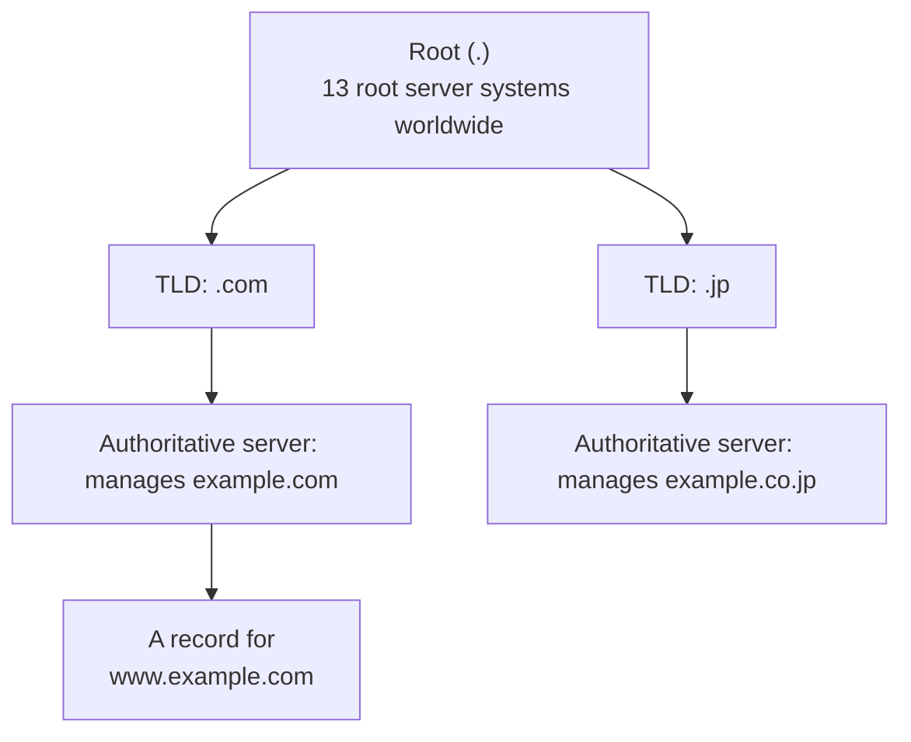
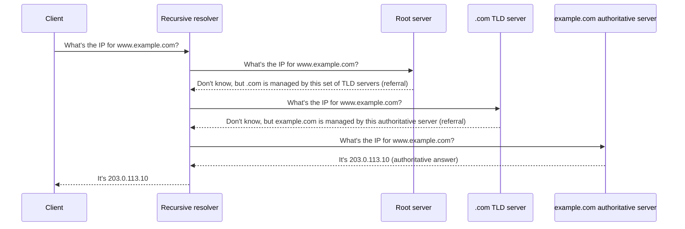

## Introduction

- **What You'll Learn From This Article**: This article unpacks what actually lies behind the understanding that "DNS converts names into IP addresses" — why it isn't handled by a single server but distributed worldwide, which server actually answers what during real-world name resolution, and two things that trip people up in practice: "when multiple DNS servers are registered, which one actually gets used?" and "how does internal name resolution actually work over a VPN connection?" — covered systematically, down to the implementation details on both Windows and Linux.
- **Intended Audience**: This article is written for infrastructure engineers who know that "DNS converts domain names into IP addresses," but can't concretely explain how multiple DNS servers get prioritized, or how an internal DNS server actually functions once a VPN connection is up.
- **Estimated Reading Time**: About 20 minutes

This article is part of the [Top 1% Series' full article guide](/en/sitemap). DNS server assignment via IPCP during VPN connection is covered in [Understanding How L2TP/IPsec Works from a "Top 1%" Perspective](/en/articles/l2tp-ipsec-guide).

## Prerequisites

- **IP address vs. hostname**: An IP address is the numeric address networking equipment uses for routing; a hostname (a string like `www.example.com`) is a name assigned for humans to work with more easily. DNS maps between the two.
- **FQDN (Fully Qualified Domain Name)**: A domain name written out in full, with every level of the hierarchy from the hostname down to the root made explicit, like `www.example.com.`. The trailing dot (representing the root) is usually omitted when displayed.
- **Client/server model**: A communication model in which roles are split between the side that sends requests (the client) and the side that processes them and sends back a response (the server). DNS likewise splits into "the side asking about a name" and "the side answering."
- **UDP/TCP**: DNS queries are fundamentally carried over lightweight UDP (port 53), but TCP is used when a response is too large, or for zone transfers (data synchronization between servers). UDP's characteristics are also covered in the prerequisites section of [Understanding How L2TP/IPsec Works from a "Top 1%" Perspective](/en/articles/l2tp-ipsec-guide).

## Getting the Big Picture

### In a Nutshell

**DNS (Domain Name System) is a worldwide, distributed database system for translating between "hierarchical names that are easy for humans to remember" (domain names) and "IP addresses that machines use for communication."** Rather than one giant server managing every name, **the namespace itself is structured as a hierarchy (a tree), with management split up level by level** — that's the single most important premise for understanding DNS.

At every level of this tree, the design is the same: **each level is responsible only for the range it has been delegated, and delegates everything below that to a different managing entity.** A root server only needs to know that "`.com` is managed by this set of TLD servers"; the `.com` TLD servers only need to know that "`example.com` is managed by this authoritative server." Responsibility is cleanly split level by level like this, and it's precisely this distributed design that lets the entire world's domain names be managed without creating a single point of failure.

## Fundamentals, Thoroughly Explained

### Authoritative Servers and Recursive Resolvers: "The Side That Knows" vs. "The Side That Goes and Asks"

The first distinction to make when understanding how DNS works is between two servers with completely different roles: the **authoritative server** and the **recursive resolver**.

- **Authoritative server**: A server that holds the official data (a zone file) for a specific zone (a delegated namespace range, such as `example.com`). Its only job is to answer accurately, from its own data, when asked about that zone — it never goes off to look something up on behalf of a query about a different domain.
- **Recursive resolver**: A server that, when asked by a client (a PC or smartphone) "what's the IP address for this hostname?", **goes and asks the root server, then a TLD server, then the authoritative server, in that order, on the client's behalf, and returns the final answer to the client.** In most cases, this role is played by a DNS server provided by your ISP, or by a public DNS service (discussed below).

### The Actual Name-Resolution Sequence: How Many Hops Does a Recursive Resolver Really Make?

Tracing what happens from the moment a client asks a recursive resolver for the IP address of `www.example.com` to the moment it actually gets an answer looks like this.

The key point here is that **neither the root server nor the TLD server ever returns "the actual answer" — each just returns information about where to ask next (a referral), pointing to whoever it delegated that range to.** Only the authoritative server that actually manages that zone can return the final, official answer (an Authoritative Answer). This whole process — going and chasing down the answer through however many hops it takes, on the client's behalf — is called a **recursive query**, which is where "recursive resolver" gets its name.

Stub resolvers vs. full-service resolvers

The DNS functionality built into a client's (PC's or smartphone's) OS doesn't perform the entire recursive query process described above by itself. In most cases it's a lightweight implementation called a **stub resolver**, which essentially just forwards the query to a single configured recursive resolver and passes back whatever answer comes back — hearsay, in effect. The actual work of a "full-service resolver" — walking from root, to TLD, to authoritative server — is handled on the recursive resolver side, provided by an ISP or a public DNS service. It helps, going into the next section on "DNS server settings on Windows/Linux," to keep in mind that what's actually being configured there is **which recursive resolver the stub resolver sends its queries to.**

### Caching and TTL: Why Doesn't It Ask the Root Every Single Time?

If the sequence above had to be dutifully repeated on every single lookup, root servers and TLD servers would be flooded with queries from around the world. What prevents that is **caching**. A recursive resolver holds on to an answer it has already obtained (along with the referral information along the way) for a period called the **TTL (Time To Live)**, specified by the authoritative server, and answers instantly from cache if the same name is queried again before the TTL expires. Because it doesn't need to re-query the authoritative server until the TTL expires, this both prevents queries from piling up on recursive resolvers worldwide and makes responses faster.

TTL length is a trade-off parameter that the side managing a DNS record (the authoritative server side) sets explicitly in the zone file. A longer TTL raises the cache hit rate, easing load on the authoritative server and improving response latency — but it also extends how long stale data can linger in caches around the world after a record's content (such as an IP address) changes. When a server migration or load-balancer cutover is planned, the standard practice is to shorten the TTL beforehand, and only lengthen it again once the cutover is complete.

### Major Record Types

The data DNS holds isn't limited to name-to-IP mappings. The representative record types are as follows.

| Record type | Role |
|---|---|
| A | The most basic record, mapping a hostname to an IPv4 address |
| AAAA | Maps a hostname to an IPv6 address |
| CNAME | Defines a name as an alias for another name |
| MX | Specifies the mail server(s) that receive mail for that domain (with priority ordering) |
| NS | Indicates the authoritative server(s) that manage that zone — the delegation information itself, discussed above |
| TXT | A general-purpose record that holds an arbitrary string (used for mail-sender authentication such as SPF/DKIM, and for domain-ownership verification) |
| PTR | A "reverse lookup" record for resolving a hostname from an IP address |

## The View from the Top 1% (What Experts See)

### When Multiple DNS Servers Are Registered, Which One Actually Gets Used? (Windows)

A frequent source of confusion in practice is: **when a single PC has multiple network adapters (wired LAN, Wi-Fi, a virtual adapter created by a VPN connection, and so on), each configured with a different DNS server, which one actually gets used?**

On Windows, DNS server settings are held **per network adapter.** Open the properties for the relevant adapter from `ncpa.cpl` (the "Network Connections" panel in Control Panel), then open the properties for "Internet Protocol Version 4 (TCP/IPv4)" (or the "Advanced" tab), and you'll see the list of DNS servers (preferred/alternate, or multiple candidates) tied to that specific adapter. In other words, the premise to grasp first is that the PC does **not** have a single, PC-wide DNS setting — instead, **there can be as many DNS server lists as there are adapters.**

When multiple adapters are active at once (say, a wired LAN and a VPN connection's virtual adapter running simultaneously), the **interface metric** (a number indicating how strongly traffic over that adapter is preferred — lower means higher priority) also affects which DNS server gets used for name resolution. On top of that, whether "Use default gateway on remote network" is enabled for the VPN connection (i.e., a full-tunnel setup) also affects DNS resolution priority, alongside routing. However, this prioritization alone cannot achieve **routing only a specific domain (such as an internal corporate domain) to a specific DNS server.** That's what the mechanism covered next, **NRPT**, is for.

### NRPT (Name Resolution Policy Table): Routing Only Specific Domains to Specific DNS Servers

Windows has a mechanism called the **NRPT (Name Resolution Policy Table).** It lets you explicitly define a **domain-level routing rule**: "queries for the `corp.example.com` namespace, specifically, should go to a designated DNS server (such as an internal corporate DNS server) instead of the regular per-adapter DNS server." It can be configured via Group Policy or the `netsh namespace` command. It was originally designed for DirectAccess (a certificate-based, always-on corporate VPN technology), but the same mechanism can be used with a regular VPN connection to control name resolution in a split-tunnel environment.

In an environment without NRPT configured, when a VPN connection uses **split tunneling** (only traffic destined for the corporate network goes over the VPN, while everything else continues to use the regular internet connection directly), even though "internal corporate DNS server information gets assigned during the VPN connection" is true on its own (via IPCP, as covered earlier), you can end up with inconsistent behavior — **general, non-corporate name resolution also getting sent to the VPN-side DNS server, or, conversely, queries for corporate-internal domains getting sent to the regular DNS server (and failing) depending on how the interface metrics happen to shake out.** Only by explicitly configuring NRPT (or an equivalent split-DNS setup) do you get deterministic control — "queries for this domain reliably go to this DNS server."

### When Multiple DNS Servers Are Registered, Which One Actually Gets Used? (Linux/systemd-resolved)

The situation on Linux depends on the distribution and DNS-resolution implementation in use.

- **The traditional implementation (reading `/etc/resolv.conf` directly)**: The order of the `nameserver` entries listed in `/etc/resolv.conf` determines the priority in which they're queried, top to bottom. This approach fundamentally has no concept of per-adapter management like Windows, nor of domain-level routing (the `search`/`domain` directives do provide search-domain completion, but that's a separate matter from which DNS server a query gets routed to).
- **The modern implementation using `systemd-resolved` (adopted by many desktop-oriented distributions)**: This can hold a separate DNS server per network interface (link), and you can inspect per-link settings with the `resolvectl status` command. It also has a mechanism equivalent to Windows' NRPT, called a **Routing Domain**: by assigning a domain prefixed with a tilde, like `~corp.example.com`, to a specific link, you get exactly the same idea as NRPT — domain-level routing where "only queries for `corp.example.com` go to that link's DNS server." If this routing domain isn't configured correctly during a VPN connection, you can run into the same class of problem as on Windows: internal-domain name resolution failing on its own, or, worse, corporate-internal queries unintentionally leaking out to an external DNS server (DNS leakage).

Configuration when connecting to a VPN via NetworkManager

When `NetworkManager` manages a VPN connection, the VPN connection profile has settings for "which DNS server to use for this VPN connection" and "which domains (search domains) should be resolved via this VPN," and these get reflected internally into `systemd-resolved`'s routing domain configuration. If internal name resolution isn't working correctly over a VPN connection, the first thing to check is whether `resolvectl status` shows the correct DNS server and routing domain (a domain prefixed with `~`) configured on the VPN's virtual interface.

### How DNS Resolution Differs Between Full-Tunnel and Split-Tunnel VPNs

Putting the above together, the behavior of DNS resolution over a VPN connection can be organized around **the combination of tunnel type (full vs. split) and DNS routing configuration (whether NRPT/routing domains are set up).**

| Configuration | General name resolution | Internal-domain name resolution |
|---|---|---|
| Full tunnel (all traffic over the VPN) | Uses the VPN-side DNS server (because the default gateway itself switches to the VPN side) | Uses the VPN-side DNS server |
| Split tunnel, no NRPT/routing domain | Usually favors the existing DNS server, but can become unreliable depending on interface metrics | No guarantee — can fail |
| Split tunnel, with NRPT/routing domain | Continues using the existing DNS server as-is (internal domains are outside the split rule's scope) | Reliably routed to the VPN-side DNS server for the specified internal domain(s) |

Keeping in mind that "connecting to a VPN automatically makes internal name resolution use the VPN server's DNS information as top priority" **only holds true for a full-tunnel configuration, or a split-tunnel configuration where NRPT/routing domains are properly set up** — this makes DNS-related troubleshooting much faster in practice.

## Common Misconceptions and Pitfalls

- **Misconception 1: "Registering multiple DNS servers gives you load balancing."**
  A typical OS's DNS client implementation treats multiple registered DNS servers as "preferred/alternate," or as an ordered list, and is fundamentally a **failover** mechanism (try the next one if the preferred server doesn't respond) — not a load balancer that spreads queries evenly.
- **Misconception 2: "DNS always takes priority over the hosts file."**
  On both Windows and Linux, the standard name-resolution order typically checks the **hosts file** (`C:\Windows\System32\drivers\etc\hosts` or `/etc/hosts`) **before** DNS. If name resolution isn't behaving as expected despite correct DNS configuration, the standard first check is whether a stale entry is sitting in the hosts file.
  

  
What controls the lookup order

  On Linux, the `hosts:` line in `/etc/nsswitch.conf` controls the actual order in which the hosts file (`files`) and DNS (`dns`) are consulted. On Windows, this lookup order is built-in default OS behavior, and there isn't a common, explicit configuration file for changing it.
  

- **Misconception 3: "Longer TTL is always better."**
  A longer TTL raises the cache hit rate and improves authoritative-server load and response time, but it also extends how long stale caches persist worldwide after a record changes. If a server migration or IP address change is planned, the standard practice is to shorten the TTL beforehand.
- **Misconception 4: "Recursive resolvers and authoritative servers are both just 'DNS servers' doing the same thing."**
  An authoritative server's job is to give the official answer for the zone it manages; a recursive resolver's job is to go and chase down the answer, from root to authoritative server, on the client's behalf. These are completely different jobs. The same server software can implement both roles at once (BIND, for instance), but conceptually they need to be understood as clearly distinct roles.

## Troubleshooting Perspective

DNS-related trouble is best approached by **narrowing down which layer of cache or configuration is stale or wrong.**

1. **Only one PC can't resolve a specific name, or gets a stale IP**: Suspect that PC's local DNS cache. On Windows, check current cache contents with `ipconfig /displaydns` and clear it with `ipconfig /flushdns`. On Linux (`systemd-resolved`), the equivalents are `resolvectl statistics` and `resolvectl flush-caches`.
2. **Only internal-domain names fail to resolve (while connected to a VPN)**: Check whether NRPT (Windows) or the routing domain (Linux — check with `resolvectl status`) is configured correctly. A classic cause is queries for a specific domain not being routed correctly to the VPN-side DNS server.
3. **A device can't resolve any name at all, internal or external**: Use `nslookup` or `dig` to check whether the DNS server actually in use is even reachable. Also check whether reachability to the DNS server itself (UDP/TCP port 53) is being blocked somewhere, such as by a firewall.
4. **A newly changed record isn't propagating globally**: Stale cached data may still be sitting in recursive resolvers worldwide until the TTL expires. You can verify whether the change was actually applied correctly on the authoritative server side, unaffected by any caching, by querying that authoritative server directly (`dig @<authoritative server IP> <hostname>`).
5. **A specific internal authoritative/DNS server isn't responding at all**: Suspect the server process itself having stopped, a startup failure caused by a zone-file syntax error, or a mismatch in the delegation information (the NS record) from the parent zone above it.

### Prevention and Long-Term Countermeasures

- If a server migration or IP address change is planned, shorten the TTL beforehand.
- When using split tunneling for a VPN connection, explicitly configure NRPT (Windows) or a routing domain (Linux), rather than letting behavior depend on which interface metric happens to win.
- Operate with the understanding that DNS server redundancy (primary/secondary) exists purely for failover, not load balancing.

## Summary

- DNS is a system that manages a hierarchical namespace in a distributed fashion, delegating each level (root, TLD, authoritative server) to a different managing entity.
- A recursive resolver's role is to chase down an answer by querying root, then TLD, then authoritative server in order; an authoritative server's role is to give the official answer for the zone it manages. The two roles are clearly distinct.
- Caching and TTL prevent queries from piling up on recursive resolvers worldwide while keeping responses fast, but TTL length is a trade-off between cache efficiency and how quickly record changes propagate.
- When multiple DNS servers are registered, Windows factors in interface metrics and per-adapter settings, while Linux (systemd-resolved) factors in per-link settings — but reliably routing a specific domain to a specific DNS server requires explicitly configuring NRPT (Windows) or a routing domain (Linux).
- Internal name resolution isn't automatically prioritized just because a VPN is connected — behavior depends on whether the tunnel is full or split, and on whether NRPT/routing domains are configured.

**Starting Today**
1. When you hit a "can't resolve DNS" issue, narrow down which layer is at fault: the local cache, the OS-level name-resolution configuration (per-adapter DNS servers, NRPT/routing domains), or the authoritative server itself.
2. If internal name resolution is unreliable over a VPN, check the NRPT (Windows) or routing domain (Linux) configuration first.

## References

- [Domain Names - Concepts and Facilities | RFC 1034](https://datatracker.ietf.org/doc/html/rfc1034)
- [Domain Names - Implementation and Specification | RFC 1035](https://datatracker.ietf.org/doc/html/rfc1035)
- [DNS Terminology | RFC 8499](https://datatracker.ietf.org/doc/html/rfc8499)
- [Name Resolution Policy Table (NRPT) | Microsoft Learn](https://learn.microsoft.com/en-us/windows-server/remote/remote-access/directaccess/technical-reference-for-name-resolution-in-directaccess)
- [resolvectl(1) | systemd](https://www.freedesktop.org/software/systemd/man/latest/resolvectl.html)
- [nsswitch.conf(5) | Linux man-pages](https://man7.org/linux/man-pages/man5/nsswitch.conf.5.html)
