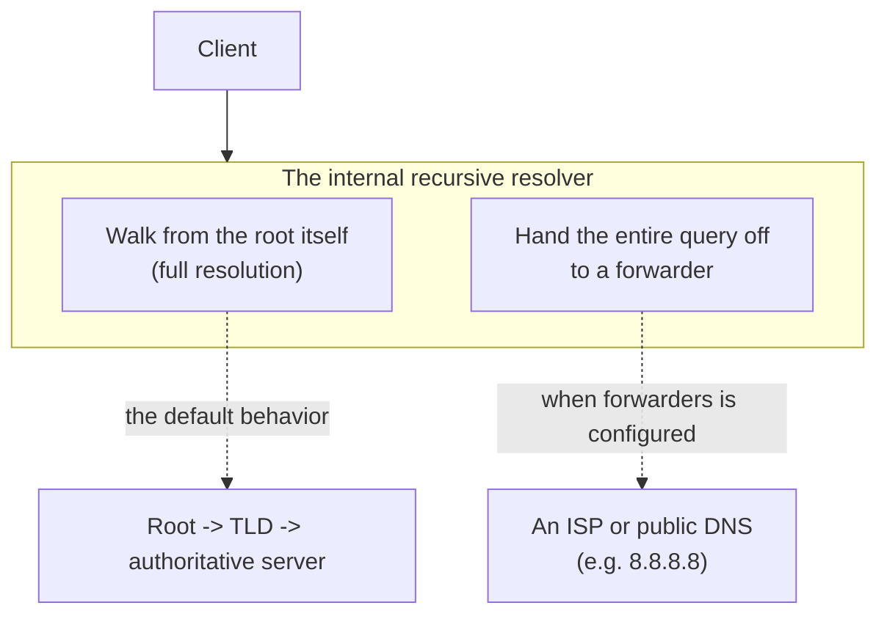

## Introduction

- **What You'll Learn From This Article**: This article digs deeper into the recursive resolver (caching server) role touched on briefly in [Understanding DNS Server Fundamentals](/en/articles/dns-server-fundamentals-guide), giving you a systematic understanding of the **forwarder** setup — where a recursive resolver hands off a query entirely to another server instead of walking the hierarchy from the root itself — and **negative caching**, where even a "this doesn't exist" answer gets cached.
- **Intended Audience**: Readers who have experience building an authoritative server (the side answering for a zone it manages) but aren't familiar with the recursive-resolver-side internals: forwarders and negative caching.
- **Estimated Reading Time**: About 15 minutes

This article is part of the [Top 1% Series Complete Article Guide](/en/sitemap), the 5th article in the [DNS Server Fundamentals Series](/en/sitemap#series-list).

## Prerequisite Knowledge

- **The Difference Between Authoritative Servers and Recursive Resolvers**: This assumes the division of labor covered in [Understanding How DNS Works](/en/articles/dns-guide) — the side that knows the answer versus the side that goes and asks.

## The Big Picture



## A Thorough, Grounds-Up Explanation

### A Forwarder: "Handing It Off" Instead of "Looking It Up Yourself"

A recursive resolver's default behavior is **full resolution (iterative querying)** — asking the root server, then the TLD, then the authoritative server, building the chain itself. Set `forwarders` in `named.conf`, though, and the internal recursive resolver **hands the entire query off to a specified other DNS server** (an ISP's DNS server, or a public DNS like 8.8.8.8) instead of walking from the root itself.

```
options {
    forwarders {
        8.8.8.8;
        8.8.4.4;
    };
    forward only;
};
```

**Specifying `forward only` means it never falls back to full resolution on its own, even if the query to the forwarder fails.** Without it (the default behavior, `forward first`), it attempts full resolution on its own if the forwarder doesn't respond.

### Why Does the Forwarder Setup Exist?

If an internal recursive resolver walked from the root itself, every single time, even for a common external domain (`google.com`, say), **the full recursive query against the entire internet would happen once per every internal client.** Hand it off to a forwarder instead, and you can **reuse the results it already has cached downstream**, so the internal resolver never needs to build up its own cache from scratch, dramatically cutting the volume of external queries. It's also used when you don't want to permit direct recursive queries from the internal network out to the internet at all (for firewall reasons, say) — consolidating all outbound queries through a single forwarder.

### Negative Caching: Even "It Doesn't Exist" Gets Cached

The last field on the SOA record, touched on in [Understanding DNS Server Fundamentals](/en/articles/dns-server-fundamentals-guide), the **negative caching TTL**, controls **how long other DNS servers may cache a negative response itself** — "that record doesn't exist" (NXDOMAIN, or no record of that type).

```
@   IN  SOA   ns1.example.com. admin.example.com. (
                2026093001
                3600
                900
                604800
                86400 )     ; <- this is the negative caching TTL
```

In other words, a recursive resolver that got a "this hostname doesn't exist" result caches that negative result itself for this TTL. **During that window, a query for the same hostname gets answered "it doesn't exist" immediately by the recursive resolver, without ever reaching the authoritative server.**

## What a Pro Sees Here (Top 1% Understanding)

### "The Record I Just Created Still Isn't Showing Up" Is Often Just Negative Caching

A common real-world scenario: **you add a record for a new hostname, but name resolution keeps failing for a while afterward.** Often, the cause is that **a query made while that hostname didn't yet exist has already been cached, negatively, somewhere along the chain of recursive resolvers.** Adding the record to the zone file and bumping the serial number doesn't make that negative cache entry disappear automatically — it only clears once the negative caching TTL elapses. Understanding this as "the addition succeeded, but a negative memory from before is still lingering" — not "the addition failed" — saves a lot of wasted troubleshooting.

### Where Does DNSSEC Validation Responsibility Go When You Use a Forwarder?

You could think of the validation covered in [Understanding How DNSSEC Works](/en/articles/dns-dnssec-fundamentals-guide) as something you hand off to an external public DNS specified as a forwarder (which often has DNSSEC validation enabled), instead of having your internal recursive resolver perform it itself. **But if the path to that forwarder isn't itself protected, a spoofing risk remains between the forwarder returning a correctly validated answer and that response actually reaching your internal recursive resolver.** When adopting a forwarder setup, keep in mind that trusting an "already-validated" answer also depends on the security of the path to that forwarder.

## Common Misconceptions and Pitfalls

- **Misconception 1: "Setting forwarders always makes every subsequent query faster."**
  If the forwarder itself is slow or down, depending on the `forward only` setting, name resolution can end up failing entirely.
- **Misconception 2: "Not being able to resolve a record right after adding it means a misconfiguration."**
  In many cases, it's simply that a negative result from before the addition is still cached, and it resolves itself once the negative caching TTL elapses.
- **Misconception 3: "Negative caching uses the same value as $TTL."**
  The negative caching TTL is an independent value, specified separately in the last field of the SOA record.

## Troubleshooting Perspective

1. **A record you just added can't be found**: Check the negative caching TTL in the SOA record via `dig`, and either wait for it to elapse or check whether you can force-clear the cache on the recursive resolver along the way.
2. **Name resolution became unstable right after configuring a forwarder**: Check whether the forwarder itself is alive and responding quickly, and consider switching from `forward only` to `forward first`.
3. **Resolution for a specific domain is unstable, only from inside the office**: Check `named.conf` to see whether the internal recursive resolver is using a forwarder or doing full resolution directly.

## Summary

- A forwarder is a setup where a recursive resolver hands off a query entirely to another DNS server, instead of performing full resolution itself.
- The negative caching TTL is the SOA record field controlling how long a negative "it doesn't exist" response itself gets cached.
- The common failure of not being able to resolve a record right after adding it is usually negative caching, not a misconfiguration.

**Takeaways to Apply Today**
1. When you can't resolve a newly added record, suspect the negative caching TTL elapsing first.
2. When adopting a forwarder setup, be clear about whether you need `forward only` or `forward first` behavior.

## References

- [BIND 9 Administrator Reference Manual: Forwarding](https://bind9.readthedocs.io/en/latest/chapter3.html)
- [RFC 2308: Negative Caching of DNS Queries](https://datatracker.ietf.org/doc/html/rfc2308)
