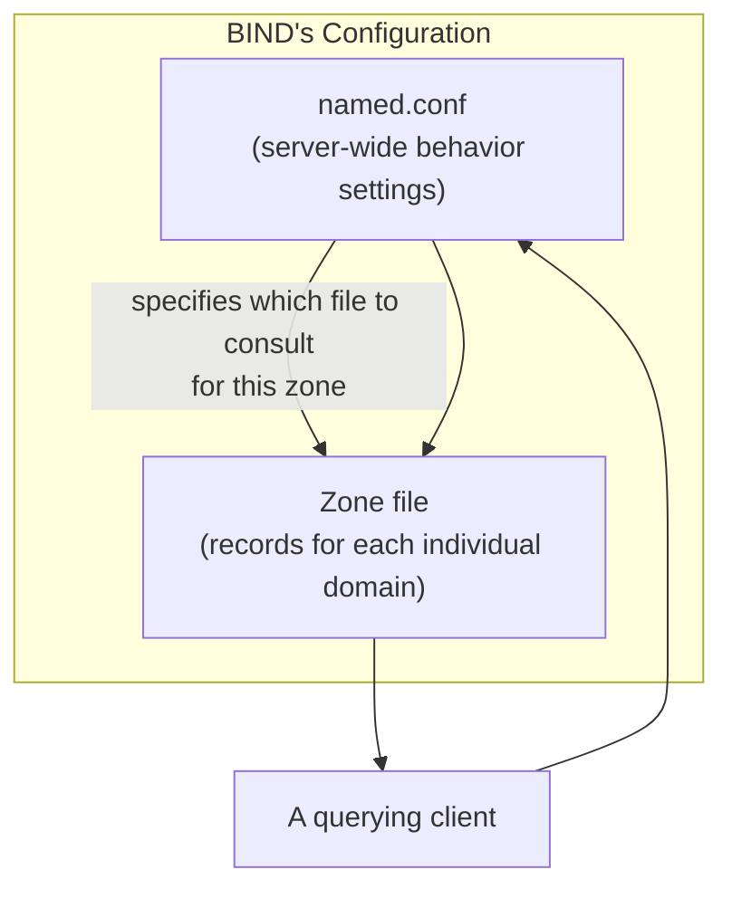

## Introduction

- **What you'll get from this article**: Building on the name-resolution hierarchy covered in [Understanding How DNS Works from a "Top 1%" Perspective](/en/articles/dns-guide), this article looks at things from the perspective of **actually building and operating a DNS server** — systematically explaining the structure of a **zone file**, what each field of an **SOA record** controls, and how a **master/slave configuration (zone transfer)** synchronizes zone data across multiple DNS servers. The example software used throughout is **BIND** (Berkeley Internet Name Domain), the most widely used DNS server software on Linux.
- **Intended audience**: Anyone who understands how DNS name resolution works but has never actually built or migrated a DNS server, and isn't familiar with practical terms like "zone file," "SOA record," or "master/slave."
- **Estimated reading time**: About 17 minutes

This article is part of the [Top 1% Series: Full Article Guide](/en/sitemap), the 1st in the [DNS Server Fundamentals Series](/en/sitemap#series-list). The [DNS server hands-on lab](/en/articles/dns-server-handson-guide) that follows builds everything covered here with your own hands.

## Prerequisite Knowledge

- **The difference between an authoritative server and a recursive resolver**: Covered in [Understanding How DNS Works](/en/articles/dns-guide) — "the side that knows the answer" (the authoritative server) versus "the side that goes and asks" (the recursive resolver). This article covers **actually building that authoritative-server side.**

## Getting the Big Picture

### What BIND Is: The Representative DNS Server Software on Linux

**BIND** (Berkeley Internet Name Domain) is the most widely used DNS server software on the internet, with a history going back to the 1980s. Just like Postfix — the representative open-source implementation in the world of email, covered in [Understanding Mail Server Fundamentals](/en/articles/mail-server-fundamentals-guide) — BIND occupies the position of **the representative Linux implementation of the DNS protocol.** BIND's configuration is split broadly across two kinds of files.

- **`named.conf`**: Defines the server's overall behavior — which zones it manages, whose queries it responds to, and other global settings.
- **Zone files**: Contain the actual records (A, NS, MX, and so on) for each individual domain (zone).



## A Thorough, Grounds-Up Explanation

### The Structure of a Zone File: The SOA Record and Resource Records

A zone file always opens with an **SOA** (Start of Authority) record. This record represents **administrative information about the zone itself.**

```
example.com.  IN  SOA  ns1.example.com. admin.example.com. (
                        2026092501  ; Serial number
                        3600        ; Refresh interval (seconds)
                        900         ; Retry interval (seconds)
                        604800      ; Expiry (seconds)
                        86400 )     ; Negative cache TTL (seconds)
```

| Field | Meaning |
|---|---|
| **Serial number** | The "version number" of this zone data. Every time you change the zone data, you must increment this value. |
| **Refresh interval** | How often a slave server (covered below) periodically checks with the master for updates. |
| **Retry interval** | How long to wait before retrying if a refresh query fails. |
| **Expiry** | How long a slave keeps treating its held zone data as valid before invalidating it as "no longer trustworthy," if queries to the master keep failing for this entire duration. |
| **Negative cache TTL** | How long other DNS servers may cache a negative response — "no such record exists." |

After the SOA record come the actual records the zone holds — NS records, A records, MX records, and so on.

<details>
<summary>What happens if you forget to bump the serial number</summary>

**The serial number doesn't increment automatically just because you edited the zone file — an administrator has to bump it manually.** Forget this, and even though you actually changed the records, a slave server (covered below) will see "the serial number hasn't changed" and conclude "there's nothing new," so **no zone transfer ever happens.** Whenever you edit a zone file, get in the habit of checking not just the content of the record changes, but whether you also remembered to bump the serial number. Using a date-plus-sequence format (like `2026092501`) makes it obvious at a glance how many changes happened that day, and makes a forgotten bump easier to notice.

</details>

### Master/Slave Configuration and Zone Transfers: An Analogy to AD DS Replication

To make a DNS server redundant, the zone data held by one **master** (primary) server gets replicated to one or more **slave** (secondary) servers. This replication mechanism is called a **zone transfer.**

- **AXFR** (full zone transfer): Transfers the entire zone data, in full.
- **IXFR** (incremental zone transfer): A more efficient method that transfers only the difference since the last transferred serial number.

At the **refresh interval** configured in `named.conf`, a slave server periodically asks the master "what's your current serial number?" **If the master's serial number is higher than the value the slave currently holds**, the slave requests a zone transfer and fetches the latest data.

This design — "use a single number as the basis for detecting whether something changed, and do nothing if it hasn't" — is exactly the same idea, in spirit, as **the version-number-based replication decision for GPOs** covered in [Understanding SYSVOL, DFSR, and Group Policy](/en/articles/ad-sysvol-dfsr-gpo-guide). DNS and AD DS are entirely separate technologies, but "use a monotonically increasing number as the basis for detecting change" is a universal design pattern that shows up again and again across distributed systems in general — recognizing it here makes it easier to spot when learning other technologies too.

### Why Authoritative and Caching Servers Should Be Kept Separate

BIND can act either as an authoritative server (answering for zones it manages) or as a recursive resolver (a caching server that looks things up on behalf of clients for other domains). In practice, though, best practice says **these two roles should not be co-located on the same server — they should be kept separate.**

The reason: exposing the caching-server (recursive resolver) functionality as an **open resolver anyone can freely use carries the risk of it being abused as a launchpad for a DDoS attack against a third party — a DNS reflection/amplification attack.** This attack abuses the property that a small DNS query can produce a much larger response, sending a flood of queries with a spoofed source IP address so that the (large) response traffic gets concentrated onto the actual target. An authoritative server has no choice but to be exposed, since it needs to answer queries from outside — but the standard practice is to **restrict the recursion feature to trusted internal clients only, and disable it entirely toward the internet.**

## The View From the Top 1% Perspective

### BIND and Windows DNS Server Are Separate Implementations of the Same Protocol

The idea covered in [What's the Difference Between SMB and CIFS?](/en/articles/smb-cifs-linux-interop-guide) — that a protocol is a documented specification, and multiple implementations of it can exist — applies directly to DNS too. Both BIND (on Linux) and Windows DNS Server (the DNS server functionality often run by a DC, covered in [Understanding AD's DNS](/en/articles/ad-dns-guide)) are simply **separate pieces of software implementing the same DNS protocol specification.** That's why a zone transfer between a Windows DNS Server master and a BIND slave (or vice versa) is technically achievable, as long as both sides follow the standardized protocol. If you're ever handed a mixed-vendor DNS migration, remember this premise: different implementations can still talk to each other, at the protocol level.

## Common Misconceptions and Pitfalls

- **Misconception 1: "Editing and saving a zone file is all it takes for the change to take effect"**
  Forgetting to bump the serial number means no zone transfer happens to slave servers, and the change never propagates.
- **Misconception 2: "It's more convenient to leave both the authoritative and caching server functions enabled on a DNS server"**
  Exposing both, unrestricted, on the same server carries the risk of it being abused as a launchpad for a DNS amplification attack. Standard practice is to restrict recursion to trusted internal clients only.
- **Misconception 3: "BIND and Windows DNS Server are separate technologies that can't interoperate"**
  Both are implementations of the same DNS protocol, and can interoperate across implementations via the standardized zone transfer mechanism.

## The Troubleshooting Perspective

DNS server misconfigurations are, in most cases, caused by **a syntax error, or a forgotten serial number bump.**

1. **BIND won't start after a config change**: Use `named-checkconf` to check `named.conf` for syntax errors, and `named-checkzone <zone name> <zone file>` to check the zone file itself.
2. **A slave server isn't picking up the master's changes**: Check whether you forgot to bump the serial number on the master. Running `dig @<master IP> <zone name> SOA` against both the master and the slave lets you compare their current serial numbers and identify which one is stale.
3. **Name resolution fails from outside**: Check whether `named.conf`'s `allow-query` or `allow-transfer` settings are unintentionally too restrictive.

### Preventive Measures and Permanent Fixes

- Make it standard practice to validate zone file syntax with `named-checkzone` before applying a change.
- Use a date-plus-sequence format for serial numbers, to make a forgotten bump easier to notice.
- On an authoritative server, restrict the recursion feature to trusted internal clients only.

## Summary

- BIND is the most widely used DNS server software on Linux, configured across two layers: `named.conf` (overall settings) and zone files (records for each individual domain).
- An SOA record's serial number is the zone data's "version number," and it's the basis for master/slave zone transfers (AXFR/IXFR).
- Authoritative and caching (recursive resolver) functionality should be kept separate in practice, to avoid the risk of a DNS amplification attack.
- BIND and Windows DNS Server are separate implementations of the same DNS protocol, and can interoperate via standardized mechanisms.

**What to Keep in Mind From Today**
1. Whenever you edit a zone file, always double-check you didn't forget to bump the serial number, not just the record content.
2. When exposing a DNS server, confirm the recursion feature is restricted to internal clients only.

## References

- [BIND 9 Administrator Reference Manual](https://bind9.readthedocs.io/en/latest/)
- [Domain Names - Implementation and Specification | RFC 1035](https://datatracker.ietf.org/doc/html/rfc1035)
- [Understanding DNS Amplification Attacks | CISA](https://www.cisa.gov/news-events/alerts/2013/03/29/dns-amplification-attacks)
