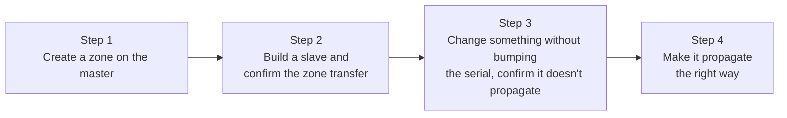

## Introduction

- **What you'll get from this article**: You'll verify the zone file, SOA record, and master/slave knowledge from [Understanding DNS Server Fundamentals](/en/articles/dns-server-fundamentals-guide) by **actually building two BIND servers and watching, with your own eyes, a zone transfer happen — and what happens when you forget to bump the serial number.**
- **Intended audience**: Anyone with no real-world experience building or operating a DNS server, who wants to first set up a master/slave configuration on VMs and confirm how it behaves.
- **Estimated reading time**: About 20 minutes (including doing the hands-on steps)

This article is part of the [Top 1% Series: Full Article Guide](/en/sitemap), the 2nd in the [DNS Server Fundamentals Series](/en/sitemap#series-list). You can do this with two Ubuntu Server environments from the [Hands-On Prep Manual](/en/articles/handson-prep-guide) (clone one VM, or build a second one from scratch).

## Prerequisite Knowledge

- **Zone files, SOA records, and master/slave configuration**: Read [Understanding DNS Server Fundamentals](/en/articles/dns-server-fundamentals-guide) first.

## Getting the Big Picture

Everything you'll do in this hands-on lab is just these 4 steps.



## Hands-On Steps

### Step 1: Create a zone on the master server

Install BIND on your first Ubuntu Server.

```bash
sudo apt update
sudo apt install -y bind9 bind9utils dnsutils
```

Add a new zone to `/etc/bind/named.conf.local`.

```
zone "lab.example.test" {
    type master;
    file "/etc/bind/db.lab.example.test";
    allow-transfer { <the slave server's IP address>; };
};
```

**The key point is explicitly specifying who's allowed to receive zone transfers via `allow-transfer`.** Without it, the default behavior generally allows zone transfer requests from essentially anyone — meaning anyone could pull the actual contents of your zone data (like a list of your internal hostnames).

Next, create the zone file `/etc/bind/db.lab.example.test`.

```
$TTL 86400
@   IN  SOA   ns1.lab.example.test. admin.lab.example.test. (
                2026092501  ; Serial number
                3600        ; Refresh
                900         ; Retry
                604800      ; Expiry
                86400 )     ; Negative cache TTL
@       IN  NS      ns1.lab.example.test.
@       IN  NS      ns2.lab.example.test.
ns1     IN  A       <the master's own IP address>
ns2     IN  A       <the slave server's IP address>
www     IN  A       10.0.20.100
```

Validate the syntax, then restart BIND.

```bash
sudo named-checkzone lab.example.test /etc/bind/db.lab.example.test
sudo systemctl restart bind9
```

Confirm it's working by querying the master itself with `dig`.

```bash
dig @localhost www.lab.example.test A
```

If the `ANSWER SECTION` shows `10.0.20.100`, it worked.

### Step 2: Build a slave server and confirm the zone transfer

Install BIND on your second Ubuntu Server too, and add this to its `/etc/bind/named.conf.local`.

```
zone "lab.example.test" {
    type slave;
    file "/var/cache/bind/db.lab.example.test";
    masters { <the master server's IP address>; };
};
```

**Notice that the slave doesn't write the zone file's contents itself — it just specifies where (`file`) to store the data transferred from the master.** Restart BIND.

```bash
sudo systemctl restart bind9
```

If the zone transfer succeeded, a file called `db.lab.example.test` should have been automatically created in `/var/cache/bind/`.

```bash
sudo ls -la /var/cache/bind/
sudo journalctl -u bind9 | grep transfer
```

If the log shows something like `transfer of 'lab.example.test/IN' from <master IP>#53: Transfer status: success`, the zone transfer succeeded. Confirm that querying the slave itself with `dig` returns the same result as the master.

```bash
dig @localhost www.lab.example.test A
```

### Step 3: Change something without bumping the serial number, and confirm it doesn't propagate

This is the part of the hands-on lab I most want you to actually feel. Edit the zone file on the master, changing `www`'s IP address — but **deliberately don't bump the serial number.**

```
www     IN  A       10.0.20.200
```

```bash
sudo named-checkzone lab.example.test /etc/bind/db.lab.example.test
sudo systemctl restart bind9
```

Query the master, and the new value shows up immediately.

```bash
dig @<master IP> www.lab.example.test A   # returns 10.0.20.200
```

But **querying the slave should still return the old value.**

```bash
dig @<slave IP> www.lab.example.test A   # still returns 10.0.20.100
```

As explained in [Understanding DNS Server Fundamentals](/en/articles/dns-server-fundamentals-guide), a slave decides "has anything changed?" based on the serial number. Since the serial number never changed, the slave concludes "the master has nothing new" and never requests a zone transfer. **This experience — "I thought I knew this, and yet the old value actually came back" — is exactly the core of this hands-on lab.**

### Step 4: Bump the serial number correctly, and make it propagate

On the master's zone file, bump just the serial number.

```
2026092502  ; bump the serial number by one
```

```bash
sudo named-checkzone lab.example.test /etc/bind/db.lab.example.test
sudo systemctl restart bind9
```

Either wait a bit (or, if you can't wait for the default refresh interval, force an immediate zone transfer on the slave side with `sudo rndc retransfer lab.example.test`), then query the slave again.

```bash
dig @<slave IP> www.lab.example.test A   # should now show 10.0.20.200
```

If the new value comes back, you succeeded. You've now confirmed, with your own hands, the entire sequence: **just one number — the serial number — forgetting to change it halts replication, and correctly bumping it resumes it.**

<details>
<summary>Stepping up: hand-craft a raw DNS query in Python</summary>

If you have energy left, try sending a raw DNS query directly to UDP port 53, using Python's `socket` module, without `dig`. The first 12 bytes of a DNS message are a fixed-length header you can hand-build using the `struct` module. You can feel the same thing here that you experienced in [A "Top 1%" Hands-On Lab: Writing Your Own HTTP Server From Scratch](/en/articles/minimal-http-server-handson-guide) — "in the end, a protocol is just a byte sequence in a fixed format" — this time with DNS.

</details>

## The View From the Top 1% Perspective

### The Gap Between "Knowing It" and "Having Actually Felt It"

The phenomenon you experienced in Step 3 — "forget to bump the serial number, and the slave never picks it up" — is something you technically already knew just from reading [Understanding DNS Server Fundamentals](/en/articles/dns-server-fundamentals-guide). But **actually reproducing it with your own hands, and watching `dig`'s results diverge with your own eyes**, is what turns that knowledge into the kind of understanding you can actually reach for on the spot, in real work. The next time you run into a "the master and slave are answering differently" incident, this hands-on experience is what lets you jump straight to suspecting the serial number, without hesitation.

## Common Misconceptions and Pitfalls

- **Misconception 1: "The slave server also needs to have the same zone file contents written manually"**
  The slave doesn't need to write the zone file's contents itself — `file` just specifies where to store the data transferred from the master.
- **Misconception 2: "Zone transfers are safely restricted by default, even without configuring `allow-transfer`"**
  Without explicitly specifying `allow-transfer`, the default behavior can be broadly permissive, potentially leaving your zone data retrievable by anyone.

## The Troubleshooting Perspective

1. **The slave never gets a zone transfer**: Check whether the slave's IP address is correctly specified in the master's `allow-transfer`. Also check whether a firewall is blocking TCP port 53 (zone transfers use TCP).
2. **`named-checkzone` reports an error**: Check the zone file's syntax (semicolon placement, matching parentheses, and so on).
3. **The slave's value never updates**: First suspect whether you forgot to bump the serial number on the master.

### Preventive Measures and Permanent Fixes

- Explicitly build "bump the serial number" into the checklist for any workflow that changes a zone file.
- Always explicitly configure `allow-transfer`, to prevent an unintended zone transfer to the wrong party.

## Summary

- A BIND master/slave configuration is built just by specifying `type master` plus a zone file on the master, and `type slave` plus a storage `file` and `masters` (the transfer source) on the slave.
- A zone transfer (AXFR/IXFR) happens when a slave checks the master's serial number and finds it's newer than its own.
- You can directly confirm, as a difference in `dig`'s results, that forgetting to bump the serial number means a real record change never reaches the slave.
- Explicitly configuring `allow-transfer` to prevent zone data from leaking to an unintended party matters in practice.

**What to Keep in Mind From Today**
1. After changing a zone file, build the habit of querying both the master and the slave with `dig` to confirm the change actually propagated.
2. When setting up a master/slave configuration, always explicitly configure `allow-transfer`.

## References

- [BIND 9 Administrator Reference Manual](https://bind9.readthedocs.io/en/latest/)
- [dig(1) - Linux manual page](https://linux.die.net/man/1/dig)
