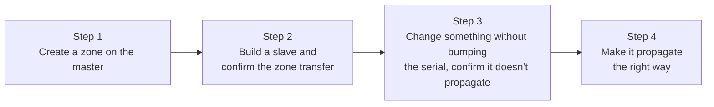

## Introduction

- **What you'll get from this article**: You'll verify the zone file, SOA record, and master/slave knowledge from [Understanding DNS Server Fundamentals](/en/articles/dns-server-fundamentals-guide) by **actually building two BIND servers and watching, with your own eyes, a zone transfer happen — and what happens when you forget to bump the serial number.**
- **Intended audience**: Anyone with no real-world experience building or operating a DNS server, who wants to first set up a master/slave configuration on VMs and confirm how it behaves.
- **Estimated reading time**: About 20 minutes (including doing the hands-on steps)

This article is part of the [Top 1% Series: Full Article Guide](/en/sitemap), the 2nd in the [DNS Server Fundamentals Series](/en/sitemap#series-list). You can do this with two Ubuntu Server environments from the [Hands-On Prep Manual](/en/articles/handson-prep-guide) (clone one VM, or build a second one from scratch).

## Prerequisite Knowledge

- **Zone files, SOA records, and master/slave configuration**: Read [Understanding DNS Server Fundamentals](/en/articles/dns-server-fundamentals-guide) first.

## Getting the Big Picture

Everything you'll do in this hands-on lab is just these 4 steps.



## Hands-On Steps

### Step 1: Create a zone on the master server

Install BIND on your first Ubuntu Server.

```bash
sudo apt update
sudo apt install -y bind9 bind9utils dnsutils
```

**These three packages each have a distinct role.** `bind9` is the DNS server itself (the `named` daemon), `bind9utils` is the set of administrative commands like `named-checkzone` and `rndc`, and `dnsutils` is the set of query commands like `dig` and `nslookup`. Just running the server only needs `bind9`, but building, verifying, and troubleshooting it is essentially impossible without the commands from the other two packages, which is why all three are installed together.

<details>
<summary>Why use the unfamiliar-looking domain name "lab.example.test"?</summary>

The `lab.example.test` used in this hands-on has an entirely different intent from the internal domain names you'd see in an AD environment. `.test` is a TLD (top-level domain) officially reserved by [RFC 2606](https://datatracker.ietf.org/doc/html/rfc2606) as "never actually registered on the real internet, and always safe to use for testing and documentation" (`.example`, `.invalid`, and `.localhost` are reserved the same way). Pick a domain name for a test environment using `.com` or `.local`, which could genuinely exist, and you risk colliding with a real name on the actual internet — using `.test` removes that risk entirely.

Also, what this article calls a "zone" and what AD DS calls a "domain" are similar-looking but different concepts. **A domain is the concept of the namespace itself, while a zone is the more practical unit of "the chunk of data this particular DNS server actually manages."** In most cases, one domain maps to one zone file, but in a large organization, a portion of a domain — like `dev.example.com` within `example.com` — is sometimes delegated to a separate DNS server and managed as its own, separate zone. Keeping "domain = namespace design" and "zone = the unit of data actually managing it" distinct sets you up well for a more advanced topic like delegation.

</details>

Add a new zone to `/etc/bind/named.conf.local`.

```bash
sudo nano /etc/bind/named.conf.local
```

```
zone "lab.example.test" {
    type master;
    file "/etc/bind/db.lab.example.test";
    allow-transfer { <the slave server's IP address>; };
};
```

**The key point is explicitly specifying who's allowed to receive zone transfers via `allow-transfer`.** Without it, the default behavior generally allows zone transfer requests from essentially anyone — meaning anyone could pull the actual contents of your zone data (like a list of your internal hostnames).

<details>
<summary>What's the difference between named.conf and named.conf.local?</summary>

When BIND starts, it first loads `/etc/bind/named.conf`, but this file itself is nearly empty — almost all it does is `include` other files.

```
include "/etc/bind/named.conf.options";
include "/etc/bind/named.conf.local";
include "/etc/bind/named.conf.default-zones";
```

`named.conf.options` holds server-wide behavior options, `named.conf.default-zones` holds the default zones (like the one for localhost) the Ubuntu package ships with out of the box, and `named.conf.local` is **the file deliberately left empty, for the administrator to write their own added zone definitions into.** You could technically write a zone addition directly into `named.conf` itself, but then a future BIND package update that overwrites `named.conf` risks wiping out your own changes. Isolating the administrator's changes into `named.conf.local` — a place the package never touches — prevents that accident.

</details>

Next, create the zone file `/etc/bind/db.lab.example.test`.

```bash
sudo nano /etc/bind/db.lab.example.test
```

```
$TTL 86400
@   IN  SOA   ns1.lab.example.test. admin.lab.example.test. (
                2026092501  ; Serial number
                3600        ; Refresh
                900         ; Retry
                604800      ; Expiry
                86400 )     ; Negative cache TTL
@       IN  NS      ns1.lab.example.test.
@       IN  NS      ns2.lab.example.test.
ns1     IN  A       <the master's own IP address>
ns2     IN  A       <the slave server's IP address>
www     IN  A       10.0.20.100
```

Let's also look at what's below the SOA record.

- **`$TTL 86400`**: The default TTL (how long it's okay to cache, in seconds) for individual records in this zone. Any record that doesn't explicitly specify its own TTL uses this default.
- **`@`**: Shorthand referring to the zone itself that this zone file manages (here, `lab.example.test`). It corresponds to the `zone "lab.example.test"` declaration in `named.conf.local`.
- **`@  IN  NS  ns1.lab.example.test.`**: Declares that "one of the authoritative servers for the zone `lab.example.test` is `ns1.lab.example.test`." The next line similarly declares `ns2` as another authoritative server.
- **`ns1  IN  A  <the master's own IP address>`**: An A record converting the name `ns1.lab.example.test` into an actual IP address. Simply declaring the name in an NS record doesn't yet tell you which IP address it points to — only with this line (also called a glue record) does the NS record's name actually become resolvable.
- **`www  IN  A  10.0.20.100`**: The A record for whatever specific hostname this zone actually wants to publish.

Validate the syntax, then restart BIND.

```bash
sudo named-checkzone lab.example.test /etc/bind/db.lab.example.test
sudo systemctl restart bind9
```

**`named-checkzone` is actually the same zone-file syntax-parsing logic BIND's own daemon (`named`) uses, cut out as a standalone command.** The first argument (`lab.example.test`) is the zone name to check, and the second argument (`/etc/bind/db.lab.example.test`) is that zone file's actual path. Validating with this command before restarting BIND heads off the situation where BIND itself fails to start because it tried to load a syntactically broken zone file.

Confirm it's working by querying the master itself with `dig`. If you'd like to understand `dig` itself in more depth, see [Understanding How to Use dig and nslookup From a "Top 1%" Perspective](/en/articles/dig-nslookup-guide).

```bash
dig @localhost www.lab.example.test A
```

If the `ANSWER SECTION` shows `10.0.20.100`, it worked.

### Step 2: Build a slave server and confirm the zone transfer

Install BIND on your second Ubuntu Server too, and add this to its `/etc/bind/named.conf.local`.

```bash
sudo apt update
sudo apt install -y bind9 bind9utils dnsutils
sudo nano /etc/bind/named.conf.local
```

```
zone "lab.example.test" {
    type slave;
    file "/var/cache/bind/db.lab.example.test";
    masters { <the master server's IP address>; };
};
```

**Notice that the slave doesn't write the zone file's contents itself — it just specifies where (`file`) to store the data transferred from the master.** Restart BIND.

```bash
sudo systemctl restart bind9
```

If the zone transfer succeeded, a file called `db.lab.example.test` should have been automatically created in `/var/cache/bind/`.

```bash
sudo ls -la /var/cache/bind/
sudo journalctl -u bind9 | grep transfer
```

If the log shows something like `transfer of 'lab.example.test/IN' from <master IP>#53: Transfer status: success`, the zone transfer succeeded. **In some environments, this grep can show nothing at all — see the FAQ at the end of this article for why and how to check further.** The most reliable confirmation is querying the slave itself with `dig`, as shown next, and confirming it returns the same result as the master.

```bash
dig @localhost www.lab.example.test A
```

### Step 3: Change something without bumping the serial number, and confirm it doesn't propagate

This is the part of the hands-on lab I most want you to actually feel. Edit the zone file on the master, changing `www`'s IP address — but **deliberately don't bump the serial number.**

```bash
sudo nano /etc/bind/db.lab.example.test
```

```
www     IN  A       10.0.20.200
```

```bash
sudo named-checkzone lab.example.test /etc/bind/db.lab.example.test
sudo systemctl restart bind9
```

Query the master, and the new value shows up immediately.

```bash
dig @<master IP> www.lab.example.test A   # returns 10.0.20.200
```

But **querying the slave should still return the old value.**

```bash
dig @<slave IP> www.lab.example.test A   # still returns 10.0.20.100
```

As explained in [Understanding DNS Server Fundamentals](/en/articles/dns-server-fundamentals-guide), a slave decides "has anything changed?" based on the serial number. Since the serial number never changed, the slave concludes "the master has nothing new" and never requests a zone transfer. **This experience — "I thought I knew this, and yet the old value actually came back" — is exactly the core of this hands-on lab.**

### Step 4: Bump the serial number correctly, and make it propagate

On the master's zone file, bump just the serial number.

```bash
sudo nano /etc/bind/db.lab.example.test
```

```
2026092502  ; bump the serial number by one
```

```bash
sudo named-checkzone lab.example.test /etc/bind/db.lab.example.test
sudo systemctl restart bind9
```

Query the slave again. **You don't actually need to wait for the refresh interval (3600 seconds) — in most cases, the new value comes back almost immediately.** We'll cover why in this article's "View From the Top 1%" section. If it hasn't propagated even after waiting, run `sudo rndc retransfer lab.example.test` on the slave to force an immediate zone transfer.

```bash
dig @<slave IP> www.lab.example.test A   # should now show 10.0.20.200
```

If the new value comes back, you succeeded. You've now confirmed, with your own hands, the entire sequence: **just one number — the serial number — forgetting to change it halts replication, and correctly bumping it resumes it.**

<details>
<summary>Stepping up: hand-craft a raw DNS query in Python</summary>

If you have energy left, try sending a raw DNS query directly to UDP port 53, using Python's `socket` module, without `dig`. The first 12 bytes of a DNS message are a fixed-length header you can hand-build using the `struct` module. You can feel the same thing here that you experienced in [A "Top 1%" Hands-On Lab: Writing Your Own HTTP Server From Scratch](/en/articles/minimal-http-server-handson-guide) — "in the end, a protocol is just a byte sequence in a fixed format" — this time with DNS.

</details>

## The View From the Top 1% Perspective

### The Gap Between "Knowing It" and "Having Actually Felt It"

The phenomenon you experienced in Step 3 — "forget to bump the serial number, and the slave never picks it up" — is something you technically already knew just from reading [Understanding DNS Server Fundamentals](/en/articles/dns-server-fundamentals-guide). But **actually reproducing it with your own hands, and watching `dig`'s results diverge with your own eyes**, is what turns that knowledge into the kind of understanding you can actually reach for on the spot, in real work. The next time you run into a "the master and slave are answering differently" incident, this hands-on experience is what lets you jump straight to suspecting the serial number, without hesitation.

### Why Step 4 Propagated Almost Instantly, Without Waiting for the Refresh Interval (3600 Seconds)

As you experienced in Step 4, once you correctly bumped the serial number, the slave returned the new value almost immediately, without dutifully waiting out the 3600-second refresh interval. That's not a coincidence — it's because a mechanism called **NOTIFY** is enabled by default.

When BIND detects that a zone was reloaded on the master and its serial number changed, it actively sends a notification — a NOTIFY message ([RFC 1996](https://datatracker.ietf.org/doc/html/rfc1996)) saying "this zone has an update" — to any slave permitted via `allow-transfer`. Once a slave receives this NOTIFY, it requests a zone transfer right then and there, without waiting for the refresh interval. **In other words, the refresh interval is purely a fallback polling interval, for when NOTIFY fails to arrive for some reason (like a network outage) — in normal real-world operation, synchronization almost always happens instantly via this NOTIFY.** Without knowing this mechanism, you'd be left puzzled by the seemingly contradictory behavior of "the refresh interval is supposed to be 3600 seconds, so why did it propagate immediately?"

## Common Misconceptions and Pitfalls

- **Misconception 1: "The slave server also needs to have the same zone file contents written manually"**
  The slave doesn't need to write the zone file's contents itself — `file` just specifies where to store the data transferred from the master.
- **Misconception 2: "Zone transfers are safely restricted by default, even without configuring `allow-transfer`"**
  Without explicitly specifying `allow-transfer`, the default behavior can be broadly permissive, potentially leaving your zone data retrievable by anyone.
- **Misconception 3: "Even after correctly bumping the serial number, you have to wait out the 3600-second refresh interval for it to propagate"**
  In reality, a mechanism called NOTIFY propagates the master's update to the slave almost instantly. The refresh interval is only a fallback polling interval, used when NOTIFY fails to arrive.

<details>
<summary>What to do if you've forgotten the path of the file you meant to edit</summary>

This hands-on lab spells out the path of every file you edit, but in real-world work, you'll often need to find "where was that file again?" on your own, without a reference to look back at. How to guess what's likely stored somewhere from a file or directory's name, and actually track it down with the `find` command, is covered in [The Top 1% Hands-On for Tracking Down a File or Directory Yourself With find](/en/articles/linux-find-guide). For where a directory like `/var/cache/bind/` under `/var` fits into the bigger picture, see [The Linux Directory Structure](/en/articles/linux-filesystem-hierarchy-guide).

</details>

## The Troubleshooting Perspective

1. **The slave never gets a zone transfer**: Check whether the slave's IP address is correctly specified in the master's `allow-transfer`. Also check whether a firewall is blocking TCP port 53 (zone transfers use TCP).
2. **`named-checkzone` reports an error**: Check the zone file's syntax (semicolon placement, matching parentheses, and so on). An error like `unexpected end of line` or `unexpected end of input` is frequently caused by a stray character (like `]`) sneaking into the very first line, often from copying and pasting terminal output. Run `cat -A <zone file>` to check for hidden characters as well.
3. **The slave's value never updates**: First suspect whether you forgot to bump the serial number on the master.

See the FAQ at the end of this article for more detail on errors you're likely to actually run into during this hands-on lab.

### Preventive Measures and Permanent Fixes

- Explicitly build "bump the serial number" into the checklist for any workflow that changes a zone file.
- Always explicitly configure `allow-transfer`, to prevent an unintended zone transfer to the wrong party.

## Summary

- A BIND master/slave configuration is built just by specifying `type master` plus a zone file on the master, and `type slave` plus a storage `file` and `masters` (the transfer source) on the slave.
- A zone transfer (AXFR/IXFR) happens when a slave checks the master's serial number and finds it's newer than its own.
- You can directly confirm, as a difference in `dig`'s results, that forgetting to bump the serial number means a real record change never reaches the slave.
- Explicitly configuring `allow-transfer` to prevent zone data from leaking to an unintended party matters in practice.

**What to Keep in Mind From Today**
1. After changing a zone file, build the habit of querying both the master and the slave with `dig` to confirm the change actually propagated.
2. When setting up a master/slave configuration, always explicitly configure `allow-transfer`.

## References

- [BIND 9 Administrator Reference Manual](https://bind9.readthedocs.io/en/latest/)
- [dig(1) - Linux manual page](https://linux.die.net/man/1/dig)
