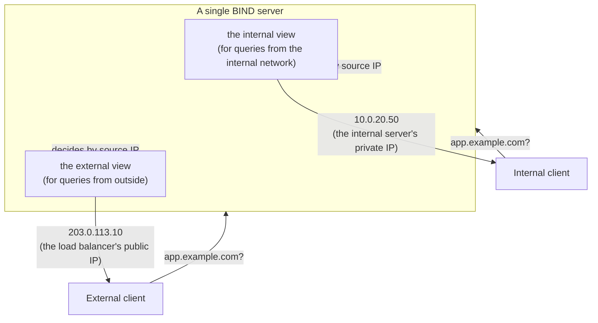

## Introduction

- **What You'll Learn From This Article**: This article extends the basic shape covered in [Understanding DNS Server Fundamentals](/en/articles/dns-server-fundamentals-guide) — one zone file per zone — into split-horizon DNS, a design where **the same domain name returns a different answer depending on where the query comes from** (inside or outside the office), and BIND's **views** feature, which implements it.
- **Intended Audience**: Readers who've built a DNS server with a single zone file before, but have never seen or built the more advanced setup where "a different IP address comes back from inside the office."
- **Estimated Reading Time**: About 16 minutes

This article is part of the [Top 1% Series Complete Article Guide](/en/sitemap), the 6th article in the [DNS Server Fundamentals Series](/en/sitemap#series-list).

## Prerequisite Knowledge

- **Zone Files and ACLs**: This assumes the zone file structure and the concept of a setting restricting the query source, like `allow-transfer`, covered in [Understanding DNS Server Fundamentals](/en/articles/dns-server-fundamentals-guide).

## The Big Picture

### The Problem Split-Horizon DNS Solves

It's not unusual to want an internal web application reachable **under the same domain name (say, `app.example.com`)** — over a fast internal network route from inside the office, and through a load balancer from outside (the internet). But a single zone file can only offer one answer per name. **A design that returns a different answer for the same name depending on where the query came from is called split-horizon DNS (or "DNS views").**



## A Thorough, Grounds-Up Explanation

### BIND's views Feature: Switching the Zone Data Itself Based on Source IP

The feature that implements split-horizon DNS in BIND is **views.** You define multiple `view` blocks in `named.conf`, each specifying its own **range of source IP addresses permitted to query it (`match-clients`)** and **the zone data used for queries from that range.**

```
view "internal" {
    match-clients { 10.0.0.0/8; };
    zone "example.com" {
        type master;
        file "/etc/bind/db.internal.example.com";
    };
};

view "external" {
    match-clients { any; };
    zone "example.com" {
        type master;
        file "/etc/bind/db.external.example.com";
    };
};
```

**For the same zone name, `example.com`, two zone files with different content get prepared — `db.internal.example.com` and `db.external.example.com`. A query whose source IP address matches `10.0.0.0/8` (internal) uses the `internal` view, and anything else (`any`, meaning everything, including external traffic) uses the `external` view.**

### The Evaluation Order of views: Top to Bottom, First Match Wins

Multiple `view` blocks defined in `named.conf` **get evaluated from top to bottom, and the first view whose `match-clients` matches is the one adopted.** This is a similar idea to the "the lowest-numbered rule wins" evaluation order covered in [Understanding the Difference Between Security Groups and Network ACLs (NACLs)](/en/articles/aws-nacl-security-group-guide). **So the standard practice is to write the more specific condition (like the internal network) first, and the broader condition (`any`) later.** Get this order backwards, and the `external` view matching `any` always wins first, meaning the `internal` view never gets used at all — a common misconfiguration.

## What a Pro Sees Here (Top 1% Understanding)

### Using views Creates the Operational Cost of Maintaining Two Zone Files in Parallel

The single biggest real-world caveat with split-horizon DNS is that **for the same domain name, you have to keep maintaining two independent zone files — internal and external — separately, going forward.** Update a record shared by both (an MX record for `mail.example.com`, say) in only one of them, and name resolution results diverge between inside and outside the office. In practice, the standard approach to reducing that dual-maintenance burden is sharing records common to both as a separate file via the `$INCLUDE` directive, and **isolating only the parts that genuinely differ per view into their own files.**

### match-clients Is About "Source IP Address," Not the DNS Query's Content

The criterion views is judged on, `match-clients`, is based purely on **the source IP address of the packet querying the DNS server.** **If a phone outside the office connects to the internal network via VPN and then queries, its source IP address gets treated as an internal address, and it gets the `internal` view's result.** In other words, it's important to understand this isn't judging "are you physically inside the office network" — it's judging purely "which IP address range, as seen by the DNS server, did this query come from." That gap in boundaries is exactly what explains being able to (correctly, or sometimes unintentionally) reach internal-only resources while connected over VPN.

## Common Misconceptions and Pitfalls

- **Misconception 1: "views is a feature that shows or hides parts of the same zone file, depending on the source."**
  views uses a completely independent zone file per view — it isn't selectively exposing parts of one shared file.
- **Misconception 2: "The order view definitions are written in doesn't affect behavior."**
  views are evaluated top to bottom, and the first match wins, so a more specific condition needs to come first.
- **Misconception 3: "match-clients judges whether you're physically connected to the internal network."**
  match-clients judges purely by source IP address, so the result changes if the source IP changes — for example, via a VPN connection.

## Troubleshooting Perspective

1. **You're querying from inside the office, but getting the external view's result**: Check the order of `view` definitions in `named.conf` — see whether a broader condition is written first.
2. **The internal and external zone files have diverged in content**: Check whether shared records are being kept in sync via something like `$INCLUDE`, or whether one file was updated while the other was forgotten.
3. **Only over a VPN connection, name resolution gives an unexpected result**: Check which range in `match-clients` the client's source IP address, after connecting over VPN, actually falls into.

## Summary

- Split-horizon DNS is a design where the same domain name returns a different answer depending on where the query came from.
- BIND's views achieves this by pairing a completely independent zone file with each `match-clients` (source IP range).
- Since view definitions are evaluated top to bottom, a more specific condition needs to come before a broader one.
- match-clients judges purely by source IP address, so which view gets used can change based on things like a VPN connection.

**Takeaways to Apply Today**
1. When configuring views, always write the more specific view's condition first.
2. For records shared between the internal and external zone files, use something like `$INCLUDE` to avoid dual-maintenance drift.

## References

- [BIND 9 Administrator Reference Manual: Views](https://bind9.readthedocs.io/en/latest/chapter4.html)
