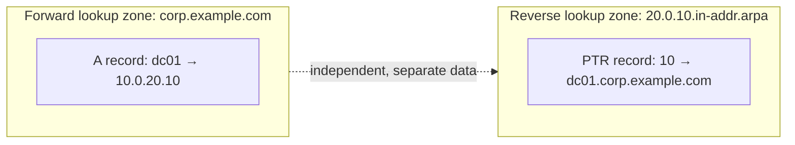

## Introduction

- **What You'll Learn From This Article**: This article systematically explains the meaning of the "forward lookup zone" / "reverse lookup zone" distinction you always see when you open DNS Manager, the true identity of the oddly named `_msdcs` zone that always appears inside an AD zone, and how a record type that plain A records can't explain — the **SRV record** — is actually used in an AD environment. Along the way, it also lays out a practical reading guide for what to check where on the DNS Manager screen.
- **Intended Audience**: This article is aimed at engineers who've seen the DNS Manager screen but can't explain what the `_msdcs` folder or SRV records inside a forward lookup zone mean, and who want to be able to read the information they need off the DNS Manager screen during an AD migration or incident response.
- **Estimated Reading Time**: About 18 minutes

This article is part of the [Top 1% Series' full article guide](/en/sitemap), and the fifth article in the [Active Directory series](/en/sitemap#series-list). Basic record types like A, CNAME, and MX, and general concepts like recursive resolvers and authoritative servers, are covered in [Understanding How DNS Works from a "Top 1%" Perspective](/en/articles/dns-guide); this article focuses on the zone structure and SRV records specific to AD environments. It also assumes you understand the meaning of the domain/forest boundary from [Understanding the Difference Between AD and DC, and Domains vs. Forests, from a "Top 1%" Perspective](/en/articles/ad-dc-fundamentals-guide).

## Prerequisites

- **Zone**: In DNS, the unit of data that a given server (or set of servers) holds authoritative responsibility for, covering a specific portion of the namespace.
- **A records and SRV records**: An A record is the basic record type that converts a hostname to an IPv4 address. An SRV record is a more sophisticated record type indicating "which server provides a specific service" — covered in detail in this article.
- **AD-integrated zones and replication partitions**: AD-integrated zone data may be managed separately from the ordinary domain partition. This distinction is the key to understanding the special treatment of the `_msdcs` zone, covered below.

## Getting the Big Picture

### Forward Lookup Zones and Reverse Lookup Zones

When you open DNS Manager, zones are broadly displayed in two categories:

- **Forward Lookup Zone**: Handles "name → IP address" conversion. Inside a domain name like `corp.example.com`, you'll find A records and the like corresponding to `www` or individual PC names. In practice, "registering a DNS record" almost always means registering it in this forward lookup zone.
- **Reverse Lookup Zone**: Handles "IP address → name" conversion (reverse lookups). The zone name is expressed in a special format listing the IP address range in reverse (for example, `10.0.20.0/24` becomes `20.0.10.in-addr.arpa`), and its contents are PTR records.



**Forward and reverse lookup zones don't reference each other — they're separate, independently managed and registered pieces of data.** Adding an A record to a forward lookup zone doesn't automatically create a corresponding PTR record in the reverse lookup zone (if dynamic updates are enabled for both, they're usually both registered together, but if the reverse lookup zone hasn't even been created, no PTR record gets registered at all). This asymmetry is sometimes the cause of a real-world headache — "name resolution works, but reverse lookups alone don't."

## Fundamentals, Explained Thoroughly

### The True Identity of the `_msdcs` Zone

Open the forward lookup zone of an AD-integrated DNS server, and alongside the ordinary list of hostnames, you'll always find a folder (or a zone in its own right) named `_msdcs`. This stands for **Microsoft DCS (Domain Controller Locator Service)**, and it's **a dedicated location that holds a special set of records for clients to search for "where's the DC for this domain (or forest)."**

In current Windows Server, this `_msdcs` is, in most cases, not just a folder inside the forest root domain's forward lookup zone — it's created as **its own independent forward lookup zone, named `_msdcs.<forest root domain name>`.** There's an important reason for this.

- Ordinary domain zone data (an AD-integrated zone) is, by default, saved as data corresponding to AD DS's **domain partition** — replicated **only among DCs within that domain** (more precisely, stored in a dedicated application partition called `DomainDnsZones`).
- The `_msdcs` zone, on the other hand, **needs to be referenceable by clients in any domain in the forest** (for example, when a member computer in one domain needs to look up a DC or global catalog server in a different domain within the forest), so it's stored in **a separate application partition, `ForestDnsZones`, replicated among all DCs across the entire forest.**

This design is exactly the same idea applied from what was explained in [Understanding the Difference Between AD and DC, and Domains vs. Forests, from a "Top 1%" Perspective](/en/articles/ad-dc-fundamentals-guide): "the configuration and schema partitions are shared across the entire forest, while the domain partition stays confined to the domain." Since `_msdcs`'s records are information referenced across domains, forest-wide, they need to be replicated over a wider scope than an ordinary domain zone.

<details>
<summary>GUID-based CNAME records: how a DC is never lost even when its name changes</summary>

Directly under the `_msdcs` zone, instead of ordinary hostnames, there's a **CNAME record named after each DC's unique NTDS Settings object GUID** (such as `a1b2c3d4-....`), one per DC. Each of these CNAME records forwards that GUID to that DC's actual A record (hostname).

This mechanism exists because **references between replication partners, and some client-side processing, permanently identify a DC by this GUID rather than by hostname.** As we saw in [What's the Difference Between sysdm.cpl and netdom computername?](/en/articles/ad-computername-netdom-guide), a DC's computer name (hostname) can change, but its GUID, once issued, never does. As long as a reference goes through this GUID-based CNAME record, **even if that DC's hostname is later changed, the reference automatically and correctly ends up at the A record for the new hostname, as long as the GUID itself hasn't changed.** This is one reason internal consistency doesn't easily break even when a computer name is changed after demoting a DC.

</details>

### What Is an SRV Record? A Record Type for Finding "Who Provides This Service"

The A records covered in [Understanding How DNS Works from a "Top 1%" Perspective](/en/articles/dns-guide) only answer the question "what's the IP address for this name." But in practice, there are situations where you need **to find a server by role, not name** — such as "which server provides the LDAP service" or "which server is the Kerberos Key Distribution Center (KDC)." This is what the **SRV record (Service record)** answers.

An SRV record indicates a service's location in the following format:

```
_service-name._protocol.domain-name  priority  weight  port  target (hostname)
```

Here are the representative SRV records actually registered in an AD environment:

| SRV record name (example) | Meaning |
|---|---|
| `_ldap._tcp.dc._msdcs.corp.example.com` | Locate a DC (LDAP service provider) for this domain |
| `_ldap._tcp.<site-name>._sites.dc._msdcs.corp.example.com` | Locate only DCs at a specific AD site (location) |
| `_ldap._tcp.pdc._msdcs.corp.example.com` | Locate the single DC holding the PDC emulator role |
| `_ldap._tcp.gc._msdcs.<forest root domain>` | Locate a global catalog server anywhere in the forest |
| `_kerberos._tcp.dc._msdcs.corp.example.com` | Locate a KDC for Kerberos authentication (usually also served by a DC) |

The **priority** and **weight** fields represent the order of preference and the load-balancing ratio for choosing among multiple servers holding the same role. A client tries to connect to one server chosen at random from the group with the lowest priority value, with a probability proportional to its weight.

<details>
<summary>Why site-aware DC location matters</summary>

The `_sites`-suffixed SRV records mentioned above exist **to let a client preferentially find a DC that's geographically and network-wise close by — belonging to the same AD site.** An AD site is a piece of AD DS configuration information that defines a set of IP subnets as "the same location (a range connected by fast links)." Without this mechanism, if a client always connected randomly to any DC in the forest, a client at an overseas branch would end up querying a distant head-office DC every time, causing significant delays on every authentication or policy application. The DC locator preferentially searches for a DC within the same site first, and only falls back to a DC at another site if none is found.

</details>

### How to Actually Read the DNS Manager Screen

When you open DNS Manager in practice, the following viewpoints make the information much easier to read:

1. **In the list of forward lookup zones, check whether both the target domain name (`corp.example.com`) and `_msdcs.<forest root domain>` exist** — the former is the domain zone; the latter is the special zone shared across the entire forest.
2. **Directly under the domain zone (`corp.example.com`), check whether an A record corresponding to each DC's hostname exists correctly** — if it's missing, or points to a stale IP address, reachability to that DC itself will suffer.
3. **In the `_msdcs` zone's `dc` folder (and under `_sites`), check whether the expected number of SRV records for your DCs are registered** — whether the name of an old DC that should already have been removed still lingers here is a particularly important checkpoint when confirming post-migration cleanup (covered in a later article).
4. **Check whether the count of GUID-named CNAME records directly under the `_msdcs` zone matches the actual number of running DCs** — a mismatch could indicate leftover remnants of a DC that wasn't correctly demoted and removed.

## The View From the Top 1% Perspective

### Verifying SRV Record Health with `dnslint`

Microsoft provides a command-line tool called `dnslint` to comprehensively verify whether there's a problem with the DNS configuration of an AD environment. The `dnslint /ad` option in particular checks, in one pass, against a specified DC, whether all the key SRV records under `_msdcs` mentioned above register and resolve as expected, and outputs a report in HTML format. Rather than eyeballing the DNS Manager screen one item at a time, using a tool like this to verify everything at once is the practical approach in large-scale environments.

### Practical Problems Caused by the Asymmetry Between Forward and Reverse Lookup Zones

As noted, forward and reverse lookup zones are independent data. This asymmetry can occasionally affect real-world operation in the form of **the use of reverse lookups in Kerberos authentication.** Some applications and services (particularly legacy implementations) use reverse lookups (PTR records) for SPN validation or logging purposes, and in an environment where the reverse lookup zone isn't correctly configured, or dynamic updates aren't enabled, this can lead to a puzzling symptom: name resolution itself works fine, yet only a specific service throws authentication errors or suffers degraded performance.

## Common Misconceptions and Pitfalls

- **Misconception 1: "_msdcs is just an annoying folder you don't need to worry about the contents of"**
  `_msdcs` is a zone at the heart of AD DS, holding the SRV records essential for clients to locate DCs, global catalogs, and KDCs. Its special, forest-wide replication scope is a particularly important thing to keep in mind.
- **Misconception 2: "If a forward lookup zone has an A record, a corresponding reverse-lookup record automatically exists too"**
  Forward and reverse lookup zones are independent pieces of data — no corresponding PTR record exists unless the reverse lookup zone itself has been created and configured.
- **Misconception 3: "SRV records are too specialized to be used outside of AD"**
  SRV records are a general-purpose DNS record type, widely used as a standard service-discovery mechanism far beyond AD — including for SIP (VoIP) and XMPP (chat), among others.

## The Troubleshooting Perspective

For AD issues rooted in DNS zones and records, the basic approach is to **confirm, starting with `_msdcs`, whether the required records actually exist and have the correct content.**

1. **A specific client can't find a DC (unstable logons)**: On the DNS server that client is querying, confirm using `nslookup` (run `set type=srv` and then query `_ldap._tcp.dc._msdcs.<domain-name>`) whether the expected DC's SRV records are correctly registered in the `_msdcs` zone.
2. **After an AD migration, an old DC that should already have been removed still shows up in search results**: Check whether the SRV records and GUID-named CNAME record in the `_msdcs` zone still contain leftover information about the old DC (the demotion process may have been incomplete).
3. **Name resolution works, but authentication fails for a specific service only**: Check whether the reverse lookup zone is correctly configured, and whether its PTR records match the content of the forward lookup zone.

### Preventive Measures and Permanent Fixes

- In large-scale environments, use a tool like `dnslint /ad` to regularly verify SRV record health rather than relying on visual inspection.
- When setting up a new forward lookup zone, always consider creating a corresponding reverse lookup zone and enabling dynamic updates for it as a set.
- When demoting and removing a DC, always confirm that the `_msdcs` zone's SRV records and GUID-named CNAME record have been correctly deleted.

## Summary

- Forward lookup zones handle name → IP, and reverse lookup zones handle IP → name; they're mutually independent pieces of data.
- The `_msdcs` zone is a special zone holding the SRV records clients need to locate DCs, global catalogs, and KDCs — since it's information that needs to be shared across the entire forest, it's stored in the `ForestDnsZones` partition and replicated over a wider scope than an ordinary domain zone.
- SRV records are a record type for finding a server by role rather than by name, with priority and weight controlling selection and load balancing among multiple servers.
- In DNS Manager, checking three types of information in sequence — the domain zone's A records, the `_msdcs` zone's SRV records, and the GUID-named CNAME records — lets you practically read off the DNS health of an AD environment.

**What to Keep in Mind From Today**
1. When you open DNS Manager, first confirm that a `_msdcs.<forest root domain>` zone exists in its own right, and keep in mind that it has a different replication scope than an ordinary domain zone.
2. During an AD migration or incident response, remember that querying SRV records directly with `nslookup` can confirm health faster than eyeballing the DNS Manager screen.

## References

- [DNS Support for Active Directory Technical Reference | Microsoft Learn](https://learn.microsoft.com/en-us/previous-versions/windows/it-pro/windows-server-2003/cc759550(v=ws.10))
- [A DNS Look-up Tool (Dnslint.exe) Is Available | Microsoft Learn](https://learn.microsoft.com/en-us/troubleshoot/windows-server/networking/dnslint-tool-available)
- [Resource Records (SRV RR) | RFC 2782](https://datatracker.ietf.org/doc/html/rfc2782)
- [DNS Zone Replication in Active Directory Domain Services | Microsoft Learn](https://learn.microsoft.com/en-us/previous-versions/windows/it-pro/windows-server-2003/cc816656(v=ws.10))
