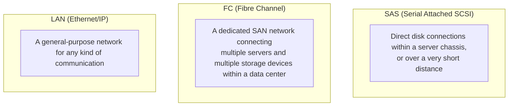
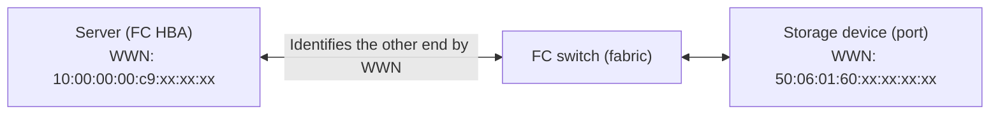

## Introduction

- **What You'll Learn From This Article**: Starting from a practical explanation you might hear — "with a Fibre Channel connection, you don't need to worry about which segment the server and storage are on" — this article systematically explains **how FC recognizes the other end of a connection without using an IP address at all.** It also organizes what **FC (Fibre Channel)**, whose design philosophy is fundamentally different from an IP network (LAN), and **SAS (Serial Attached SCSI)**, used for direct connections within a server chassis, were each designed for, and how to choose between them in practice.
- **Intended Audience**: This article is aimed at engineers who've encountered the terms FC and SAS in server-to-storage connections, but who can't concretely explain how they differ from an IP network, or the design philosophy behind each standard.
- **Estimated Reading Time**: About 18 minutes

This article is part of the [Top 1% Series' full article guide](/en/sitemap), and the second article in the [Storage Fundamentals Series](/en/sitemap#series-list).

## Prerequisites

- **SAN (Storage Area Network)**: A configuration connecting multiple servers and multiple storage devices over a network. Rather than each server having its own directly attached storage, it's a mechanism that lets storage be treated as an external, shared resource.

## Getting the Big Picture

### The Three Connection Methods Have Fundamentally Different Design Philosophies

**FC, SAS, and LAN (Ethernet/IP) aren't simply "different types of cable." Each is a technology with a distinct design philosophy, assuming a completely different connection scope and purpose.**

## Fundamentals, Explained Thoroughly

### How FC (Fibre Channel) Recognizes the Other End Without Using an IP Address

This is the biggest question. **Because FC isn't an IP network at all, it doesn't use the concept of an IP address in the first place.** Instead, every device on an FC network (a server's FC HBA, a storage device's port, and so on) is assigned a **WWN (World Wide Name)** — **a globally unique identifier** — at the time of manufacture. This is the conceptual equivalent of a MAC address in the Ethernet world.

Dedicated FC switches (a network made up of multiple FC switches is called a **fabric**) manage which server can communicate with which storage device (and which port on it), based on this WWN. **The explanation "you don't need to worry about the segment" is pointing exactly at this.** Rather than dividing access scope by the concept of subnets/segments, as in an IP network, **FC performs access control through a mechanism called zoning, which directly specifies which device can communicate with which other device, based on WWN.** The very concept of IP address allocation design or routing simply doesn't exist in FC.

What is zoning?

**Zoning** is a mechanism on an FC switch that defines rules such as "this server's WWN can only communicate with this specific port's WWN on this storage device," based on WWN (or which physical switch port a device is connected to). This is similar to the role a VLAN or access control list (ACL) plays in an IP network, but it differs in that **it's based directly on a device's own identifier (WWN), without going through the abstraction of an IP address.**

### Even in a direct connection with no FC switch, WWN identification still happens automatically

There's also a configuration called **point-to-point**, where a server and a storage device are connected directly by cable, without an FC switch. In this case, the administrator never has to manually specify the other end's WWN. **When a link comes up, an FC port automatically goes through a procedure called "login."** It first sends a `FLOGI` (Fabric Login) request, to check whether the other end is an FC switch (a fabric). In a direct connection with no fabric present, nothing responds to that `FLOGI`, so the port concludes "I'm in a point-to-point configuration" and instead **performs `PLOGI` (N_Port Login) directly against the other device itself, exchanging WWNs with it before starting communication.** In other words, exactly the way two directly connected devices on an IP network automatically learn each other's MAC address via ARP, **identifying the other end by WWN is something the FC protocol itself does automatically the moment the cable is connected — it isn't something an administrator configures explicitly.** Zoning only exists to enforce access control in an environment where multiple servers and multiple storage devices coexist through a fabric; in a direct connection where there's only ever one possible communication partner to begin with, the very concept of zoning has no meaning, so no configuration is needed.

### FC's Physical Layer: Completely Independent Wiring and Equipment From LAN

FC differs not only in its logical communication method — it's also **completely independent from an existing LAN (Ethernet) in terms of physical wiring and equipment.** On the server side, a dedicated adapter called an **FC HBA (Host Bus Adapter)**, separate from an ordinary NIC, connects via dedicated fiber-optic cable (copper in a small number of environments) to a dedicated FC switch. This entire set of wiring and equipment is built as an entirely separate network from the existing Ethernet LAN cables and switches.

The exception: FCoE (Fibre Channel over Ethernet)

In recent years, a technology called **FCoE (Fibre Channel over Ethernet)** has emerged, letting FC frames be encapsulated inside Ethernet frames so the physical wiring itself can be shared with Ethernet. Even in this case, though, **FC's own logical mechanisms — identification by WWN, zoning, and so on — remain unchanged.** It's accurate to understand this purely as a technology for letting the physical layer's wiring be shared — it doesn't change the design philosophy of the FC communication method itself.

### What Is SAS (Serial Attached SCSI)?

**SAS** is the serial-transmission version of **SCSI**, a standard that's long been used for storage connections. It's a standard used for **direct connections over a very short distance (a few meters) — within a server chassis, or to an external disk enclosure** — and it doesn't assume the kind of use case FC does, where **multiple servers and multiple storage devices communicate freely with each other over a network.**

**SAS's basic idea is strictly a "direct one-to-one connection (or one-to-many via a relay device called an expander)," and it has no network-like mechanism of its own — no "fabric" or zoning, unlike FC.** It's easiest to understand as the most basic storage connection method, used for connecting HDDs/SSDs built into a server, or an external disk enclosure directly attached to a server.

### How does SAS identify the other end of a connection?

Just as FC identifies devices by WWN, **SAS devices (an HBA, a disk, an expander port, and so on) also each carry a globally unique identifier, assigned at manufacture, called a `SAS address`.** You can think of this as essentially the same idea as FC's WWN. In a somewhat more complex configuration, with multiple disks connected in a tree via expanders, a management protocol called **SMP (Serial Management Protocol)** is used to run a discovery procedure, querying which SAS-addressed device is attached to which port.

Does SAS have anything equivalent to zoning?

It doesn't come up in a basic one-to-one direct connection, but in more advanced enterprise SAS configurations — where multiple servers (initiators) share the same disk enclosure — a mechanism called **SAS zoning**, similar in spirit to FC's zoning, is sometimes used. Zoning configuration gets applied to the expander via SMP, restricting which disks are visible to which specific initiator. This is an advanced use of SAS, though, and isn't something you need to think about for a simple direct connection within a server chassis or over a short distance.

## The View From the Top 1% Perspective

### Criteria for Choosing: By Connection Scope and Requirements

The choice between the three methods can be organized by the following criteria:

| Method | Main use case | Characteristics |
|---|---|---|
| **SAS** | A very short-distance connection within a server chassis, or to a directly attached external disk enclosure | A simple direct connection where the very concept of a network isn't needed |
| **FC** | Building a SAN connecting multiple servers and multiple storage devices within a data center | Mature bandwidth guarantees, low latency, and congestion control via a dedicated network completely independent from IP. Traditionally chosen in large-scale enterprise environments |
| **LAN (iSCSI, and so on)** | Wanting to build a SAN-equivalent configuration by reusing existing IP network/Ethernet equipment | Advantageous cost-wise since no additional dedicated equipment (an FC switch, an FC HBA) is needed. Traditionally considered to fall short of FC's low latency and bandwidth guarantees, though the gap has narrowed with the spread of high-speed Ethernet |

Comparing them on more concrete numbers — throughput and transmission distance — looks like this:

| Item | SAS | FC |
|---|---|---|
| Speed by generation | SAS-1 (3Gbps) → SAS-2 (6Gbps) → SAS-3 (12Gbps) → SAS-4 (24Gbps), roughly doubling each generation | 8G → 16G → 32G → 64G → 128G, roughly doubling each generation |
| Transmission distance | Fundamentally a copper-cable direct connection, on the order of a few meters (somewhat extendable with active cables or expanders) | Fundamentally fiber optic, reaching up to roughly 10 km depending on generation — capable of long-distance connections such as between data centers |
| Connection topology | One-to-one, or a one-to-many tree via an expander | A full-scale network (fabric) buildable via FC switches |

As this table shows, **SAS and FC are fundamentally aimed at different scenarios: "short distance, low cost" versus "long distance, large-scale networking."** SAS's per-generation speed has climbed to a level that holds its own against FC, but the difference in transmission distance and topological flexibility means one doesn't simply replace the other's use case.

**The reason FC continues to be chosen in enterprise environments today is the maturity of its bandwidth guarantees, low latency, and congestion control, stemming from being a dedicated communication method completely independent from IP networks.** On the other hand, LAN-based options like iSCSI are also widely used, thanks to being able to reuse existing IP network infrastructure and avoid additional dedicated-equipment investment. Which to choose is a trade-off judgment based on **existing network investment, the operations team's skill set, and the required performance level.**

## Common Misconceptions and Pitfalls

- **Misconception 1: "FC is a kind of IP network, and internally uses something equivalent to an IP address"**
  FC is a communication method from an entirely separate lineage from IP networks, and doesn't use the concept of an IP address at all. Devices are identified using a unique identifier called a WWN.
- **Misconception 2: "SAS is a network protocol that can communicate freely with multiple destinations"**
  SAS's basic idea is a direct one-to-one connection (or one-to-many via an expander), and it has no network-like mechanism such as a fabric or zoning, unlike FC.
- **Misconception 3: "Using FCoE replaces FC itself with Ethernet"**
  FCoE is a technology for carrying FC frames encapsulated over Ethernet's physical wiring — FC's own logical mechanisms, such as identification by WWN and zoning, remain unchanged.

## The Troubleshooting Perspective

For FC/SAN-related issues, the basic approach is to **isolate whether the problem is with the physical wiring/equipment, or with zoning (logical access control).**

1. **A specific storage device's (LUN's) storage isn't visible from a server**: Check whether that server's WWN is zoned to be able to communicate with the target storage device's port.
2. **The FC HBA itself isn't recognized**: Check the OS-side device driver, and the physical connection between the FC HBA and the FC switch (the fiber-optic cable, SFP modules, and so on).
3. **An external disk enclosure connected via SAS isn't recognized**: Check the SAS cable connection itself, and if going through an expander, its configuration.

### Preventive Measures and Permanent Fixes

- Before making a zoning configuration change, accurately identify the target WWNs and the scope of impact ahead of time.
- When designing an FC/SAN environment, compare whether FC or iSCSI better fits the requirements, factoring in existing network investment and the operations team's skill set.

## Summary

- FC, SAS, and LAN aren't simply different types of cable — they're technologies with distinct design philosophies, assuming different connection scopes and purposes.
- FC doesn't use IP addresses — it identifies devices by a globally unique identifier called a WWN, and performs access control via a mechanism called zoning, so there's no need to worry about a segment-like concept as in an IP network.
- SAS is a standard used for direct disk connections within a server chassis or over a very short distance, and has no network-like mechanism (a fabric, zoning) like FC.
- FC continues to be chosen in large-scale enterprise environments due to the maturity of its bandwidth guarantees and low latency as a dedicated network, while LAN-based options like iSCSI offer a cost advantage by reusing existing infrastructure.

**What to Keep in Mind From Today**
1. When you hear the explanation "you don't need to worry about the segment" for FC, remember that access control is done by WWN and zoning, not by IP address.
2. When you encounter the terms SAS, FC, and LAN, keep in mind the difference in connection scope each assumes (direct connection within a chassis, a SAN, or a general-purpose network).

## References

- [Fibre Channel Overview | SNIA](https://www.snia.org/education/what-is-fibre-channel)
- [Serial Attached SCSI (SAS) | SNIA Dictionary](https://www.snia.org/education/dictionary)
- [Fibre Channel Zoning | Storage Networking Industry Association](https://www.snia.org/education)
