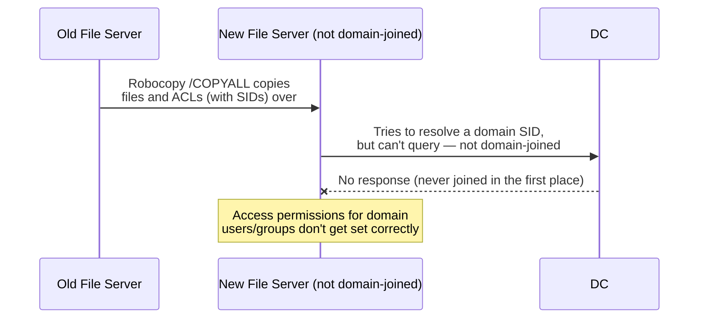

## Introduction

- **What You'll Learn From This Article**: It's well known that `Robocopy`'s `/COPYALL` option is supposed to copy access permissions (ACLs) along with the files, in a file server migration. But there's a surprising pitfall: **run it while the new server isn't domain-joined yet, and permissions for domain users and domain groups don't copy correctly.** After understanding **that NTFS ACLs are recorded using an identifier called a SID, and that resolving that SID requires domain membership**, you'll systematically understand why the idea "making it read-only before copying keeps things safe" can lead to an easy-to-miss oversight, unless you understand [the two-layer structure of share permissions and NTFS permissions](/en/articles/smb-file-sharing-guide).
- **Intended Audience**: Readers who've used `Robocopy`'s `/COPYALL` option in a file server migration or replacement, but can't explain why the timing of domain join actually matters.
- **Estimated Reading Time**: About 17 minutes

This article is part of the [Top 1% Series Complete Article Guide](/en/sitemap), and article 8.1 in the [Windows Server Operations Series](/en/sitemap#series-list).

## Prerequisite Knowledge

- [Windows Server's SMB Shares](/en/articles/smb-file-sharing-guide): The premise that share permissions and NTFS permissions are two independent layers of access control.
- [The Difference Between AD, DC, Domains, and Forests](/en/articles/ad-dc-fundamentals-guide): The premise that a domain-joined device communicates with a DC to perform authentication and resolve account information.

## Getting the Big Picture

**An NTFS ACL (Access Control List) records "who" gets a permission not as a readable string like a username or group name, but as an internal identifier called a SID (Security Identifier).** A SID in the form `S-1-5-21-...` doesn't directly tell either a human or the OS "who it refers to," on its own. **For the OS to translate a SID into meaningful information about who it refers to, it needs to query the SID's issuing authority — either the local computer, or the domain.** For a domain user or domain group's SID, that query target is the DC. **If the new file server isn't domain-joined yet, it has no way at all to query a DC, and can't resolve any domain SID.** As a result, even when `Robocopy` tries to copy the entire ACL wholesale with `/COPYALL`, only the permission settings tied to domain SIDs end up failing to migrate correctly.

## Deep Dive Into the Fundamentals

### Why Domain SIDs Don't Copy Correctly, Even With `/COPYALL`

**`Robocopy`'s `/COPYALL` option (internally `/COPY:DATSOU`) is a setting that copies not just the file's data, but also security-related attributes together — timestamps, owner information, ACLs, and so on.** When copying an ACL, **Windows tries to verify whether the SID it's about to write at the destination is an actually resolvable (i.e. valid) security principal.** **A local group or local user's SID can be resolved just by looking at the destination computer's own local account information,** but **a domain user or domain group's SID can only be resolved if the destination computer is domain-joined and in a state where it can query a DC.** On a destination that isn't domain-joined, this SID resolution fails, and **by default, the access control entry (ACE) for a SID that couldn't be resolved simply doesn't get set correctly.** Since the file itself still copies normally, "the copy succeeded" looks true on the surface, but **only the permissions are quietly missing** — a mismatch that's genuinely easy to overlook by appearance alone.

Another Pitfall When Local Groups Are in Use

**If the old file server's ACL used that server's own local group (not a domain group),** this problem gets even trickier. **A local group's SID is specific to the computer where that group was created, and can never be resolved from a different computer (the new file server) at all, even if that computer is domain-joined.** At the destination, this SID gets treated as "an account that doesn't exist," ending up as what's called a **dead SID** — an orphaned SID whose owner can't be resolved. Early in migration planning, it's worth checking whether the old file server's ACL uses any local groups, and if so, replacing them with domain groups before the migration.

### The Correct Migration Order

To avoid the problem above, you need to strictly follow this order:

1. **Domain-join the new file server first** (don't copy any files yet, at this point)
2. **Confirm domain join has completed, and that it's in a state where it can query a DC**
3. **Only after reaching this state, copy files and ACLs with `Robocopy /COPYALL`**

With this order, the new file server stays in a state where it can query a DC throughout the copy process, so domain user and domain group SIDs resolve correctly, and the ACL carries over exactly as-is.

## What a Pro Sees Here (Top 1% Understanding)

### The Oversight Behind "Making It Read-Only Before Copying Keeps Things Safe"

In file server migrations, it's common to temporarily make the old file server's shared folder read-only, to prevent the accident of **a user updating a file during the migration, causing a mismatch with the post-copy content.** A question practitioners often have at this point is: **"Will this read-only setting get copied as-is to the new server by Robocopy, accidentally leaving the new server stuck read-only too?"**

**The answer to this question becomes clear once you understand [the two independent layers of access control: share permissions and NTFS permissions](/en/articles/smb-file-sharing-guide).** If you set the read-only restriction **as a share permission (the permission set at the "entrance" to the shared folder)**, that setting is information tied to the shared folder itself, and **all `Robocopy` ever copies is the NTFS ACL of the files and folders themselves.** Share permissions are never recorded anywhere on the filesystem, so they're never even included in what `Robocopy` copies in the first place. **In other words, a read-only setting made as a share permission never carries over to the new server via Robocopy at all** — it needs to be explicitly reconfigured when creating the share on the new server.

What Happens If the Read-Only Restriction Was Set as an NTFS Permission?

On the other hand, if the read-only restriction was set **as an NTFS permission (an individual permission recorded on the file or folder itself)**, the story changes. In this case, that restriction is **part of the file's own ACL**, so `Robocopy /COPYALL` copies this restriction over to the new server as-is, too. **Users will keep being unable to write on the new server even after the migration completes**, so the final stage of the migration work needs to include, on its checklist, the task of explicitly lifting any read-only restriction that was set as an NTFS permission.

## Common Misconceptions and Pitfalls

- **Misconception 1: "Using `/COPYALL` copies any ACL completely, no matter what."**
  All `/COPYALL` can copy is the ACL for SIDs resolvable at the destination. If the destination isn't domain-joined, a domain SID can't be resolved, and doesn't copy correctly.
- **Misconception 2: "The file copy completing successfully means the access permissions carried over correctly too."**
  Even when the file copy itself succeeds, an ACE whose SID couldn't be resolved never gets set correctly — and goes missing in a way that's genuinely easy to overlook by appearance.
- **Misconception 3: "Making the shared folder read-only means Robocopy carries that over to the new server as-is."**
  A read-only setting made as a share permission isn't included in the NTFS ACL that Robocopy copies at all, and needs to be explicitly reconfigured on the new server's side.

## Troubleshooting Perspective

1. **Reports keep coming in that domain users can't access the file server after migration**: Check whether the new server was actually domain-joined at the time of migration, and whether the old server's ACL used any local groups.
2. **A specific folder stays stuck non-writable even after migration**: Check the old server's ACL from before migration, for whether a read-only restriction was set as an NTFS permission.
3. **After migration, every access to the shared folder on the new server gets denied**: Check whether share permissions were explicitly set when creating the share on the new server's side. Even with correct NTFS permissions, access gets denied if share permissions were never configured.

## Summary

- An NTFS ACL is recorded using an internal identifier called a SID, not a username or group name.
- Resolving a domain user or domain group's SID requires the destination computer to be domain-joined and in a state where it can query a DC.
- Copying with Robocopy before domain-joining the new file server causes only the access permissions tied to domain SIDs to fail to migrate correctly.
- Share permissions and NTFS permissions are two independent layers, and all Robocopy ever copies is the NTFS permissions.

**Takeaways to Apply Today**
1. In a file server migration, always confirm "the new server's domain join has completed" before running a Robocopy file copy.
2. Early in migration planning, check whether the old file server's ACL uses any local groups.

## References

- [Robocopy | Microsoft Learn](https://learn.microsoft.com/en-us/windows-server/administration/windows-commands/robocopy)
- [How Security Descriptors and Access Control Lists Work | Microsoft Learn](https://learn.microsoft.com/en-us/windows/win32/secauthz/access-control-lists)
