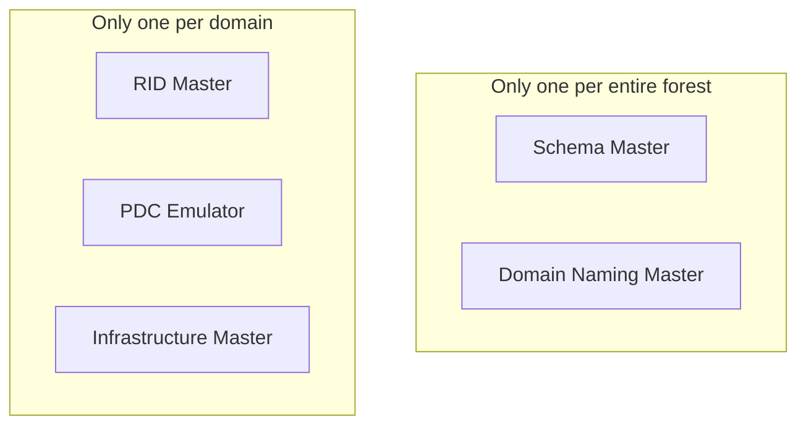
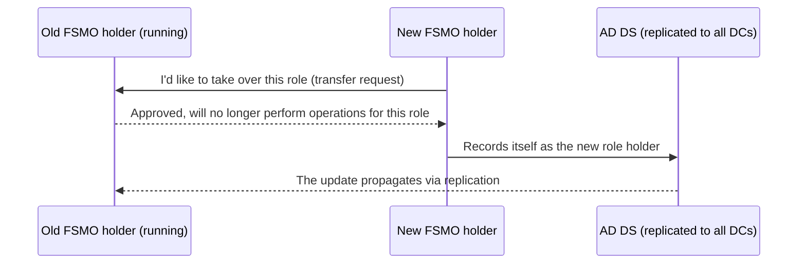

## Introduction

- **What You'll Learn From This Article**: The principle covered in [Understanding the Difference Between AD and DC, and Domains vs. Forests, from a "Top 1%" Perspective](/en/articles/ad-dc-fundamentals-guide) — that "AD DS is fundamentally built on multi-master replication" — actually has an exception. Five roles called **FSMO (Flexible Single Master Operations)** are specially set up as single-master operations: only one DC in the forest or domain can perform them. This article systematically explains why only these five roles can't be multi-mastered, what each role concretely does, and the mechanism behind **FSMO transfer** — moving an FSMO role from one DC to another.
- **Intended Audience**: This article is aimed at engineers who've performed "FSMO migration" as part of an AD migration or DC build procedure, but who can't concretely explain what each of the five roles does or why it needs a single master.
- **Estimated Reading Time**: About 20 minutes

This article is part of the [Top 1% Series' full article guide](/en/sitemap), and the sixth article in the [Active Directory series](/en/sitemap#series-list). It assumes you understand the domain/forest boundary from [Understanding the Difference Between AD and DC, and Domains vs. Forests, from a "Top 1%" Perspective](/en/articles/ad-dc-fundamentals-guide).

## Prerequisites

- **Multi-master replication**: The way ordinary AD DS changes propagate — a change made on any DC eventually propagates to every other DC. See [Understanding the Difference Between AD and DC, and Domains vs. Forests, from a "Top 1%" Perspective](/en/articles/ad-dc-fundamentals-guide) for details.
- **SID (Security Identifier)**: A value that uniquely identifies a user or computer, made up of a combination of the domain SID (the part shared across that domain) and a **RID (Relative Identifier)**, a number unique per object.

## Getting the Big Picture

### Why This Exception to Multi-Master Is Needed

Multi-master replication relies on the premise that "whatever DC you change something on, it eventually propagates to the others." But AD DS has several kinds of operations where **a simple approach can't correctly reconcile conflicting changes made simultaneously on multiple DCs.** For example, if two DCs independently and simultaneously assigned the exact same SID number to two different new users, there'd be no mechanical way to decide which SID is correct once the replication arrives later.

**FSMO (Operations Master) roles are a mechanism that restricts specific kinds of operations — ones where conflicts could arise if multiple DCs performed them simultaneously — to a single DC within the forest or domain.**



There are five FSMO roles in total: two are held by a single DC **across the entire forest**, and the other three are held by a single DC **per domain**. In a single-domain forest, all five roles could in theory be consolidated onto one DC, but in a multi-domain forest, the three per-domain roles (RID, PDC Emulator, Infrastructure) naturally exist once for each domain.

## Fundamentals, Explained Thoroughly

### One Per Forest: Schema Master

The **Schema Master** is the sole DC in the forest that can make changes to the AD DS schema (the object type definitions). The schema is information shared across the entire forest, and if multiple DCs made conflicting changes to it at the same time (such as adding the same attribute name with different definitions), it could break the consistency of the object structure across the entire forest. Schema changes themselves happen only occasionally — typically when deploying certain products like Exchange Server or SCCM — and aren't something performed frequently in day-to-day operations. What actually happens when the schema is extended, and why it's essentially irreversible, is covered in depth in [Understanding AD Schema Extension](/en/articles/ad-schema-extension-guide).

### One Per Forest: Domain Naming Master

The **Domain Naming Master** is the sole DC in the forest that can add or remove domains from the forest (and add or remove certain application partitions). "Globally unique" here doesn't mean **unique across the entire internet worldwide — it means unique within your own forest, and only that.** Even if multiple different organizations (each in their own separate forest) all happen to use a commonly-recycled internal name like `test.local`, that's not a problem at all, since the forests are separate. What the Domain Naming Master manages and guarantees is strictly **preventing the accident of two domains with the same name ending up inside your own forest** — it has no involvement with, or even any means of knowing about, domain names that exist out in the world beyond your forest.

### One Per Domain: RID Master

As noted in the prerequisites, an object's SID is composed of "domain SID + RID." Every time a new user, computer, or group is created, the DC handling it needs to allocate a new RID — but **if each DC independently and freely numbered RIDs on its own, the same RID could end up duplicated across multiple DCs at once, causing a SID collision.**

To prevent this, the **RID Master** uses a scheme where it **allocates a block of RIDs (by default, 500 at a time) to each DC in the domain ahead of time.** Each DC can freely number RIDs within its own assigned block without needing to coordinate with any other DC, and when it's about to run out, it requests the next block from the RID Master. **RID allocation itself happens locally on each DC, while only the block-level assignment is centrally managed through the single-master RID Master** — this avoids needing to query a single master on every single object creation, while still preventing duplicates.

<details>
<summary>RID pool exhaustion: a practical risk</summary>

Because RIDs have a theoretical upper limit (a 32-bit value range), **RID pool exhaustion** can become a practical concern in very large, long-running domains that have gone through an enormous number of object creations and deletions over a very long time. When the RID Master's remaining allocatable block runs low, a warning is logged to the event log. If left unaddressed, this can eventually make it impossible to create new user or computer accounts, so in large, long-lived domains, it's recommended to monitor RID pool consumption.

</details>

### One Per Domain: PDC Emulator

The **PDC Emulator** is, in effect, the role that shoulders the most practical responsibilities among the five FSMOs — a sort of "face of the domain."

- **Authority as the time server**: Time synchronization within a domain (the Windows Time service) is hierarchical — each DC synchronizes to the PDC Emulator's clock, and ordinary domain-joined PCs synchronize to their DC's clock. Kerberos authentication is strict about clock drift, and if the drift exceeds the allowed tolerance (5 minutes by default), authentication itself fails outright — so the PDC Emulator's clock accuracy is directly tied to the stability of authentication across the entire domain.

<details>
<summary>What does the PDC Emulator itself synchronize its time against?</summary>

If you haven't explicitly configured an upstream time source above the PDC Emulator, the Windows Time service **free-runs off the PDC Emulator's own local hardware clock (the CMOS clock)** as its time source. Because every other DC and client in the domain synchronizes to this same PDC Emulator, **there's no relative time drift within the domain** — meaning that not syncing with an external NTP source doesn't immediately break Kerberos authentication.

That said, this isn't a recommended configuration. CMOS clocks generally have poor accuracy and are prone to drift accumulating over the long term, and as the absolute gap versus true external time (UTC) gradually widens, problems start to surface in areas outside authentication — certificate expiration checks, correlating log timestamps, or time synchronization if you ever establish a cross-forest trust with another organization. Even in an environment where the internal segment has no connectivity to the internet, the standard practice is to **explicitly configure a high-precision time source located somewhere inside your own network (such as a GPS-equipped NTP appliance) as the PDC Emulator's sync target**; if even that isn't available, at minimum, the people operating the environment should be aware that "this PDC Emulator is free-running off its CMOS clock" and periodically check for drift.

</details>

- **Immediate propagation of password changes**: Ordinary AD DS changes propagate through multi-master replication (with some lag), but **password changes** get special treatment. When a password is changed on any DC, that DC **immediately forwards the change to the PDC Emulator**, without waiting for the usual replication order. This means that if a logon request happens to land on a different DC that hasn't yet received the replicated change right after a password change, that DC can rescue the situation by "checking with the PDC Emulator for the latest password if authentication fails against its own local copy" — reducing the chance of a legitimate user getting mistakenly locked out right after changing their password.
- **The default target for Group Policy edits**: When editing a policy in the Group Policy Management Console (GPMC), the edit is always directed at the PDC Emulator by default. If multiple administrators edited a policy against different DCs at the same time, it could lead to conflicts or overwrites — centralizing the edit operation itself onto a single DC avoids this.

### One Per Domain: Infrastructure Master

The **Infrastructure Master** is responsible for **updating reference information when an object in another domain that's referenced by an object in this domain (for example, a user in a different domain who's a member of a group in this domain) gets renamed or moved.**

This FSMO has a **placement caveat** that's particularly important to keep in mind in practice. **A DC holding the Infrastructure Master role should, in principle, not also serve as a global catalog (GC)** (unless every DC in the forest also serves as a GC). The reason is that, as explained in [Understanding the Difference Between AD and DC, and Domains vs. Forests, from a "Top 1%" Perspective](/en/articles/ad-dc-fundamentals-guide), a GC also holds a partial replica of objects in other domains in the forest — meaning **the GC itself can always see what the referenced object actually looks like now, so it can never detect the "stale references (so-called phantom objects)" the Infrastructure Master is supposed to find.** As a result, co-locating the Infrastructure Master on the same DC as a GC can lead to a bug where a rename of an object in another domain fails to be correctly reflected in this domain's references (such as a group member's displayed name).

<details>
<summary>Does a GC need a FSMO-style "transfer" too?</summary>

In short, no — a GC is a fundamentally different kind of role from FSMO. **FSMO is a single-master role that only one DC in the entire forest or domain can hold at a time, whereas GC is more like a multi-master role that can be given to as many DCs as you want.** Turning a DC into (or out of) a GC is done simply by toggling the "Global Catalog" checkbox on that DC's NTDS Settings object properties — there's no procedure like a FSMO transfer, where you explicitly hand the role off from the current holder to the next. By default, only the **first DC of each domain (the very first DC in the forest)** holds a GC; every other DC doesn't hold one unless an administrator explicitly adds it.

So why would you deliberately give a GC to only some DCs in a multi-domain forest? Every additional GC you stand up means that DC now **continuously replicates a partial attribute set from every other domain in the forest** — so the more domains a forest has, the more directly adding GCs drives up replication traffic. This matters especially in configurations spanning thin inter-site WAN links, where the choice becomes a tradeoff between availability and network cost: "put a GC locally to prioritize that site's logon and search performance," versus "keep GCs consolidated on the DCs at a central site to keep link load down."

</details>

## FSMO Transfer: Safely Moving a Role

The operation of moving an FSMO role from one DC to another is called **FSMO transfer.** A transfer is a **proper procedure performed while the current role holder (the old DC) is still up and running normally.** It can be performed from the Active Directory Administrative Center, PowerShell (`Move-ADDirectoryServerOperationMasterRole`), or `ntdsutil` — the old and new DCs communicate directly, and the role-holder information is explicitly updated in AD DS.



<details>
<summary>The difference between transfer and seizure</summary>

By contrast, **seizure (forced role transfer)** is used when the old DC has been **completely lost — to a disaster, hardware failure, and so on — and can never be recovered.** It's an operation, performed via `ntdsutil`, that forcibly assigns the role to a different DC without a proper exchange with the old DC. **Seizure is positioned as a last resort, used only after confirming the old DC is truly unrecoverable.** If the old DC actually turns out to still be alive and later comes back online, you can end up in a state where two DCs simultaneously believe they hold the same role — which can lead to serious consistency problems, particularly for the Schema, Domain Naming, or RID Master roles. So **after a seizure, the old DC must never be brought back onto the network as-is; it must be fully wiped (such as by reinstalling the OS) before being reused.**

</details>

<details>
<summary>What actually happens if you demote a DC without remembering to transfer its roles first?</summary>

If you try to demote a FSMO-holding DC through the normal procedure (the "Remove Roles and Features" wizard in Server Manager, or `Uninstall-ADDSDomainController`) while other DCs still exist in the domain, **the wizard itself checks whether that DC holds any FSMO roles and, where possible, automatically transfers them to another DC in the same domain/forest before completing the demotion.** In other words, "I forgot to transfer and just demoted it normally, and now no DC anywhere holds that role" essentially can't happen through an ordinary demotion (one that doesn't use a force flag).

Things are different if this automatic transfer fails, or if you deliberately skip the safety checks using an option like `-Force` to force the demotion through. In that case, you end up in the same situation as a seizure described above — **the record in AD DS still points to "that DC is the holder," but that DC no longer actually exists.** The same applies if there are no other DCs left in the domain at all (a lone remaining DC, meaning not a single surviving DC holds that FSMO role). The remedy is to run a seizure via `ntdsutil` against a remaining DC (or a newly promoted one, if none remain), explicitly overwriting that role's holder information in AD DS.

</details>

## The View From the Top 1% Perspective

### How to Check Who Holds Which FSMO Role

You can easily check which DC currently holds which FSMO role from the command line.

```powershell
netdom query fsmo
```

You can also retrieve this via PowerShell's `Get-ADForest` (for the Schema Master and Domain Naming Master) and `Get-ADDomain` (for the RID, PDC Emulator, and Infrastructure Masters). During an AD migration, it's important to build the habit of running this command at each stage of the migration to confirm the role placement is as expected.

### Should All FSMO Roles Be Consolidated on One DC, or Spread Out?

In a single-domain forest, it's common to see all five FSMO roles consolidated onto a single DC. This offers the operational benefit of **making it easier to track and manage where the roles live.** On the other hand, in a multi-domain forest, or a large-scale environment prioritizing availability, some designs deliberately spread the FSMO roles across multiple DCs, aiming for load distribution and limiting the blast radius of a DC failure. Since **different roles have different placement considerations** — as with the Infrastructure Master/GC placement constraint noted above — there's no simple, universal answer of "always consolidate" or "always spread out"; the design needs to account for the number of domains, GC placement, and availability requirements.

## Common Misconceptions and Pitfalls

- **Misconception 1: "If even one DC holding an FSMO role goes down, the whole of AD immediately stops working"**
  Operations that involve FSMO (schema changes, RID allocation for new objects, and so on) are independent of ordinary logons, authentication, and access to existing objects. Even if the FSMO holder is temporarily unavailable, most day-to-day operations (like existing users logging on) continue without a problem. That said, the PDC Emulator going down does affect time synchronization and the immediate propagation of password changes, so its impact tends to be noticed more readily than the other roles.
- **Misconception 2: "As long as you transfer the FSMO, all of the old DC's information automatically disappears too"**
  FSMO transfer only rewrites the role-holder information — it's an entirely separate operation from fully removing the old DC from AD DS (demotion and removal).
- **Misconception 3: "The Infrastructure Master needs careful placement even in a single-domain forest"**
  In a single-domain forest, it's typical for every DC to also serve as a GC, in which case the Infrastructure Master/GC placement constraint effectively doesn't apply (in fact, if every DC is a GC, this constraint is exempted entirely). This caveat becomes practically important in a multi-domain forest where only some DCs hold the GC role.

## The Troubleshooting Perspective

For FSMO-related issues, the basic approach is to **isolate whether the operation in question genuinely requires reaching the FSMO holder.**

1. **Can't create a new user or computer account**: Check whether the RID Master is reachable, and whether the RID pool has been exhausted.
2. **A group's displayed name for a member from another domain remains stale**: Check whether the Infrastructure Master is co-located on the same DC as a GC (in a multi-domain forest), and whether the Infrastructure Master itself is functioning normally.
3. **Kerberos authentication fails for no apparent reason**: Check whether time synchronization anchored to the PDC Emulator is functioning correctly across the domain, and whether the clock drift between a client and DC is within tolerance.
4. **A DC that held an FSMO role was completely lost in a disaster**: After confirming with certainty that it's unrecoverable, perform a seizure. Enforce an operational rule that strictly prohibits ever bringing the old DC back onto the network as-is after a seizure.

### Preventive Measures and Permanent Fixes

- In large, long-lived domains, periodically monitor RID pool consumption.
- In a multi-domain forest, explicitly account for the Infrastructure Master/GC placement constraint at design time.
- Prioritize DCs holding FSMO roles for backup and availability measures (such as snapshots or redundancy in a virtualized environment) wherever possible.

## Summary

- FSMO is a mechanism that restricts specific operations — ones where conflicts could arise if performed simultaneously on multiple DCs — to a single DC within the forest or domain.
- The Schema Master and Domain Naming Master are held by a single DC across the entire forest; the RID Master, PDC Emulator, and Infrastructure Master are held by a single DC per domain.
- The PDC Emulator is the FSMO with the broadest practical impact, shouldering multiple real-world responsibilities: the time synchronization anchor, immediate propagation of password changes, and the default target for Group Policy edits.
- FSMO transfer is a proper procedure performed while the old holder is still running; seizure is a forced measure used only when the old holder is completely lost — and after a seizure, the old DC must never be brought back online as-is.

**What to Keep in Mind From Today**
1. Build the habit of running `netdom query fsmo` at each stage of an AD migration to confirm the FSMO placement is as expected.
2. When designing or operating a multi-domain forest, always confirm the Infrastructure Master isn't co-located on the same DC as a GC.

## References

- [FSMO Roles | Microsoft Learn](https://learn.microsoft.com/en-us/troubleshoot/windows-server/identity/fsmo-roles)
- [Transfer or Seize FSMO Roles in AD DS | Microsoft Learn](https://learn.microsoft.com/en-us/troubleshoot/windows-server/identity/transfer-or-seize-fsmo-roles-in-ad-ds)
- [Understanding RID Allocation | Microsoft Learn](https://learn.microsoft.com/en-us/troubleshoot/windows-server/identity/understanding-rid-allocation-issues)
- [Windows Time Service Technical Reference | Microsoft Learn](https://learn.microsoft.com/en-us/windows-server/networking/windows-time-service/windows-time-service-tech-ref)
