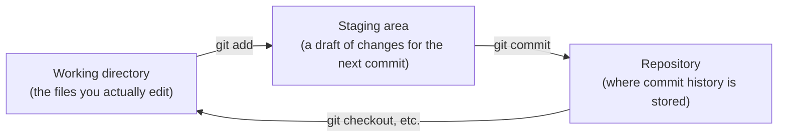

## Introduction

- **What You'll Learn From This Article**: Articles like [The Top 1% Hands-On for Never Leaving a Password in Plaintext in Git With Ansible Vault](/en/articles/ansible-vault-handson-guide) have used commands like `git add` and `git commit` without explanation. This article covers the relationship between the three areas Git manages (the working directory, the staging area, and the repository), and the mechanism of version control itself, working in units called commits.
- **Intended Audience**: Readers who've copy-pasted `git add` and `git commit` as steps in a hands-on, but can't explain what each command actually does, or what a commit even is.
- **Estimated Reading Time**: About 20 minutes

This article is part of the [Top 1% Series Complete Article Guide](/en/sitemap), the 15th article in the [Linux/OS Fundamentals Series](/en/sitemap#series-list).

## The Big Picture

Git records a file's change history by routing it through three areas.



## A Thorough, Grounds-Up Explanation

### The Three Areas: Working Directory, Staging Area, and Repository

The single most important thing to understand about Git is the division of labor between these three areas.

- **Working directory**: Where you normally have files actually open and being edited in your editor.
- **Staging area** (also called the index): Where the list of files you've chosen to "include in the next commit" is temporarily held.
- **Repository**: Where the staging area's content gets finalized as a commit, and accumulates as history.

**`git add <filename>` "moves" a change from the working directory into the staging area.** This alone doesn't leave anything in the history yet. **Only once `git commit` runs does the staging area's content get recorded into the repository as a single commit.**

```bash
git status   # Check the state of each of the three areas
git add requirements.yml
git commit -m "Pin geerlingguy.nginx to 3.1.4"
```

<details>
<summary>Why are add (staging) and commit separate steps?</summary>

At first glance, it seems like it'd be enough to commit a changed file directly, but there's a reason for this two-stage split. **Even while editing multiple files, it lets you choose just some of them and record them as one meaningful, coherent unit (a commit).** Say you're fixing a bug and, separately, tidying up an unrelated config file at the same time — you could `git add` and commit just the bug-fix files, and split the config file cleanup into a separate commit. This habit of "splitting commits into meaningful units" is an important real-world practice that makes a change's intent much easier to follow later, when reviewing history.

</details>

### A Commit Is a "Snapshot," Not a "Diff"

There's a common misconception about Git commits. **A commit doesn't just record the change (the diff) from the previous one — it records the state of every file (a snapshot) at that point in time.** That said, for files that haven't changed, it cleverly just holds a reference to the data an earlier commit already has, rather than storing duplicate copies of identical data. As a result, from a user's perspective it looks like "only the diff is being efficiently recorded," but the actual internal structure is "a collection of complete snapshots, reusing references to unchanged files."

<details>
<summary>What's that 40-character hexadecimal string called the commit hash?</summary>

Run `git log`, and you'll notice each commit is tagged with a 40-character hexadecimal string (a commit hash), like `a1b2c3d...`. This is a hash value computed from the commit's entire content — the snapshot's content, the commit message, author information, and the parent commit's hash. **Change even a single character of the commit's content, and this hash value becomes an entirely different value.** And since the "parent commit's hash" is included in that computation, every commit is cryptographically linked to the one before it, like a chain. This mechanism makes tampering with past history, after the fact, effectively extremely difficult.

</details>

### Remote Repositories and push/pull

Everything covered so far has been about a "local repository" that lives entirely on your own PC. In real-world work, it's common to work with a **remote repository** — one shared over the network, like on GitHub.

- **`git clone <URL>`**: Copies a remote repository's entire content onto your own PC.
- **`git push`**: Reflects (uploads) the commits accumulated in your local repository to the remote repository.
- **`git pull`**: Reflects (downloads) the remote repository's latest commits into your local repository.

**What `git push` actually sends isn't the latest state of the files themselves — it's the set of commit history that doesn't yet exist on the remote side.** This directly corresponds to the mechanism covered above: a commit is a collection of snapshots.

## What a Pro Sees Here (Top 1% Understanding)

### .gitignore: A Mechanism for Deliberately "Not Tracking" a File

A real-world repository almost always has a file called `.gitignore`. A file matching a pattern written there never gets included in the staging area, even when a bulk-add command like `git add .` is run. **Alongside the approach covered in [The Top 1% Hands-On for Never Leaving a Password in Plaintext in Git With Ansible Vault](/en/articles/ansible-vault-handson-guide) — encrypting secrets before committing them — another common real-world defense is registering the file containing secrets itself in `.gitignore`, removing it from Git's tracking entirely.** Encryption (Vault) and exclusion from tracking (.gitignore) aren't an either-or choice — combining both is the real-world standard.

## Common Misconceptions and Pitfalls

- **Misconception 1: "Running git add records the change into history."**
  `git add` is purely a temporary addition to the staging area. Only running `git commit` finalizes it into history.
- **Misconception 2: "A commit only stores the diff from the previous one."**
  In reality, a full snapshot of every file is recorded on every commit (internally optimized by reusing references to unchanged files).
- **Misconception 3: "Running git push overwrites the remote repository's file content directly."**
  What's actually sent is the commit history that doesn't yet exist on the remote side. The file content is reconstructed as a result of walking that commit history.

## Troubleshooting Perspective

1. **After git commit, a file you don't remember changing shows up in the record**: Check with `git status` whether you `git add`ed an unintended file.
2. **`git push` gets rejected**: In most cases, the remote side has a newer commit you haven't fetched yet. Pull the latest state with `git pull`, then push again.
3. **You accidentally committed a file containing secrets**: If you've already pushed it to the remote, just adding a commit that deletes the file leaves the secret sitting in past history. You need to rewrite history with a dedicated tool (like `git filter-repo`), and also revoke and reissue the leaked credential itself.

## Summary

- Git records change history by routing it through three areas: the working directory, the staging area, and the repository.
- `git add` is a temporary addition to the staging area; only `git commit` finalizes it into history.
- A commit is a collection of snapshots reusing references to unchanged files, not a diff.
- `.gitignore` is a separate defense, alongside encryption, for removing something like a secret from Git's tracking from the start.

**Takeaways to Apply Today**
1. Before running `git commit`, check with `git status` that only the changes you genuinely want are staged.
2. Defend a file containing secrets by combining both encryption (like Vault) and registering it in `.gitignore`.

## References

- [Git - Book (Pro Git)](https://git-scm.com/book/en/v2)
- [gitignore Documentation | Git](https://git-scm.com/docs/gitignore)
