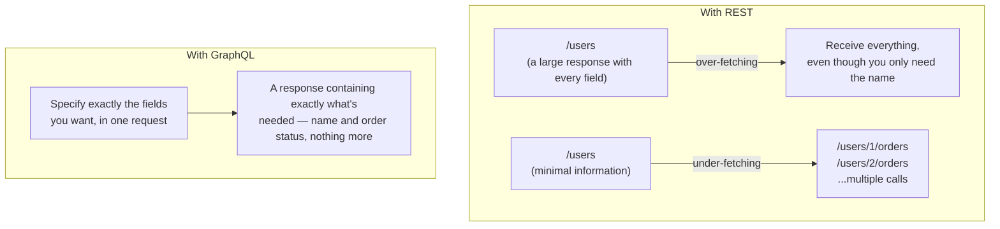

## Introduction

- **What You'll Learn From This Article**: Building on the design philosophy covered in [Understanding RESTful APIs](/en/articles/restful-api-guide) — specifying a resource via a URL — a systematic understanding of how **GraphQL**, an API spec with an entirely different design philosophy, solves REST's **over-fetching** (receiving more data than you need) and **under-fetching** (needing multiple API calls just to render one screen) problems.
- **Intended Audience**: Readers who've heard the word "GraphQL," but can't explain its difference from REST in terms of the actual request and response shapes.
- **Estimated Reading Time**: About 18 minutes

This article is part of the [Top 1% Series Complete Article Guide](/en/sitemap), and the fifth article in the [Web/API Series](/en/sitemap#series-list).

## Prerequisite Knowledge

- **RESTful API's Basic Design**: The design philosophy covered in [Understanding RESTful APIs](/en/articles/restful-api-guide) — specifying a resource via a URL, and expressing an operation via an HTTP method. GraphQL takes an entirely different approach from this.

## Getting the Big Picture

### Over-Fetching and Under-Fetching: REST's Two Contrasting Problems

Consider building a "user list screen" with a RESTful API.

- **Over-fetching**: Say the `/users` endpoint returns a response containing every field — name, email, address, purchase history, and more. Even if the screen only needs to show a name, you receive a large amount of unused data, every single time.
- **Under-fetching**: Conversely, if `/users` is designed to return only the bare minimum (just a name), you'd need an additional call to `/users/{id}/orders` for every single user, just to show each one's latest order status. Rendering a single screen can end up requiring dozens of API calls.



## Deep Dive Into the Fundamentals

### GraphQL's Idea: the Client Specifies the Exact "Shape of Data" It Wants, as a Query

In GraphQL, there's fundamentally just one endpoint (`/graphql`). **The client side writes the exact fields and structure it wants, directly into the request, as a query.**

```graphql
query {
  users {
    name
    orders {
      status
    }
  }
}
```

Send this query, and the server returns **a response matching exactly the fields specified in the query** — just the name, and the order's status. Fields you never specified in the query, like email or address, never appear in the response at all. This is how **over-fetching gets eliminated.**

And you receive information that spans across what would otherwise be entirely separate resources (separate REST endpoints) — "a user's name" and "that user's order status" — **in a single request, as a single response.** This is how **under-fetching gets eliminated.**

<details>
<summary>What's Actually Happening on the Server Side in GraphQL?</summary>

A GraphQL server parses the query it receives, and calls a function called a **resolver**, separately, for each field in the query (`name`, `orders`, `status`, and similar). The resolver tied to `users` fetches the user list from the database, and the resolver tied to the `orders` nested inside it fetches each user's order information, and so on. **From the client's view, it's one request — but internally, on the server side, multiple operations (potentially multiple database queries) are actually executing.** That exact gap — "simplicity from the client's view" versus "complexity inside the server" — is precisely the value GraphQL provides.

</details>

### GraphQL Has Trade-Offs Too

While GraphQL eliminates over-fetching and under-fetching, it introduces new challenges of its own.

- **Caching gets harder**: In REST, the URL itself (`/users/123`) functions as the cache key. In GraphQL, the endpoint is always the same (`/graphql`), and the response changes based on the query's content, making it hard to simply apply [an HTTP caching mechanism](/en/articles/http-caching-cdn-guide) as-is.
- **Load from complex queries**: If a client — deliberately or by mistake — sends a massive, deeply nested query, it can trigger a flood of resolver calls on the server side, risking an unexpectedly heavy load.

## What a Pro Sees Here (Top 1% Understanding)

### It's Not "Which Is Better, REST or GraphQL" — It's a Difference in "Who Decides What"

The essential difference between REST and GraphQL boils down to one single question: **"who decides the response's shape?"** In REST, **the server side (the API designer) decides the response's shape ahead of time, per endpoint.** In GraphQL, **the client side decides the response's desired shape, with every single request.** When multiple different screens (a web app, a mobile app, and similar) each need a differently shaped set of data, GraphQL offers the strength of handling this without multiplying server-side endpoints. On the other hand, for simple use cases, or where caching efficiency matters most, REST's URL-based simplicity can be the better fit. **This is never a binary "which is better" choice — it's a requirements-driven decision about who actually needs to decide the response's shape.**

## Common Misconceptions and Pitfalls

- **Misconception 1: "GraphQL is REST's successor, and is always better than REST."**
  REST and GraphQL are two separate design philosophies, each with different trade-offs. In cases where caching efficiency or simplicity matters most, REST can be the better fit.
- **Misconception 2: "With GraphQL, you never need to worry about server-side load."**
  A deeply nested, complex query risks an unexpectedly heavy load on the server side. Real-world practice usually requires a mechanism limiting query depth and complexity.
- **Misconception 3: "GraphQL always wraps up in a single database query."**
  It's a single request from the client's view, but internally, depending on the query's structure, multiple resolvers (potentially multiple database queries) actually execute.

## Troubleshooting Perspective

1. **An expected field is missing from the GraphQL response**: Check whether you forgot to explicitly specify that field in the query you sent.
2. **One specific query is extremely slow to respond**: Check whether the query is deeply nested, or whether it triggers too many resolver calls.
3. **A GraphQL response gets cached unintentionally, or doesn't get cached at all**: Because GraphQL doesn't lend itself to simple URL-based caching, you need a dedicated caching strategy (designing a cache key based on the query's content, and similar).

## Summary

- Over-fetching (receiving more data than needed) and under-fetching (needing multiple calls) are two contrasting problems REST tends to carry.
- GraphQL eliminates both problems by letting the client side specify the exact shape of data it wants, as a query.
- Because GraphQL's response shape changes dynamically, simple URL-based caching like REST's doesn't apply well, and query complexity introduces a new load-management challenge.
- The difference between REST and GraphQL comes down to a design philosophy question: who decides the response's shape, the server side or the client side.

**Takeaways to Apply Today**
1. When stuck on an API design decision, first ask yourself: "who do I want deciding the response's shape — the server side or the client side?"
2. If you adopt GraphQL, consider your caching strategy and query-complexity limits from the earliest design stage.

## References

- [GraphQL Official Documentation](https://graphql.org/learn/)
- [RFC 7234 - HTTP/1.1 Caching](https://datatracker.ietf.org/doc/html/rfc7234)
