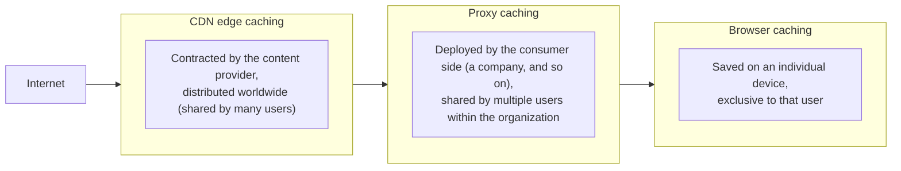
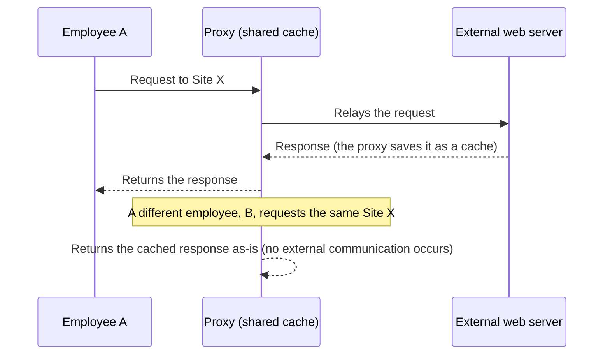
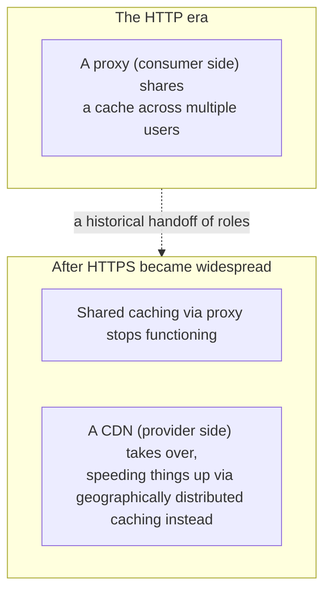

## Introduction

- **What You'll Learn From This Article**: This article explains the reasoning behind the claim "with HTTPS now widespread, a proxy can barely function as a cache anymore" — starting from **how a proxy achieved caching in the first place.** It also systematically explains **whether a browser's cache is affected by this same shift**, and **how a CDN (Content Delivery Network) relates to it**, organizing three distinct caching layers along the way.
- **Intended Audience**: This article is aimed at engineers who work with operating a proxy or CDN but can't concretely explain the effect HTTPS adoption had on proxy caching, or the difference in role between a browser cache and a CDN.
- **Estimated Reading Time**: About 17 minutes

This article is part of the [Top 1% Series' full article guide](/en/sitemap), and the second article in the [Web Proxy / Caching Fundamentals Series](/en/sitemap#series-list). It assumes you understand a proxy's basic role from [Understanding When to Use a Proxy vs. a Firewall from a "Top 1%" Perspective](/en/articles/proxy-firewall-guide).

## Prerequisites

- **HTTP caching**: A mechanism where headers a web server includes in its HTTP response, such as `Cache-Control`, control "how long this content may be reused."

## Getting the Big Picture

### Three Caching Layers

Web content caching has three representative layers, differing in **"for whom" and "where" the cache is held.**

**The core of this article is that, of these three, only "proxy caching" has effectively stopped functioning due to the rise of HTTPS.**

## Fundamentals, Explained Thoroughly

### How Proxy Caching Worked in the First Place

Back in the era of HTTP (unencrypted communication), a proxy **could read the content of a passing HTTP response as-is (the URL, response body, `Cache-Control` header, and so on).** This let it, for example, when multiple employees within a company each accessed the same popular external website, **save the content it retrieved when the first person accessed it, and serve subsequent requests from that cache.** This mechanism is based on the idea of **sharing** one cache among many users within an organization.

### Why This Mechanism Stopped Working With the Rise of HTTPS

With HTTPS, **the entire communication between client and server is encrypted.** In a typical proxy configuration that doesn't perform SSL inspection, covered in [Understanding When to Use a Proxy vs. a Firewall from a "Top 1%" Perspective](/en/articles/proxy-firewall-guide), **the proxy can't read the content of this encrypted communication at all.** All the proxy sees is a relay of an opaque, encrypted byte stream — it can't even determine **whether that response is cacheable, or which URL it's a response to in the first place.** (SNI reveals the destination hostname, but the path and response body remain invisible.)

**As a result, a proxy's traditional role of sharing content among multiple users has effectively stopped functioning for HTTPS traffic.** SSL inspection could technically make caching possible again, but since it requires decrypting the traffic, it isn't a common practice due to privacy and processing-cost concerns. Given that **the vast majority of internet traffic today is HTTPS**, the understanding that "a proxy's role as a cache has all but disappeared" accurately reflects the current state of things.

### Why the Browser Cache Isn't Affected by This Shift

Here's a crucial distinction: **a browser's cache is a different layer from a proxy cache, and it's unaffected by the shift to HTTPS.** Because **the browser itself is the endpoint terminating (decrypting) the HTTPS connection**, it can read the content of the response returned from the server in its plaintext state, after decryption. So it continues to interpret the `Cache-Control` header and save that content as a cache on local disk exactly as before — unchanged by HTTPS.

The accurate way to frame it is: **"HTTPS adoption didn't destroy the caching mechanism itself — it neutralized only the specific form of caching shared among multiple users (proxy caching), without affecting the browser cache, which is self-contained on an individual device."**

| Cache type | Effect of HTTPS adoption | Reason |
|---|---|---|
| Proxy cache (shared) | Has effectively stopped functioning | The proxy can't read the content of encrypted traffic |
| Browser cache (individual) | Unaffected | The browser itself terminates the encryption and can handle the plaintext content |

### How CDNs (Content Delivery Networks) Fit In

Here, a key perspective is that **the end of proxy caching and the rise of CDNs are two sides of the same coin.** A CDN is a mechanism where **the content provider itself (the website operator) contracts for the service and pre-caches its own content onto edge servers distributed geographically around the world.**

**A CDN can cache and deliver content just fine in an HTTPS environment because the content provider itself is the entity managing that content and the TLS certificate.** A proxy is deployed by "the consumer side," trying to relay someone else's (a server's) encrypted content from the outside — which is why HTTPS adoption broke its ability to cache. A CDN, on the other hand, has **"the provider side" itself, as the content's manager, handle the legitimate TLS termination**, so being HTTPS poses no technical obstacle.

**In other words, it's cleanest to understand this whole shift as a historical transition where the role of speeding things up and saving bandwidth via caching — once carried by "a shared cache built by the consumer side" (a proxy) — got handed off to "a shared cache built by the provider side" (a CDN), across the boundary marked by the rise of HTTPS.**

## The View From the Top 1% Perspective

### Today's Primary Purpose for Deploying a Proxy Is Security, Not Caching

Given the shift described above, it's more accurate to understand that **the main reason modern organizations deploy a proxy has shifted away from caching for bandwidth savings, toward security purposes — URL filtering, malware inspection, access control — as covered in [Understanding When to Use a Proxy vs. a Firewall from a "Top 1%" Perspective](/en/articles/proxy-firewall-guide).** When considering whether to deploy a proxy, expecting "bandwidth savings via caching" as a major benefit isn't realistic given today's traffic landscape.

### How CDN Cache Control Works

A CDN leverages the `Cache-Control` header and `ETag` (a value identifying a content version), while also offering its own **cache key** mechanism (a configuration that treats a combination of specific headers or query parameters, in addition to the URL, as the unit of caching). For dynamic content whose response differs per user even for the same URL, a mistake in cache key design carries the serious risk that **content meant for one user could accidentally be delivered to a different user** — a scenario requiring careful design.

## Common Misconceptions and Pitfalls

- **Misconception 1: "Deploying a proxy saves bandwidth even for HTTPS traffic"**
  In a typical configuration without SSL inspection, a proxy can't read the content of HTTPS traffic, so almost no bandwidth-saving effect can be expected from shared caching.
- **Misconception 2: "A browser cache and a proxy cache are basically the same mechanism"**
  A browser cache is a private cache confined to an individual device, while a proxy cache is a shared cache used by multiple users — and they're affected completely differently by the rise of HTTPS.
- **Misconception 3: "A CDN is just a proxy cache relocated to the cloud"**
  A CDN is a mechanism contracted and managed by the content provider itself — a fundamentally different entity from a proxy, which is deployed by the consumer side.

## The Troubleshooting Perspective

For caching-related issues, the basic approach is to **isolate which layer (proxy, browser, or CDN) the problem concerns.**

1. **A proxy's cache hit rate is lower than expected**: Check whether the traffic in question is HTTPS. If it is, caching simply doesn't function at all unless SSL inspection is performed.
2. **A website was updated, but the browser keeps showing old content**: Check the `Cache-Control` header's configuration and the browser's own cache (a forced reload can help isolate this temporarily).
3. **Content updated via a CDN isn't reflected**: A cache purge (forcing a re-fetch) on the CDN side may be needed.
4. **Dynamic content meant for one user got shown to a different user**: Urgently check for a flaw in the CDN's cache key design.

### Preventive Measures and Permanent Fixes

- When weighing the benefits of deploying a proxy, factor in today's HTTPS adoption rate and don't overestimate its bandwidth-saving effect via caching.
- When using a CDN, design dynamic content's cache keys carefully, eliminating the risk of accidentally sharing content meant to differ per user through a common cache.

## Summary

- A proxy cache functioned as a mechanism for sharing content across multiple users in the HTTP era, but has effectively stopped functioning as HTTPS made the content of traffic unreadable.
- A browser cache continues to function as a cache exclusive to an individual device, unaffected by HTTPS, because the browser itself terminates the encryption.
- A CDN can cache and deliver content just fine in an HTTPS environment, because the content provider itself manages the TLS termination and the content.
- The end of proxy caching and the rise of CDNs can be understood as two sides of the same historical shift, where the role moved from "a shared cache on the consumer side" to "a shared cache on the provider side."

**What to Keep in Mind From Today**
1. When you encounter the phrase "a proxy's role as a cache," remember it mostly refers to the era of HTTP, and doesn't hold up well in an HTTPS environment.
2. When you run into a caching-related issue, first isolate which layer — proxy, browser, or CDN — it concerns.

## References

- [Hypertext Transfer Protocol (HTTP/1.1): Caching | RFC 7234](https://datatracker.ietf.org/doc/html/rfc7234)
- [HTTP Caching | MDN Web Docs](https://developer.mozilla.org/en-US/docs/Web/HTTP/Caching)
- [What Is a CDN? | Cloudflare Learning Center](https://www.cloudflare.com/learning/cdn/what-is-a-cdn/)
